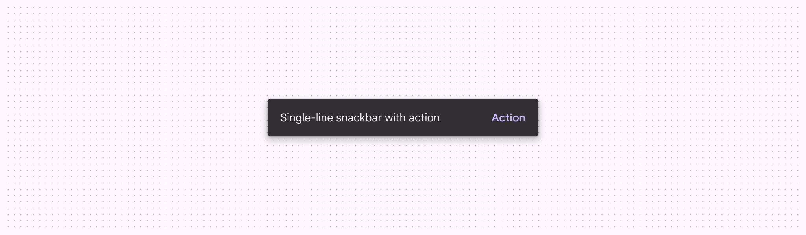
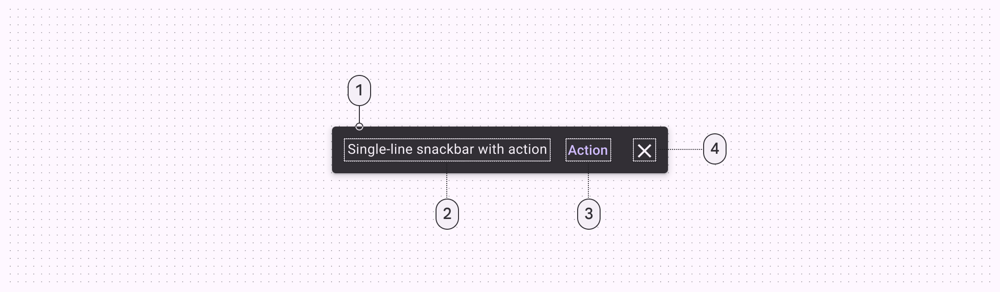
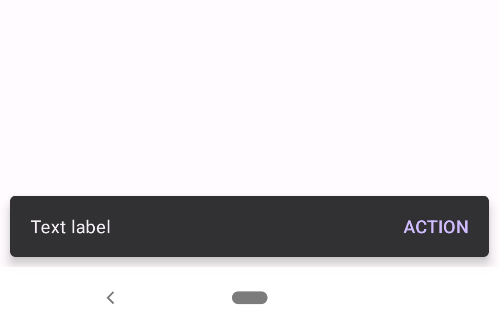
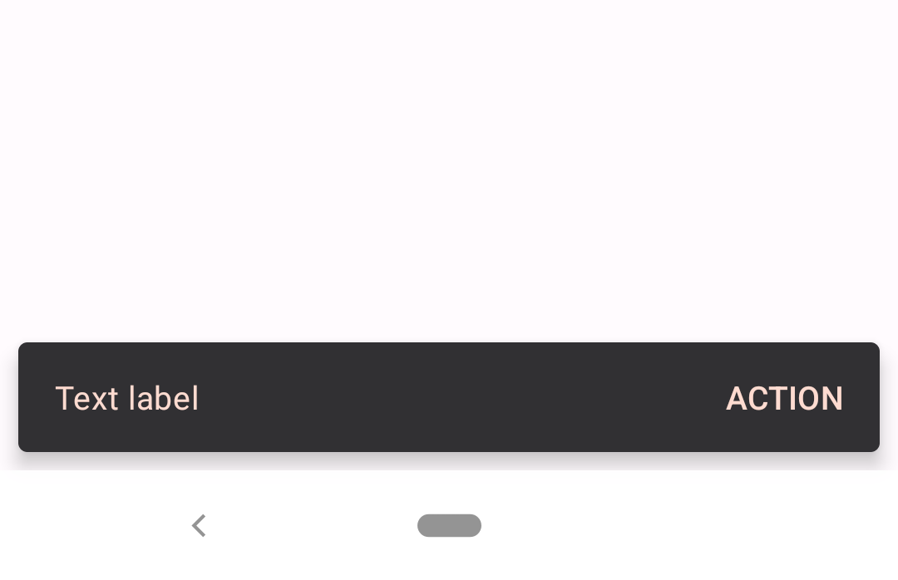

<!--docs:
title: "Snackbar"
layout: detail
section: components
excerpt: "Snackbars provide brief messages about app processes at the bottom of the screen."
iconId: toast
path: /catalog/snackbars/
-->

# Snackbar

[Snackbars](https://m3.material.io/components/snackbar/overview) provide brief messages
about app processes at the bottom of the screen.



Snackbars inform users of a process that an app has performed or will perform.
They appear temporarily, towards the bottom of the screen. They shouldn’t
interrupt the user experience, and they don’t require user input to disappear.
They disappear either after a timeout or after a user interaction elsewhere on
the screen, but can also be swiped off the screen.

Snackbars can also offer the ability to perform an action, such as undoing an
action that was just taken, or retrying an action that had failed.

**Note:** Images use various dynamic color schemes.

## Design & API documentation

*   [Material 3 (M3) spec](https://m3.material.io/components/snackbar/overview/)
*   [API reference](https://developer.android.com/reference/com/google/android/material/snackbar/package-summary)

## Anatomy



1.  Container
2.  Supporting text
3.  Action (optional)
4.  Close button (optional)

More details on anatomy items in the [component guidelines](https://m3.material.io/components/snackbar/guidelines#fea592b7-eba4-4d65-88fe-34b64e884041).

## Key properties

### Text label attributes

Element              | Attribute                | Related method(s) | Default value
-------------------- | ------------------------ | ----------------- | -------------
**Text label style** | N/A                      | N/A               | `?attr/snackbarTextViewStyle`
**Text label**       | `android:text`           | `setText`         | `null`
**Color**            | `android:textColor`      | `setTextColor`    | `?attr/colorOnSurfaceInverse`
**Typography**       | `android:textAppearance` | N/A               | `?attr/textAppearanceBodyMedium`

### Container attributes

Element                 | Attribute                                              | Related method(s)                               | Default value
----------------------- | ------------------------------------------------------ | ----------------------------------------------- | -------------
**Color**               | `app:backgroundTint`                                   | `setBackgroundTint`<br/>`setBackgroundTintList` | `?attr/colorSurfaceInverse`
**Color overlay alpha** | `app:backgroundOverlayColorAlpha`                      | N/A                                             | `0.8f` (ignored if `app:backgroundTint` is set)
**Shape**               | `app:shapeAppearance`<br/>`app:shapeAppearanceOverlay` | N/A                                             | `?attr/shapeAppearanceCornerExtraSmall`
**Margin**              | `android:layout_margin`                                | N/A                                             | `8dp`
**Elevation**           | `app:elevation`                                        | N/A                                             | `6dp`
**Animation mode**      | `app:animationMode`                                    | `setAnimationMode`<br/>`getAnimationMode`       | `fade`

### Action attributes

Element              | Attribute                  | Related method(s)    | Default value
-------------------- | -------------------------- | -------------------- | -------------
**Button style**     | N/A                        | N/A                  | `?attr/snackbarButtonStyle`
**Text color alpha** | `app:actionTextColorAlpha` | N/A                  | `1.0f`
**Text Color**       | `android:textColor`        | `setTextActionColor` | `?attr/colorPrimaryInverse`

### Close attributes

Element                    | Attribute      | Related method(s)      | Default value
-------------------------- |----------------|------------------------| -------------
**Close button style**     | N/A            | N/A                    | `?attr/snackbarCloseButtonStyle`
**Icon tint**              | `app:iconTint` | `setCloseIconTint`     | `?attr/colorOnSurfaceInverse`
**Icon**                   | `app:icon`     | `setCloseIconResource` | `@drawable/mtrl_close_24px`

### Styles

Element                   | Theme attribute                  | Default value
------------------------- |----------------------------------| -----------------
**Default style**         | `?attr/snackbarStyle`            | `@style/Widget.Material3.Snackbar`
**Action button style**   | `?attr/snackbarButtonStyle`      | `@style/Widget.Material3.Button.TextButton.Snackbar`
**Text label style**      | `?attr/snackbarTextViewStyle`    | `@style/Widget.Material3.Snackbar.TextView`
**Close button style**    | `?attr/snackbarCloseButtonStyle` | `@style/Widget.Material3.Button.IconButton.Close.Snackbar`

For the full list, see
[styles](https://github.com/material-components/material-components-android/tree/master/lib/java/com/google/android/material/snackbar/res/values/styles.xml)
and
[attrs](https://github.com/material-components/material-components-android/tree/master/lib/java/com/google/android/material/snackbar/res/values/attrs.xml).

## Code implementation

Before you can use Material snackbars, you need to add a dependency to the
Material components for Android library. For more information, go to the
[Getting started](https://github.com/material-components/material-components-android/tree/master/docs/getting-started.md)
page.

### Adding snackbar

The `Snackbar` class provides static `make` methods to produce a snackbar
configured in the desired way. These methods take a `View`, which will be used
to find a suitable ancestor `ViewGroup` to display the snackbar, a text string
to display, and a duration to display the snackbar. A suitable ancestor
`ViewGroup` will be either the nearest `CoordinatorLayout` to the `View` passed
in, or the root `DecorView` if none could be found.

Available duration presets are:

*   `LENGTH_INDEFINITE` (Show the snackbar until it's either dismissed or
    another snackbar is shown)
*   `LENGTH_LONG` (Show the snackbar for a long period of time)
*   `LENGTH_SHORT` (Show the snackbar for a short period of time)

**Note:** Snackbars work best if they are displayed inside of a
[CoordinatorLayout](https://developer.android.com/reference/androidx/coordinatorlayout/widget/CoordinatorLayout),
which allows the snackbar to enable behavior like swipe-to-dismiss.

The following is an example of a snackbar with an action button:



In code:

```kt
Snackbar.make(contextView, "Text label", Snackbar.LENGTH_LONG)
    .setAction("Action") {
        // Responds to click on the action
    }
    .show()
```
### Making snackbar accessible

Snackbars support content labeling for accessibility and are readable by most
screen readers, such as TalkBack. Text rendered in snackbars is automatically
provided to accessibility services. Additional content labels are usually
unnecessary.

### Showing snackbar

Calling `make` creates the snackbar, but doesn't cause it to be visible on the
screen. To show it, use the `show` method on the returned `Snackbar` instance.

**Note**: Only one snackbar will be shown at a time. Showing a new snackbar will
dismiss any previous ones first.

To show a snackbar with a message and no action:

```kt
// The view used to make the snackbar.
// This should be contained within the view hierarchy where you want to display
// the snackbar. Generally it can be the view that triggered the snackbar,
// such as a button that was clicked, or a card that was swiped.
val contextView = findViewById<View>(R.id.context_view)

Snackbar.make(contextView, R.string.text_label, Snackbar.LENGTH_SHORT)
    .show()
```
### Anchoring snackbar

By default, `Snackbar`s will be anchored to the bottom edge of their parent
view. However, you can use the `setAnchorView` method to make a `Snackbar`
appear above a specific view within your layout, for example a
`FloatingActionButton`.

```kt
Snackbar.make(...)
    .setAnchorView(fab)
    ...
```

This is especially helpful if you would like to place a `Snackbar` above
navigational elements at the bottom of the screen, such as a `BottomAppBar` or
`BottomNavigationView`.

### Related concepts

Temporary bottom bars can be implemented with other sorts of content layouts by
subclassing
[BaseTransientBottomBar](https://developer.android.com/reference/com/google/android/material/snackbar/BaseTransientBottomBar).

Android also provides a
[Toast](https://developer.android.com/reference/android/widget/Toast.html) class
with a similar API that can be used for displaying system-level notifications.
Generally, snackbars are the preferred mechanism for displaying feedback
messages to users, because they can be displayed in the context of the UI where
the action occurred. Reserve `Toast` for cases where this cannot be done.

### Adding an action

To add an action, use the `setAction` method on the object returned from `make`.
Snackbars are automatically dismissed when the action is clicked.

To show a snackbar with a message and an action:

```kt
Snackbar.make(contextView, R.string.text_label, Snackbar.LENGTH_LONG)
    .setAction(R.string.action_text) {
        // Responds to click on the action
    }
    .show()
```

### Adding a close button

To add a close button to the end of the snackbar, use the `setCloseIconVisible`
method on the object returned from `make`. Snackbars are automatically dismissed
when the close button is clicked.

```kt
Snackbar.make(contextView, R.string.text_label, Snackbar.LENGTH_INDEFINITE)
    .setCloseIconVisible(true)
    .show()
```

## Customizing snackbar

### Theming snackbar

Snackbars support the customization of color and typography.

#### Snackbar theming example

API and source code:

*   `Snackbar`
    *   [Class definition](https://developer.android.com/reference/com/google/android/material/snackbar/Snackbar)
    *   [Class source](https://github.com/material-components/material-components-android/tree/master/lib/java/com/google/android/material/snackbar/Snackbar.java)

The following is an example of a snackbar with an action button that uses the
Material.io [Shrine](https://m2.material.io/design/material-studies/shrine.html)
color theming:



##### Implementing snackbar theming

Use theme attributes in `res/values/styles.xml` to style all snackbars. This
will affect other components:

```xml
<style name="Theme.App" parent="Theme.Material3.*">
    ...
    <item name="colorPrimaryInverse">@color/shrine_pink_100</item>
    <item name="colorOnSurfaceInverse">@color/shrine_pink_100</item>
</style>

```

Use default style theme attributes, styles and theme overlays to style all
snackbars. This will not affect other components:

```xml
<style name="Theme.App" parent="Theme.Material3.*">
    ...
    <item name="snackbarStyle">@style/Widget.App.Snackbar</item>
    <item name="snackbarButtonStyle">@style/Widget.App.SnackbarButton</item>
</style>

<style name="Widget.App.Snackbar" parent="Widget.Material3.Snackbar">
    <item name="materialThemeOverlay">@style/ThemeOverlay.App.Snackbar</item>
  </style>

<style name="Widget.App.SnackbarButton" parent="Widget.Material3.Button.TextButton.Snackbar">
    <item name="android:textColor">@color/shrine_pink_100</item>
</style>

<style name="ThemeOverlay.App.Snackbar" parent="">
    <item name="colorPrimaryInverse">@color/shrine_pink_100</item>
    <item name="colorOnSurfaceInverse">@color/shrine_pink_100</item>
</style>
```

Set style attributes in code, which only affects this snackbar:

```kt
Snackbar.make(contextView, "Text label", Snackbar.LENGTH_LONG)
    .setAction("Action") {
        // Responds to click on the action
    }
    .setBackgroundTint(resources.getColor(R.color.backgroundTint))
    .setActionTextColor(resources.getColor(R.color.actionTextColor))
    .show()
```

Set in `values/colors.xml`:

```xml
<color name="backgroundTint">@color/shrine_pink_900</color>
<color name="actionTextColor">@color/shrine_pink_100</color>
```
