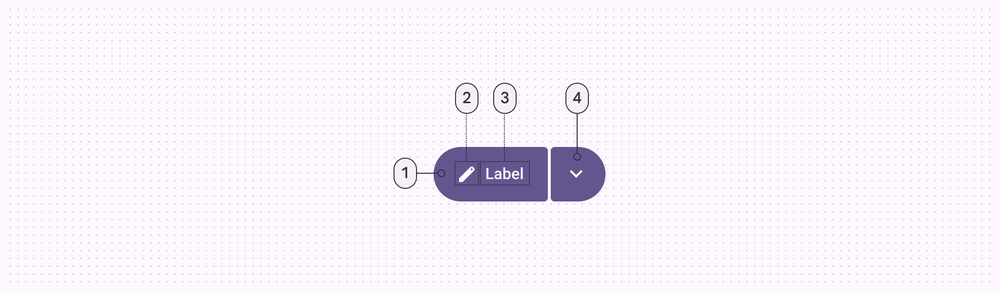
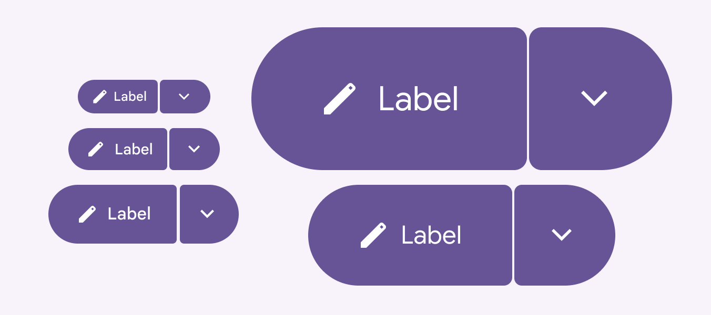

<!--docs:
title: "Split button"
layout: detail
section: components
excerpt: "A customizable button component with updated visual styles."
iconId: materialbutton
path: /catalog/buttons/
-->

# Split button

[Split buttons](https://m3.material.io/components/split-button/overview) open a
menu to give people more options related to an action. It is a specialized type
of the connected button group. The trailing button is checkable with an animated
icon.


**Note:** Images use various dynamic color schemes.

## Design & API documentation

*   [Material 3 (M3) spec](https://m3.material.io/components/split-button/overview)
*   [API reference](https://developer.android.com/reference/com/google/android/material/button/package-summary)

## Anatomy



1.  Leading button
2.  Icon
3.  Label text
4.  Trailing button

More details on anatomy items in the
[component guidelines](https://m3.material.io/components/split-button/guidelines#551f6e11-0f95-41c2-9398-cd4066755806).

## M3 Expressive

### M3 Expressive update

Before you can use `Material3Expressive` component styles, follow the
[`Material3Expressive` themes setup instructions](https://github.com/material-components/material-components-android/tree/master/docs/getting-started.md#material3expressive-themes).


Split buttons have the same five recommended sizes as label and icon buttons

The split button has a separate menu button that spins and changes shape when
activated. It can be used alongside other buttons of the same size.
[More on M3 Expressive](https://m3.material.io/blog/building-with-m3-expressive)

Split button is a new component added in expressive, a special type of connected
button group.

**Sizes:**

*   Extra small
*   Small
*   Medium
*   Large
*   Extra large

**Color styles:**

*   Elevated
*   Filled
*   Tonal
*   Outlined

## Key properties

### Size and space attributes

Element                     | Attribute              | Related method(s)                             | Default value
--------------------------- | ---------------------- | --------------------------------------------- | -------------
**Size of inner corners**   | `app:innerCornerSize`  | `setInnerCornerSize`<br/>`getInnerCornerSize` | `none`
**Spacing between buttons** | `android:spacing`      | `setSpacing`<br/>`getSpacing`                 | `2dp`
**Button size change**      | `app:buttonSizeChange` | N/A                                           | `0%`

### Styles and theme attributes

Element                                   | Style                                                     | Theme attribute
----------------------------------------- | --------------------------------------------------------- | ---------------
**Default style**                         | `Widget.Material3.MaterialSplitButton`                    | `?attr/materialSplitButtonStyle`
**Leading button primary (filled) style** | `Widget.Material3.SplitButton.LeadingButton.Filled`       | `?attr/materialSplitButtonLeadingFilledStyle`
**Leading button primary (tonal) style**  | `Widget.Material3.SplitButton.LeadingButton.Filled.Tonal` | `?attr/materialSplitButtonLeadingFilledTonalStyle`
**Trailing icon primary (filled) style**  | `Widget.Material3.SplitButton.IconButton.Filled`          | `?attr/materialSplitButtonIconFilledStyle`
**Trailing icon secondary (tonal) style** | `Widget.Material3.SplitButton.IconButton.Filled.Tonal`    | `?attr/materialSplitButtonIconFilledTonalStyle`

The two new trailing icon styles `materialSplitButtonIconFilledStyle` – parented
by `materialIconButtonFilledStyle` – and
`materialSplitButtonIconFilledTonalStyle`-- parented by
`materialIconButtonFilledTonalStyle` allow for the `MaterialSplitButton` custom
behavior for `onChecked` and `onUnchecked` states.
`materialSplitButtonIconFilledStyle` is paired with default leading button
styling, with no style explicitly specified in the XML.
`materialSplitButtonIconFilledTonalStyle` is paired with
`materialButtonTonalStyle` for the leading button.

## Code implementation

Before you can use Material buttons, you need to add a dependency to the
Material components for Android library. For more information, go to the
[Getting started](https://github.com/material-components/material-components-android/tree/master/docs/getting-started.md)
page.

**Note:** `<Button>` is auto-inflated as
`<com.google.android.material.button.MaterialButton>` via
`MaterialComponentsViewInflater` when using a `Theme.Material3.*` theme.

The leading button in split buttons can have an icon, label text, or both. The
trailing button should always have a menu icon.


1.  Label + icon
2.  Label
3.  Icon

### Adding split button

Source code:

*   `MaterialSplitButton`
    *   [Class source](https://github.com/material-components/material-components-android/tree/master/lib/java/com/google/android/material/button/MaterialSplitButton.java)

The following example shows a split button with a leading label button and a
trailing icon button that has an AnimatedVectorDrawable.

In the layout:

```xml
<com.google.android.material.button.MaterialSplitButton
    android:id="@+id/splitbutton"
    android:layout_width="wrap_content"
    android:layout_height="wrap_content">
    <Button
        style="?attr/materialSplitButtonLeadingFilledStyle"
        android:layout_width="wrap_content"
        android:layout_height="wrap_content"
        android:text="@string/cat_split_button_label"
        app:icon="@drawable/ic_edit_vd_theme_24dp"
    />
    <Button
        style="?attr/materialSplitButtonIconFilledStyle"
        android:id="@+id/expand_more_or_less_filled"
        android:layout_width="wrap_content"
        android:layout_height="wrap_content"
        android:contentDescription="@string/cat_split_button_label_chevron"
        app:icon="@drawable/m3_split_button_chevron_avd"
    />
</com.google.android.material.button.MaterialSplitButton>
```

### Making buttons accessible

Buttons support content labeling for accessibility and are readable by most
screen readers, such as TalkBack. Text rendered in buttons is automatically
provided to accessibility services. Additional content labels are usually
unnecessary.

For more information on content labels, go to the
[Android accessibility help guide](https://support.google.com/accessibility/android/answer/7158690).

### Animating trailing icon

The icon on the trailing button is animated. In the samples, this is done with
an AVD, `m3_split_button_chevron_avd`
[[source](https://github.com/material-components/material-components-android/tree/master/lib/java/com/google/android/material/button/res/drawable/m3_split_button_chevron_avd.xml)].

## Customizing split button

### Theming buttons

Buttons support the customization of color, typography, and shape.

#### Button theming example

API and source code:

*   `MaterialButton`
    *   [Class description](https://developer.android.com/reference/com/google/android/material/button/MaterialButton)
    *   [Class source](https://github.com/material-components/material-components-android/tree/master/lib/java/com/google/android/material/button/MaterialButton.java)

The following example shows text, outlined and filled button types with Material
theming.


##### Implementing button theming

Use theme attributes and styles in `res/values/styles.xml` to add the theme to
all buttons. This affects other components:

```xml
<style name="Theme.App" parent="Theme.Material3.*">
    ...
    <item name="colorPrimary">@color/shrine_pink_100</item>
    <item name="colorOnPrimary">@color/shrine_pink_900</item>
    <item name="textAppearanceLabelLarge">@style/TextAppearance.App.Button</item>
    <item name="shapeCornerFamily">cut</item>
</style>

<style name="TextAppearance.App.Button" parent="TextAppearance.Material3.LabelLarge">
    <item name="fontFamily">@font/rubik</item>
    <item name="android:fontFamily">@font/rubik</item>
</style>
```

Use default style theme attributes, styles and theme overlays. This adds the
theme to all buttons but does not affect other components:

```xml
<style name="Theme.App" parent="Theme.Material3.*">
    ...
    <item name="borderlessButtonStyle">@style/Widget.App.Button.TextButton</item>
    <item name="materialButtonOutlinedStyle">@style/Widget.App.Button.OutlinedButton</item>
    <item name="materialButtonStyle">@style/Widget.App.Button</item>
</style>

<style name="Widget.App.Button.TextButton" parent="Widget.Material3.Button.TextButton">
    <item name="materialThemeOverlay">@style/ThemeOverlay.App.Button.TextButton</item>
    <item name="android:textAppearance">@style/TextAppearance.App.Button</item>
    <item name="shapeAppearance">@style/ShapeAppearance.App.Button</item>
</style>

<style name="Widget.App.Button.OutlinedButton" parent="Widget.Material3.Button.OutlinedButton">
    <item name="materialThemeOverlay">@style/ThemeOverlay.App.Button.TextButton</item>
    <item name="android:textAppearance">@style/TextAppearance.App.Button</item>
    <item name="shapeAppearance">@style/ShapeAppearance.App.Button</item>
</style>

<style name="Widget.App.Button" parent="Widget.Material3.Button">
    <item name="materialThemeOverlay">@style/ThemeOverlay.App.Button</item>
    <item name="android:textAppearance">@style/TextAppearance.App.Button</item>
    <item name="shapeAppearance">@style/ShapeAppearance.App.Button</item>
</style>

<style name="ThemeOverlay.App.Button.TextButton" parent="ThemeOverlay.Material3.Button.TextButton">
    <item name="colorOnContainer">@color/shrine_pink_900</item>
</style>

<style name="ThemeOverlay.App.Button" parent="ThemeOverlay.Material3.Button">
    <item name="colorContainer">@color/shrine_pink_100</item>
    <item name="colorOnContainer">@color/shrine_pink_900</item>
</style>

<style name="ShapeAppearance.App.Button" parent="">
    <item name="cornerFamily">cut</item>
    <item name="cornerSize">4dp</item>
</style>
```

Use one of the styles in the layout. That will affect only this button:

```xml

<Button style="@style/Widget.App.Button".../>
```

### Optical centering

Optical centering means to offset the `MaterialButton`’s contents (icon and/or
label) when the shape is asymmetric. Before optical centering, we only provided
centering with horizontally asymmetrical shapes.

To turn on optical centering for a given button, use
`setOpticalCenterEnabled(true)`. Optical centering is disabled by default. When
enabled, the shift amount of the icon and/or text is calculated as a value with
the fixed ratio to the difference between left corner size in dp and right
corner size in dp. The shift amount is applied to the padding start and padding
end.
