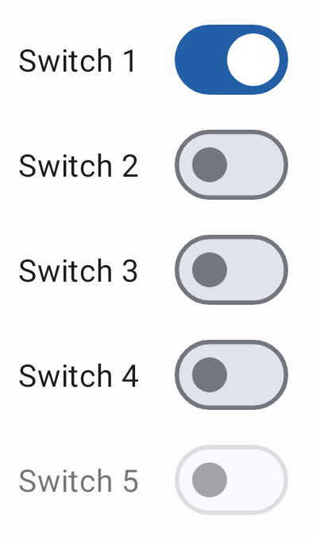
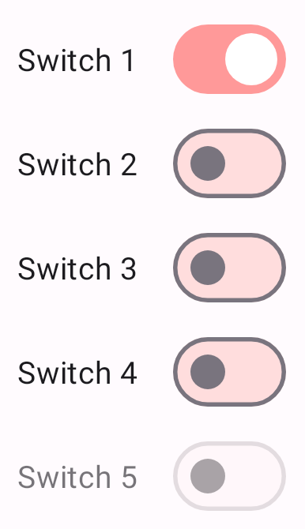
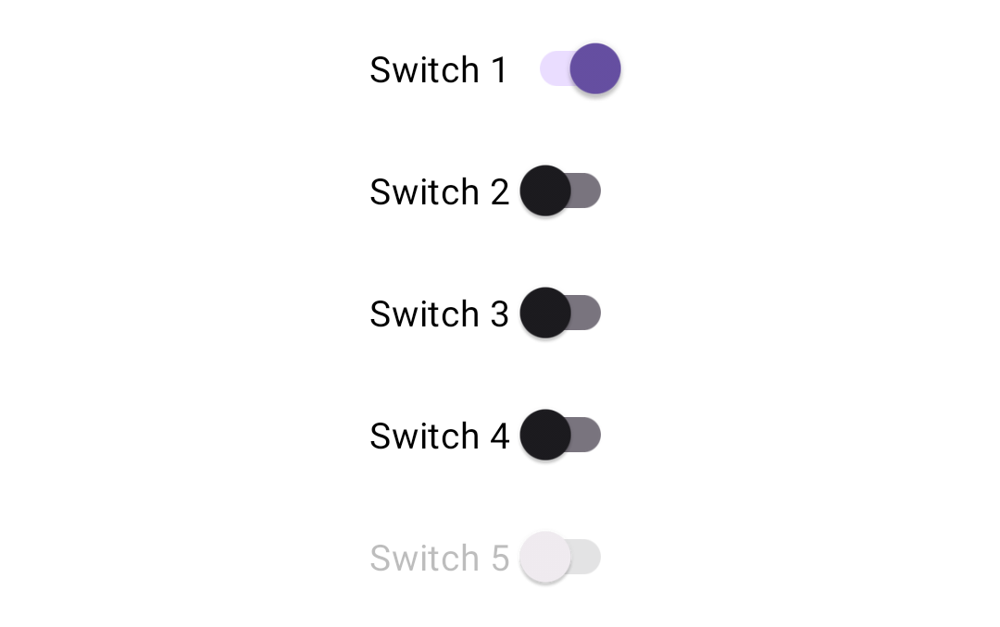
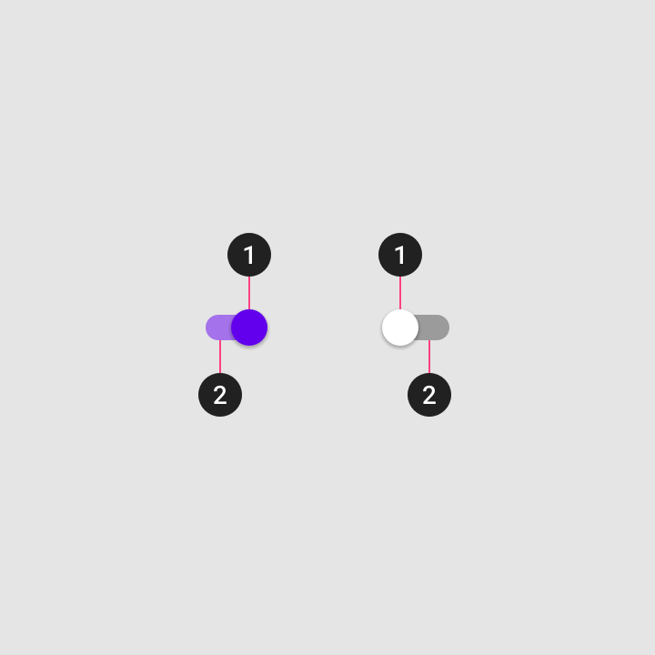
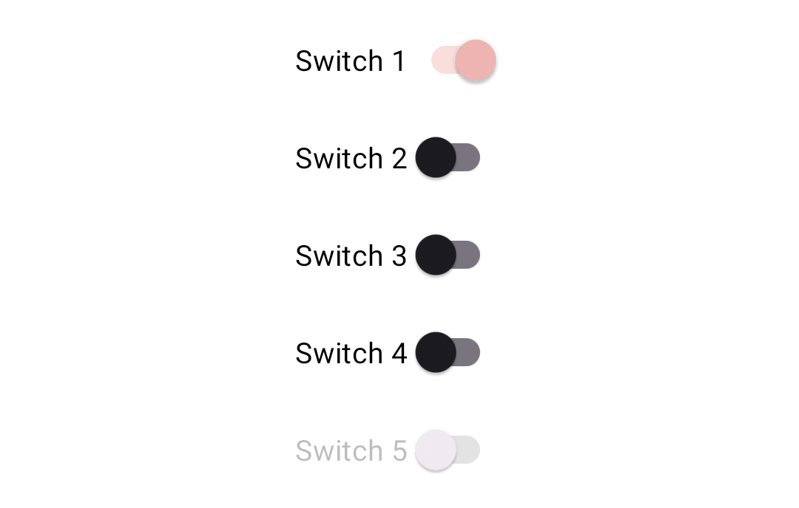

<!--docs:
title: "Switch"
layout: detail
section: components
excerpt: "Selection controls allow the user to select options."
iconId: switch
path: /catalog/switches/
-->

# Switch

[Switches](https://m3.material.io/components/switch/overview) toggle the state
of a single setting on or off.


**Note:** Images use various dynamic color schemes.

Switches are best used to adjust settings and other standalone options. They
make a binary selection, like on and off or true and false.

The effects of a switch should start immediately, without needing to save.

## Design & API documentation

*   [Material 3 (M3) spec](https://m3.material.io/components/switch/overview)
*   [API reference](https://developer.android.com/reference/com/google/android/material/switchmaterial/package-summary)

## Anatomy


1.  Track
2.  Handle (formerly "thumb")
3.  Icon

More details on anatomy items in the
[component guidelines](https://m3.material.io/components/switch/guidelines#9f55e13e-1327-4edf-9b81-6fa97db45bdd).

## Key properties

### Switch attributes

Element        | Attribute           | Related method(s)                 | Default value
-------------- | ------------------- | --------------------------------- | -------------
**Min height** | `android:minHeight` | `setMinHeight`<br/>`getMinHeight` | `?attr/minTouchTargetSize`

### Thumb attributes

Element   | Attribute       | Related method(s)                         | Default value
--------- | --------------- | ----------------------------------------- | -------------
**Thumb** | `android:thumb` | `setThumbDrawable`<br/>`getThumbDrawable` | `@drawable/mtrl_switch_thumb`
**Color** | `app:thumbTint` | `setThumbTintList`<br/>`getThumbTintList` | `?attr/colorOutline` (unchecked)<br/>`?attr/colorOnPrimary` (checked)

### Icon attributes

You can add an optional icon to enhance the on/off indication of your custom
switch by assigning `app:thumbIcon`. This icon will be centered and displayed on
top of the thumb drawable.

Element   | Attribute           | Related method(s)                                 | Default value
--------- | ------------------- | ------------------------------------------------- | -------------
**Icon**  | `app:thumbIcon`     | `setThumbIconDrawable`<br/>`getThumbIconDrawable` | `null`
**Size**  | `app:thumbIconSize` | `setThumbIconSize`<br/>`getThumbIconSize`         | `16dp`
**Color** | `app:thumbIconTint` | `setThumbIconTintList`<br/>`getThumbIconTintList` | `?attr/colorSurfaceContainerHighest` (unchecked)<br/>`?attr/colorOnPrimaryContainer` (checked)

### Track attributes

Element              | Attribute                 | Related method(s)                                             | Default value
-------------------- | ------------------------- | ------------------------------------------------------------- | -------------
**Track**            | `app:track`               | `setTrackDrawable`<br/>`getTrackDrawable`                     | `@drawable/mtrl_switch_track`
**Color**            | `app:trackTint`           | `setTrackTintList`<br/>`getTrackTintList`                     | `?attr/colorSurfaceContainerHighest` (unchecked)<br/>`?attr/colorPrimary` (checked)
**Decoration**       | `app:trackDecoration`     | `setTrackDecorationDrawable`<br/>`getTrackDecorationDrawable` | `@drawable/mtrl_switch_track_decoration`<br/>(Shows an outline of the track.)
**Decoration color** | `app:trackDecorationTint` | `setTrackDecorationTintList`<br/>`getTrackDecorationTintList` | `?attr/colorOutline` (unchecked)<br/>`@android:color/transparent` (checked)

### Text label attributes

Element        | Attribute                | Related method(s)                         | Default value
-------------- | ------------------------ | ----------------------------------------- | -------------
**Text label** | `android:text`           | `setText`<br/>`getText`                   | `null`
**Color**      | `android:textColor`      | `setTextColor`<br/>`getTextColors`        | `?android:attr/textColorPrimaryDisableOnly`
**Typography** | `android:textAppearance` | `setTextAppearance`                       | `?attr/textAppearanceBodyMedium`
**Padding**    | `app:switchPadding`      | `setSwitchPadding`<br/>`getSwitchPadding` | `16dp`

### Switch states

Switches can be on or off. Switches have enabled, hover, focused, and pressed
states.


### Styles

Element           | Style                                            | Theme attribute
----------------- | ------------------------------------------------ | ---------------
**Default style** | `Widget.Material3.CompoundButton.MaterialSwitch` | `?attr/materialSwitchStyle`

For the full list, see
[styles](https://github.com/material-components/material-components-android/tree/master/lib/java/com/google/android/material/materialswitch/res/values/styles.xml)
and
[attrs](https://github.com/material-components/material-components-android/tree/master/lib/java/com/google/android/material/materialswitch/res/values/attrs.xml).

## Code implementation

Before you can use Material switches, you need to add a dependency on the
Material components for Android library. For more information, go to the
[Getting started](https://github.com/material-components/material-components-android/tree/master/docs/getting-started.md)
page.

**Note:** The `MaterialSwitch` widget provides a complete implementation of
Material Design's switch component. It extends from the support library's
`SwitchCompat` widget, but not from the framework `Switch` widget. As such, it
does not auto-inflate, unlike other selection controls, and must be explicitly
specified in layouts.

**Note:** For the old `SwitchMaterial` documentation, please refer to
[Switch (deprecated)](#switch-deprecated) and
[Theming switch (deprecated)](#theming-switch-deprecated).

### Adding switch

A `Switch` represents a button with two states, on and off. Switches are most
often used on mobile devices to enable and disable options in an options menu. A
switch consists of a track and thumb; the thumb moves along the track to
indicate its current state.

Use switches to:

* Toggle a single item on or off
* Immediately activate or deactivate something

The following example shows a list of five switches.



In the layout:

```xml
<com.google.android.material.materialswitch.MaterialSwitch
    android:layout_width="wrap_content"
    android:layout_height="match_parent"
    android:checked="true"
    android:text="@string/label_1"/>
<com.google.android.material.materialswitch.MaterialSwitch
    android:layout_width="wrap_content"
    android:layout_height="match_parent"
    android:text="@string/label_2"/>
<com.google.android.material.materialswitch.MaterialSwitch
    android:layout_width="wrap_content"
    android:layout_height="match_parent"
    android:text="@string/label_3"/>
<com.google.android.material.materialswitch.MaterialSwitch
    android:layout_width="wrap_content"
    android:layout_height="match_parent"
    android:text="@string/label_4"/>
<com.google.android.material.materialswitch.MaterialSwitch
    android:layout_width="wrap_content"
    android:layout_height="match_parent"
    android:enabled="false"
    android:text="@string/label_5"/>
```

In code:

```kt
// To check a switch
materialSwitch.isChecked = true

// To listen for a switch's checked/unchecked state changes
materialSwitch.setOnCheckedChangeListener { buttonView, isChecked
    // Responds to switch being checked/unchecked
}
```

### Making switch accessible

Switches support content labeling for accessibility and are readable by most
screen readers, such as Talkback. Text rendered in switches is automatically
provided to accessibility services. Additional content labels are usually
unnecessary.

## Customizing switch

### Theming switch

Switch supports the customization of color and typography.

#### Switch theming example

API and source code:

*   `MaterialSwitch`
    *   [Class definition](https://developer.android.com/reference/com/google/android/material/materialswitch/MaterialSwitch)
    *   [Class source](https://github.com/material-components/material-components-android/tree/master/lib/java/com/google/android/material/materialswitch/MaterialSwitch.java)

**Note:** Since version 1.7.0, the new `MaterialSwitch` class will replace the
obsolete `SwitchMaterial` class. In most cases you should be able to just
replace all `SwitchMaterial` class reference with `MaterialSwitch` to achieve
the default look and feel. Please refer to the following sections if you need to
customize the new styles.

The following example shows a list of switches with Material theming.



##### Implementing switch theming

Use theme attributes in `res/values/styles.xml`, which applies to all switches
and affects other components:

```xml
<style name="Theme.App" parent="Theme.Material3.*">
    ...
    <item name="colorPrimary">@color/pink_200</item>
    <item name="colorSurfaceVariant">@color/pink_100</item>
</style>

```

Use default style theme attributes, styles and theme overlays, which apply to
all switches but do not affect other components:

```xml
<style name="Theme.App" parent="Theme.Material3.*">
    ...
    <item name="materialSwitchStyle">@style/Widget.App.Switch</item>
</style>

<style name="Widget.App.Switch" parent="Widget.Material3.CompoundButton.MaterialSwitch">
    <item name="materialThemeOverlay">@style/ThemeOverlay.App.Switch</item>
</style>

<style name="ThemeOverlay.App.Switch" parent="">
    <item name="colorPrimary">@color/pink_200</item>
    <item name="colorSurfaceVariant">@color/pink_100</item>
</style>
```

Use the styles in the layout, which affects only this switch:

```xml
<com.google.android.material.materialswitch.MaterialSwitch
        ...
    style="@style/Widget.App.Switch"
    />
```

<details>
<summary><h2 id="switch-deprecated">Switch (deprecated)</h2></summary>

The following example shows a list of five switches.



In the layout:

```xml
<com.google.android.material.switchmaterial.SwitchMaterial
    android:layout_width="wrap_content"
    android:layout_height="match_parent"
    android:checked="true"
    android:text="@string/label_1"/>
<com.google.android.material.switchmaterial.SwitchMaterial
    android:layout_width="wrap_content"
    android:layout_height="match_parent"
    android:text="@string/label_2"/>
<com.google.android.material.switchmaterial.SwitchMaterial
    android:layout_width="wrap_content"
    android:layout_height="match_parent"
    android:text="@string/label_3"/>
<com.google.android.material.switchmaterial.SwitchMaterial
    android:layout_width="wrap_content"
    android:layout_height="match_parent"
    android:text="@string/label_4"/>
<com.google.android.material.switchmaterial.SwitchMaterial
    android:layout_width="wrap_content"
    android:layout_height="match_parent"
    android:enabled="false"
    android:text="@string/label_5"/>
```

In code:

```kt
// To check a switch
switchmaterial.isChecked = true

// To listen for a switch's checked/unchecked state changes
switchmaterial.setOnCheckedChangeListener { buttonView, isChecked
    // Responds to switch being checked/unchecked
}
```

### Anatomy



1.  Thumb
2.  Track

### Key properties

#### Switch attributes

Element                    | Attribute                                  | Related method(s)                                          | Default value
-------------------------- | ------------------------------------------ | ---------------------------------------------------------- | -------------
**To use material colors** | `app:useMaterialThemeColors`               | `setUseMaterialThemeColors`<br/>`isUseMaterialThemeColors` | `true` (ignored if specific tint attrs are set)
**Min size**               | `android:minWidth`<br/>`android:minHeight` | `(set/get)MinWidth`<br/>`(set/get)MinHeight`               | `?attr/minTouchTargetSize`

The color of the switch defaults to using `?attr/colorPrimary`,
`?attr/colorPrimaryContainer`, `?attr/colorOnSurface`, and `?attr/colorOutline`
defined in your app theme. If you want to override this behavior, as you might
with a custom drawable that should not be tinted, set
`app:useMaterialThemeColors` to `false`:

```xml
<com.google.android.material.switchmaterial.SwitchMaterial
        ...
    app:useMaterialThemeColors="false"
    />
```

#### Thumb attributes

Element       | Attribute       | Related method(s)                         | Default value
------------- | --------------- | ----------------------------------------- | -------------
**Thumb**     | `android:thumb` | `setThumbDrawable`<br/>`getThumbDrawable` | inherits from `SwitchCompat`
**Color**     | `app:thumbTint` | `setThumbTintList`<br/>`getThumbTintList` | `?attr/colorOnSurface` (unchecked)<br/>`?attr/colorPrimary` (checked)
**Elevation** | N/A             | N/A                                       | `4dp`

#### Track attributes

Element   | Attribute       | Related method(s)                         | Default value
--------- | --------------- | ----------------------------------------- | -------------
**Track** | `app:track`     | `setTrackDrawable`<br/>`getTrackDrawable` | inherits from `SwitchCompat`
**Color** | `app:trackTint` | `setTrackTintList`<br/>`getTrackTintList` | `?attr/colorOutline` (unchecked)<br/>`?attr/colorPrimaryContainer` (checked)

#### Text label attributes

Element        | Attribute                | Related method(s)                  | Default value
-------------- | ------------------------ | ---------------------------------- | -------------
**Text label** | `android:text`           | `setText`<br/>`getText`            | `null`
**Color**      | `android:textColor`      | `setTextColor`<br/>`getTextColors` | `?android:attr/textColorPrimaryDisableOnly`
**Typography** | `android:textAppearance` | `setTextAppearance`                | `?attr/textAppearanceBodyMedium`

#### Switch states

Switches can be on or off. Switches have enabled, hover, focused, and pressed
states.

Display the outer radial reaction only on form factors that use touch, where
interaction may obstruct the element completely.

For desktop, the radial reaction isn't needed.


#### Styles

Element           | Style
----------------- | ----------------------------------------
**Default style** | `Widget.Material3.CompoundButton.Switch`

Default style theme attribute: `?attr/switchStyle`

For the full list, see
[styles](https://github.com/material-components/material-components-android/tree/master/lib/java/com/google/android/material/switchmaterial/res/values/styles.xml)
and
[attrs](https://github.com/material-components/material-components-android/tree/master/lib/java/com/google/android/material/switchmaterial/res/values/attrs.xml).

<h3 id="theming-switch-deprecated"> Theming switch</h3>

Switch supports the customization of color and typography.

#### Switch theming example

API and source code:

*   `SwitchMaterial`
    *   [Class definition](https://developer.android.com/reference/com/google/android/material/switchmaterial/SwitchMaterial)
    *   [Class source](https://github.com/material-components/material-components-android/tree/master/lib/java/com/google/android/material/switchmaterial/SwitchMaterial.java)

The following example shows a list of switches with Material theming.



##### Implementing switch theming

Use theme attributes in `res/values/styles.xml`, which applies to all switches
and affects other components:

```xml
<style name="Theme.App" parent="Theme.Material3.*">
    ...
    <item name="colorPrimaryContainer">@color/pink_100</item>
    <item name="colorPrimary">@color/pink_200</item>
</style>

```

Use default style theme attributes, styles and theme overlays, which apply to
all switches but do not affect other components:

```xml
<style name="Theme.App" parent="Theme.Material3.*">
    ...
    <item name="switchStyle">@style/Widget.App.Switch</item>
</style>

<style name="Widget.App.Switch" parent="Widget.Material3.CompoundButton.Switch">
    <item name="materialThemeOverlay">@style/ThemeOverlay.App.Switch</item>
</style>

<style name="ThemeOverlay.App.Switch" parent="">
    <item name="colorPrimaryContainer">@color/pink_100</item>
    <item name="colorPrimary">@color/pink_200</item>
</style>
```

Use the styles in the layout, which affects only this switch:

```xml
<com.google.android.material.switchmaterial.SwitchMaterial
        ...
    style="@style/Widget.App.Switch"
    />
```

</details>
