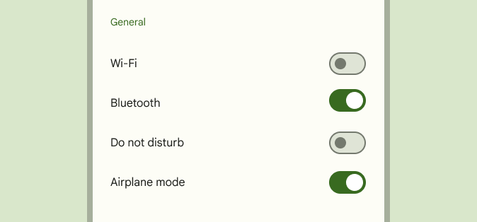
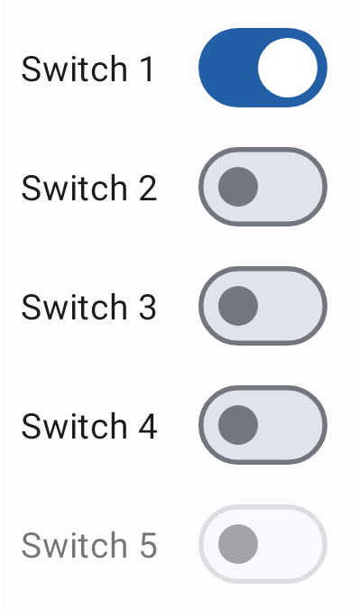
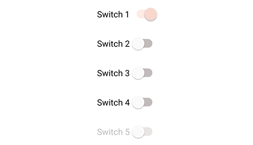

<!--docs:
title: "Material selection controls: Switches"
layout: detail
section: components
excerpt: "Selection controls allow the user to select options."
iconId: switch
path: /catalog/switches/
-->

# Selection controls: switches

[Selection controls](https://material.io/components/selection-controls#usage)
allow the user to select options.

Switches toggle the state of a single setting on or off. They are the preferred
way to adjust settings on mobile.



**Contents**

*   [Using switches](#using-switches)
*   [Switch](#switch)
*   [Theming switches](#theming-switches)

## Using switches

Before you can use Material switches, you need to add a dependency to the
Material Components for Android library. For more information, go to the
[Getting started](https://github.com/material-components/material-components-android/tree/master/docs/getting-started.md)
page.

_**Note:** The `SwitchMaterial` widget provides a complete implementation of
Material Design's switch component. It extends from the support library's
`SwitchCompat` widget, but not from the framework `Switch` widget. As such, it
does not auto-inflate, unlike other selection controls, and must be explicitly
specified in layouts._

Use switches to:

*   Toggle a single item on or off, on mobile and tablet
*   Immediately activate or deactivate something

### Making switches accessible

Switches support content labeling for accessibility and are readable by most
screen readers, such as TalkBack. Text rendered in switches is automatically
provided to accessibility services. Additional content labels are usually
unnecessary.

## Switch

A `Switch` represents a button with two states, on and off. Switches are most
often used on mobile devices to enable and disable options in an options menu. A
switch consists of a track and thumb; the thumb moves along the track to
indicate its current state.

### Switches example

API and source code:

*   `SwitchMaterial`
    *   [Class definition](https://developer.android.com/reference/com/google/android/material/switchmaterial/SwitchMaterial)
    *   [Class source](https://github.com/material-components/material-components-android/tree/master/lib/java/com/google/android/material/switchmaterial/SwitchMaterial.java)

The following example shows a list of five switches.



In the layout:

```xml
<com.google.android.material.switchmaterial.SwitchMaterial
    android:layout_width="wrap_content"
    android:layout_height="match_parent"
    android:checked="true"
    android:text="@string/label_1"/>
<com.google.android.material.switchmaterial.SwitchMaterial
    android:layout_width="wrap_content"
    android:layout_height="match_parent"
    android:text="@string/label_2"/>
<com.google.android.material.switchmaterial.SwitchMaterial
    android:layout_width="wrap_content"
    android:layout_height="match_parent"
    android:text="@string/label_3"/>
<com.google.android.material.switchmaterial.SwitchMaterial
    android:layout_width="wrap_content"
    android:layout_height="match_parent"
    android:text="@string/label_4"/>
<com.google.android.material.switchmaterial.SwitchMaterial
    android:layout_width="wrap_content"
    android:layout_height="match_parent"
    android:enabled="false"
    android:text="@string/label_5"/>
```

In code:

```kt
// To check a switch
switchMaterial.isChecked = true

// To listen for a switch's checked/unchecked state changes
switchMaterial.setOnCheckedChangeListener { buttonView, isChecked
    // Responds to switch being checked/unchecked
}
```

## Anatomy and key properties

The following is an anatomy diagram that shows a switch thumb and a switch
track:


1.  Thumb
1.  Track

### Switch attributes

&nbsp;                     | Attribute                                  | Related method(s)                                          | Default value
-------------------------- | ------------------------------------------ | ---------------------------------------------------------- | -------------
**To use material colors** | `app:useMaterialThemeColors`               | `setUseMaterialThemeColors`<br/>`isUseMaterialThemeColors` | `true` (ignored if specific tint attrs are set)
**Min size**               | `android:minWidth`<br/>`android:minHeight` | `(set/get)MinWidth`<br/>`(set/get)MinHeight`               | `?attr/minTouchTargetSize`

The color of the switch defaults to using `?attr/colorSurface`,
`?attr/colorOnSurface`, and `?attr/colorSecondary` defined in your app theme. If
you want to override this behavior, as you might with a custom drawable that
should not be tinted, set `app:useMaterialThemeColors` to `false`:

```xml
<com.google.android.material.switchmaterial.SwitchMaterial
        ...
    app:useMaterialThemeColors="false"
    />
```

### Thumb attributes

&nbsp;        | Attribute       | Related method(s)                         | Default value
------------- | --------------- | ----------------------------------------- | -------------
**Thumb**     | `android:thumb` | `setThumbDrawable`<br/>`getThumbDrawable` | inherits from `SwitchCompat`
**Color**     | `app:thumbTint` | `setThumbTintList`<br/>`getThumbTintList` | `?attr/colorSurface` (unchecked)<br/>`?attr/colorSecondary` (checked)
**Elevation** | N/A             | N/A                                       | `4dp`

### Track attributes

&nbsp;    | Attribute       | Related method(s)                         | Default value
--------- | --------------- | ----------------------------------------- | -------------
**Track** | `app:track`     | `setTrackDrawable`<br/>`getTrackDrawable` | inherits from `SwitchCompat`
**Color** | `app:trackTint` | `setTrackTintList`<br/>`getTrackTintList` | `?attr/colorOnSurface` (unchecked)<br/>`?attr/colorSecondary` (checked)

### Text label attributes

&nbsp;         | Attribute                | Related method(s)                  | Default value
-------------- | ------------------------ | ---------------------------------- | -------------
**Text label** | `android:text`           | `setText`<br/>`getText`            | `null`
**Color**      | `android:textColor`      | `setTextColor`<br/>`getTextColors` | inherits from `SwitchCompat`
**Typography** | `android:textAppearance` | `setTextAppearance`                | inherits from `SwitchCompat`

### Switch states

Switches can be on or off. Switches have enabled, hover, focused, and pressed
states.

Display the outer radial reaction only on form factors that use touch, where
interaction may obstruct the element completely.

For desktop, the radial reaction isn't needed.


### Styles

&nbsp;            | Style
----------------- | -------------------------------------------------
**Default style** | `Widget.MaterialComponents.CompoundButton.Switch`

Default style theme attribute: `?attr/switchStyle`

See the full list of
[styles](https://github.com/material-components/material-components-android/tree/master/lib/java/com/google/android/material/switchmaterial/res/values/styles.xml)
and
[attrs](https://github.com/material-components/material-components-android/tree/master/lib/java/com/google/android/material/switchmaterial/res/values/attrs.xml).

## Theming switches

Switches support
[Material Theming](https://material.io/components/selection-controls#theming)
and can be customized in terms of color and typography.

### Switch theming example

API and source code:

*   `SwitchMaterial`
    *   [Class definition](https://developer.android.com/reference/com/google/android/material/switchmaterial/SwitchMaterial)
    *   [Class source](https://github.com/material-components/material-components-android/tree/master/lib/java/com/google/android/material/switchmaterial/SwitchMaterial.java)

The following example shows a list of switches with Material Theming.



#### Implementing switch theming

Using theme attributes in `res/values/styles.xml` (themes all switches and
affects other components):

```xml
<style name="Theme.App" parent="Theme.MaterialComponents.*">
    ...
    <item name="colorOnSurface">@color/shrine_pink_900</item>
    <item name="colorSecondary">@color/shrine_pink_100</item>
</style>

```

or using default style theme attributes, styles and theme overlays (themes all
switches but does not affect other components):

```xml
<style name="Theme.App" parent="Theme.MaterialComponents.*">
    ...
    <item name="switchStyle">@style/Widget.App.Switch</item>
</style>

<style name="Widget.App.Switch" parent="Widget.MaterialComponents.CompoundButton.Switch">
    <item name="materialThemeOverlay">@style/ThemeOverlay.App.Switch</item>
</style>

<style name="ThemeOverlay.App.Switch" parent="">
    <item name="colorOnSurface">@color/shrine_pink_900</item>
    <item name="colorSecondary">@color/shrine_pink_100</item>
</style>
```

or using the styles in the layout (affects only this switch):

```xml
<com.google.android.material.switchmaterial.SwitchMaterial
        ...
    style="@style/Widget.App.Switch"
    />
```
