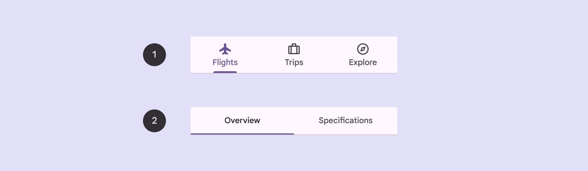
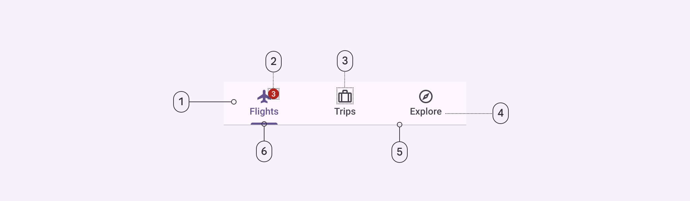
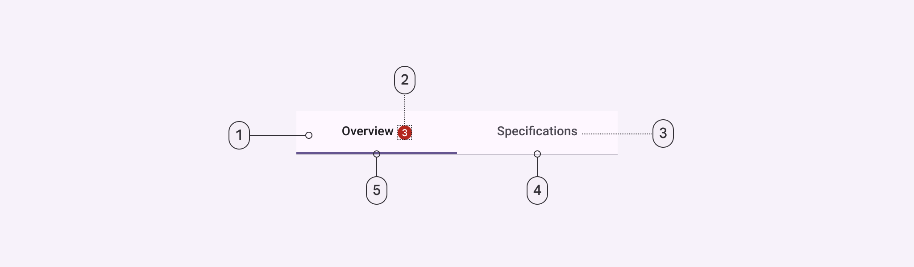

<!--docs:
title: "Tabs"
layout: detail
section: components
excerpt: "Android tabs."
iconId: tabs
path: /catalog/tabs/
-->

# Tabs

[Tabs](https://m3.material.io/components/tabs/overview) organize content across
different screens, data sets, and other interactions. There are two variants of
tabs.



1.  Primary tabs
2.  Secondary tabs

**Primary tabs** are placed at the top of the content pane under an app bar.
They display the main content destinations.

**Secondary tabs** are used within a content area to further separate related
content and establish hierarchy.

**Note:** Images use various dynamic color schemes.

## Design & API documentation

*   [Material 3 (M3) spec](https://m3.material.io/components/tabs/overview)
*   [API reference](https://developer.android.com/reference/com/google/android/material/tabs/package-summary)

## Anatomy

#### Primary tabs



1.  Container
2.  Badge (optional)
3.  Icon (optional)
4.  Label
5.  Divider
6.  Active indicator

#### Secondary tabs



1.  Container
2.  Badge (optional)
3.  Label
4.  Divider
5.  Active indicator

More details on anatomy items in the
[component guidelines](https://m3.material.io/components/tabs/guidelines#9b89bb22-e4b2-4de2-9844-14ebf7524760).

## Key properties

### Container attributes

Element       | Attribute            | Related method(s)                  | Default value
------------- | -------------------- | ---------------------------------- | -------------
**Color**     | `android:background` | `setBackground`<br>`getBackground` | `?attr/colorOnSurfaceVariant`
**Elevation** | `android:elevation`  | `setElevation`                     | `0dp`
**Height**    | N/A                  | N/A                                | `48dp` (inline text) or `72dp` (non-inline text and icon)
**Tab mode**  | `tabMode`            | `setTabMode`<br>`getTabMode`       | `fixed`

### Tab item icon attributes

Element   | Attribute      | Related method(s)                                                | Default value
--------- | -------------- | ---------------------------------------------------------------- | -------------
**Icon**  | `android:icon` | `setIcon`<br>`getIcon`                                           | `null`
**Color** | `tabIconTint`  | `setTabIconTint`<br>`setTabIconTintResource`<br>`getTabIconTint` | `colorOnSurfaceVariant` and `colorPrimary` (activated) (see all [states](https://github.com/material-components/material-components-android/tree/master/lib/java/com/google/android/material/tabs/res/color/m3_tabs_icon_color.xml))

### Tab item text label attributes

Element                   | Attribute                   | Related method(s)                                               | Default value
------------------------- | --------------------------- | --------------------------------------------------------------- | -------------
**Text**                  | `android:text`              | `setText`<br>`getText`                                          | `null`
**Color**                 | `tabTextColor`              | `setTabTextColors`<br>`getTabTextColors`                        | `colorOnSurfaceVariant` and `colorPrimary` (activated) (see all [states](https://github.com/material-components/material-components-android/tree/master/lib/java/com/google/android/material/tabs/res/color/m3_tabs_icon_color.xml))
**Typography**            | `tabTextAppearance`         | N/A                                                             | `?attr/textAppearanceTitleSmall`
**Active tab typography** | `tabSelectedTextAppearance` | N/A                                                             | None; will use `tabTextAppearance` instead
**Inline label**          | `tabInlineLabel`            | `setInlineLabel`<br>`setInlineLabelResource`<br>`isInlineLabel` | `false`

**Note:** When using `tabSelectedTextAppearance`, you must have matching text
attributes in `tabTextAppearance` to avoid unintended behavior.

### Tab item container attributes

Element              | Attribute                                                                                     | Related method(s)                                                            | Default value
-------------------- | --------------------------------------------------------------------------------------------- | ---------------------------------------------------------------------------- | -------------
**Ripple color**     | `tabRippleColor`                                                                              | `setTabRippleColor`<br>`setTabRippleColorResource`<br>`getTabRippleColor`    | `colorOnSurfaceVariant` at 16% opacity and `colorPrimary` at 16% opacity (activated) (see all [states](https://github.com/material-components/material-components-android/tree/master/lib/java/com/google/android/material/tabs/res/color/m3_tabs_ripple_color.xml))
**Unbounded ripple** | `tabUnboundedRipple`                                                                          | `setUnboundedRipple`<br>`setUnboundedRippleResource`<br>`hasUnboundedRipple` | `false`
**Gravity**          | `tabGravity`                                                                                  | `setTabGravity`<br>`getTabGravity`                                           | `fill`
**Min width**        | `tabMinWidth`                                                                                 | N/A                                                                          | `72dp` (scrollable) or `wrap_content`
**Max width**        | `tabMaxWidth`                                                                                 | N/A                                                                          | `264dp`
**Padding**          | `tabPaddingStart`<br>`tabPaddingEnd`<br>`tabPaddingTop`<br>`tabPaddingBottom`<br>`tabPadding` | N/A                                                                          | `12dp`<br>`12dp`<br>`0dp`<br>`0dp`<br>`0dp`

### Tab indicator attributes

Element                | Attribute                       | Related method(s)                                                | Default value
---------------------- | ------------------------------- | ---------------------------------------------------------------- | -------------
**Color**              | `tabIndicatorColor`             | `setSelectedTabIndicatorColor`                                   | `colorPrimary`
**Drawable**           | `tabIndicator`                  | `setSelectedTabIndicator`<br>`getSelectedTabIndicator`           | [`m3_tabs_rounded_line_indicator`](https://github.com/material-components/material-components-android/tree/master/lib/java/com/google/android/material/tabs/res/drawable/m3_tabs_rounded_line_indicator.xml)
**Height**             | `tabIndicatorHeight`            | `setSelectedTabIndicatorHeight`                                  | `2dp`
**Full width**         | `tabIndicatorFullWidth`         | `setTabIndicatorFullWidth`<br>`isTabIndicatorFullWidth`          | `false`
**Animation mode**     | `tabIndicatorAnimationMode`     | `setTabIndicatorAnimationMode`<br>`getTabIndicatorAnimationMode` | `elastic`
**Gravity**            | `tabIndicatorGravity`           | `setSelectedTabIndicatorGravity`<br>`getTabIndicatorGravity`     | `bottom`
**Animation duration** | `tabIndicatorAnimationDuration` | N/A                                                              | `250`

### Styles

Element                           | Style                                  | Theme attribute
--------------------------------- | -------------------------------------- | ---------------
**Default style**                 | `Widget.Material3.TabLayout`           | `?attr/tabStyle`
**Style for elevatable surfaces** | `Widget.Material3.TabLayout.OnSurface` | N/A
**Primary secondary color style** | `Widget.Material3.TabLayout.Secondary` | `?attr/tabSecondaryStyle`

For the full list, see
[styles](https://github.com/material-components/material-components-android/tree/master/lib/java/com/google/android/material/tabs/res/values/styles.xml)
and
[attrs](https://github.com/material-components/material-components-android/tree/master/lib/java/com/google/android/material/tabs/res/values/attrs.xml).

## Code implementation

Before you can use Material tabs, you need to add a dependency to the Material
components for Android library. For more information, go to the
[Getting started](https://github.com/material-components/material-components-android/tree/master/docs/getting-started.md)
page.

### Adding tabs


A
[`TabLayout`](https://github.com/material-components/material-components-android/tree/master/lib/java/com/google/android/material/tabs/TabLayout.java)
can be added to a layout:

```xml
<com.google.android.material.tabs.TabLayout
    android:layout_width="match_parent"
    android:layout_height="wrap_content">

    ...

</com.google.android.material.tabs.TabLayout>
```

[`TabItem`](https://github.com/material-components/material-components-android/tree/master/lib/java/com/google/android/material/tabs/TabItem.java)s
can then be added as children of the `TabLayout` and adjusted as needed:

```xml
<com.google.android.material.tabs.TabLayout
    ...>

    <com.google.android.material.tabs.TabItem
        android:layout_width="wrap_content"
        android:layout_height="wrap_content"
        android:text="@string/text_label_1"
        />

    <com.google.android.material.tabs.TabItem
        android:layout_width="wrap_content"
        android:layout_height="wrap_content"
        android:text="@string/text_label_2"
        />

    ...

</com.google.android.material.tabs.TabLayout>
```

Observe changes to tab selections:

```kt
tabLayout.addOnTabSelectedListener(object : TabLayout.OnTabSelectedListener {

    override fun onTabSelected(tab: TabLayout.Tab?) {
        // Handle tab select
    }

    override fun onTabReselected(tab: TabLayout.Tab?) {
        // Handle tab reselect
    }

    override fun onTabUnselected(tab: TabLayout.Tab?) {
        // Handle tab unselect
    }
})
```

### Making tabs accessible

The Android tab components support screen reader descriptions for tabs and
badges. While optional, we strongly encourage their use.

#### Content description

Adding a content descriptions to the entire `TabLayout` can be done in XML with
the `android:contentDescription` attribute or programmatically:

```kt
tabLayout.contentDescription = contentDescription
```

Content descriptions can also be added to individual tabs:

```kt
val tab = tabLayout.getTabAt(index)
tab?.contentDescription = contentDescription
```

`BadgeDrawable` also has a number of content description setters for different
badge states:

```kt
val badge = tab.getOrCreateBadge()

// For badges with a number
badge.setContentDescriptionNumberless(contentDescription)
badge.setContentDescriptionQuantityStringsResource(R.string.content_description)
badge.setContentDescriptionExceedsMaxBadgeNumberStringResource(R.string.content_description)

// For badges with a text
badge.setContentDescriptionForText(contentDescription)
```

### Using tabs with ViewPager

A `TabLayout` can be set up with a
[`ViewPager`](https://developer.android.com/reference/androidx/viewpager/widget/ViewPager)
in order to:

*   Dynamically create `TabItem`s based on the number of pages, their titles,
    etc.
*   Synchronize the selected tab and tab indicator position with page swipes

First, your
[`PagerAdapter`](https://developer.android.com/reference/androidx/viewpager/widget/PagerAdapter)
(or subclass) needs to override the `getPageTitle` function in order to set the
tab text label:

```kt
class Adapter : PagerAdapter() {

    ...

    override fun getPageTitle(position: Int): CharSequence? {
        // Return tab text label for position
    }
}
```

After the adapter has been set on the `ViewPager`, synchronize the `TabLayout`:

```kt
tabLayout.setupWithViewPager(viewPager)
```

Further customization of the dynamically-created `TabItem`s (such as setting
icons) needs to be done separately:

```kt
val tab = tabLayout.getTabAt(index)
tab?.icon = drawable
```

### Using tabs with ViewPager2

Setting up a `TabLayout` with a
[`ViewPager2`](https://developer.android.com/reference/androidx/viewpager2/widget/ViewPager2)
relies on the same concepts as doing so with a `ViewPager`, but the
implementation is different. Everything is handled by the
[`TabLayoutMediator`](https://github.com/material-components/material-components-android/tree/master/lib/java/com/google/android/material/tabs/TabLayoutMediator.java)
class:

```kt
TabLayoutMediator(tabLayout, viewPager2) { tab, position ->
    when (position) {
        0 -> {
            tab.text = textLabel1
            tab.icon = drawable1
        }
        1 -> {
            tab.text = textLabel2
            tab.icon = drawable2
        }
        ...
    }
}.attach()
```

### Adding badges to tabs


Tabs support badging with the
[`BadgeDrawable`](https://github.com/material-components/material-components-android/tree/master/lib/java/com/google/android/material/badge/BadgeDrawable.java)
class:

```kt
// Get badge from tab (or create one if none exists)
val badge = tab.getOrCreateBadge()
// Customize badge
badge.number = number
// Remove badge from tab
tab.removeBadge()
```

### Adding fixed tabs

Fixed tabs display all tabs on one screen, with each tab at a fixed width. The
width of each tab is determined by dividing the number of tabs by the screen
width. They don’t scroll to reveal more tabs; the visible tab set represents the
only tabs available.

#### Fixed tabs example

The following example shows a row of fixed tabs.


In the layout:

```xml
<com.google.android.material.tabs.TabLayout
    android:layout_width="match_parent"
    android:layout_height="wrap_content"
    app:tabMode="fixed">

    <com.google.android.material.tabs.TabItem
        android:layout_width="wrap_content"
        android:layout_height="wrap_content"
        android:text="@string/tab_1"
        android:icon="@drawable/ic_favorite_24dp"
        />

    <com.google.android.material.tabs.TabItem
        android:layout_width="wrap_content"
        android:layout_height="wrap_content"
        android:text="@string/tab_2"
        android:icon="@drawable/ic_music_24dp"
        />

    <com.google.android.material.tabs.TabItem
        android:layout_width="wrap_content"
        android:layout_height="wrap_content"
        android:text="@string/tab_3"
        android:icon="@drawable/ic_search_24dp"
        />

</com.google.android.material.tabs.TabLayout>
```

### Adding scrollable tabs

Scrollable tabs are displayed without fixed widths. They are scrollable, such
that some tabs will remain off-screen until scrolled.

#### Scrollable tabs example

The following example shows a row of scrollable tabs.


In the layout:

```xml
<com.google.android.material.tabs.TabLayout
    android:layout_width="match_parent"
    android:layout_height="wrap_content"
    app:tabMode="scrollable"
    app:tabContentStart="56dp">

    <com.google.android.material.tabs.TabItem
        android:layout_width="wrap_content"
        android:layout_height="wrap_content"
        android:text="@string/tab_1"
        />

    <com.google.android.material.tabs.TabItem
        android:layout_width="wrap_content"
        android:layout_height="wrap_content"
        android:text="@string/tab_2"
        />

    <com.google.android.material.tabs.TabItem
        android:layout_width="wrap_content"
        android:layout_height="wrap_content"
        android:text="@string/tab_3"
        />

    <com.google.android.material.tabs.TabItem
        android:layout_width="wrap_content"
        android:layout_height="wrap_content"
        android:text="@string/tab_4"
        />

    <com.google.android.material.tabs.TabItem
        android:layout_width="wrap_content"
        android:layout_height="wrap_content"
        android:text="@string/tab_5"
        />
    ...
</com.google.android.material.tabs.TabLayout>
```

## Customizing tabs

### Theming tabs

Tabs support the customization of color and typography.

#### Tabs theming example

API and source code:

*   `TabLayout`
    *   [Class definition](https://developer.android.com/reference/com/google/android/material/tabs/TabLayout)
    *   [Class source](https://github.com/material-components/material-components-android/tree/master/lib/java/com/google/android/material/tabs/TabLayout.java)
*   `TabItem`
    *   [Class definition](https://developer.android.com/reference/com/google/android/material/tabs/TabItem)
    *   [Class source](https://github.com/material-components/material-components-android/tree/master/lib/java/com/google/android/material/tabs/TabItem.java)

The following example shows a row of scrollable tabs with Material theming.


##### Implementing tabs theming

Use theme attributes and styles in `res/values/styles.xml` which applies to all
tabs and affects other components:

```xml
<style name="Theme.App" parent="Theme.Material3.*">
    ...
    <item name="colorPrimary">@color/shrine_pink_900</item>
    <item name="colorSurface">@color/shrine_pink_light</item>
    <item name="colorOnSurface">@color/shrine_pink_900</item>
    <item name="textAppearanceLabelLarge">@style/TextAppearance.App.LabelLarge</item>
</style>

<style name="TextAppearance.App.LabelLarge" parent="TextAppearance.Material3.LabelLarge">
    <item name="fontFamily">@font/rubik</item>
    <item name="android:fontFamily">@font/rubik</item>
</style>
```

Use default style theme attributes, styles and theme overlays, which apply to
all tabs but do not affect other components:

```xml
<style name="Theme.App" parent="Theme.Material3.*">
    ...
    <item name="tabStyle">@style/Widget.App.LabelLarge</item>
</style>

<style name="Widget.App.TabLayout" parent="Widget.Material3.TabLayout">
    <item name="materialThemeOverlay">@style/ThemeOverlay.App.TabLayout</item>
    <item name="tabTextAppearance">@style/TextAppearance.App.LabelLarge</item>
</style>

<style name="ThemeOverlay.App.TabLayout" parent="">
    <item name="colorPrimary">@color/shrine_pink_900</item>
    <item name="colorSurface">@color/shrine_pink_light</item>
    <item name="colorOnSurface">@color/shrine_pink_900</item>
</style>
```

Use the style in the layout, which affects only these tabs:

```xml
<com.google.android.material.tabs.TabLayout
    ...
    style="@style/Widget.App.TabLayout"
    />
```
