<!--docs:
title: "Text Fields"
layout: detail
section: components
excerpt: "A text field with an animated floating label and other Material Design features."
iconId: text_field
path: /catalog/text-fields/
-->

# Text fields

[Text fields](https://material.io/components/text-fields) let users enter and
edit text.


**Contents**

*   [Using text fields](#using-text-fields)
*   [Filled text field](#filled-text-field)
*   [Outlined text field](#outlined-text-field)
*   [Theming](#theming-text-fields)

## Using text fields

Before you can use Material text fields, you need to add a dependency to the
Material Components for Android library. For more information, go to the
[Getting started](https://github.com/material-components/material-components-android/tree/master/docs/getting-started.md)
page.

```xml
<com.google.android.material.textfield.TextInputLayout
    android:id="@+id/textField"
    android:layout_width="match_parent"
    android:layout_height="wrap_content"
    android:hint="@string/label">

    <com.google.android.material.textfield.TextInputEditText
        android:layout_width="match_parent"
        android:layout_height="wrap_content"
    />

</com.google.android.material.textfield.TextInputLayout>
```

_**Note:** A text field is composed of a `TextInputLayout` and a
`TextInputEditText` as a direct child. Using an `EditText` as the child might
work, but `TextInputEditText` provides accessibility support for the text field
and allows `TextInputLayout` greater control over the visual aspects of the
input text. If an `EditText` is being used, make sure to set its
`android:background` to `@null` so that `TextInputLayout` can set the proper
background on it._

### Making text fields accessible

Android's text field component APIs support both label text and helper text for
informing the user as to what information is requested for a text field. While
optional, their use is strongly encouraged.

#### Content description

When using **custom icons**, you should set a content description on them so
that screen readers like TalkBack are able to announce their purpose or action,
if any.

For the leading icon, that can be achieved via the
`app:startIconContentDescription` attribute or `setStartIconContentDescription`
method. For the trailing icon, that can be achieved via the
`app:endIconContentDescription` attribute or `setEndIconContentDescription`
method.

When setting an **error message** that contains special characters that screen
readers or other accessibility systems are not able to read, you should set a
content description via the `app:errorContentDescription` attribute or
`setErrorContentDescription` method. That way, when the error needs to be
announced, it will announce the content description instead.

#### Custom `EditText`

If you are using a custom `EditText` as `TextInputLayout`'s child and your text
field requires different accessibility support than the one offered by
`TextInputLayout`, you can set a `TextInputLayout.AccessibilityDelegate` via the
`setTextInputAccessibilityDelegate` method. This method should be used in place
of providing an `AccessibilityDelegate` directly on the `EditText`.

### Adding a leading icon to a text field

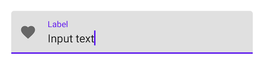

```xml
<com.google.android.material.textfield.TextInputLayout
    ...
    app:startIconDrawable="@drawable/ic_favorite_24dp"
    app:startIconContentDescription="@string/content_description_end_icon">

    ...

</com.google.android.material.textfield.TextInputLayout>
```

### Adding a trailing icon to a text field

**Password toggle:**

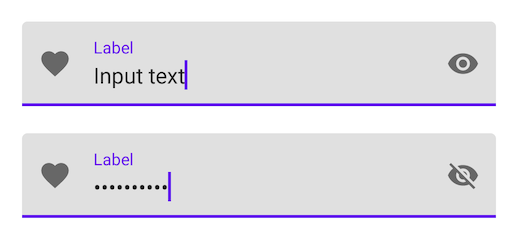

If set, an icon is displayed to toggle between the password being displayed as
plain-text or disguised (when the `TextInputEditText` is set to display a
password).

```xml
<com.google.android.material.textfield.TextInputLayout
    ...
    app:endIconMode="password_toggle">

    <com.google.android.material.textfield.TextInputEditText
        ...
        android:inputType="textPassword"
    />

</com.google.android.material.textfield.TextInputLayout>
```

**Clear text:**

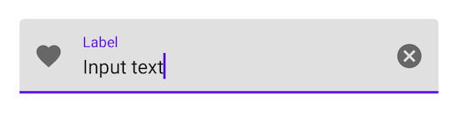

If set, an icon is displayed when text is present and pressing it clears the
input text.

```xml
<com.google.android.material.textfield.TextInputLayout
    ...
    app:endIconMode="clear_text">

    ...

</com.google.android.material.textfield.TextInputLayout>
```

**Custom icon:**

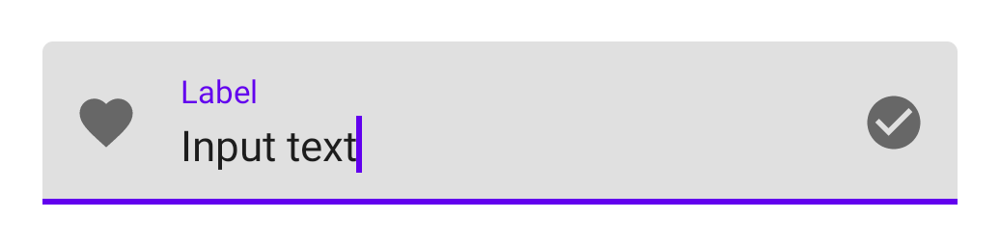

It is possible to set a custom `Drawable` as the text field's trailing icon via
`app:endIconMode="custom"`. You should specify a drawable and content
description for the icon, and, optionally, specify custom behaviors.

In the layout:

```xml
<com.google.android.material.textfield.TextInputLayout
    ...
    app:endIconMode="custom"
    app:endIconDrawable="@drawable/ic_check_circle_24dp"
    app:endIconContentDescription="@string/content_description_end_icon">

    ...

</com.google.android.material.textfield.TextInputLayout>
```

Optionally, in code:

```kt
textField.setEndIconOnClickListener {
  // Respond to end icon presses
}

textField.addOnEditTextAttachedListener {
  // If any specific changes should be done when the edit text is attached (and
  // thus when the trailing icon is added to it), set an
  // OnEditTextAttachedListener.

  // Example: The clear text icon's visibility behavior depends on whether the
  // EditText has input present. Therefore, an OnEditTextAttachedListener is set
  // so things like editText.getText() can be called.
}

textField.addOnEndIconChangedListener {
  // If any specific changes should be done if/when the endIconMode gets
  // changed, set an OnEndIconChangedListener.

  // Example: If the password toggle icon is set and a different EndIconMode
  // gets set, the TextInputLayout has to make sure that the edit text's
  // TransformationMethod is still PasswordTransformationMethod. Because of
  // that, an OnEndIconChangedListener is used.
}
```

_**Note:** You should opt to use the `EndIconMode` API instead of setting an
end/right compound `Drawable` on the `TextInputEditText`. The same applies to
the now-deprecated `passwordToggle*` attributes._

See the full list of
[end icon modes](https://github.com/material-components/material-components-android/tree/master/lib/java/com/google/android/material/textfield/res/values/attrs.xml#L149).

### Implementing an exposed dropdown menu

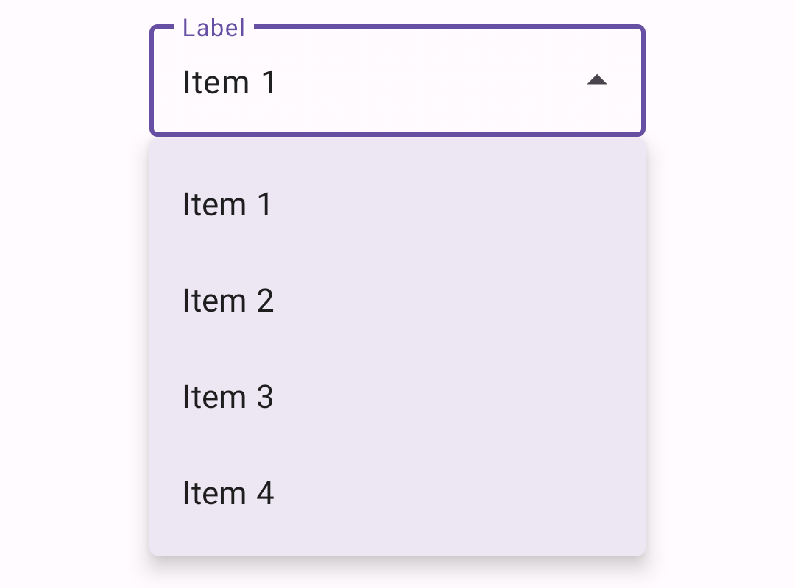

In the layout:

```xml
<com.google.android.material.textfield.TextInputLayout
    ...
    style="@style/Widget.MaterialComponents.TextInputLayout.*.ExposedDropdownMenu">

    <AutoCompleteTextView
        android:layout_width="match_parent"
        android:layout_height="wrap_content"
        android:inputType="none"
    />

</com.google.android.material.textfield.TextInputLayout>
```

In code:

```kt
val items = listOf("Material", "Design", "Components", "Android")
val adapter = ArrayAdapter(requireContext(), R.layout.list_item, items)
(textField.editText as? AutoCompleteTextView)?.setAdapter(adapter)
```

In the item layout (`list_item.xml`):

```xml
<TextView
    xmlns:android="http://schemas.android.com/apk/res/android"
    android:layout_width="match_parent"
    android:layout_height="wrap_content"
    android:padding="16dp"
    android:ellipsize="end"
    android:maxLines="1"
    android:textAppearance="?attr/textAppearanceSubtitle1"
/>
```

### Adding helper text to a text field

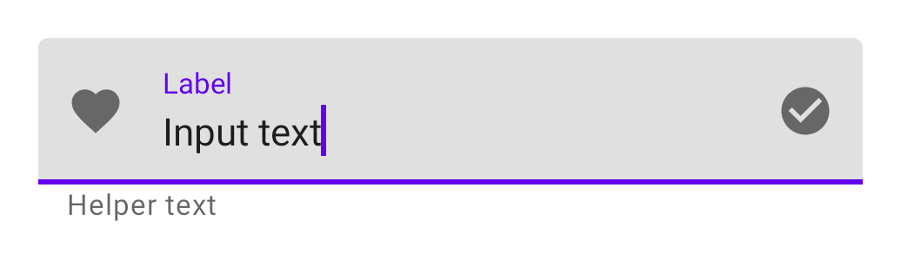

```xml
<com.google.android.material.textfield.TextInputLayout
    ...
    app:helperTextEnabled="true"
    app:helperText="@string/helper_text">

    ...

</com.google.android.material.textfield.TextInputLayout>
```

### Adding a counter to a text field

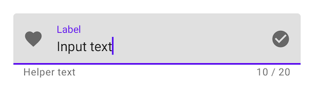

```xml
<com.google.android.material.textfield.TextInputLayout
    ...
    app:counterEnabled="true"
    app:counterMaxLength="20">

    ...

</com.google.android.material.textfield.TextInputLayout>
```

### Adding errors to a text field

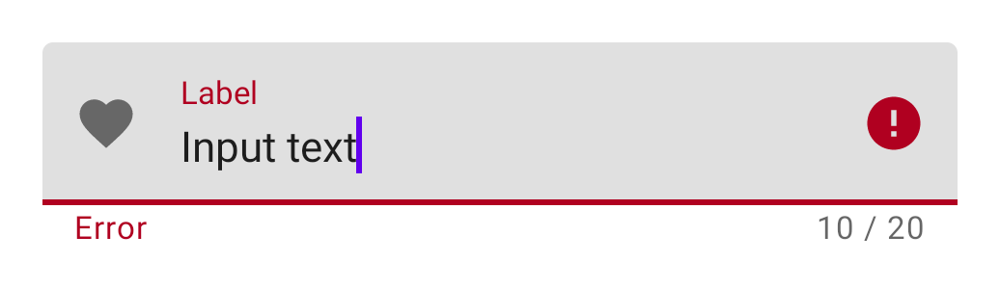

In the layout:

```xml
<com.google.android.material.textfield.TextInputLayout
    ...
    app:errorEnabled="true">

    ...

</com.google.android.material.textfield.TextInputLayout>
```

In code:

```kt
// Set error text
passwordLayout.error = getString(R.string.error)

// Clear error text
passwordLayout.error = null
```

_**Note:** Non-null error text will replace any existing helper text._

### Adding a prefix/suffix to a text field

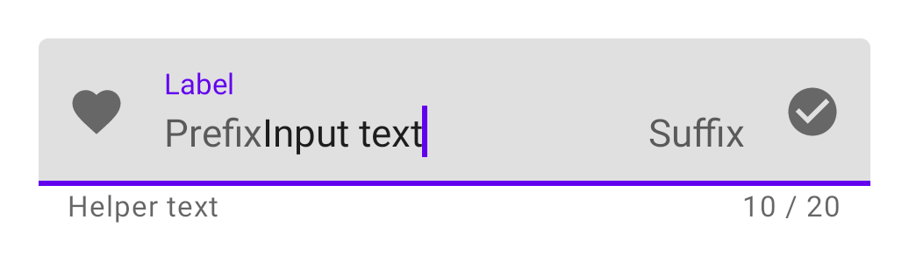

```xml
<com.google.android.material.textfield.TextInputLayout
    ...
    app:prefixText="@string/prefix"
    app:suffixText="@string/suffix">

    ...

</com.google.android.material.textfield.TextInputLayout>
```

### Using text fields programmatically

If you construct the `TextInputEditText` child of a `TextInputLayout`
programmatically, you should use `TextInputLayout`'s context to create the view.
This will allow `TextInputLayout` to pass along the appropriate styling to the
edit text.

```kt
val textInputLayout = TextInputLayout(context)
val editText = TextInputEditText(textInputLayout.context)
```

## Types

There are two types of text fields: 1\. [Filled text field](#filled-text-field),
2\. [Outlined text field](#outlined-text-field)


## Filled text field

[Filled text fields](https://material.io/components/text-fields/#filled-text-field)
have more visual emphasis than outlined text fields, making them stand out when
surrounded by other content and components.

_**Note:** The filled text field is the default style if the style is not set._

### Filled text field examples

API and source code:

*   `TextInputLayout`
    *   [Class definition](https://developer.android.com/reference/com/google/android/material/textfield/TextInputLayout)
    *   [Class source](https://github.com/material-components/material-components-android/tree/master/lib/java/com/google/android/material/textfield/TextInputLayout.java)
*   `TextInputEditText`
    *   [Class definition](https://developer.android.com/reference/com/google/android/material/textfield/TextInputEditText)
    *   [Class source](https://github.com/material-components/material-components-android/tree/master/lib/java/com/google/android/material/textfield/TextInputEditText.java)

The following examples shows a filled text field with a label.

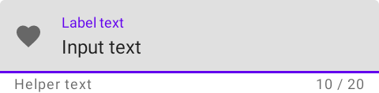

In the layout:

```xml
<com.google.android.material.textfield.TextInputLayout
    android:id="@+id/filledTextField"
    android:layout_width="match_parent"
    android:layout_height="wrap_content"
    android:hint="@string/label">

    <com.google.android.material.textfield.TextInputEditText
        android:layout_width="match_parent"
        android:layout_height="wrap_content"
    />

</com.google.android.material.textfield.TextInputLayout>
```

In code:

```kt
// Get input text
val inputText = filledTextField.editText?.text.toString()

filledTextField.editText?.doOnTextChanged { inputText, _, _, _ ->
    // Respond to input text change
}
```

See the [using text fields](#using-text-fields) section above for more examples.

### Anatomy and key properties

A filled text field has a filled container, input text, a label, an activation
indicator, optional helper/error text and optional leading/trailing icons.

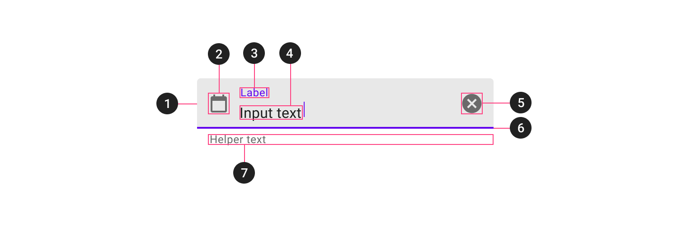

1.  Container
2.  Leading icon
3.  Label
4.  Input text
5.  Trailing icon
6.  Activation indicator
7.  Helper/error/counter text
8.  Prefix/suffix/placeholder (not shown)

_**Note:** All the attributes on the tables below should be set on the
`TextInputLayout`, with the exception of the input text attributes (which should
be set on the `TextInputEditText`)._

#### Container attributes

&nbsp;                 | Attribute                | Related method(s)                                                                       | Default value
---------------------- | ------------------------ | --------------------------------------------------------------------------------------- | -------------
**Color**              | `app:boxBackgroundColor` | `setBoxBackgroundColor`<br/>`setBoxBackgroundColorResource`<br/>`getBoxBackgroundColor` | `?attr/colorOnSurface` at 12% opacity (see all [states](https://github.com/material-components/material-components-android/tree/master/lib/java/com/google/android/material/textfield/res/color/mtrl_filled_background_color.xml))
**Shape**              | `app:shapeAppearance`    | N/A                                                                                     | `?attr/shapeAppearanceSmallComponent`
**Text field enabled** | `android:enabled`        | `setEnabled`                                                                            | `true`

#### Leading icon attributes

&nbsp;                  | Attribute                         | Related method(s)                                                     | Default value
----------------------- | --------------------------------- | --------------------------------------------------------------------- | -------------
**Icon**                | `app:startIconDrawable`           | `setStartIconDrawable`<br/>`getStartIconDrawable`                     | `null`
**Content description** | `app:startIconContentDescription` | `setStartIconContentDescription`<br/>`getStartIconContentDescription` | `null`
**Color**               | `app:startIconTint`               | `setStartIconTintList`                                                | `colorOnSurface` at 54% opacity (see all [states](https://github.com/material-components/material-components-android/tree/master/lib/java/com/google/android/material/textfield/res/color/mtrl_filled_icon_tint.xml))
**Checkable**           | `app:startIconCheckable`          | `setStartIconCheckable`<br/>`isStartIconCheckable`                    | `false`

#### Label attributes

&nbsp;                         | Attribute                  | Related method(s)                                       | Default value
------------------------------ | -------------------------- | ------------------------------------------------------- | -------------
**Text**                       | `android:hint`             | `setHint`<br/>`getHint`                                 | `null`
**Color**                      | `android:textColorHint`    | `setDefaultHintTextColor`<br/>`getDefaultHintTextColor` | `?attr/colorOnSurface` at 60% opacity (see all [states](https://github.com/material-components/material-components-android/tree/master/lib/java/com/google/android/material/textfield/res/color/mtrl_indicator_text_color.xml))
**Collapsed (floating) color** | `app:hintTextColor`        | `setHintTextColor`<br/>`getHintTextColor`               | `?attr/colorPrimary`
**Typography**                 | `app:hintTextAppearance`   | `setHintTextAppearance`                                 | `?attr/textAppearanceCaption`
**Animation**                  | `app:hintAnimationEnabled` | `setHintAnimationEnabled`<br/>`isHintAnimationEnabled`  | `true`
**Expanded enabled**           | `app:expandedHintEnabled`  | `setExpandedHintEnabled`<br/>`isExpandedHintEnabled`    | `true`

**Note:** The `android:hint` should always be set on the `TextInputLayout`
instead of on the `EditText` in order to avoid unintended behaviors.

#### Input text attributes

&nbsp;               | Attribute                                                           | Related method(s)                                            | Default value
-------------------- | ------------------------------------------------------------------- | ------------------------------------------------------------ | -------------
**Input text**       | `android:text`                                                      | `setText`<br/>`getText`                                      | `@null`
**Typography**       | `android:textAppearance`                                            | `setTextAppearance`                                          | `?attr/textAppearanceSubtitle1`
**Input text color** | `android:textColor`                                                 | `setTextColor`<br/>`getTextColors`<br/>`getCurrentTextColor` | `?android:textColorPrimary`
**Cursor color**     | N/A (color comes from the theme attr `?attr/colorControlActivated`) | N/A                                                          | `?attr/colorPrimary`

_**Note:** The input text attributes should be set on the `TextInputEditText`._

#### Trailing icon attributes

&nbsp;                              | Attribute                       | Related method(s)                                                 | Default value
----------------------------------- | ------------------------------- | ----------------------------------------------------------------- | -------------
**Mode**                            | `app:endIconMode`               | `setEndIconMode`<br/>`getEndIconMode`                             | `END_ICON_NONE`
**Color**                           | `app:endIconTint`               | `setEndIconTintList`                                              | `colorOnSurface` at 54% opacity and `colorPrimary` (activated) (see all [states](https://github.com/material-components/material-components-android/tree/master/lib/java/com/google/android/material/textfield/res/color/mtrl_filled_icon_tint.xml))
**Custom icon**                     | `app:endIconDrawable`           | `setEndIconDrawable`<br/>`getEndIconDrawable`                     | `null`
**Custom icon content description** | `app:endIconContentDescription` | `setEndIconContentDescription`<br/>`getEndIconContentDescription` | `null`
**Custom icon checkable**           | `app:endIconCheckable`          | `setEndIconCheckable`<br/>`isEndIconCheckable`                    | `true`
**Error icon**                      | `app:errorIconDrawable`         | `setErrorIconDrawable`<br/>`getErrorIconDrawable`                 | [`@drawable/mtrl_ic_error`](https://github.com/material-components/material-components-android/tree/master/lib/java/com/google/android/material/textfield/res/drawable/mtrl_ic_error.xml)
**Error icon color**                | `app:errorIconTint`             | `setErrorIconTintList`                                            | `?attr/colorError` (see all [states](https://github.com/material-components/material-components-android/tree/master/lib/java/com/google/android/material/textfield/res/color/mtrl_error.xml))

#### Activation indicator attributes

&nbsp;            | Attribute                   | Related method(s)                                                            | Default value
----------------- | --------------------------- | ---------------------------------------------------------------------------- | -------------
**Color**         | `app:boxStrokeColor`        | `setBoxStrokeColor`<br/>`setBoxStrokeColorStateList`<br/>`getBoxStrokeColor` | `?attr/colorOnSurface` at 42% opacity and `?attr/colorPrimary` (focused) (see all [states](https://github.com/material-components/material-components-android/tree/master/lib/java/com/google/android/material/textfield/res/color/mtrl_filled_stroke_color.xml))
**Error color**   | `app:boxStrokeErrorColor`   | `setBoxStrokeErrorColor`<br/>`getBoxStrokeErrorColor`                        | `?attr/colorError` (see all [states](https://github.com/material-components/material-components-android/tree/master/lib/java/com/google/android/material/textfield/res/color/mtrl_error.xml))
**Width**         | `app:boxStrokeWidth`        | N/A                                                                          | `1dp`
**Focused width** | `app:boxStrokeWidthFocused` | N/A                                                                          | `2dp`

#### Helper/error/counter text attributes

&nbsp;                      | Attribute                                                           | Related method(s)                                                                                                   | Default value
--------------------------- | ------------------------------------------------------------------- | ------------------------------------------------------------------------------------------------------------------- | -------------
**Helper text enabled**     | `app:helperTextEnabled`                                             | `setHelperTextEnabled`<br/>`isHelperTextEnabled`                                                                    | `false`
**Helper text**             | `app:helperText`                                                    | `setHelperText`<br/>`getHelperText`                                                                                 | `null`
**Helper text color**       | `app:helperTextColor`                                               | `setHelperTextColor`<br/>`getHelperTextColor`                                                                       | `?attr/colorOnSurface` at 60% opacity (see all [states](https://github.com/material-components/material-components-android/tree/master/lib/java/com/google/android/material/textfield/res/color/mtrl_indicator_text_color.xml))
**Helper text typography**  | `app:helperTextAppearance`                                          | `setHelperTextAppearance`                                                                                           | `?attr/textAppearanceCaption`
**Error text enabled**      | `app:errorEnabled`                                                  | `setErrorEnabled`<br/>`isErrorEnabled`                                                                              | `false`
**Error text**              | N/A                                                                 | `setError`<br/>`getError`                                                                                           | `null`
**Error text color**        | `app:errorTextColor`                                                | `setErrorTextColor`<br/>`getErrorCurrentTextColors`                                                                 | `?attr/colorError` (see all [states](https://github.com/material-components/material-components-android/tree/master/lib/java/com/google/android/material/textfield/res/color/mtrl_error.xml)
**Error text typography**   | `app:errorTextAppearance`                                           | `setErrorTextAppearance`                                                                                            | `?attr/textAppearanceCaption`
**Counter text enabled**    | `app:counterEnabled`                                                | `setCounterEnabled`<br/>`isCounterEnabled`                                                                          | `false`
**Counter text length**     | `app:counterMaxLength`                                              | `setCounterMaxLength`<br/>`getCounterMaxLength`                                                                     | `-1`
**Counter text typography** | `app:counterTextAppearance`<br/>`app:counterOverflowTextAppearance` | `setCounterTextAppearance`<br/>`setCounterOverflowTextAppearance`                                                   | `?attr/textAppearanceCaption`
**Counter text color**      | `app:counterTextColor`<br/>`app:counterOverflowTextColor`           | `setCounterTextColor`<br/>`setCounterOverflowTextColor`<br/>`getCounterTextColor`<br/>`getCounterOverflowTextColor` | `?attr/colorOnSurface` at 60% (`app:counterTextColor`) (see all [states](https://github.com/material-components/material-components-android/tree/master/lib/java/com/google/android/material/textfield/res/color/mtrl_indicator_text_color.xml))<br/>`?attr/colorError` (`app:counterOverflowTextColor`) (see all [states](https://github.com/material-components/material-components-android/tree/master/lib/java/com/google/android/material/textfield/res/color/mtrl_error.xml)

#### Prefix/suffix attributes

&nbsp;                | Attribute                  | Related method(s)                             | Default value
--------------------- | -------------------------- | --------------------------------------------- | -------------
**Prefix**            | `app:prefixText`           | `setPrefixText`<br/>`getPrefixText`           | `null`
**Prefix color**      | `app:prefixTextColor`      | `setPrefixTextColor`<br/>`getPrefixTextColor` | `?attr/colorOnSurface` at 60% opacity (see all [states](https://github.com/material-components/material-components-android/tree/master/lib/java/com/google/android/material/textfield/res/color/mtrl_indicator_text_color.xml))
**Prefix typography** | `app:prefixTextAppearance` | `setPrefixTextAppearance`                     | `?attr/textAppearanceSubtitle1`
**Suffix**            | `app:suffixText`           | `setSuffixText`<br/>`getSuffixText`           | `null`
**Suffix color**      | `app:suffixTextColor`      | `setSuffixTextColor`<br/>`getSuffixTextColor` | `?attr/colorOnSurface` at 60% opacity (see all [states](https://github.com/material-components/material-components-android/tree/master/lib/java/com/google/android/material/textfield/res/color/mtrl_indicator_text_color.xml))
**Suffix typography** | `app:suffixTextAppearance` | `setSuffixTextAppearance`                     | `?attr/textAppearanceSubtitle1`

#### Styles

&nbsp;                                | Style
------------------------------------- | -----
**Default style**                     | `Widget.MaterialComponents.TextInputLayout.FilledBox`
**Dense style**                       | `Widget.MaterialComponents.TextInputLayout.FilledBox.Dense`
**Exposed dropdown menu style**       | `Widget.MaterialComponents.TextInputLayout.FilledBox.ExposedDropdownMenu`
**Dense exposed dropdown menu style** | `Widget.MaterialComponents.TextInputLayout.FilledBox.Dense.ExposedDropdownMenu`

Default style theme attribute: `?attr/textInputStyle`

See the full list of
[styles](https://github.com/material-components/material-components-android/tree/master/lib/java/com/google/android/material/textfield/res/values/styles.xml)
and
[attrs](https://github.com/material-components/material-components-android/tree/master/lib/java/com/google/android/material/textfield/res/values/attrs.xml).

## Outlined text field

[Outlined text fields](https://material.io/components/text-fields/#outlined-text-field)
have less visual emphasis than filled text fields. When they appear in places
like forms, where many text fields are placed together, their reduced emphasis
helps simplify the layout.

### Outlined text field examples

API and source code:

*   `TextInputLayout`
    *   [Class definition](https://developer.android.com/reference/com/google/android/material/textfield/TextInputLayout)
    *   [Class source](https://github.com/material-components/material-components-android/tree/master/lib/java/com/google/android/material/textfield/TextInputLayout.java)
*   `TextInputEditText`
    *   [Class definition](https://developer.android.com/reference/com/google/android/material/textfield/TextInputEditText)
    *   [Class source](https://github.com/material-components/material-components-android/tree/master/lib/java/com/google/android/material/textfield/TextInputEditText.java)

The following examples shows an outlined text field.

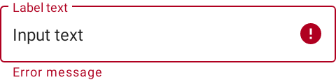

In the layout:

```xml
<com.google.android.material.textfield.TextInputLayout
    android:id="@+id/outlinedTextField"
    android:layout_width="match_parent"
    android:layout_height="wrap_content"
    android:hint="@string/label"
    style="@style/Widget.MaterialComponents.TextInputLayout.OutlinedBox">

    <com.google.android.material.textfield.TextInputEditText
        android:layout_width="match_parent"
        android:layout_height="wrap_content"
    />

</com.google.android.material.textfield.TextInputLayout>
```

In code:

```kt
// Get input text
val inputText = outlinedTextField.editText?.text.toString()

outlinedTextField.editText?.doOnTextChanged { inputText, _, _, _ ->
    // Respond to input text change
}
```

See the [using text fields](#using-text-fields) section above for more examples.

### Anatomy and key properties

An outlined text field has a stroked container, input text, a label, optional
helper/error text and optional leading/trailing icons.

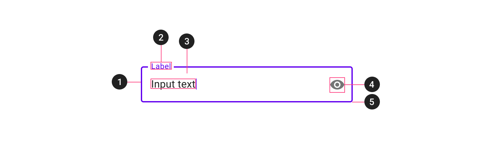

1.  Container
2.  Leading icon
3.  Label
4.  Input text
5.  Trailing icon
6.  Helper/error/counter text
7.  Prefix/suffix/placeholder (not shown)

_**Note:** All the attributes on the tables below should be set on the
`TextInputLayout`, with the exception of the input text attributes (which should
be set on the `TextInputEditText`)._

#### Container attributes

&nbsp;                   | Attribute                   | Related method(s)                                                            | Default value
------------------------ | --------------------------- | ---------------------------------------------------------------------------- | -------------
**Stroke color**         | `app:boxStrokeColor`        | `setBoxStrokeColor`<br/>`setBoxStrokeColorStateList`<br/>`getBoxStrokeColor` | `?attr/colorOnSurface` at 38% opacity and `?attr/colorPrimary` (focused) (see all [states](https://github.com/material-components/material-components-android/tree/master/lib/java/com/google/android/material/textfield/res/color/mtrl_outlined_stroke_color.xml))
**Stroke error color**   | `app:boxStrokeErrorColor`   | `setBoxStrokeErrorColor`<br/>`getBoxStrokeErrorColor`                        | `?attr/colorError` (see all [states](https://github.com/material-components/material-components-android/tree/master/lib/java/com/google/android/material/textfield/res/color/mtrl_error.xml))
**Stroke width**         | `app:boxStrokeWidth`        | N/A                                                                          | `1dp`
**Stroke focused width** | `app:boxStrokeWidthFocused` | N/A                                                                          | `2dp`
**Shape**                | `app:shapeAppearance`       | N/A                                                                          | `?attr/shapeAppearanceSmallComponent`
**Text field enabled**   | `android:enabled`           | `setEnabled`                                                                 | `true`

#### Leading icon attributes

&nbsp;                  | Attribute                         | Related method(s)                                                     | Default value
----------------------- | --------------------------------- | --------------------------------------------------------------------- | -------------
**Icon**                | `app:startIconDrawable`           | `setStartIconDrawable`<br/>`getStartIconDrawable`                     | `null`
**Content description** | `app:startIconContentDescription` | `setStartIconContentDescription`<br/>`getStartIconContentDescription` | `null`
**Color**               | `app:startIconTint`               | `setStartIconTintList`                                                | `colorOnSurface` at 60% opacity (see all [states](https://github.com/material-components/material-components-android/tree/master/lib/java/com/google/android/material/textfield/res/color/mtrl_outlined_icon_tint.xml))
**Checkable**           | `app:startIconCheckable`          | `setStartIconCheckable`<br/>`isStartIconCheckable`                    | `false`

#### Label attributes

&nbsp;                         | Attribute                | Related method(s)                                       | Default value
------------------------------ | ------------------------ | ------------------------------------------------------- | -------------
**Text**                       | `android:hint`           | `setHint`<br/>`getHint`                                 | `null`
**Color**                      | `android:textColorHint`  | `setDefaultHintTextColor`<br/>`getDefaultHintTextColor` | `?attr/colorOnSurface` at 60% opacity (see all [states](https://github.com/material-components/material-components-android/tree/master/lib/java/com/google/android/material/textfield/res/color/mtrl_indicator_text_color.xml))
**Collapsed (floating) color** | `app:hintTextColor`      | `setHintTextColor`<br/>`getHintTextColor`               | `?attr/colorPrimary`
**Typography**                 | `app:hintTextAppearance` | `setHintTextAppearance`                                 | `?attr/textAppearanceCaption`

**Note:** The `android:hint` should always be set on the `TextInputLayout`
instead of on the `EditText` in order to avoid unintended behaviors.

#### Input text attributes

&nbsp;               | Attribute                                                           | Related method(s)                                            | Default value
-------------------- | ------------------------------------------------------------------- | ------------------------------------------------------------ | -------------
**Input text**       | `android:text`                                                      | `setText`<br/>`getText`                                      | `@null`
**Typography**       | `android:textAppearance`                                            | `setTextAppearance`                                          | `?attr/textAppearanceSubtitle1`
**Input text color** | `android:textColor`                                                 | `setTextColor`<br/>`getTextColors`<br/>`getCurrentTextColor` | `?android:textColorPrimary`
**Cursor color**     | N/A (color comes from the theme attr `?attr/colorControlActivated`) | N/A                                                          | `?attr/colorPrimary`

_**Note:** The input text attributes should be set on the `TextInputEditText`._

#### Trailing icon attributes

&nbsp;                              | Attribute                       | Related method(s)                                                 | Default value
----------------------------------- | ------------------------------- | ----------------------------------------------------------------- | -------------
**Mode**                            | `app:endIconMode`               | `setEndIconMode`<br/>`getEndIconMode`                             | `END_ICON_NONE`
**Color**                           | `app:endIconTint`               | `setEndIconTintList`                                              | `colorOnSurface` at 60% opacity and `colorPrimary` (activated) (see all [states](https://github.com/material-components/material-components-android/tree/master/lib/java/com/google/android/material/textfield/res/color/mtrl_outlined_icon_tint.xml))
**Custom icon**                     | `app:endIconDrawable`           | `setEndIconDrawable`<br/>`getEndIconDrawable`                     | `null`
**Custom icon content description** | `app:endIconContentDescription` | `setEndIconContentDescription`<br/>`getEndIconContentDescription` | `null`
**Custom icon checkable**           | `app:endIconCheckable`          | `setEndIconCheckable`<br/>`isEndIconCheckable`                    | `true`
**Error icon**                      | `app:errorIconDrawable`         | `setErrorIconDrawable`<br/>`getErrorIconDrawable`                 | [`@drawable/mtrl_ic_error`](https://github.com/material-components/material-components-android/tree/master/lib/java/com/google/android/material/textfield/res/drawable/mtrl_ic_error.xml)
**Error icon color**                | `app:errorIconTint`             | `setErrorIconTintList`                                            | `?attr/colorError` (see all [states](https://github.com/material-components/material-components-android/tree/master/lib/java/com/google/android/material/textfield/res/color/mtrl_error.xml))

#### Helper/error/counter text attributes

&nbsp;                      | Attribute                                                           | Related method(s)                                                                                                   | Default value
--------------------------- | ------------------------------------------------------------------- | ------------------------------------------------------------------------------------------------------------------- | -------------
**Helper text enabled**     | `app:helperTextEnabled`                                             | `setHelperTextEnabled`<br/>`isHelperTextEnabled`                                                                    | `false`
**Helper text**             | `app:helperText`                                                    | `setHelperText`<br/>`getHelperText`                                                                                 | `null`
**Helper text color**       | `app:helperTextColor`                                               | `setHelperTextColor`<br/>`getHelperTextColor`                                                                       | `?attr/colorOnSurface` at 60% opacity (see all [states](https://github.com/material-components/material-components-android/tree/master/lib/java/com/google/android/material/textfield/res/color/mtrl_indicator_text_color.xml))
**Helper text typography**  | `app:helperTextAppearance`                                          | `setHelperTextAppearance`                                                                                           | `?attr/textAppearanceCaption`
**Error text enabled**      | `app:errorEnabled`                                                  | `setErrorEnabled`<br/>`isErrorEnabled`                                                                              | `false`
**Error text**              | N/A                                                                 | `setError`<br/>`getError`                                                                                           | `null`
**Error text color**        | `app:errorTextColor`                                                | `setErrorTextColor`<br/>`getErrorCurrentTextColors`                                                                 | `?attr/colorError` (see all [states](https://github.com/material-components/material-components-android/tree/master/lib/java/com/google/android/material/textfield/res/color/mtrl_error.xml)
**Error text typography**   | `app:errorTextAppearance`                                           | `setErrorTextAppearance`                                                                                            | `?attr/textAppearanceCaption`
**Counter text enabled**    | `app:counterEnabled`                                                | `setCounterEnabled`<br/>`isCounterEnabled`                                                                          | `false`
**Counter text length**     | `app:counterMaxLength`                                              | `setCounterMaxLength`<br/>`getCounterMaxLength`                                                                     | `-1`
**Counter text typography** | `app:counterTextAppearance`<br/>`app:counterOverflowTextAppearance` | `setCounterTextAppearance`<br/>`setCounterOverflowTextAppearance`                                                   | `?attr/textAppearanceCaption`
**Counter text color**      | `app:counterTextColor`<br/>`app:counterOverflowTextColor`           | `setCounterTextColor`<br/>`setCounterOverflowTextColor`<br/>`getCounterTextColor`<br/>`getCounterOverflowTextColor` | `?attr/colorOnSurface` at 60% (`app:counterTextColor`) (see all [states](https://github.com/material-components/material-components-android/tree/master/lib/java/com/google/android/material/textfield/res/color/mtrl_indicator_text_color.xml))<br/>`?attr/colorError` (`app:counterOverflowTextColor`) (see all [states](https://github.com/material-components/material-components-android/tree/master/lib/java/com/google/android/material/textfield/res/color/mtrl_error.xml))

#### Prefix/suffix attributes

&nbsp;                | Attribute                  | Related method(s)                             | Default value
--------------------- | -------------------------- | --------------------------------------------- | -------------
**Prefix**            | `app:prefixText`           | `setPrefixText`<br/>`getPrefixText`           | `null`
**Prefix color**      | `app:prefixTextColor`      | `setPrefixTextColor`<br/>`getPrefixTextColor` | `?attr/colorOnSurface` at 60% opacity (see all [states](https://github.com/material-components/material-components-android/tree/master/lib/java/com/google/android/material/textfield/res/color/mtrl_indicator_text_color.xml))
**Prefix typography** | `app:prefixTextAppearance` | `setPrefixTextAppearance`                     | `?attr/textAppearanceSubtitle1`
**Suffix**            | `app:suffixText`           | `setSuffixText`<br/>`getSuffixText`           | `null`
**Suffix color**      | `app:suffixTextColor`      | `setSuffixTextColor`<br/>`getSuffixTextColor` | `?attr/colorOnSurface` at 60% opacity (see all [states](https://github.com/material-components/material-components-android/tree/master/lib/java/com/google/android/material/textfield/res/color/mtrl_indicator_text_color.xml))
**Suffix typography** | `app:suffixTextAppearance` | `setSuffixTextAppearance`                     | `?attr/textAppearanceSubtitle1`

#### Styles

&nbsp;                                | Style
------------------------------------- | -----
**Default style**                     | `Widget.MaterialComponents.TextInputLayout.OutlinedBox`
**Dense style**                       | `Widget.MaterialComponents.TextInputLayout.OutlinedBox.Dense`
**Exposed dropdown menu style**       | `Widget.MaterialComponents.TextInputLayout.OutlinedBox.ExposedDropdownMenu`
**Dense exposed dropdown menu style** | `Widget.MaterialComponents.TextInputLayout.OutlinedBox.Dense.ExposedDropdownMenu`

Default style theme attribute: `?attr/textInputStyle`

See the full list of
[styles](https://github.com/material-components/material-components-android/tree/master/lib/java/com/google/android/material/textfield/res/values/styles.xml)
and
[attrs](https://github.com/material-components/material-components-android/tree/master/lib/java/com/google/android/material/textfield/res/values/attrs.xml).

## Theming text fields

Text fields support
[Material Theming](https://material.io/components/text-fields/#theming) and can
be customized in terms of color, typography and shape.

### Text field theming example

API and source code:

*   `TextInputLayout`
    *   [Class definition](https://developer.android.com/reference/com/google/android/material/textfield/TextInputLayout)
    *   [Class source](https://github.com/material-components/material-components-android/tree/master/lib/java/com/google/android/material/textfield/TextInputLayout.java)
*   `TextInputEditText`
    *   [Class definition](https://developer.android.com/reference/com/google/android/material/textfield/TextInputEditText)
    *   [Class source](https://github.com/material-components/material-components-android/tree/master/lib/java/com/google/android/material/textfield/TextInputEditText.java)

The following example shows filled and outlined text field types with Material
Theming.


#### Implementing text field theming

Using theme attributes and styles in `res/values/styles.xml` (themes all text
fields and affects other components):

```xml
<style name="Theme.App" parent="Theme.MaterialComponents.*">
    ...
    <item name="colorPrimary">@color/shrine_pink_100</item>
    <item name="colorOnSurface">@color/shrine_pink_900</item>
    <item name="colorError">@color/shrine_red</item>
    <item name="textAppearanceSubtitle1">@style/TextAppearance.App.Subtitle1</item>
    <item name="textAppearanceCaption">@style/TextAppearance.App.Caption</item>
    <item name="shapeAppearanceSmallComponent">@style/ShapeAppearance.App.SmallComponent</item>
</style>

<style name="TextAppearance.App.Subtitle1" parent="TextAppearance.MaterialComponents.Subtitle1">
    <item name="fontFamily">@font/rubik</item>
    <item name="android:fontFamily">@font/rubik</item>
</style>

<style name="TextAppearance.App.Caption" parent="TextAppearance.MaterialComponents.Caption">
    <item name="fontFamily">@font/rubik</item>
    <item name="android:fontFamily">@font/rubik</item>
</style>

<style name="ShapeAppearance.App.SmallComponent" parent="ShapeAppearance.MaterialComponents.SmallComponent">
    <item name="cornerFamily">cut</item>
    <item name="cornerSize">4dp</item>
</style>
```

or using default style theme attributes, styles and theme overlays (themes all
text fields but does not affect other components):

```xml
<style name="Theme.App" parent="Theme.MaterialComponents.*">
    ...
    <item name="textInputStyle">@style/Widget.App.TextInputLayout</item>
</style>

<style name="Widget.App.TextInputLayout" parent="Widget.MaterialComponents.TextInputLayout.*">
    <item name="materialThemeOverlay">@style/ThemeOverlay.App.TextInputLayout</item>
    <item name="shapeAppearance">@style/ShapeAppearance.App.SmallComponent</item>
    <item name="hintTextColor">?attr/colorOnSurface</item>
</style>

<style name="ThemeOverlay.App.TextInputLayout" parent="">
    <item name="colorPrimary">@color/shrine_pink_100</item>
    <item name="colorOnSurface">@color/shrine_pink_900</item>
    <item name="colorError">@color/shrine_red</item>
    <item name="textAppearanceSubtitle1">@style/TextAppearance.App.Subtitle1</item>
    <item name="textAppearanceCaption">@style/TextAppearance.App.Caption</item>
    <item name="editTextStyle">@style/Widget.MaterialComponents.TextInputEditText.*</item>
</style>
```

or using one the style in the layout (affects only this text field):

```xml
<com.google.android.material.textfield.TextInputLayout
    ...
    style="@style/Widget.App.TextInputLayout">

    ...

</com.google.android.material.textfield.TextInputLayout>
```

_**Note:** When setting a `materialThemeOverlay` on a custom `TextInputLayout`
style, don't forget to set `editTextStyle` to either a
`@style/Widget.MaterialComponents.TextInputEditText.*` style or to a custom one
that inherits from that.
<br/>
The `TextInputLayout` styles set `materialThemeOverlay` that overrides
`editTextStyle` with the specific `TextInputEditText` style needed. Therefore,
you don't need to specify a style tag on the edit text._
