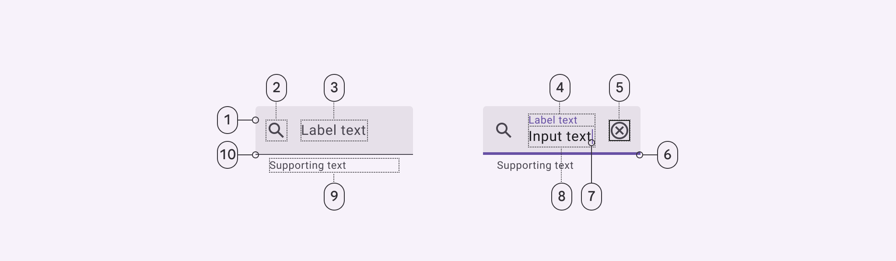
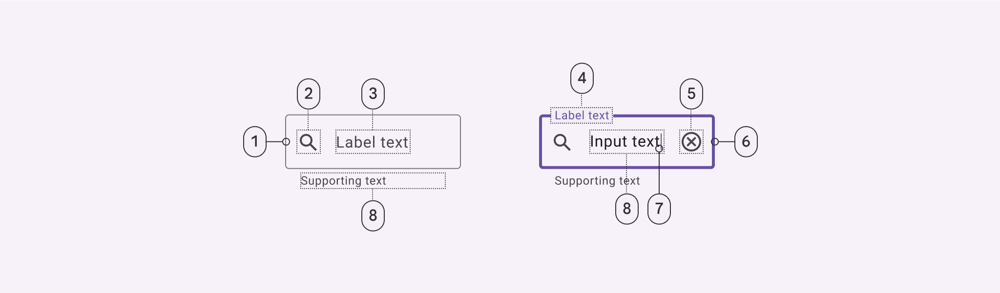
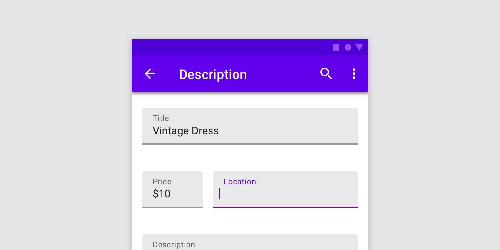
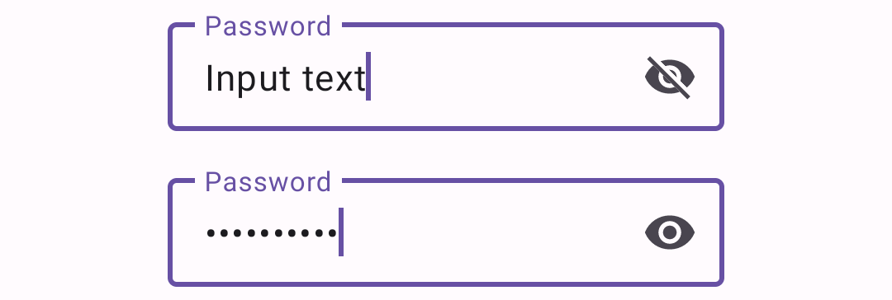
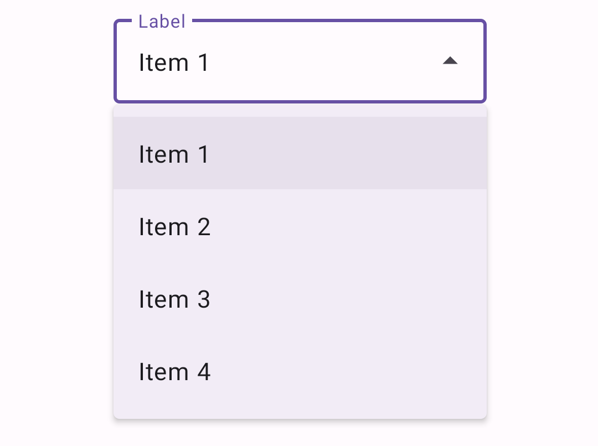
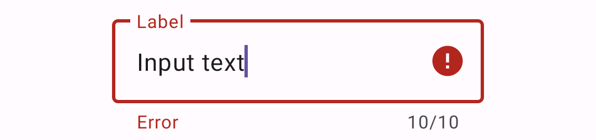

<!--docs:
title: "Text Fields"
layout: detail
section: components
excerpt: "A text field with an animated floating label and other Material Design features."
iconId: text_field
path: /catalog/text-fields/
-->

# Text fields

[Text fields](https://m3.material.io/components/text-fields/overview) let users
enter and edit text. There are two variants of text fields.


1.  Filled text field
2.  Outlined text field

**Note:** Images use various dynamic color schemes.

## Design & API documentation

*   [Material 3 (M3) spec](https://m3.material.io/components/text-fields/overview)
*   [API reference](https://developer.android.com/reference/com/google/android/material/textfield/package-summary)

## Anatomy

#### Filled text field



1.  Container
2.  Leading icon (optional)
3.  Label text (empty)
4.  Label text (populated)
5.  Trailing icon (optional)
6.  Active indicator (focused)
7.  Caret
8.  Input text
9.  Supporting text (optional)
10. Active Indicator (enabled)

#### Outlined text field



1.  Container outline (enabled)
2.  Leading icon (optional)
3.  Label text (unpopulated)
4.  Label text (populated)
5.  Trailing icon (optional)
6.  Container outline (focused)
7.  Caret
8.  Input text
9.  Supporting text (optional)

More details on anatomy items in the
[component guidelines](https://m3.material.io/components/text-fields/guidelines#6be8deda-2eed-4765-9e32-98c2563d6c1c).

## Key properties

<details>
<summary><h3>Filled text field</h3></summary>

#### Container attributes

Element                | Attribute                | Related method(s)                                                                       | Default value
---------------------- | ------------------------ | --------------------------------------------------------------------------------------- | -------------
**Color**              | `app:boxBackgroundColor` | `setBoxBackgroundColor`<br/>`setBoxBackgroundColorResource`<br/>`getBoxBackgroundColor` | `?attr/colorSurfaceContainerHighest` (see all [states](https://github.com/material-components/material-components-android/tree/master/lib/java/com/google/android/material/textfield/res/color/m3_textfield_filled_background_color.xml))
**Shape**              | `app:shapeAppearance`    | N/A                                                                                     | `?attr/shapeAppearanceCornerExtraSmall`
**Text field enabled** | `android:enabled`        | `setEnabled`                                                                            | `true`

#### Leading icon attributes

Element                 | Attribute                         | Related method(s)                                                     | Default value
----------------------- | --------------------------------- | --------------------------------------------------------------------- | -------------
**Icon**                | `app:startIconDrawable`           | `setStartIconDrawable`<br/>`getStartIconDrawable`                     | `null`
**Content description** | `app:startIconContentDescription` | `setStartIconContentDescription`<br/>`getStartIconContentDescription` | `null`
**Color**               | `app:startIconTint`               | `setStartIconTintList`                                                | `?attr/colorOnSurfaceVariant` (see all [states](https://github.com/material-components/material-components-android/tree/master/lib/java/com/google/android/material/textfield/res/color/m3_textfield_indicator_text_color.xml))
**Checkable**           | `app:startIconCheckable`          | `setStartIconCheckable`<br/>`isStartIconCheckable`                    | `false`
**Size**                | `app:startIconMinSize`            | `setStartIconMinSize`<br/>`getStartIconMinSize`                       | `48dp`
**Scale type**          | `app:startIconScaleType`          | `setStartIconScaleType` <br/> `getStartIconScaleType`                 | `ScaleType.CENTER`

#### Label attributes

Element                        | Attribute                  | Related method(s)                                       | Default value
------------------------------ | -------------------------- | ------------------------------------------------------- | -------------
**Text**                       | `android:hint`             | `setHint`<br/>`getHint`                                 | `null`
**Color**                      | `android:textColorHint`    | `setDefaultHintTextColor`<br/>`getDefaultHintTextColor` | `?attr/colorOnSurfaceVariant` (see all [states](https://github.com/material-components/material-components-android/tree/master/lib/java/com/google/android/material/textfield/res/color/m3_textfield_label_color.xml))
**Collapsed (floating) color** | `app:hintTextColor`        | `setHintTextColor`<br/>`getHintTextColor`               | `?attr/colorPrimary` (see all [states](https://github.com/material-components/material-components-android/tree/master/lib/java/com/google/android/material/textfield/res/color/m3_textfield_label_color.xml))
**Typography**                 | `app:hintTextAppearance`   | `setHintTextAppearance`                                 | `?attr/textAppearanceBodySmall`
**Animation**                  | `app:hintAnimationEnabled` | `setHintAnimationEnabled`<br/>`isHintAnimationEnabled`  | `true`
**Expanded enabled**           | `app:expandedHintEnabled`  | `setExpandedHintEnabled`<br/>`isExpandedHintEnabled`    | `true`

**Note:** The `android:hint` should always be set on the `TextInputLayout`
instead of on the `EditText` in order to avoid unintended behaviors.

#### Input text attributes (set on the `TextInputEditText`)

Element                  | Attribute                                                                | Related method(s)                                            | Default value
------------------------ | ------------------------------------------------------------------------ | ------------------------------------------------------------ | -------------
**Input text**           | `android:text`                                                           | `setText`<br/>`getText`                                      | `@null`
**Typography**           | `android:textAppearance`                                                 | `setTextAppearance`                                          | `?attr/textAppearanceBodyLarge`
**Input text color**     | `android:textColor`                                                      | `setTextColor`<br/>`getTextColors`<br/>`getCurrentTextColor` | `?attr/colorOnSurface`
**Cursor color**         | N/A (color comes from the theme attr `?attr/colorControlActivated`)      | N/A                                                          | `?attr/colorPrimary`
**Text highlight color** | N/A (color comes from the theme attr `?android:attr/textColorHighlight`) | N/A                                                          | [`@color/m3_highlighted_text`](https://github.com/material-components/material-components-android/tree/master/lib/java/com/google/android/material/color/res/color/m3_highlighted_text.xml)

#### Input text attributes (set on the `TextInputLayout`)

Element                | Attribute                                | Related method(s)                                                     | Default value
---------------------- | ---------------------------------------- | --------------------------------------------------------------------- | -------------
**Cursor color**       | `app:cursorColor` on API levels 28+      | `setCursorColor`<br/>`getCursorColor`<br/>on API levels 28+           | `@null` (uses `?attr/colorControlActivated` by default)
**Cursor error color** | `app:cursorErrorColor` on API levels 28+ | `setCursorErrorColor`<br/>`getCursorErrorColor`<br/>on API levels 28+ | `?attr/colorError` on API levels 28+, `?attr/colorControlActivated` otherwise

#### Trailing icon attributes

Element                             | Attribute                       | Related method(s)                                                 | Default value
----------------------------------- | ------------------------------- | ----------------------------------------------------------------- | -------------
**Mode**                            | `app:endIconMode`               | `setEndIconMode`<br/>`getEndIconMode`                             | `END_ICON_NONE`
**Color**                           | `app:endIconTint`               | `setEndIconTintList`                                              | `colorOnSurfaceVariant` (see all [states](https://github.com/material-components/material-components-android/tree/master/lib/java/com/google/android/material/textfield/res/color/m3_textfield_indicator_text_color.xml))
**Custom icon**                     | `app:endIconDrawable`           | `setEndIconDrawable`<br/>`getEndIconDrawable`                     | `null`
**Custom icon content description** | `app:endIconContentDescription` | `setEndIconContentDescription`<br/>`getEndIconContentDescription` | `null`
**Custom icon checkable**           | `app:endIconCheckable`          | `setEndIconCheckable`<br/>`isEndIconCheckable`                    | `true`
**Error icon**                      | `app:errorIconDrawable`         | `setErrorIconDrawable`<br/>`getErrorIconDrawable`                 | [`@drawable/mtrl_ic_error`](https://github.com/material-components/material-components-android/tree/master/lib/java/com/google/android/material/textfield/res/drawable/mtrl_ic_error.xml)
**Error icon color**                | `app:errorIconTint`             | `setErrorIconTintList`                                            | `?attr/colorError`
**Size**                            | `app:endIconMinSize`            | `setEndIconMinSize`<br/>`getEndIconMinSize`                       | `48dp`
**Scale type**                      | `app:endIconScaleType`          | `setEndIconScaleType` <br/> `getEndIconScaleType`                 | `ScaleType.CENTER`

#### Activation indicator attributes

Element           | Attribute                   | Related method(s)                                                            | Default value
----------------- | --------------------------- | ---------------------------------------------------------------------------- | -------------
**Color**         | `app:boxStrokeColor`        | `setBoxStrokeColor`<br/>`setBoxStrokeColorStateList`<br/>`getBoxStrokeColor` | `?attr/colorOutline` and `?attr/colorPrimary` (focused) (see all [states](https://github.com/material-components/material-components-android/tree/master/lib/java/com/google/android/material/textfield/res/color/m3_textfield_stroke_color.xml))
**Error color**   | `app:boxStrokeErrorColor`   | `setBoxStrokeErrorColor`<br/>`getBoxStrokeErrorColor`                        | `?attr/colorError`
**Width**         | `app:boxStrokeWidth`        | N/A                                                                          | `1dp`
**Focused width** | `app:boxStrokeWidthFocused` | N/A                                                                          | `2dp`

#### Helper/error/counter text attributes

Element                                  | Attribute                                                           | Related method(s)                                                                                                   | Default value
---------------------------------------- | ------------------------------------------------------------------- | ------------------------------------------------------------------------------------------------------------------- | -------------
**Helper text enabled**                  | `app:helperTextEnabled`                                             | `setHelperTextEnabled`<br/>`isHelperTextEnabled`                                                                    | `false`
**Helper text**                          | `app:helperText`                                                    | `setHelperText`<br/>`getHelperText`                                                                                 | `null`
**Helper text color**                    | `app:helperTextColor`                                               | `setHelperTextColor`<br/>`getHelperTextColor`                                                                       | `?attr/colorOnSurfaceVariant` (see all [states](https://github.com/material-components/material-components-android/tree/master/lib/java/com/google/android/material/textfield/res/color/m3_textfield_indicator_text_color.xml))
**Helper text typography**               | `app:helperTextAppearance`                                          | `setHelperTextAppearance`                                                                                           | `?attr/textAppearanceBodySmall`
**Error text enabled**                   | `app:errorEnabled`                                                  | `setErrorEnabled`<br/>`isErrorEnabled`                                                                              | `false`
**Error text**                           | N/A                                                                 | `setError`<br/>`getError`                                                                                           | `null`
**Error text accessibility live region** | `app:errorAccessibilityLiveRegion`                                  | `setErrorAccessibilityLiveRegion`<br/>`getErrorAccessibilityLiveRegion`                                             | `ViewCompat.ACCESSIBILITY_LIVE_REGION_POLITE`
**Error text color**                     | `app:errorTextColor`                                                | `setErrorTextColor`<br/>`getErrorCurrentTextColors`                                                                 | `?attr/colorError`
**Error text typography**                | `app:errorTextAppearance`                                           | `setErrorTextAppearance`                                                                                            | `?attr/textAppearanceBodySmall`
**Counter text enabled**                 | `app:counterEnabled`                                                | `setCounterEnabled`<br/>`isCounterEnabled`                                                                          | `false`
**Counter text length**                  | `app:counterMaxLength`                                              | `setCounterMaxLength`<br/>`getCounterMaxLength`                                                                     | `-1`
**Counter text typography**              | `app:counterTextAppearance`<br/>`app:counterOverflowTextAppearance` | `setCounterTextAppearance`<br/>`setCounterOverflowTextAppearance`                                                   | `?attr/textAppearanceBodySmall`
**Counter text color**                   | `app:counterTextColor`<br/>`app:counterOverflowTextColor`           | `setCounterTextColor`<br/>`setCounterOverflowTextColor`<br/>`getCounterTextColor`<br/>`getCounterOverflowTextColor` | `?attr/colorOnSurfaceVariant` (`app:counterTextColor`) (see all [states](https://github.com/material-components/material-components-android/tree/master/lib/java/com/google/android/material/textfield/res/color/m3_textfield_indicator_text_color.xml))<br/>`?attr/colorError` (`app:counterOverflowTextColor`)

#### Prefix/suffix attributes

Element               | Attribute                  | Related method(s)                             | Default value
--------------------- | -------------------------- | --------------------------------------------- | -------------
**Prefix**            | `app:prefixText`           | `setPrefixText`<br/>`getPrefixText`           | `null`
**Prefix color**      | `app:prefixTextColor`      | `setPrefixTextColor`<br/>`getPrefixTextColor` | `?attr/colorOnSurfaceVariant` (see all [states](https://github.com/material-components/material-components-android/tree/master/lib/java/com/google/android/material/textfield/res/color/m3_textfield_indicator_text_color.xml))
**Prefix typography** | `app:prefixTextAppearance` | `setPrefixTextAppearance`                     | `?attr/textAppearanceTitleMedium`
**Suffix**            | `app:suffixText`           | `setSuffixText`<br/>`getSuffixText`           | `null`
**Suffix color**      | `app:suffixTextColor`      | `setSuffixTextColor`<br/>`getSuffixTextColor` | `?attr/colorOnSurfaceVariant` (see all [states](https://github.com/material-components/material-components-android/tree/master/lib/java/com/google/android/material/textfield/res/color/m3_textfield_indicator_text_color.xml))
**Suffix typography** | `app:suffixTextAppearance` | `setSuffixTextAppearance`                     | `?attr/textAppearanceTitleMedium`

#### Styles

Element                               | Style                                                                  | Default style theme attribute
------------------------------------- | ---------------------------------------------------------------------- | -----------------------------
**Default style**                     | `Widget.Material3.TextInputLayout.FilledBox`                           | `?attr/textInputFilledStyle`
**Dense style**                       | `Widget.Material3.TextInputLayout.FilledBox.Dense`                     | `?attr/textInputFilledDenseStyle`
**Exposed dropdown menu style**       | `Widget.Material3.TextInputLayout.FilledBox.ExposedDropdownMenu`       | `?attr/textInputFilledExposedDropdownMenuStyle`
**Dense exposed dropdown menu style** | `Widget.Material3.TextInputLayout.FilledBox.Dense.ExposedDropdownMenu` | N/A

For the full list, see
[styles](https://github.com/material-components/material-components-android/tree/master/lib/java/com/google/android/material/textfield/res/values/styles.xml)
and
[attrs](https://github.com/material-components/material-components-android/tree/master/lib/java/com/google/android/material/textfield/res/values/attrs.xml).

</details>

<details>
<summary><h3>Outlined text field</h3></summary>

#### Container attributes

Element                  | Attribute                   | Related method(s)                                                            | Default value
------------------------ | --------------------------- | ---------------------------------------------------------------------------- | -------------
**Stroke color**         | `app:boxStrokeColor`        | `setBoxStrokeColor`<br/>`setBoxStrokeColorStateList`<br/>`getBoxStrokeColor` | `?attr/colorOutline` and `?attr/colorPrimary` (focused) (see all [states](https://github.com/material-components/material-components-android/tree/master/lib/java/com/google/android/material/textfield/res/color/m3_textfield_stroke_color.xml))
**Stroke error color**   | `app:boxStrokeErrorColor`   | `setBoxStrokeErrorColor`<br/>`getBoxStrokeErrorColor`                        | `?attr/colorError`
**Stroke width**         | `app:boxStrokeWidth`        | N/A                                                                          | `1dp`
**Stroke focused width** | `app:boxStrokeWidthFocused` | N/A                                                                          | `2dp`
**Shape**                | `app:shapeAppearance`       | N/A                                                                          | `?attr/shapeAppearanceCornerExtraSmall`
**Text field enabled**   | `android:enabled`           | `setEnabled`                                                                 | `true`

#### Leading icon attributes

Element                 | Attribute                         | Related method(s)                                                     | Default value
----------------------- | --------------------------------- | --------------------------------------------------------------------- | -------------
**Icon**                | `app:startIconDrawable`           | `setStartIconDrawable`<br/>`getStartIconDrawable`                     | `null`
**Content description** | `app:startIconContentDescription` | `setStartIconContentDescription`<br/>`getStartIconContentDescription` | `null`
**Color**               | `app:startIconTint`               | `setStartIconTintList`                                                | `?attr/colorOnSurfaceVariant` (see all [states](https://github.com/material-components/material-components-android/tree/master/lib/java/com/google/android/material/textfield/res/color/m3_textfield_indicator_text_color.xml))
**Checkable**           | `app:startIconCheckable`          | `setStartIconCheckable`<br/>`isStartIconCheckable`                    | `false`

#### Label attributes

Element                        | Attribute                | Related method(s)                                       | Default value
------------------------------ | ------------------------ | ------------------------------------------------------- | -------------
**Text**                       | `android:hint`           | `setHint`<br/>`getHint`                                 | `null`
**Color**                      | `android:textColorHint`  | `setDefaultHintTextColor`<br/>`getDefaultHintTextColor` | `?attr/colorOnSurfaceVariant` (see all [states](https://github.com/material-components/material-components-android/tree/master/lib/java/com/google/android/material/textfield/res/color/m3_textfield_label_color.xml))
**Collapsed (floating) color** | `app:hintTextColor`      | `setHintTextColor`<br/>`getHintTextColor`               | `?attr/colorPrimary`
**Typography**                 | `app:hintTextAppearance` | `setHintTextAppearance`                                 | `?attr/textAppearanceBodySmall`
**Max number of lines**        | `app:hintMaxLines`       | `setHintMaxLines`<br/>`getHintMaxLines`                 | `1`

**Note:** The `android:hint` should always be set on the `TextInputLayout`
instead of on the `EditText` in order to avoid unintended behaviors.

#### Input text attributes (set on the `TextInputEditText`)

Element                  | Attribute                                                                | Related method(s)                                            | Default value
------------------------ | ------------------------------------------------------------------------ | ------------------------------------------------------------ | -------------
**Input text**           | `android:text`                                                           | `setText`<br/>`getText`                                      | `@null`
**Typography**           | `android:textAppearance`                                                 | `setTextAppearance`                                          | `?attr/textAppearanceBodyLarge`
**Input text color**     | `android:textColor`                                                      | `setTextColor`<br/>`getTextColors`<br/>`getCurrentTextColor` | `?attr/colorOnSurface`
**Cursor color**         | N/A (color comes from the theme attr `?attr/colorControlActivated`)      | N/A                                                          | `?attr/colorPrimary`
**Text highlight color** | N/A (color comes from the theme attr `?android:attr/textColorHighlight`) | N/A                                                          | [`@color/m3_highlighted_text`](https://github.com/material-components/material-components-android/tree/master/lib/java/com/google/android/material/color/res/color/m3_highlighted_text.xml)

#### Input text attributes (set on the `TextInputLayout`)

Element                | Attribute                                | Related method(s)                                                     | Default value
---------------------- | ---------------------------------------- | --------------------------------------------------------------------- | -------------
**Cursor color**       | `app:cursorColor` on API levels 28+      | `setCursorColor`<br/>`getCursorColor`<br/>on API levels 28+           | `@null` (uses `?attr/colorControlActivated` by default)
**Cursor error color** | `app:cursorErrorColor` on API levels 28+ | `setCursorErrorColor`<br/>`getCursorErrorColor`<br/>on API levels 28+ | `?attr/colorError` on API levels 28+, `?attr/colorControlActivated` otherwise

#### Trailing icon attributes

Element                             | Attribute                       | Related method(s)                                                 | Default value
----------------------------------- | ------------------------------- | ----------------------------------------------------------------- | -------------
**Mode**                            | `app:endIconMode`               | `setEndIconMode`<br/>`getEndIconMode`                             | `END_ICON_NONE`
**Color**                           | `app:endIconTint`               | `setEndIconTintList`                                              | `?attr/colorOnSurfaceVariant` (see all [states](https://github.com/material-components/material-components-android/tree/master/lib/java/com/google/android/material/textfield/res/color/m3_textfield_indicator_text_color.xml))
**Custom icon**                     | `app:endIconDrawable`           | `setEndIconDrawable`<br/>`getEndIconDrawable`                     | `null`
**Custom icon content description** | `app:endIconContentDescription` | `setEndIconContentDescription`<br/>`getEndIconContentDescription` | `null`
**Custom icon checkable**           | `app:endIconCheckable`          | `setEndIconCheckable`<br/>`isEndIconCheckable`                    | `true`
**Error icon**                      | `app:errorIconDrawable`         | `setErrorIconDrawable`<br/>`getErrorIconDrawable`                 | [`@drawable/mtrl_ic_error`](https://github.com/material-components/material-components-android/tree/master/lib/java/com/google/android/material/textfield/res/drawable/mtrl_ic_error.xml)
**Error icon color**                | `app:errorIconTint`             | `setErrorIconTintList`                                            | `?attr/colorError`

#### Helper/error/counter text attributes

Element                                  | Attribute                                                           | Related method(s)                                                                                                   | Default value
---------------------------------------- | ------------------------------------------------------------------- | ------------------------------------------------------------------------------------------------------------------- | -------------
**Helper text enabled**                  | `app:helperTextEnabled`                                             | `setHelperTextEnabled`<br/>`isHelperTextEnabled`                                                                    | `false`
**Helper text**                          | `app:helperText`                                                    | `setHelperText`<br/>`getHelperText`                                                                                 | `null`
**Helper text color**                    | `app:helperTextColor`                                               | `setHelperTextColor`<br/>`getHelperTextColor`                                                                       | `?attr/colorOnSurfaceVariant` (see all [states](https://github.com/material-components/material-components-android/tree/master/lib/java/com/google/android/material/textfield/res/color/m3_textfield_indicator_text_color.xml))
**Helper text typography**               | `app:helperTextAppearance`                                          | `setHelperTextAppearance`                                                                                           | `?attr/textAppearanceBodySmall`
**Error text enabled**                   | `app:errorEnabled`                                                  | `setErrorEnabled`<br/>`isErrorEnabled`                                                                              | `false`
**Error text**                           | N/A                                                                 | `setError`<br/>`getError`                                                                                           | `null`
**Error text accessibility live region** | `app:errorAccessibilityLiveRegion`                                  | `setErrorAccessibilityLiveRegion`<br/>`getErrorAccessibilityLiveRegion`                                             | `ViewCompat.ACCESSIBILITY_LIVE_REGION_POLITE`
**Error text color**                     | `app:errorTextColor`                                                | `setErrorTextColor`<br/>`getErrorCurrentTextColors`                                                                 | `?attr/colorError`
**Error text typography**                | `app:errorTextAppearance`                                           | `setErrorTextAppearance`                                                                                            | `?attr/textAppearanceBodySmall`
**Counter text enabled**                 | `app:counterEnabled`                                                | `setCounterEnabled`<br/>`isCounterEnabled`                                                                          | `false`
**Counter text length**                  | `app:counterMaxLength`                                              | `setCounterMaxLength`<br/>`getCounterMaxLength`                                                                     | `-1`
**Counter text typography**              | `app:counterTextAppearance`<br/>`app:counterOverflowTextAppearance` | `setCounterTextAppearance`<br/>`setCounterOverflowTextAppearance`                                                   | `?attr/textAppearanceBodySmall`
**Counter text color**                   | `app:counterTextColor`<br/>`app:counterOverflowTextColor`           | `setCounterTextColor`<br/>`setCounterOverflowTextColor`<br/>`getCounterTextColor`<br/>`getCounterOverflowTextColor` | `?attr/colorOnSurfaceVariant` (`app:counterTextColor`) (see all [states](https://github.com/material-components/material-components-android/tree/master/lib/java/com/google/android/material/textfield/res/color/m3_textfield_indicator_text_color.xml))<br/>`?attr/colorError` (`app:counterOverflowTextColor`)

#### Prefix/suffix attributes

Element               | Attribute                  | Related method(s)                             | Default value
--------------------- | -------------------------- | --------------------------------------------- | -------------
**Prefix**            | `app:prefixText`           | `setPrefixText`<br/>`getPrefixText`           | `null`
**Prefix color**      | `app:prefixTextColor`      | `setPrefixTextColor`<br/>`getPrefixTextColor` | `?attr/colorOnSurfaceVariant` (see all [states](https://github.com/material-components/material-components-android/tree/master/lib/java/com/google/android/material/textfield/res/color/m3_textfield_indicator_text_color.xml))
**Prefix typography** | `app:prefixTextAppearance` | `setPrefixTextAppearance`                     | `?attr/textAppearanceTitleMedium`
**Suffix**            | `app:suffixText`           | `setSuffixText`<br/>`getSuffixText`           | `null`
**Suffix color**      | `app:suffixTextColor`      | `setSuffixTextColor`<br/>`getSuffixTextColor` | `?attr/colorOnSurfaceVariant` (see all [states](https://github.com/material-components/material-components-android/tree/master/lib/java/com/google/android/material/textfield/res/color/m3_textfield_indicator_text_color.xml))
**Suffix typography** | `app:suffixTextAppearance` | `setSuffixTextAppearance`                     | `?attr/textAppearanceTitleMedium`

#### Styles

Element                               | Style                                                                    | Default style theme attribute
------------------------------------- | ------------------------------------------------------------------------ | -----------------------------
**Default style**                     | `Widget.Material3.TextInputLayout.OutlinedBox`                           | `?attr/textInputStyle` and `?attr/textInputOutlinedStyle`
**Dense style**                       | `Widget.Material3.TextInputLayout.OutlinedBox.Dense`                     | `?attr/textInputOutlinedDenseStyle`
**Exposed dropdown menu style**       | `Widget.Material3.TextInputLayout.OutlinedBox.ExposedDropdownMenu`       | `?attr/textInputOutlinedExposedDropdownMenuStyle`
**Dense exposed dropdown menu style** | `Widget.Material3.TextInputLayout.OutlinedBox.Dense.ExposedDropdownMenu` | N/A

For the full list, see
[styles](https://github.com/material-components/material-components-android/tree/master/lib/java/com/google/android/material/textfield/res/values/styles.xml)
and
[attrs](https://github.com/material-components/material-components-android/tree/master/lib/java/com/google/android/material/textfield/res/values/attrs.xml).

</details>

## Variants of text fields

### Filled text field

[Filled text fields](https://material.io/components/text-fields/#filled-text-field)
have more visual emphasis than outlined text fields, making them stand out when
surrounded by other content and components.

#### Filled text field examples

The following example shows a filled text field with a label.


In the layout:

```xml
<com.google.android.material.textfield.TextInputLayout
    style="?attr/textInputFilledStyle"
    android:id="@+id/filledTextField"
    android:layout_width="match_parent"
    android:layout_height="wrap_content"
    android:hint="@string/label">

    <com.google.android.material.textfield.TextInputEditText
        android:layout_width="match_parent"
        android:layout_height="wrap_content"
    />

</com.google.android.material.textfield.TextInputLayout>
```

In code:

```kt
// Get input text
val inputText = filledTextField.editText?.text.toString()

filledTextField.editText?.doOnTextChanged { inputText, _, _, _ ->
    // Respond to input text change
}
```

See the [code implementation](#code-implementation) section below for more
examples.

### Outlined text field

[Outlined text fields](https://material.io/components/text-fields/#outlined-text-field)
have less visual emphasis than filled text fields. When they appear in forms,
for example, where many text fields are placed together, their reduced emphasis
helps simplify the layout.

**Note:** The outlined text field is the default style.

#### Outlined text field examples

The following example shows an outlined text field.


In the layout:

```xml
<com.google.android.material.textfield.TextInputLayout
    android:id="@+id/outlinedTextField"
    android:layout_width="match_parent"
    android:layout_height="wrap_content"
    android:hint="@string/label">

    <com.google.android.material.textfield.TextInputEditText
        android:layout_width="match_parent"
        android:layout_height="wrap_content"
    />

</com.google.android.material.textfield.TextInputLayout>
```

In code:

```kt
// Get input text
val inputText = outlinedTextField.editText?.text.toString()

outlinedTextField.editText?.doOnTextChanged { inputText, _, _, _ ->
    // Respond to input text change
}
```

See the [code implementation](#code-implementation) section below for more
examples.

## Code implementation

Before you can use Material text fields, you need to add a dependency to the
Material components for Android library. For more information, go to the
[Getting started](https://github.com/material-components/material-components-android/tree/master/docs/getting-started.md)
page.

<details>
<summary><h3>Adding text field</h3></summary>



```xml
<com.google.android.material.textfield.TextInputLayout
    android:id="@+id/textField"
    android:layout_width="match_parent"
    android:layout_height="wrap_content"
    android:hint="@string/label">

    <com.google.android.material.textfield.TextInputEditText
        android:layout_width="match_parent"
        android:layout_height="wrap_content"
    />

</com.google.android.material.textfield.TextInputLayout>
```

**Note:** A text field is composed of a `TextInputLayout` and a
`TextInputEditText` as a direct child. Using an `EditText` as the child might
work, but `TextInputEditText` provides accessibility support for the text field
and allows `TextInputLayout` greater control over the visual aspects of the
input text. If an `EditText` is being used, make sure to set its
`android:background` to `@null` so that `TextInputLayout` can set the proper
background on it.

</details>

<details>
<summary><h3>Making text fields accessible</h3></summary>

Android's text field component APIs support both label text and helper text,
which explain what is requested for a text field. While optional, their use is
strongly encouraged.

#### Content description

When using **custom icons**, you should set a content description on them so
that screen readers, like TalkBack, are able to announce their purpose or
action.

For the leading icon, that can be achieved via the
`app:startIconContentDescription` attribute or `setStartIconContentDescription`
method. For the trailing icon, that can be achieved via the
`app:endIconContentDescription` attribute or `setEndIconContentDescription`
method.

When setting an **error message** that contains special characters that screen
readers or other accessibility systems are not able to read, you should set a
content description via the `app:errorContentDescription` attribute or
`setErrorContentDescription` method. That way the error will announce the
content description instead of the error message.

**Note:** Icons that don't have click listeners set on them work as decorative
elements, and are therefore skipped by screen readers.

#### Custom `EditText`

If you are using a custom `EditText` as `TextInputLayout`'s child and your text
field requires different accessibility support than the one offered by
`TextInputLayout`, you can set a `TextInputLayout.AccessibilityDelegate` via the
`setTextInputAccessibilityDelegate` method. This method should be used in place
of providing an `AccessibilityDelegate` directly on the `EditText`.

</details>

<details>
<summary><h3>Using text fields programmatically</h3></summary>

If you construct the `TextInputEditText` child of a `TextInputLayout`
programmatically, you should use `TextInputLayout`'s context to create the view.
This will allow `TextInputLayout` to pass along the appropriate styling to the
edit text.

```kt
val textInputLayout = TextInputLayout(context)
val editText = TextInputEditText(textInputLayout.context)
```

</details>

<details>
<summary><h3>Adding a leading icon to a text field</h3></summary>


```xml
<com.google.android.material.textfield.TextInputLayout
    ...
    app:startIconDrawable="@drawable/ic_search_24dp"
    app:startIconContentDescription="@string/content_description_start_icon">

    ...

</com.google.android.material.textfield.TextInputLayout>
```

</details>

<details>
<summary><h3>Adding a trailing icon to a text field</h3></summary>

**Password toggle:**



When the `TextInputEditText` is set to display a password, an icon can be added
to toggle between masking the password or displaying the password as plain-text.

```xml
<com.google.android.material.textfield.TextInputLayout
    ...
    app:endIconMode="password_toggle">

    <com.google.android.material.textfield.TextInputEditText
        ...
        android:inputType="textPassword"
    />

</com.google.android.material.textfield.TextInputLayout>
```

**Clear text:**


An icon can be set to display when text is present. The icon can be pressed to
clear the input text.

```xml
<com.google.android.material.textfield.TextInputLayout
    ...
    app:endIconMode="clear_text">

    ...

</com.google.android.material.textfield.TextInputLayout>
```

**Custom icon:**


It is possible to set a custom `Drawable` as the text field's trailing icon via
`app:endIconMode="custom"`. You should specify a drawable and content
description for the icon, and you have the option to specify custom behaviors.

In the layout:

```xml
<com.google.android.material.textfield.TextInputLayout
    ...
    app:endIconMode="custom"
    app:endIconDrawable="@drawable/ic_accelerator_24dp"
    app:endIconContentDescription="@string/content_description_end_icon">

    ...

</com.google.android.material.textfield.TextInputLayout>
```

Optionally, in code:

```kt
textField.setEndIconOnClickListener {
  // Respond to end icon presses
}

textField.addOnEditTextAttachedListener {
  // If any specific changes should be done when the edit text is attached (and
  // thus when the trailing icon is added to it), set an
  // OnEditTextAttachedListener.

  // Example: The clear text icon's visibility behavior depends on whether the
  // EditText has input present. Therefore, an OnEditTextAttachedListener is set
  // so things like editText.getText() can be called.
}

textField.addOnEndIconChangedListener {
  // If any specific changes should be done if/when the endIconMode gets
  // changed, set an OnEndIconChangedListener.

  // Example: If the password toggle icon is set and a different EndIconMode
  // gets set, the TextInputLayout has to make sure that the edit text's
  // TransformationMethod is still PasswordTransformationMethod. Because of
  // that, an OnEndIconChangedListener is used.
}
```

**Note:** You should opt to use the `EndIconMode` API instead of setting an
end/right compound `Drawable` on the `TextInputEditText`. The same applies to
the now-deprecated `passwordToggle*` attributes.

**Important:** Calling `setEndIconMode` will initialize the icon with its
default features, such as default drawables, and in the case of the custom mode,
an empty drawable. You can add customizations after calling `setEndIconMode`.
The exception for this is if a drawable was specified in XML via the
`app:endIconDrawable` attribute. An end icon drawable set in XML will take
precedence and override an existing default icon.

For the full list, see
[end icon modes](https://github.com/material-components/material-components-android/tree/master/lib/java/com/google/android/material/textfield/res/values/attrs.xml#L149).

</details>

<details>
<summary><h3>Implementing an exposed dropdown menu</h3></summary>



In the layout:

```xml
<com.google.android.material.textfield.TextInputLayout
    ...
    style="@style/Widget.Material3.TextInputLayout.*.ExposedDropdownMenu">

    <AutoCompleteTextView
        android:layout_width="match_parent"
        android:layout_height="wrap_content"
        android:inputType="none"
        app:simpleItems="@array/simple_items"
    />

</com.google.android.material.textfield.TextInputLayout>
```

The string array specified by `app:simpleItems` will be used as the default item
strings for auto-completion. Or you can also set it programmatically:

```kt
val items = arrayOf("Item 1", "Item 2", "Item 3", "Item 4")
(textField.editText as? MaterialAutoCompleteTextView)?.setSimpleItems(items)
```

Alternatively, to have more control over the auto-completion items rendering,
you can also provide a custom item adapter by:

```kt
val items = listOf("Item 1", "Item 2", "Item 3", "Item 4")
val adapter = ArrayAdapter(requireContext(), R.layout.list_item, items)
(textField.editText as? AutoCompleteTextView)?.setAdapter(adapter)
```

And a custom item layout (`list_item.xml`):

```xml
<TextView
    xmlns:android="http://schemas.android.com/apk/res/android"
    android:layout_width="match_parent"
    android:layout_height="wrap_content"
    android:padding="16dp"
    android:ellipsize="end"
    android:maxLines="1"
    android:textAppearance="?attr/textAppearanceTitleMedium"
/>
```

</details>

<details>
<summary><h3>Adding helper text to a text field</h3></summary>


```xml
<com.google.android.material.textfield.TextInputLayout
    ...
    app:helperTextEnabled="true"
    app:helperText="@string/helper_text">

    ...

</com.google.android.material.textfield.TextInputLayout>
```

</details>

<details>
<summary><h3>Adding a counter to a text field</h3></summary>


```xml
<com.google.android.material.textfield.TextInputLayout
    ...
    app:counterEnabled="true"
    app:counterMaxLength="20">

    ...

</com.google.android.material.textfield.TextInputLayout>
```

</details>

<details>
<summary><h3>Adding errors to a text field</h3></summary>



In the layout:

```xml
<com.google.android.material.textfield.TextInputLayout
    ...
    app:errorEnabled="true">

    ...

</com.google.android.material.textfield.TextInputLayout>
```

In code:

```kt
// Set error text
passwordLayout.error = getString(R.string.error)

// Clear error text
passwordLayout.error = null
```

**Note:** Non-null error text will replace any existing helper text, and
non-null helper text will replace any existing error text.

</details>

<details>
<summary><h3>Adding a prefix/suffix to a text field</h3></summary>


```xml
<com.google.android.material.textfield.TextInputLayout
    ...
    app:prefixText="@string/prefix"
    app:suffixText="@string/suffix">

    ...

</com.google.android.material.textfield.TextInputLayout>
```

</details>

<details>
<summary><h3>Setting text field dimensions</h3></summary>

The recommended default `android:layout_width` is `245dp`.

By default, text fields have a maximum width of `488dp`, and a minimum width of
`56dp` for layouts without a label. If a label is present, the minimum width
recommended is `88dp`. `android:minWidth` and `android:maxWidth` (as well as
`android:minEms` and `android:maxEms`) should be set on the `TextInputLayout`
instead of on the `TextInputEditText` to avoid unintended behaviors.

You can override those values in a custom style that inherits from a
`TextInputLayout` style or by making changes directly on the layout:

```xml
<com.google.android.material.textfield.TextInputLayout
    android:id="@+id/textField"
    android:layout_width="wrap_content"
    android:layout_height="wrap_content"
    android:minWidth="@dimen/custom_min_width"
    android:maxWidth="@dimen/custom_max_width"
    android:hint="@string/label">

    <com.google.android.material.textfield.TextInputEditText
        android:layout_width="match_parent"
        android:layout_height="wrap_content"
    />

</com.google.android.material.textfield.TextInputLayout>
```

**Note:** The `android:layout_width` of the `TextInputLayout` should be
`wrap_content` in order for those minimum and maximum dimensions to be used.

</details>

## Customizing text fields

### Theming text fields

Text fields support the customization of color, typography, and shape.

#### Text field theming example

API and source code:

*   `TextInputLayout`
    *   [Class definition](https://developer.android.com/reference/com/google/android/material/textfield/TextInputLayout)
    *   [Class source](https://github.com/material-components/material-components-android/tree/master/lib/java/com/google/android/material/textfield/TextInputLayout.java)
*   `TextInputEditText`
    *   [Class definition](https://developer.android.com/reference/com/google/android/material/textfield/TextInputEditText)
    *   [Class source](https://github.com/material-components/material-components-android/tree/master/lib/java/com/google/android/material/textfield/TextInputEditText.java)

The following example shows filled and outlined text field types with Material
theming.


##### Implementing text field theming

Using theme attributes and styles in `res/values/styles.xml` adds themes to all
text fields and affects other components:

```xml
<style name="Theme.App" parent="Theme.Material3.*">
    ...
    <item name="colorPrimary">@color/shrine_pink_100</item>
    <item name="colorOnSurface">@color/shrine_pink_900</item>
    <item name="colorError">@color/shrine_red</item>
    <item name="textAppearanceTitleMedium">@style/TextAppearance.App.TitleMedium</item>
    <item name="textAppearanceBodySmall">@style/TextAppearance.App.BodySmall</item>
    <item name="shapeAppearanceCornerExtraSmall">@style/ShapeAppearance.App.Corner.ExtraSmall</item>
</style>

<style name="TextAppearance.App.TitleMedium" parent="TextAppearance.Material3.TitleMedium">
    <item name="fontFamily">@font/rubik</item>
    <item name="android:fontFamily">@font/rubik</item>
</style>

<style name="TextAppearance.App.BodySmall" parent="TextAppearance.Material3.BodySmall">
    <item name="fontFamily">@font/rubik</item>
    <item name="android:fontFamily">@font/rubik</item>
</style>

<style name="ShapeAppearance.App.Corner.ExtraSmall" parent="ShapeAppearance.Material3.Corner.ExtraSmall">
    <item name="cornerFamily">cut</item>
    <item name="cornerSize">4dp</item>
</style>
```

Using default style theme attributes, styles and theme overlays adds themes to
all text fields but does not affect other components:

```xml
<style name="Theme.App" parent="Theme.Material3.*">
    ...
    <item name="textInputStyle">@style/Widget.App.TextInputLayout</item>
</style>

<style name="Widget.App.TextInputLayout" parent="Widget.Material3.TextInputLayout.*">
    <item name="materialThemeOverlay">@style/ThemeOverlay.App.TextInputLayout</item>
    <item name="shapeAppearance">@style/ShapeAppearance.App.Corner.ExtraSmall</item>
    <item name="hintTextColor">?attr/colorOnSurface</item>
</style>

<style name="ThemeOverlay.App.TextInputLayout" parent="">
    <item name="colorPrimary">@color/shrine_pink_100</item>
    <item name="colorOnSurface">@color/shrine_pink_900</item>
    <item name="colorError">@color/shrine_red</item>
    <item name="textAppearanceTitleMedium">@style/TextAppearance.App.TitleMedium</item>
    <item name="textAppearanceBodySmall">@style/TextAppearance.App.BodySmall</item>
    <item name="editTextStyle">@style/Widget.Material3.TextInputEditText.*</item>
</style>
```

Using the style in the layout affects only this text field:

```xml
<com.google.android.material.textfield.TextInputLayout
    ...
    style="@style/Widget.App.TextInputLayout">

    ...

</com.google.android.material.textfield.TextInputLayout>
```

**Note:** When setting a `materialThemeOverlay` on a custom `TextInputLayout`
style, don't forget to set `editTextStyle` to either a
`@style/Widget.Material3.TextInputEditText.*` style or to a custom one that
inherits from that. <br/> The `TextInputLayout` styles set
`materialThemeOverlay` to override `editTextStyle` with the specific
`TextInputEditText` style needed. Therefore, you don't need to specify a style
tag on the edit text.
