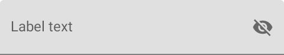
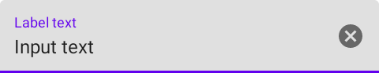
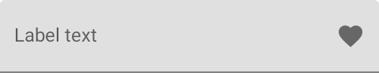
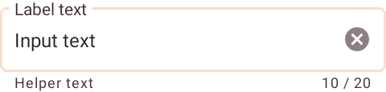

<!--docs:
title: "Text Fields"
layout: detail
section: components
excerpt: "A text field with an animated floating label and other Material Design features."
iconId: text_field
path: /catalog/text-input-layout/
-->

# Text fields

[Text fields](https://material.io/components/text-fields) let users enter and
edit text.

The text field class consists of the following types:

*   [Filled text](#filled-text-field)
*   [Outlined text](#outlined-text-field)


## Using text fields

Text fields allow users to enter text into a UI. They typically appear in forms
and dialogs.

Before you can use Material text fields, you need to add a dependency to the
Material Components for Android library. For more information, go to the
[Getting started](/material-components/material-components-android/blob/master/docs/getting-started.md)
page.

A text field is composed of a `TextInputLayout` and a `TextInputEditText` as a
direct child.

_**Note:** Using an `EditText` as the child might work, but `TextInputEditText`
provides accessibility support for the text field and allows `TextInputLayout`
greater control over the visual aspects of the input text. If an `EditText` is
being used, make sure to set its `android:background` to `@null` so that
`TextInputLayout` can set the proper background to it._

### Using `TextInputLayout` programmatically

If you construct the edit text child of a `TextInputLayout` programmatically,
you should use `TextInputLayout's` context to create the view. This will allow
`TextInputLayout` to pass along the appropriate styling to the edit text.

```kt
val editText = TextInputEditText(textInputLayout.getContext());
```

### Using trailing icons

The `TextInputLayout` provides certain pre-packaged `EndIconMode`s that come
with specific behaviors. However, their appearance and behaviors can be
customized via the trailing icon API and its attributes. The `TextInputLayout`
also provides support for a custom trailing icon.

_**Note:** You should opt to use the `EndIconMode` API instead of setting an
end/right compound drawable on the `EditText`._

<b>Password redaction icon</b>

If set, a button is displayed to toggle between the password being displayed as
plain-text or disguised when the `TextInputEditText` is set to display a
password.



```xml
<com.google.android.material.textfield.TextInputLayout
    ...
    app:endIconMode="password_toggle">

  <com.google.android.material.textfield.TextInputEditText
      ...
      android:inputType="textPassword"/>

</com.google.android.material.textfield.TextInputLayout>
```

<b>Clear text icon</b>

If set, a button is displayed when text is present and clicking it clears the
`EditText` field.



```xml
<com.google.android.material.textfield.TextInputLayout
    ...
    app:endIconMode="clear_text">

  <com.google.android.material.textfield.TextInputEditText
      ...
  />

</com.google.android.material.textfield.TextInputLayout>
```

<b>Custom icon</b>

It is possible to set a custom drawable or button as the `EditText`'s trailing
icon via `app:endIconMode="custom"`. You should specify a drawable and content
description for the icon, and, optionally, specify custom behaviors.



```xml
<com.google.android.material.textfield.TextInputLayout
    ...
    app:endIconMode="custom"
    app:endIconDrawable="@drawable/baseline_favorite_24"
    app:endIconContentDescription="@string/custom_content_desc">

  <com.google.android.material.textfield.TextInputEditText
      ...
  />

</com.google.android.material.textfield.TextInputLayout>
```

Optionally, in code:

```kt
// Icon's functionality.
textInputCustomEndIcon.setEndIconOnClickListener {
  // If the icon should work as button, set an OnClickListener to it.
}

// Behavior that depends on the edit text.
textInputCustomEndIcon.addOnEditTextAttachedListener {
  // If any specific changes should be done when the edit text is attached (and
  // thus when the trailing icon is added to it), set an
  // OnEditTextAttachedListener.

  // Example: The clear text icon's visibility behavior depends on whether the
  // edit text has input present. Therefore, an OnEditTextAttachedListener is set
  // so things like editText.getText() can be called.
}

// Behavior if EndIconMode changes.
textInputCustomEndIcon.addOnEndIconChangedListener {
  // If any specific changes should be done if/when the endIconMode gets
  // changed, set an OnEndIconChangedListener.

  // Example: If the password redaction icon is set and a different EndIconMode
  // gets set, the TextInputLayout has to make sure that the edit text's
  // TransformationMethod is still PasswordTransformationMethod. Because of
  // that, an OnEndIconChangedListener is used.
}
```

### Making text fields accessible

Android's text field component APIs support both label text and helper text for
informing the user as to what information is requested for a text field. While
optional, their use is strongly encouraged.

#### Content description

When using **custom icons**, you should set a content description on them so
that screen readers like TalkBack are able to announce their purpose or action,
if any.

For the leading icon, that can be achieved via the
`app:startIconContentDescription` attribute or `setStartIconContentDescription`
method. For the trailing icon, that can be achieved via the
`app:endIconContentDescription` attribute or `setEndIconContentDescription`
method.

When setting an **error message** that contains special characters that screen
readers or other accessibility systems are not able to read, you should set a
content description via the `app:errorContentDescription` attribute or
`setErrorContentDescription` method. That way, when the error needs to be
announced, it will announce the content description instead.

#### Custom `EditText`

If you are using a custom `EditText` as `TextInputLayout`'s child and your text
field requires different accessibility support than the one offered by
`TextInputLayout`, you can set a `TextInputLayout.AccessibilityDelegate` via the
`setTextInputAccessibilityDelegate` method. This method should be used in place
of providing an `AccessibilityDelegate` directly on the `EditText`.

## Filled text field

[Filled text fields](https://material.io/components/text-fields/#filled-text-field)
have more visual emphasis than outlined text fields, making them stand out when
surrounded by other content and components.

_**Note:** The filled text field is the default style if the style is not set._

### Filled text field example

Source code API:

*   `TextInputLayout`

    *   [Class definition](https://developer.android.com/reference/com/google/android/material/textfield/TextInputLayout)
    *   [Class source](https://github.com/material-components/material-components-android/tree/master/lib/java/com/google/android/material/textfield/TextInputLayout.java)

*   `TextInputEditText`

    *   [Class definition](https://developer.android.com/reference/com/google/android/material/textfield/TextInputEditText)
    *   [Class source](https://github.com/material-components/material-components-android/tree/master/lib/java/com/google/android/material/textfield/TextInputEditText.java)

The following examples shows a filled text field.


In the layout:

```xml
<com.google.android.material.textfield.TextInputLayout
    android:id="@+id/filledTextField"
    android:layout_width="match_parent"
    android:layout_height="wrap_content"
    android:hint="@string/label_text"
    app:helperTextEnabled="true"
    app:helperText="@string/helper_text"
    app:counterEnabled="true"
    app:counterMaxLength="20"
    app:startIconContentDescription="@string/leading_icon_content_desc"
    app:startIconDrawable="@drawable/baseline_favorite_24">

  <com.google.android.material.textfield.TextInputEditText
      android:layout_width="match_parent"
      android:layout_height="wrap_content"/>

</com.google.android.material.textfield.TextInputLayout>
```

_**Note:** Since this is the default type, you don't need to specify a style tag
as long as you are using a Material Components Theme. If not, set the style to
`@style/Widget.MaterialComponents.TextInputLayout.FilledBox`._

<b>Height variations</b>

`TextInputLayout` provides two height variations for filled text fields,
standard and dense. The
`@style/Widget.MaterialComponents.TextInputLayout.FilledBox` style defaults to
the standard height.

A dense style will reduce the height of a text field by reducing the vertical
padding within the text field. You can achieve this by setting the style to
`@style/Widget.MaterialComponents.TextInputLayout.FilledBox.Dense`

In the layout:

```xml
<com.google.android.material.textfield.TextInputLayout
      ...
      style="@style/Widget.MaterialComponents.TextInputLayout.FilledBox.Dense">
    <com.google.android.material.textfield.TextInputEditText
        android:layout_width="match_parent"
        android:layout_height="wrap_content"/>
</com.google.android.material.textfield.TextInputLayout>
```

_**Note:** To change a text field's internal padding and overall dimensions, you
can adjust the `android:padding` attributes on the `TextInputEditText`._

### Anatomy and key properties


1.  Container
1.  Leading icon (optional)
1.  Label text (optional)
1.  Input text
1.  Trailing icon (optional)
1.  Activation indicator
1.  Helper text (optional)

<b>Container</b> attributes

&nbsp;    | Attribute                | Related method(s)                                                                       | Default value
--------- | ------------------------ | --------------------------------------------------------------------------------------- | -------------
**Color** | `app:boxBackgroundColor` | `setBoxBackgroundColorResource`<br/>`setBoxBackgroundColor`<br/>`getBoxBackgroundColor` | `?attr/colorOnSurface` at 12% opacity over `attr/colorSurface`
**Shape** | `app:shapeAppearance`    | N/A                                                                                     | `?attr/shapeAppearanceSmallComponent`

<b>Leading icon</b> (optional) attributes

&nbsp;                  | Attribute                         | Related method(s)                                 | Default value
----------------------- | --------------------------------- | ------------------------------------------------- | -------------
**Icon**                | `app:startIconDrawable`           | `setStartIconDrawable`<br/>`getStartIconDrawable` | `@null`
**Content description** | `app:startIconContentDescription` | `setStartIconContentDescription`                  | `@null`
**Color**               | `app:startIconTint`               | `setStartIconTintList`                            | `?attr/colorOnSurface` at 54% (see all [states](https://github.com/material-components/material-components-android/tree/master/lib/java/com/google/android/material/textfield/res/color/mtrl_filled_icon_tint.xml))

<b>Label text</b> (optional) attributes

The following attributes and methods should be set and called on the
`TextInputLayout` instead of on the edit text in order to avoid unintended
behaviors.

&nbsp;         | Attribute                                                                       | Related method(s)                                                                                     | Default value
-------------- | ------------------------------------------------------------------------------- | ----------------------------------------------------------------------------------------------------- | -------------
**Label text** | `app:hintEnabled`<br/>`android:hint`                                            | `setHintEnabled`<br/>`setHint`<br/>`isHintEnabled`<br/>`getHint`                                      | `true` (`app:hintEnabled`)<br/>`@null` (`android:hint`)
**Typography** | `app:hintTextAppearance`                                                        | `setHintTextAppearance`                                                                               | `?attr/textAppearanceCaption`
**Color**      | `app:hintTextColor` (floating state)<br/>`android:textColorHint` (other states) | `setHintTextColor`<br/>`setDefaultHintTextColor`<br/>`getHintTextColor`<br/>`getDefaultHintTextColor` | `?attr/colorPrimary` (`app:hintTextColor`)<br/>`?attr/colorOnSurface` at 60% opacity (see all [states](https://github.com/material-components/material-components-android/tree/master/lib/java/com/google/android/material/textfield/res/color/mtrl_indicator_text_color.xml))

<b>Input text</b> attributes

**Important:** The following attributes and methods should be set and called on
the **`TextInputEditText`**, not on the `TextInputLayout`.

&nbsp;         | Attribute                | Related method(s)                                            | Default value
-------------- | ------------------------ | ------------------------------------------------------------ | -------------
**Input text** | `android:text`           | `setText`<br/>`getText`                                      | `@null`
**Typography** | `android:textAppearance` | `setTextAppearance`                                          | `?attr/textAppearanceSubtitle1`
**Color**      | `android:textColor`      | `setTextColor`<br/>`getTextColors`<br/>`getCurrentTextColor` | `?android:textColorPrimary`

<b>Trailing icon</b> (optional) attributes

&nbsp;                  | Attribute                                   | Related method(s)                                                                       | Default value
----------------------- | ------------------------------------------- | --------------------------------------------------------------------------------------- | -------------
**Icon**                | `app:endIconMode`<br/>`app:endIconDrawable` | `setEndIconMode`<br/>`setEndIconDrawable`<br/>`getEndIconMode`<br/>`getEndIconDrawable` | `END_ICON_NONE` (`app:endIconMode`)<br/>`@null` (`app:endIconDrawable`)
**Content description** | `app:endIconContentDescription`             | `setEndIconContentDescription`                                                          | `@null` for `END_ICON_NONE`
**Color**               | `app:endIconTint`                           | `setEndIconTintList`                                                                    | `?attr/colorOnSurface` at 54% (see all [states](https://github.com/material-components/material-components-android/tree/master/lib/java/com/google/android/material/textfield/res/color/mtrl_filled_icon_tint.xml))

<b>Activation indicator</b> attributes

&nbsp;           | Attribute                                            | Related method(s)                                                                                                                           | Default value
---------------- | ---------------------------------------------------- | ------------------------------------------------------------------------------------------------------------------------------------------- | -------------
**Stroke color** | `app:boxStrokeColor`<br/>`app:boxStrokeErrorColor`   | `setBoxStrokeColor`<br/>`setBoxStrokeColorStateList`<br/>`setBoxStrokeErrorColor`<br/>`getBoxStrokeColor`<br/>`getBoxStrokeErrorColor`<br/> | `?attr/colorOnSurface` at 42% opacity (see all [states](https://github.com/material-components/material-components-android/tree/master/lib/java/com/google/android/material/textfield/res/color/mtrl_filled_stroke_color.xml))<br/>`?attr/colorError` for `app:boxStrokeErrorColor` (see all [states](https://github.com/material-components/material-components-android/tree/master/lib/java/com/google/android/material/textfield/res/color/mtrl_error.xml))
**Stroke width** | `app:boxStrokeWidth`<br/>`app:boxStrokeWidthFocused` | N/A                                                                                                                                         | `1dp` (default)<br/>`2dp`(focused)

<b>Helper text</b> (optional) attributes

&nbsp;          | Attribute                                    | Related method(s)                                                                        | Default value
--------------- | -------------------------------------------- | ---------------------------------------------------------------------------------------- | -------------
**Helper text** | `app:helperTextEnabled`<br/>`app:helperText` | `setHelperTextEnabled`<br/>`setHelperText`<br/>`isHelperTextEnabled`<br/>`getHelperText` | `false` (`app:helperTextEnabled`)<br/>`@null` (`app:helperText`)
**Typography**  | `app:helperTextTextAppearance`               | `setHelperTextTextAppearance`                                                            | `app:?attr/textAppearanceCaption`
**Color**       | `app:helperTextTextColor`                    | `setHelperTextColor`<br/>`getHelperTextCurrentTextColor`                                 | `?attr/colorOnSurface` at 60% (see all [states](https://github.com/material-components/material-components-android/tree/master/lib/java/com/google/android/material/textfield/res/color/mtrl_indicator_text_color.xml))

<b>Error message</b> (optional) attributes

&nbsp;                        | Attribute                     | Related method(s)                                                    | Default value
----------------------------- | ----------------------------- | -------------------------------------------------------------------- | -------------
**Error text**                | `app:errorEnabled`            | `setErrorEnabled`<br/>`setError`<br/>`isErrorEnabled`<br/>`getError` | `false`
**Typography**                | `app:errorTextAppearance`     | `setErrorTextAppearance`                                             | `?attr/textAppearanceCaption`
**Color**                     | `app:errorTextColor`          | `setErrorTextColor`<br/>`getErrorCurrentTextColors`                  | `?attr/colorError` (see all [states](https://github.com/material-components/material-components-android/tree/master/lib/java/com/google/android/material/textfield/res/color/mtrl_error.xml))
**Error content description** | `app:errorContentDescription` | `setErrorContentDescription`<br/>`getErrorContentDescription`        | `@null`
**Error icon**                | `app:errorIconDrawable`       | `setErrorIconDrawable`<br/>`getErrorIconDrawable`                    | [`@drawable/mtrl_ic_error`](https://github.com/material-components/material-components-android/tree/master/lib/java/com/google/android/material/textfield/res/drawable/mtrl_ic_error.xml)
**Error icon color**          | `app:errorIconTint`           | `setErrorIconTintList`                                               | `?attr/colorError` (see all [states](https://github.com/material-components/material-components-android/tree/master/lib/java/com/google/android/material/textfield/res/color/mtrl_error.xml))

<b>Character counter</b> (optional) attributes

&nbsp;                     | Attribute                                                           | Related method(s)                                                                                                   | Default value
-------------------------- | ------------------------------------------------------------------- | ------------------------------------------------------------------------------------------------------------------- | -------------
**Character counter text** | `app:counterEnabled`<br/>`app:counterMaxLength`                     | `setCounterEnabled`<br/>`setCounterMaxLength`<br/>`isCounterEnabled`                                                | `false` (`app:counterEnabled`)<br/>`-1` (`app:counterMaxLength`)
**Typography**             | `app:counterTextAppearance`<br/>`app:counterOverflowTextAppearance` | `setCounterTextAppearance`<br/>`setCounterOverflowTextAppearance`                                                   | `?attr/textAppearanceCaption`
**Color**                  | `app:counterTextColor`<br/>`app:counterOverflowTextColor`           | `setCounterTextColor`<br/>`setCounterOverflowTextColor`<br/>`getCounterTextColor`<br/>`getCounterOverflowTextColor` | `?attr/colorOnSurface` at 60% (`app:counterTextColor`) (see all [states](https://github.com/material-components/material-components-android/tree/master/lib/java/com/google/android/material/textfield/res/color/mtrl_indicator_text_color.xml))<br/>`?attr/colorError` (`app:counterOverflowTextColor`) (see all [states](https://github.com/material-components/material-components-android/tree/master/lib/java/com/google/android/material/textfield/res/color/mtrl_error.xml)

<b>Placeholder text</b> (optional) attributes

&nbsp;               | Attribute                       | Related method(s)                                                 | Default value
-------------------- | ------------------------------- | ----------------------------------------------------------------- | -------------
**Placeholder text** | `app:placeholderText`           | `setPlaceholderText`<br/>`getPlaceholderText`                     | `@null`
**Typography**       | `app:placeholderTextAppearance` | `setPlaceholderTextAppearance`<br/>`getPlaceholderTextAppearance` | `?attr/textAppearanceSubtitle1`
**Color**            | `app:placeholderTextColor`      | `setPlaceholderTextColor`<br/>`getPlaceholderTextColor`           | `?attr/colorOnSurface` at 60% (see all [states](https://github.com/material-components/material-components-android/tree/master/lib/java/com/google/android/material/textfield/res/color/mtrl_indicator_text_color.xml))

<b>Prefix</b> (optional) attributes

&nbsp;          | Attribute                  | Related method(s)                                           | Default value
--------------- | -------------------------- | ----------------------------------------------------------- | -------------
**Prefix text** | `app:prefixText`           | `setPrefixText`<br/>`getPrefixText`<br/>`getPrefixTextView` | `@null`
**Typography**  | `app:prefixTextAppearance` | `setPrefixTextAppearance`                                   | `?attr/textAppearanceSubtitle1`
**Color**       | `app:prefixTextColor`      | `setPrefixTextColor`<br/>`getPrefixTextColor`               | `?attr/colorOnSurface` at 60% (see all [states](https://github.com/material-components/material-components-android/tree/master/lib/java/com/google/android/material/textfield/res/color/mtrl_indicator_text_color.xml))

<b>Suffix</b> (optional) attributes

&nbsp;         | Attribute                 | Related method(s)                                        | Default value
-------------- | ------------------------- | -------------------------------------------------------- | -------------
**Sufix text** | `app:sufixText`           | `setSufixText`<br/>`getSufixText`<br/>`getSufixTextView` | `@null`
**Typography** | `app:sufixTextAppearance` | `setSufixTextAppearance`                                 | `?attr/textAppearanceSubtitle1`
**Color**      | `app:sufixTextColor`      | `setSufixTextColor`<br/>`getSufixTextColor`              | `?attr/colorOnSurface` at 60% (see all [states](https://github.com/material-components/material-components-android/tree/master/lib/java/com/google/android/material/textfield/res/color/mtrl_indicator_text_color.xml))

<b>Styles</b>

&nbsp;            | Style
----------------- | -----
**Default style** | `@style/Widget.MaterialComponents.TextInputLayout.FilledBox`
**Dense style**   | `@style/Widget.MaterialComponents.TextInputLayout.FilledBox.Dense`

Default theme style attribute: `textInputStyle`

_**Note:**
The `TextInputLayout` styles set `materialThemeOverlay` that overrides `editTextStyle` with the specific `TextInputEditText` style needed. Therefore, you don't need to specify a style tag on the edit text.<br/>If you wish to customize the edit text, you can set your own `materialThemeOverlay`, setting `editTextStyle` to a custom style that inherits from the original `Widget.MaterialComponents.TextInputEditText.*` style. See more about theming in the [Theming text fields](#Theming-text-fields) section._

See the full list of
[styles](https://github.com/material-components/material-components-android/tree/master/lib/java/com/google/android/material/textfield/res/values/styles.xml)
and
[attrs](https://github.com/material-components/material-components-android/tree/master/lib/java/com/google/android/material/textfield/res/values/attrs.xml).

## Outlined text field

[Outlined text fields](https://material.io/components/text-fields/#outlined-text-field)
have less visual emphasis than filled text fields. When they appear in places
like forms, where many text fields are placed together, their reduced emphasis
helps simplify the layout.

### Outlined text field example

Source code API:

*   `TextInputLayout`

    *   [Class definition](https://developer.android.com/reference/com/google/android/material/textfield/TextInputLayout)
    *   [Class source](https://github.com/material-components/material-components-android/tree/master/lib/java/com/google/android/material/textfield/TextInputLayout.java)

*   `TextInputEditText`

    *   [Class definition](https://developer.android.com/reference/com/google/android/material/textfield/TextInputEditText)
    *   [Class source](https://github.com/material-components/material-components-android/tree/master/lib/java/com/google/android/material/textfield/TextInputEditText.java)

The following example shows an outlined text field.


In the layout:

```xml
<com.google.android.material.textfield.TextInputLayout
    android:id="@+id/outlinedTextField"
    android:layout_width="match_parent"
    android:layout_height="wrap_content"
    style="@style/Widget.MaterialComponents.TextInputLayout.OutlinedBox"
    android:hint="@string/label_text"
    app:errorEnabled="true">

  <com.google.android.material.textfield.TextInputEditText
      android:layout_width="match_parent"
      android:layout_height="wrap_content"/>

</com.google.android.material.textfield.TextInputLayout>
```

In code:

```kt
outlinedTextField.setError("Error message")
```

<b>Height variations</b>

`TextInputLayout` provides two height variations for outlined text fields,
standard and dense. The
`@style/Widget.MaterialComponents.TextInputLayout.OutlinedBox` style defaults to
the standard height.

A dense style will reduce the height of a text field by reducing the vertical
padding within the text field. You can achieve this by setting the style to
`@style/Widget.MaterialComponents.TextInputLayout.OutlinedBox.Dense`

In the layout:

```xml
<com.google.android.material.textfield.TextInputLayout
      ...
      style="@style/Widget.MaterialComponents.TextInputLayout.OutlinedBox.Dense">
    <com.google.android.material.textfield.TextInputEditText
        android:layout_width="match_parent"
        android:layout_height="wrap_content"/>
</com.google.android.material.textfield.TextInputLayout>
```

_**Note:** To change a text field's internal padding and overall dimensions, you
can adjust the `android:padding` attributes on the `TextInputEditText`._

### Anatomy and key properties


1.  Container
1.  Leading icon (optional)
1.  Label text (optional)
1.  Input text
1.  Trailing icon (optional)
1.  Activation indicator
1.  Helper text (optional)

<b>Container</b> attributes

&nbsp;           | Attribute                                            | Related method(s)                                                                                                                           | Default value
---------------- | ---------------------------------------------------- | ------------------------------------------------------------------------------------------------------------------------------------------- | -------------
**Color**        | N/A                                                  | N/A                                                                                                                                         | `@android:color/transparent`
**Stroke color** | `app:boxStrokeColor`<br/>`app:boxStrokeErrorColor`   | `setBoxStrokeColor`<br/>`setBoxStrokeColorStateList`<br/>`setBoxStrokeErrorColor`<br/>`getBoxStrokeColor`<br/>`getBoxStrokeErrorColor`<br/> | `?attr/colorOnSurface` at 38% opacity (`app:boxStrokeColor`) (see all [states](https://github.com/material-components/material-components-android/tree/master/lib/java/com/google/android/material/textfield/res/color/mtrl_outlined_stroke_color.xml))<br/>`?attr/colorError` (`app:boxStrokeErrorColor`) (see all [states](https://github.com/material-components/material-components-android/tree/master/lib/java/com/google/android/material/textfield/res/color/mtrl_error.xml))
**Stroke width** | `app:boxStrokeWidth`<br/>`app:boxStrokeWidthFocused` | N/A                                                                                                                                         | `1dp` (default)<br/>`2dp`(focused)
**Shape**        | `app:shapeAppearance`                                | N/A                                                                                                                                         | `?attr/shapeAppearanceSmallComponent`

<b>Leading icon</b> (optional) attributes

&nbsp;                  | Attribute                         | Related method(s)                                 | Default value
----------------------- | --------------------------------- | ------------------------------------------------- | -------------
**Icon**                | `app:startIconDrawable`           | `setStartIconDrawable`<br/>`getStartIconDrawable` | `@null`
**Content description** | `app:startIconContentDescription` | `setStartIconContentDescription`                  | `@null`
**Color**               | `app:startIconTint`               | `setStartIconTintList`                            | `?attr/colorOnSurface` at 60% (see all [states](https://github.com/material-components/material-components-android/tree/master/lib/java/com/google/android/material/textfield/res/color/mtrl_outlined_icon_tint.xml))

<b>Label text</b> (optional) attributes

The following attributes and methods should be set and called on the
`TextInputLayout` instead of on the edit text in order to avoid unintended
behaviors.

&nbsp;         | Attribute                                                                       | Related method(s)                                                                                     | Default value
-------------- | ------------------------------------------------------------------------------- | ----------------------------------------------------------------------------------------------------- | -------------
**Label text** | `app:hintEnabled`<br/>`android:hint`                                            | `setHintEnabled`<br/>`setHint`<br/>`isHintEnabled`<br/>`getHint`                                      | `true` (`app:hintEnabled`)<br/>`@null` (`android:hint`)
**Typography** | `app:hintTextAppearance`                                                        | `setHintTextAppearance`                                                                               | `?attr/textAppearanceCaption`
**Color**      | `app:hintTextColor` (floating state)<br/>`android:textColorHint` (other states) | `setHintTextColor`<br/>`setDefaultHintTextColor`<br/>`getHintTextColor`<br/>`getDefaultHintTextColor` | `?attr/colorPrimary` (`app:hintTextColor`)<br/>`?attr/colorOnSurface` at 60% opacity (see all [states](https://github.com/material-components/material-components-android/tree/master/lib/java/com/google/android/material/textfield/res/color/mtrl_indicator_text_color.xml))

<b>Input text</b> attributes

**Important:** The following attributes and methods should be set and called on
the **`TextInputEditText`**, not on the `TextInputLayout`.

&nbsp;         | Attribute                | Related method(s)                                            | Default value
-------------- | ------------------------ | ------------------------------------------------------------ | -------------
**Input text** | `android:text`           | `setText`<br/>`getText`                                      | `@null`
**Typography** | `android:textAppearance` | `setTextAppearance`                                          | `?attr/textAppearanceSubtitle1`
**Color**      | `android:textColor`      | `setTextColor`<br/>`getTextColors`<br/>`getCurrentTextColor` | `?android:textColorPrimary`

<b>Trailing icon</b> (optional) attributes

&nbsp;                  | Attribute                                   | Related method(s)                                                                       | Default value
----------------------- | ------------------------------------------- | --------------------------------------------------------------------------------------- | -------------
**Icon**                | `app:endIconMode`<br/>`app:endIconDrawable` | `setEndIconMode`<br/>`setEndIconDrawable`<br/>`getEndIconMode`<br/>`getEndIconDrawable` | `END_ICON_NONE` (`app:endIconMode`)<br/>`@null` (`app:endIconDrawable`)
**Content description** | `app:endIconContentDescription`             | `setEndIconContentDescription`                                                          | `@null` for `END_ICON_NONE`
**Color**               | `app:endIconTint`                           | `setEndIconTintList`                                                                    | `?attr/colorOnSurface` at 60% (see all [states](https://github.com/material-components/material-components-android/tree/master/lib/java/com/google/android/material/textfield/res/color/mtrl_outlined_icon_tint.xml))

<b>Helper text</b> (optional) attributes

&nbsp;          | Attribute                                    | Related method(s)                                                                        | Default value
--------------- | -------------------------------------------- | ---------------------------------------------------------------------------------------- | -------------
**Helper text** | `app:helperTextEnabled`<br/>`app:helperText` | `setHelperTextEnabled`<br/>`setHelperText`<br/>`isHelperTextEnabled`<br/>`getHelperText` | `false` (`app:helperTextEnabled`)<br/>`@null` (`app:helperText`)
**Typography**  | `app:helperTextTextAppearance`               | `setHelperTextTextAppearance`                                                            | `app:?attr/textAppearanceCaption`
**Color**       | `app:helperTextTextColor`                    | `setHelperTextColor`<br/>`getHelperTextCurrentTextColor`                                 | `?attr/colorOnSurface` at 60% (see all [states](https://github.com/material-components/material-components-android/tree/master/lib/java/com/google/android/material/textfield/res/color/mtrl_indicator_text_color.xml))

<b>Error message</b> (optional) attributes

&nbsp;                        | Attribute                     | Related method(s)                                                    | Default value
----------------------------- | ----------------------------- | -------------------------------------------------------------------- | -------------
**Error text**                | `app:errorEnabled`            | `setErrorEnabled`<br/>`setError`<br/>`isErrorEnabled`<br/>`getError` | `false`
**Typography**                | `app:errorTextAppearance`     | `setErrorTextAppearance`                                             | `?attr/textAppearanceCaption`
**Color**                     | `app:errorTextColor`          | `setErrorTextColor`<br/>`getErrorCurrentTextColors`                  | `?attr/colorError` (see all [states](https://github.com/material-components/material-components-android/tree/master/lib/java/com/google/android/material/textfield/res/color/mtrl_error.xml))
**Error content description** | `app:errorContentDescription` | `setErrorContentDescription`<br/>`getErrorContentDescription`        | `@null`
**Error icon**                | `app:errorIconDrawable`       | `setErrorIconDrawable`<br/>`getErrorIconDrawable`                    | [`@drawable/mtrl_ic_error`](https://github.com/material-components/material-components-android/tree/master/lib/java/com/google/android/material/textfield/res/drawable/mtrl_ic_error.xml)
**Error icon color**          | `app:errorIconTint`           | `setErrorIconTintList`                                               | `?attr/colorError` (see all [states](https://github.com/material-components/material-components-android/tree/master/lib/java/com/google/android/material/textfield/res/color/mtrl_error.xml))

<b>Character counter</b> (optional) attributes

&nbsp;                     | Attribute                                                           | Related method(s)                                                                                                   | Default value
-------------------------- | ------------------------------------------------------------------- | ------------------------------------------------------------------------------------------------------------------- | -------------
**Character counter text** | `app:counterEnabled`<br/>`app:counterMaxLength`                     | `setCounterEnabled`<br/>`setCounterMaxLength`<br/>`isCounterEnabled`                                                | `false` (`app:counterEnabled`)<br/>`-1` (`app:counterMaxLength`)
**Typography**             | `app:counterTextAppearance`<br/>`app:counterOverflowTextAppearance` | `setCounterTextAppearance`<br/>`setCounterOverflowTextAppearance`                                                   | `?attr/textAppearanceCaption`
**Color**                  | `app:counterTextColor`<br/>`app:counterOverflowTextColor`           | `setCounterTextColor`<br/>`setCounterOverflowTextColor`<br/>`getCounterTextColor`<br/>`getCounterOverflowTextColor` | `?attr/colorOnSurface` at 60% (`app:counterTextColor`) (see all [states](https://github.com/material-components/material-components-android/tree/master/lib/java/com/google/android/material/textfield/res/color/mtrl_indicator_text_color.xml))<br/>`?attr/colorError` (`app:counterOverflowTextColor`) (see all [states](https://github.com/material-components/material-components-android/tree/master/lib/java/com/google/android/material/textfield/res/color/mtrl_error.xml))

<b>Placeholder text</b> (optional) attributes

&nbsp;               | Attribute                       | Related method(s)                                                 | Default value
-------------------- | ------------------------------- | ----------------------------------------------------------------- | -------------
**Placeholder text** | `app:placeholderText`           | `setPlaceholderText`<br/>`getPlaceholderText`                     | `@null`
**Typography**       | `app:placeholderTextAppearance` | `setPlaceholderTextAppearance`<br/>`getPlaceholderTextAppearance` | `?attr/textAppearanceSubtitle1`
**Color**            | `app:placeholderTextColor`      | `setPlaceholderTextColor`<br/>`getPlaceholderTextColor`           | `?attr/colorOnSurface` at 60% (see all [states](https://github.com/material-components/material-components-android/tree/master/lib/java/com/google/android/material/textfield/res/color/mtrl_indicator_text_color.xml))

<b>Prefix</b> (optional) attributes

&nbsp;          | Attribute                  | Related method(s)                                           | Default value
--------------- | -------------------------- | ----------------------------------------------------------- | -------------
**Prefix text** | `app:prefixText`           | `setPrefixText`<br/>`getPrefixText`<br/>`getPrefixTextView` | `@null`
**Typography**  | `app:prefixTextAppearance` | `setPrefixTextAppearance`                                   | `?attr/textAppearanceSubtitle1`
**Color**       | `app:prefixTextColor`      | `setPrefixTextColor`<br/>`getPrefixTextColor`               | `?attr/colorOnSurface` at 60% (see all [states](https://github.com/material-components/material-components-android/tree/master/lib/java/com/google/android/material/textfield/res/color/mtrl_indicator_text_color.xml))

<b>Suffix</b> (optional) attributes

&nbsp;         | Attribute                 | Related method(s)                                        | Default value
-------------- | ------------------------- | -------------------------------------------------------- | -------------
**Sufix text** | `app:sufixText`           | `setSufixText`<br/>`getSufixText`<br/>`getSufixTextView` | `@null`
**Typography** | `app:sufixTextAppearance` | `setSufixTextAppearance`                                 | `?attr/textAppearanceSubtitle1`
**Color**      | `app:sufixTextColor`      | `setSufixTextColor`<br/>`getSufixTextColor`              | `?attr/colorOnSurface` at 60% (see all [states](https://github.com/material-components/material-components-android/tree/master/lib/java/com/google/android/material/textfield/res/color/mtrl_indicator_text_color.xml))

<b>Styles</b>

&nbsp;            | Style
----------------- | -----
**Default style** | `@style/Widget.MaterialComponents.TextInputLayout.OutlinedBox`
**Dense style**   | `@style/Widget.MaterialComponents.TextInputLayout.OutlinedBox.Dense`

Default theme style attribute: N/A

_**Note:**
The `TextInputLayout` styles set `materialThemeOverlay` that overrides `editTextStyle` with the specific `TextInputEditText` style needed. Therefore, you don't need to specify a style tag on the edit text.<br/>If you wish to customize the edit text, you can set your own `materialThemeOverlay`, setting `editTextStyle` to a custom style that inherits from the original `Widget.MaterialComponents.TextInputEditText.*` style. See more about theming in the [Theming text fields](#Theming-text-fields) section._

See the full list of
[styles](https://github.com/material-components/material-components-android/tree/master/lib/java/com/google/android/material/textfield/res/values/styles.xml)
and
[attrs](https://github.com/material-components/material-components-android/tree/master/lib/java/com/google/android/material/textfield/res/values/attrs.xml).

## Theming text fields

Text fields support
[Material Theming](https://material.io/components/text-fields/#theming) and can
be customized in terms of color, typography and shape.

<b>Customizing the edit text</b>

The `TextInputLayout` styles apply `TextInputEditText` styles on the edit text
by setting a `materialThemeOverlay` that overrides `editTextStyle`.

If you wish to make changes via styling that will affect the edit text, you
should first create a `TextInputEditText` style that extends from a
`Widget.MaterialComponents.TextInputEditText.*` style:

```xml
<style name="Widget.App.TextInputEditText" parent="Widget.MaterialComponents.TextInputEditText.*">
    <!-- Your edit text customization changes go here. -->
</style>
```

Then, you should create a theme overlay that extends from a
`ThemeOverlay.MaterialComponents.TextInputEditText.*` style, and set
`editTextStyle` to your previous `TextInputEditText` style:

```xml
<style name="ThemeOverlay.App.TextInputEditText" parent="ThemeOverlay.MaterialComponents.TextInputEditText.*">
    <item name="editTextStyle">@style/Widget.App.TextInputEditText</item>
  <!--
    Note: here you can also change theme attributes, such as colorControlActivated, which controls the cursor color (and which default
    is ?attr/colorPrimary), for example:
    <item name="colorControlActivated">@color/orange</item>
  -->
</style>
```

Then, create a `TextInputLayout` style that uses the theme overlay:

```xml
<style name="Widget.App.TextInputLayout" parent="Widget.MaterialComponents.TextInputLayout.*">
    <item name="materialThemeOverlay">@style/ThemeOverlay.App.TextInputEditText</item>
    <!-- Any TextInputLayout customization changes also go here. -->
</style>
```

Finally, you can set the `TextInputLayout` style as the default in your app
theme:

```xml
<item name="textInputStyle">@style/Widget.AppTheme.TextInputLayout</item>
```

### Text field theming example

API and source code:

*   `TextInputLayout`

    *   [Class definition](https://developer.android.com/reference/com/google/android/material/textfield/TextInputLayout)
    *   [Class source](https://github.com/material-components/material-components-android/tree/master/lib/java/com/google/android/material/textfield/TextInputLayout.java)

*   `TextInputEditText`

    *   [Class definition](https://developer.android.com/reference/com/google/android/material/textfield/TextInputEditText)
    *   [Class source](https://github.com/material-components/material-components-android/tree/master/lib/java/com/google/android/material/textfield/TextInputEditText.java)

The following examples show filled and outlined text fields with Material
Theming.




<b>Implementing text field theming</b>

Using theme attributes and styles in `res/values/styles.xml` (themes all text
fields and affects other components):

```xml
<style name="Theme.App" parent="Theme.MaterialComponents.*">
    ...
    <item name="colorPrimary">@color/shrine_pink_100</item>
    <item name="colorOnPrimary">@color/shrine_pink_900</item>
    <item name="colorOnSecondary">@color/shrine_pink_900</item>
    <item name="colorSurface">#FFFBFA</item>
    <item name="colorOnSurface">@color/shrine_pink_900</item>
    <item name="colorError">@color/shrine_red_700</item>
    <item name="colorOnError">#FFFBFA</item>
    <item name="colorControlActivated">@color/shrine_pink_900</item>
    <item name="shapeAppearanceSmallComponent">@style/ShapeAppearance.App.SmallComponent</item>
</style>

<style name="ShapeAppearance.App.SmallComponent" parent="ShapeAppearance.MaterialComponents.SmallComponent">
    <item name="cornerFamily">cut</item>
    <item name="cornerSize">4dp</item>
</style>

<!-- You still need the individual text field styles below to change non-theme attributes -->

<style name="Widget.App.TextInputLayout.FilledBox" parent="Widget.MaterialComponents.TextInputLayout.FilledBox">
    <item name="shapeAppearanceOverlay">@style/ShapeAppearanceOverlay.App.TextInputLayout.FilledBox</item>
    <item name="hintTextColor">@null</item>
    <item name="android:textColorHint">@null</item>
    <item name="hintTextAppearance">@style/TextAppearance.App.HintText</item>
    <item name="boxBackgroundColor">@null</item>
</style>

<style name="Widget.App.TextInputLayout.OutlinedBox" parent="Widget.MaterialComponents.TextInputLayout.OutlinedBox">
    <item name="shapeAppearance">@style/ShapeAppearance.App.SmallComponent</item>
    <item name="hintTextColor">@null</item>
    <item name="android:textColorHint">@null</item>
    <item name="hintTextAppearance">@style/TextAppearance.App.HintText</item>
</style>

<style name="TextAppearance.App.HintText" parent="TextAppearance.MaterialComponents.Subtitle2">
    <item name="android:textColor">@color/shrine_pink_900</item>
</style>

<style name="ShapeAppearanceOverlay.App.TextInputLayout.FilledBox" parent="ShapeAppearance.App.SmallComponent">
    <item name="cornerSizeBottomLeft">@dimen/mtrl_textinput_box_corner_radius_small</item>
    <item name="cornerSizeBottomRight">@dimen/mtrl_textinput_box_corner_radius_small</item>
</style>

```

or using default style theme attributes, styles and theme overlays (themes all
text fields but does not affect other components):

```xml
<style name="Theme.App" parent="Theme.MaterialComponents.*">
    ...
    <!-- Having the custom outlined text field as the default style. -->
    <item name="textInputStyle">@style/Widget.App.TextInputLayout.OutlinedBox</item>
</style>

<style name="Widget.App.TextInputLayout.FilledBox" parent="Widget.MaterialComponents.TextInputLayout.FilledBox">
    <item name="materialThemeOverlay">@style/ThemeOverlay.App.TextInputEditText.FilledBox</item>
    <item name="shapeAppearance">@style/ShapeAppearance.App.SmallComponent</item>
    <item name="shapeAppearanceOverlay">@style/ShapeAppearanceOverlay.App.TextInputLayout.FilledBox</item>
    <item name="hintTextColor">@null</item>
    <item name="android:textColorHint">@null</item>
    <item name="hintTextAppearance">@style/TextAppearance.App.HintText</item>
    <item name="boxBackgroundColor">@null</item>
</style>

<style name="Widget.App.TextInputLayout.OutlinedBox" parent="Widget.MaterialComponents.TextInputLayout.OutlinedBox">
    <item name="materialThemeOverlay">@style/ThemeOverlay.App.TextInputEditText.OutlinedBox</item>
    <item name="shapeAppearance">@style/ShapeAppearance.App.SmallComponent</item>
    <item name="hintTextColor">@null</item>
    <item name="android:textColorHint">@null</item>
    <item name="hintTextAppearance">@style/TextAppearance.App.HintText</item>
</style>

<style name="ThemeOverlay.App.TextInputEditText" parent="ThemeOverlay.MaterialComponents.TextInputEditText.*">
    <item name="colorPrimary">@color/shrine_pink_100</item>
    <item name="colorSecondary">@color/shrine_pink_50</item>
    <item name="colorOnSecondary">@color/shrine_pink_900</item>
    <item name="colorSurface">#FFFBFA</item>
    <item name="colorOnSurface">@color/shrine_pink_900</item>
    <item name="colorError">@color/shrine_red_700</item>
    <item name="colorOnError">#FFFBFA</item>
    <item name="colorControlActivated">@color/shrine_pink_900</item>
</style>

<style name="ThemeOverlay.App.TextInputEditText.FilledBox" parent="ThemeOverlay.App.TextInputEditText">
    <item name="editTextStyle">@style/Widget.MaterialComponents.TextInputEditText.FilledBox</item>
</style>

<style name="ThemeOverlay.App.TextInputEditText.OutlinedBox" parent="ThemeOverlay.App.TextInputEditText">
    <item name="editTextStyle">@style/Widget.MaterialComponents.TextInputEditText.OutlinedBox</item>
</style>

<style name="TextAppearance.App.HintText" parent="TextAppearance.MaterialComponents.Subtitle2">
    <item name="android:textColor">@color/shrine_pink_900</item>
</style>

<style name="ShapeAppearanceOverlay.App.TextInputLayout.FilledBox" parent="ShapeAppearance.App.SmallComponent">
    <item name="cornerSizeBottomLeft">@dimen/mtrl_textinput_box_corner_radius_small</item>
    <item name="cornerSizeBottomRight">@dimen/mtrl_textinput_box_corner_radius_small</item>
</style>
```

or using one of the styles in the layout (affects only this specific text
field):

```xml
<TextInputLayout
    ...
    style="@style/Widget.App.TextInputLayout.*"
/>
```
