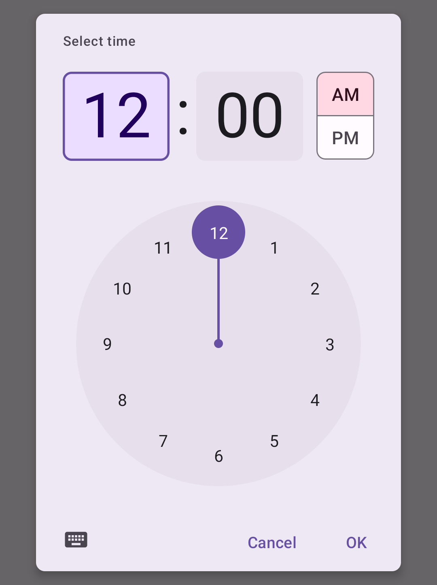
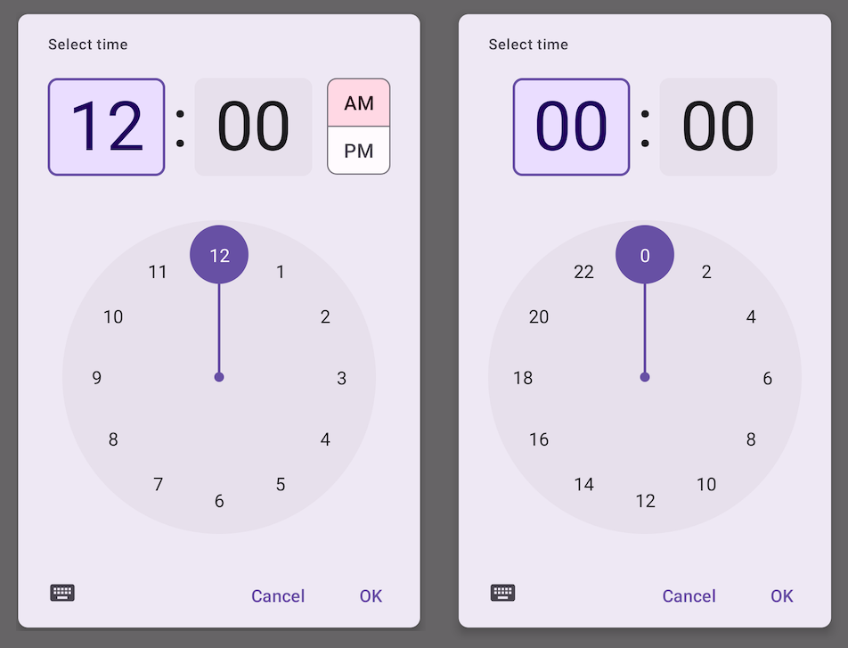
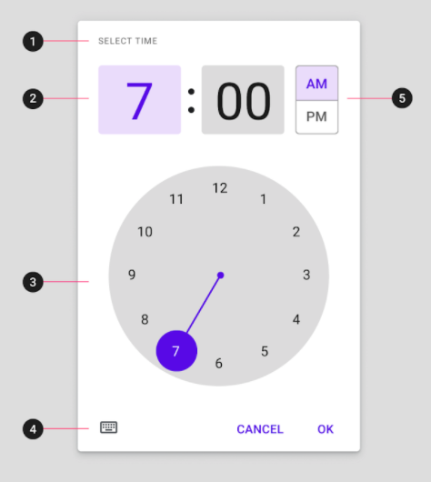
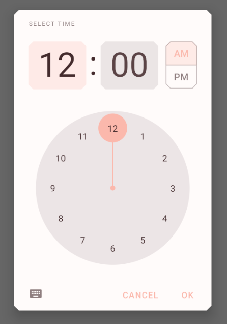

<!--docs:
title: "Time Picker"
layout: detail
section: components
excerpt: "Time Pickers are modals that allow the user to choose a time."
iconId: picker
path: /catalog/time-pickers/
-->

# Time pickers

[Time pickers](https://material.io/components/time-pickers) help users select and set a specific time.



**Contents**

*   [Using time pickers](#using-time-pickers)
*   [Time pickers](#time-pickers)
*   [Theming time pickers](#theming-time-pickers)

## Using time pickers

Before you can use Material time pickers, you need to add a dependency to the
Material Components for Android library. For more information, go to the
[Getting started](https://github.com/material-components/material-components-android/tree/master/docs/getting-started.md)
page.

### Usage



API and source code:

*   `MaterialTimePicker`
    *   [Class definition](https://developer.android.com/reference/com/google/android/material/timepicker/MaterialTimePicker)
    *   [Class source](https://github.com/material-components/material-components-android/tree/master/lib/java/com/google/android/material/timepicker/MaterialTimePicker.java)

A time picker can be instantiated with `MaterialTimePicker.Builder`

```kt
val picker =
    MaterialTimePicker.Builder()
        .setTimeFormat(TimeFormat.CLOCK_12H)
        .setHour(12)
        .setMinute(10)
        .setTitle("Select Appointment time")
        .build()
```

`minute` is a *[0, 60)* value and hour is a *[0, 23]* value regardless of which
time format you choose.

You can use either `TimeFormat.CLOCK_12H` or `TimeFormat.CLOCK_24H`, depending on the
locale of the device:

```
val isSystem24Hour = is24HourFormat(this)
val clockFormat = if (isSystem24Hour) TimeFormat.CLOCK_24H else TimeFormat.CLOCK_12H
```

The time picker can be started in text input mode with:

```kt
MaterialTimePicker.Builder().setInputMode(INPUT_MODE_KEYBOARD)
```

To show the time picker to the user:

```kt
 picker.show(fragmentManager, "tag");
```

Subscribe to positive button click, negative button click, cancel and or dismiss events with the following calls:

```
picker.addOnPositiveButtonClickListener {
    // call back code
}
picker.addOnNegativeButtonClickListener {
   // call back code
}
picker.addOnCancelListener {
    // call back code
}
picker.addOnDismissListener {
    // call back code
}
```

You can get the user selection with `picker.minute` and `picker.hour`.

### Making time pickers accessible

Material time pickers are fully accessible and compatible with screen readers.
The title of your time picker will be read when the user launches the dialog.
Use a descriptive title that for the task:

```kt
val picker =
   MaterialTimePicker.Builder()
       .setTitle("Select Appointment time")
   ...
```

### Anatomy and key properties

A Time Picker has a title, an input method, a clock dial, an icon to switch input
and an AM/PM selector.



1. Title
2. Interactive display and time input for hour and minutes
3. Clock dial
4. Icon button to switch to time input
5. AM/PM selector

#### Attributes

&nbsp;                                      | Attribute                          | Related method(s)                                         | Default value
------------------------------------------- | ---------------------------------- | --------------------------------------------------------- | -------------
**Hour**                                    | `N/A`                              | `Builder.setHour` </br/> `MaterialTimePicker.getHour`     | `0`
**Minute**                                  | `N/A`                              | `Builder.setMinute` </br/> `MaterialTimePicker.getMinute` | `0`
**Title**                                   | `N/A`                              | `Builder.setTitle`                                        | `Select Time`
**Keyboard Icon**                           | `app:keyboardIcon`                 | `N/A`                                                     | `@drawable/ic_keyboard_black_24dp`
**Clock Icon**                              | `app:clockIcon`                    | `N/A`                                                     | `@drawable/ic_clock_black_24dp`
**Clock face Background Color**             | `app:clockFaceBackgroundColor`     | `N/A`                                                     | `?colorOnSurface 24%`
**Clock hand color**                        | `app:clockNumberTextColor`         | `N/A`                                                     | `?colorPrimary`
**Clock Number Text Color**                 | `app:clockNumberTextColor`         | `N/A`                                                     | `colorOnSurface`

#### Styles

&nbsp;            | Style
----------------- | ----------------------------------
**Default style** | `Widget.MaterialComponents.TimePicker`

Default style theme attribute: `?attr/materialTimePickerStyle`

The style attributes are assigned to the following components:

&nbsp;                           | Affected component                  | Default
------------------------         | ----------------------------------  | ---------------------
**chipStyle**                    | Number inputs in the clock mode     | `@style/Widget.MaterialComponents.TimePicker.Display`
**materialButtonOutlinedStyle**  | AM/PM toggle                        | `@style/Widget.MaterialComponents.TimePicker.Button`
**imageButtonStyle**             | Keyboard/Text Input button          | `@style/Widget.MaterialComponents.TimePicker.ImageButton`
**materialClockStyle**           | Clock Face of the Time Picker       | `@style/Widget.MaterialComponents.TimePicker.Clock`


See the full list of
[styles](https://github.com/material-components/material-components-android/tree/master/lib/java/com/google/android/material/timepicker/res/values/styles.xml)
and
[attributes](https://github.com/material-components/material-components-android/tree/master/lib/java/com/google/android/material/timepicker/res/values/attrs.xml).

## Theming time pickers

Time Pickers support
[Material Theming](https://material.io/components/sliders#theming) and can be
customized in terms of color and typography.

### Time picker theming example

The following example shows a Time Picker with Material Theming.



Using theme attributes and styles in `res/values/styles.xml` (themes all time pickers
and affects other components):

```xml
<style name="Theme.App" parent="Theme.MaterialComponents.*">
    ...
    <item name="colorPrimary">@color/shrine_pink_100</item>
    <item name="colorOnPrimary">@color/shrine_pink_900</item>
    <item name="colorOnSurface">@color/shrine_pink_100</item>
    <item name="chipStyle">@style/Widget.App.Chip</item>
</style>
```

```xml
<style name="Widget.App.Chip" parent="Widget.MaterialComponents.TimePicker.Display">
  <item name="android:textColor">@color/shrine_diplay_text_color</item>
</style>
```

In res/color/shrine_diplay_text_color.xml:

```xml
<selector xmlns:android="http://schemas.android.com/apk/res/android">

  <item android:color="?attr/colorOnSecondary" android:state_enabled="true" android:state_selected="true"/>
  <item android:color="?attr/colorOnSecondary" android:state_enabled="true" android:state_checked="true"/>
  <item android:alpha="0.87" android:color="?attr/colorOnSurface" android:state_enabled="true"/>
  <item android:alpha="0.33" android:color="?attr/colorOnSurface"/>

</selector>
```

```xml
<style name="Widget.App.TimePicker.Clock" parent="Widget.MaterialComponents.TimePicker.Clock">
    <item name="clockFaceBackgroundColor">@color/...</item>
    <item name="clockHandColor">@color/...</item>
    <item name="clockNumberTextColor">@color/...</item>
</style>
```

You can also set a theme specific to the time picker

```xml
<style name="Theme.App" parent="Theme.MaterialComponents.*">
    ...
    <item name="materialTimePickerTheme">@style/ThemeOverlay.App.TimePicker</item>
</style>
