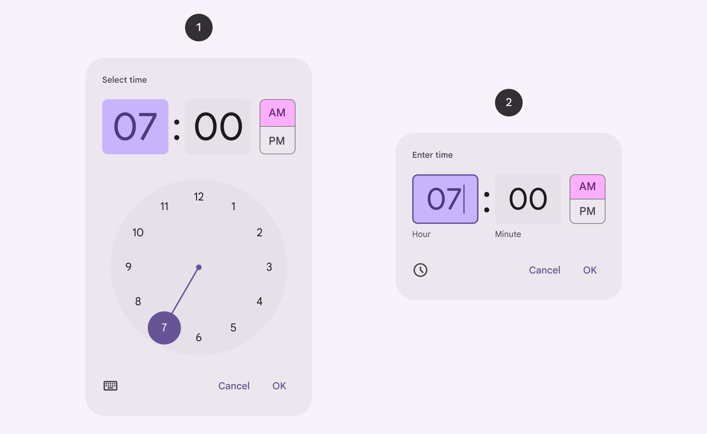
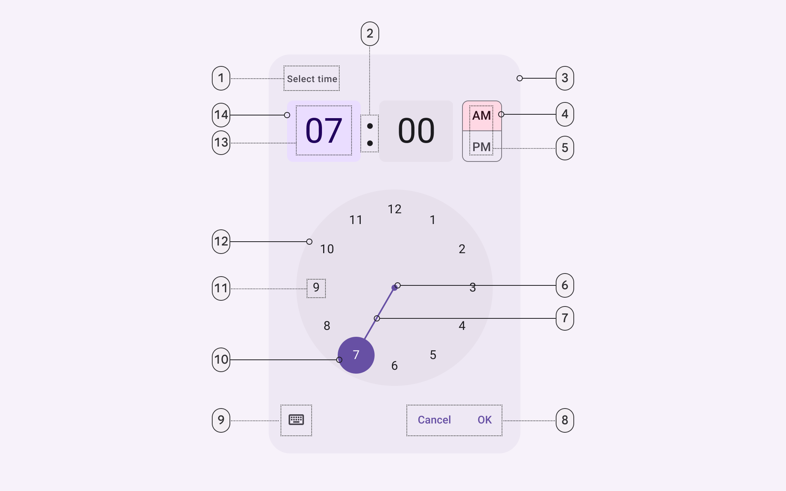
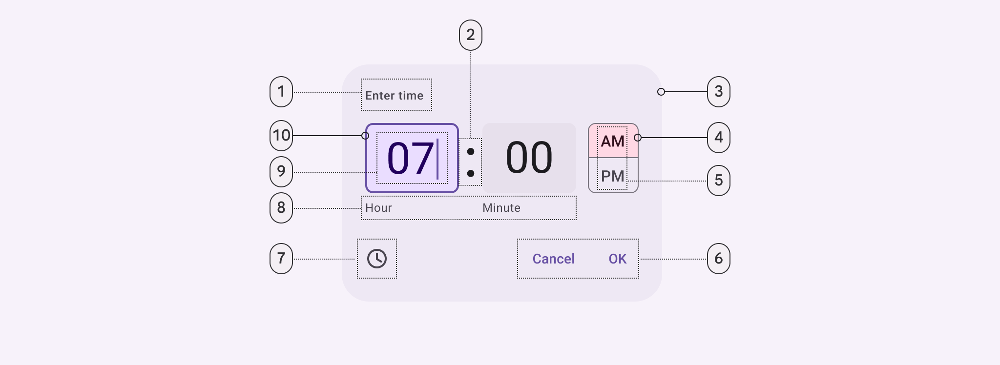
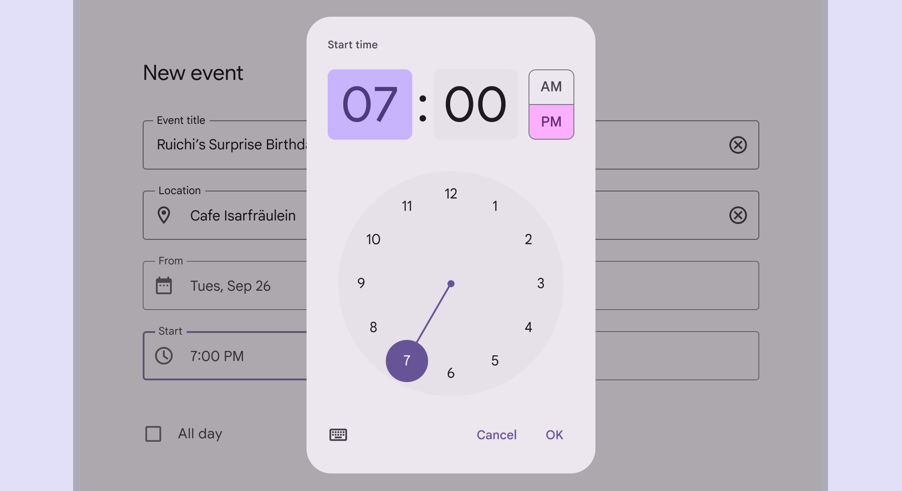
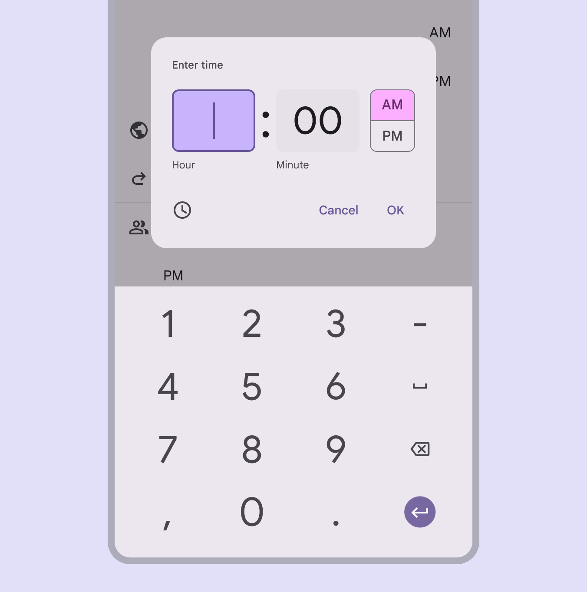
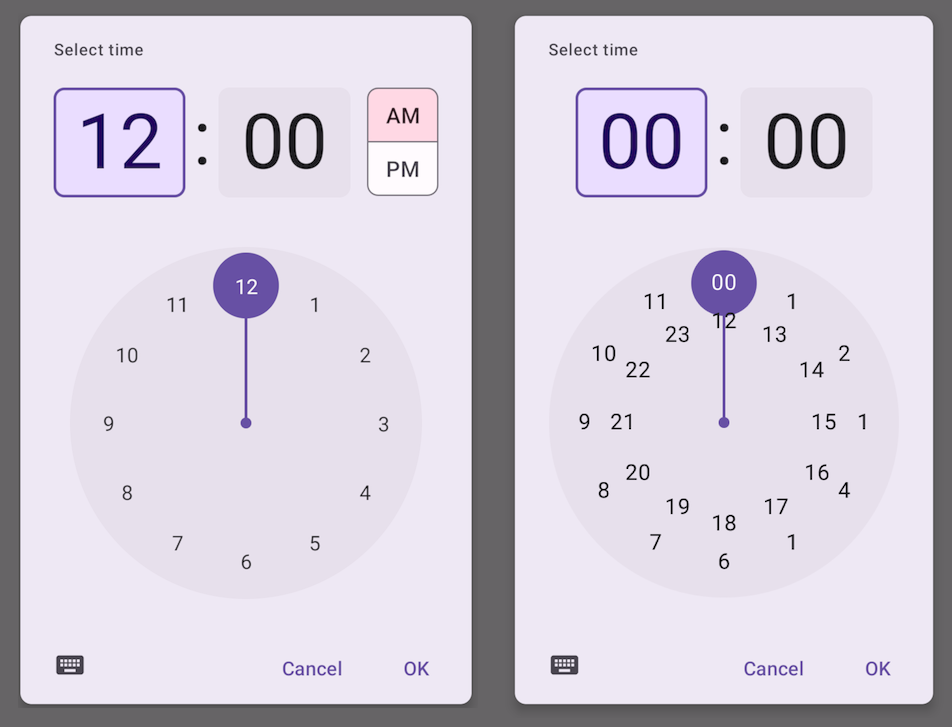
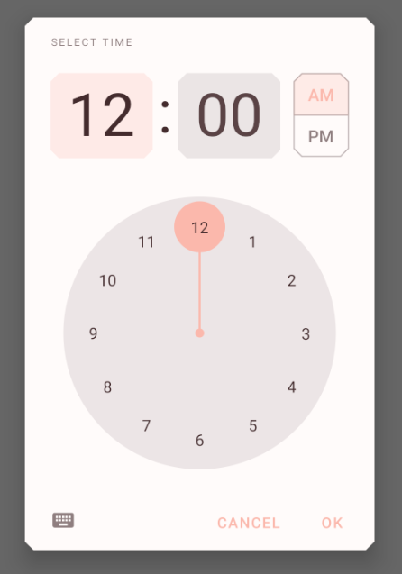

<!--docs:
title: "Time Pickers"
layout: detail
section: components
excerpt: "Time Pickers are modals that allow the user to choose a time."
iconId: picker
path: /catalog/time-pickers/
-->

# Time pickers

[Time pickers](https://m3.material.io/components/time-pickers/overview/) help
users select and set a specific time. There are two variants of time pickers.



1.  Time picker dial
2.  Time picker input

**Note:** Images use various dynamic color schemes.

## Design & API documentation

*   [Material 3 (M3) spec](https://m3.material.io/components/time-pickers/overview/)
*   [API reference](https://developer.android.com/reference/com/google/android/material/timepicker/package-summary)

## Anatomy

<details>
  <summary><h4>Time picker dial</h4></summary>



1.  Headline
2.  Time selector separator
3.  Container
4.  Period selector container
5.  Period selector label text
6.  Clock dial selector center
7.  Clock dial selector track
8.  Text button
9.  Icon button
10. Time selector container
11. Clock dial label text
12. Clock dial container
13. Time selector label text
14. Time selector container

</details>

<details>
  <summary><h4>Time picker input</h4></summary>



1.  Headline
2.  Time selector separator
3.  Container
4.  Period selector container
5.  Period selector label text
6.  Clock dial selector center
7.  Clock dial selector track
8.  Text button
9.  Icon button
10. Time selector container
11. Clock dial label text
12. Clock dial container
13. Time selector label text
14. Time selector container

</details>

More details on anatomy items in the
[component guidelines](https://m3.material.io/components/time-pickers/guidelines#d08ce88e-aa29-4b9e-a655-3f693ccf72ee).

## Key properties

### Attributes

Element                         | Attribute                      | Related method(s)                                     | Default value
------------------------------- | ------------------------------ | ----------------------------------------------------- | -------------
**Hour**                        | `N/A`                          | `Builder.setHour`<br>`MaterialTimePicker.getHour`     | `0`
**Minute**                      | `N/A`                          | `Builder.setMinute`<br>`MaterialTimePicker.getMinute` | `0`
**Title**                       | `N/A`                          | `Builder.setTitleText`                                | `Select Time`
**Keyboard Icon**               | `app:keyboardIcon`             | `N/A`                                                 | `@drawable/ic_keyboard_black_24dp`
**Clock Icon**                  | `app:clockIcon`                | `N/A`                                                 | `@drawable/ic_clock_black_24dp`
**Clock face Background Color** | `app:clockFaceBackgroundColor` | `N/A`                                                 | `?attr/colorSurfaceContainerHighest`
**Clock hand color**            | `app:clockNumberTextColor`     | `N/A`                                                 | `?attr/colorPrimary`
**Clock Number Text Color**     | `app:clockNumberTextColor`     | `N/A`                                                 | `?attr/colorOnBackground`

### Styles

Element           | Style                                 | Theme attribute
----------------- | ------------------------------------- | ---------------
**Default style** | `Widget.Material3.MaterialTimePicker` | `?attr/materialTimePickerStyle`

The style attributes are assigned to the following components:

Element                         | Affected component              | Default
------------------------------- | ------------------------------- | -------
**chipStyle**                   | Number inputs in the clock mode | `@style/Widget.Material3.MaterialTimePicker.Display`
**materialButtonOutlinedStyle** | AM/PM toggle                    | `@style/Widget.Material3.MaterialTimePicker.Button`
**imageButtonStyle**            | Keyboard/Text Input button      | `@style/Widget.Material3.MaterialTimePicker.ImageButton`
**materialClockStyle**          | Clock Face of the Time Picker   | `@style/Widget.Material3.MaterialTimePicker.Clock`

For the full list, see
[styles](https://github.com/material-components/material-components-android/tree/master/lib/java/com/google/android/material/timepicker/res/values/styles.xml)
and
[attributes](https://github.com/material-components/material-components-android/tree/master/lib/java/com/google/android/material/timepicker/res/values/attrs.xml).

## Variants of time pickers

### Time picker dial



Dial time pickers let people set a time by moving a handle around the dial. They
are often used for setting an alarm or calendar event.

### Time picker input



Input time pickers allow people to set a time using a keyboard. This option is
accessible from any mobile time picker interface via the keyboard icon.

## Code implementation

Before you can use Material time pickers, you need to add a dependency to the
Material components for Android library. For more information, go to the
[Getting started](https://github.com/material-components/material-components-android/tree/master/docs/getting-started.md)
page.

### Adding time picker



API and source code:

*   `MaterialTimePicker`
    *   [Class definition](https://developer.android.com/reference/com/google/android/material/timepicker/MaterialTimePicker)
    *   [Class source](https://github.com/material-components/material-components-android/tree/master/lib/java/com/google/android/material/timepicker/MaterialTimePicker.java)

A time picker can be instantiated with `MaterialTimePicker.Builder`

```kt
val picker =
    MaterialTimePicker.Builder()
        .setTimeFormat(TimeFormat.CLOCK_12H)
        .setHour(12)
        .setMinute(10)
        .setTitleText("Select Appointment time")
        .build()
```

`minute` is a *[0, 59]* value and hour is a *[0, 23]* value regardless of which
time format you choose.

You can use either `TimeFormat.CLOCK_12H` (1 ring) or `TimeFormat.CLOCK_24H` (2
rings), depending on the location of the device:

```kt
val isSystem24Hour = is24HourFormat(this)
val clockFormat = if (isSystem24Hour) TimeFormat.CLOCK_24H else TimeFormat.CLOCK_12H
```

The time picker's input mode defaults to clock mode (`INPUT_MODE_CLOCK`) with
`TimeFormat.CLOCK_12H` and text input mode (`INPUT_MODE_KEYBOARD`) with
`TimeFormat.CLOCK_24H`.

The time picker can be started in clock mode with:

```kt
MaterialTimePicker.Builder().setInputMode(INPUT_MODE_CLOCK)
```

The time picker can be started in text input mode with:

```kt
MaterialTimePicker.Builder().setInputMode(INPUT_MODE_KEYBOARD)
```

To show the time picker to the user:

```kt
 picker.show(fragmentManager, "tag");
```

Listen to positive button click, negative button click, cancel and dismiss
events with the following calls:

```kt
picker.addOnPositiveButtonClickListener {
    // call back code
}
picker.addOnNegativeButtonClickListener {
   // call back code
}
picker.addOnCancelListener {
    // call back code
}
picker.addOnDismissListener {
    // call back code
}
```

You can get the user selection with `picker.minute` and `picker.hour`.

### Making time pickers accessible

Material time pickers are fully accessible and compatible with screen readers.
The title of your time picker will be read when the user launches the dialog.
Use a descriptive title that for the task:

```kt
val picker =
   MaterialTimePicker.Builder()
       .setTitleText("Select Appointment time")
   ...
```

## Customizing time pickers

### Theming time pickers

Time pickers support the customization of color and typography.

#### Time picker theming example

The following example shows a time picker with Material theming.



Use theme attributes and styles in `res/values/styles.xml`, which styles all
time pickers and affects other components:

```xml
<style name="Theme.App" parent="Theme.Material3.*">
    ...
    <item name="colorPrimary">@color/shrine_pink_100</item>
    <item name="colorOnPrimary">@color/shrine_pink_900</item>
    <item name="colorOnSurface">@color/shrine_pink_100</item>
    <item name="chipStyle">@style/Widget.App.Chip</item>
</style>
```

```xml
<style name="Widget.App.Chip" parent="Widget.Material3.MaterialTimePicker.Display">
  <item name="android:textColor">@color/shrine_diplay_text_color</item>
</style>
```

In res/color/shrine_diplay_text_color.xml:

```xml
<selector xmlns:android="http://schemas.android.com/apk/res/android">

  <item android:color="?attr/colorOnSecondary" android:state_enabled="true" android:state_selected="true"/>
  <item android:color="?attr/colorOnSecondary" android:state_enabled="true" android:state_checked="true"/>
  <item android:alpha="0.87" android:color="?attr/colorOnSurface" android:state_enabled="true"/>
  <item android:alpha="0.33" android:color="?attr/colorOnSurface"/>

</selector>
```

```xml
<style name="Widget.App.TimePicker.Clock" parent="Widget.Material3.MaterialTimePicker.Clock">
    <item name="clockFaceBackgroundColor">@color/...</item>
    <item name="clockHandColor">@color/...</item>
    <item name="clockNumberTextColor">@color/...</item>
</style>
```

You can also set a theme specific to the time picker

```xml
<style name="Theme.App" parent="Theme.Material3.*">
    ...
    <item name="materialTimePickerTheme">@style/ThemeOverlay.App.TimePicker</item>
</style>

```
