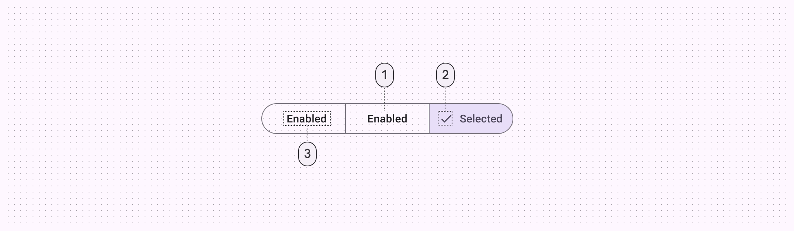

<!--docs:
title: "Toggle button group"
layout: detail
section: components
excerpt: "A customizable button component with updated visual styles."
iconId: materialbutton
path: /catalog/buttons/
-->

# Toggle button groups

**Note:** Segmented buttons are being deprecated in the Material 3 expressive
update. For those who have updated, use the
[connected button group](https://github.com/material-components/material-components-android/tree/master/docs/components/ButtonGroup.md)
instead, which has mostly the same functionality but with an updated visual
design.

[Toggle button group (Segmented buttons)](https://m3.material.io/components/segmented-buttons)
can be used to select from a group of choices. There are two types of toggle
buttons that can be placed in a toggle button group:

*   [Toggle button](#toggle-button)
*   [Icon toggle button](#icon-toggle-button)

**Note:** Images use various dynamic color schemes.

## Design & API documentation

*   [Material 3 (M3) spec](https://m3.material.io/components/segmented-buttons)
*   [API reference](https://developer.android.com/reference/com/google/android/material/button/package-summary)

## Anatomy

A toggle button has a shared stroked container, icons and/or text labels.



1.  Container
2.  Icon (optional for unselected state)
3.  Label text

More details on anatomy items in the
[component guidelines](https://m3.material.io/components/segmented-buttons/guidelines#75ec9219-0196-4c59-bd6a-ed9a1b481013).

## M3 Expressive

### M3 Expressive update

The segmented button is being deprecated. Use the
[connected button group](https://github.com/material-components/material-components-android/tree/master/docs/components/ButtonGroup.md)
instead.
[More on M3 Expressive](https://m3.material.io/blog/building-with-m3-expressive)

### M3 Expressive style

Default style in the expressive themes:
`Widget.Material3Expressive.MaterialButtonToggleGroup`

## Key properties

### Selection attributes

Element                               | Attribute               | Related method(s)                                | Default value
------------------------------------- | ----------------------- | ------------------------------------------------ | -------------
**Single selection**                  | `app:singleSelection`   | `setSingleSelection`<br/>`isSingleSelection`     | `false`
**Selection required**                | `app:selectionRequired` | `setSelectionRequired`<br/>`isSelectionRequired` | `false`
**Enable the group and all children** | `android:enabled`       | `setEnabled`<br/>`isEnabled`                     | `true`

### Container attributes

Element                         | Attribute             | Related method(s)                             | Default value
------------------------------- | --------------------- | --------------------------------------------- | -------------
**Size of inner corners**       | `app:innerCornerSize` | `setInnerCornerSize`<br/>`getInnerCornerSize` | `0dp`
**Spacing between buttons**     | `android:spacing`     | `setSpacing`<br/>`getSpacing`                 | `0dp`
**Group shape (outer corners)** | `app:shapeAppearance` | `setShapeAppearance`</br>`getShapeAppearance` | `none`

### Styles

Element           | Style                                        | Theme attribute
----------------- | -------------------------------------------- | ---------------
**Default style** | `Widget.Material3.MaterialButtonToggleGroup` | `?attr/materialButtonToggleGroupStyle`

See the full list of
[styles](https://github.com/material-components/material-components-android/tree/master/lib/java/com/google/android/material/button/res/values/styles.xml)
and
[attrs](https://github.com/material-components/material-components-android/tree/master/lib/java/com/google/android/material/button/res/values/attrs.xml).

## Code implementation

Before you can use Material buttons, you need to add a dependency to the
Material components for Android library. For more information, go to the
[Getting started](https://github.com/material-components/material-components-android/tree/master/docs/getting-started.md)
page.

**Note:** `<Button>` is auto-inflated as
`<com.google.android.material.button.MaterialButton>` via
`MaterialComponentsViewInflater` when using a `Theme.Material3.*` theme.

<h3 id="toggle-button">Adding toggle button</h3>

To emphasize groups of related toggle buttons, a group should share a common
container.

#### Toggle button examples

API and source code:

*   `MaterialButtonToggleGroup`
    *   [Class description](https://developer.android.com/reference/com/google/android/material/button/MaterialButtonToggleGroup)
    *   [Class source](https://github.com/material-components/material-components-android/tree/master/lib/java/com/google/android/material/button/MaterialButtonToggleGroup.java)
*   `MaterialButton`
    *   [Class description](https://developer.android.com/reference/com/google/android/material/button/MaterialButton)
    *   [Class source](https://github.com/material-components/material-components-android/tree/master/lib/java/com/google/android/material/button/MaterialButton.java)

The following example shows a toggle button with three buttons that have text
labels.


In the layout:

```xml
<com.google.android.material.button.MaterialButtonToggleGroup
    android:id="@+id/toggleButton"
    android:layout_width="wrap_content"
    android:layout_height="wrap_content">
    <Button
        style="?attr/materialButtonOutlinedStyle"
        android:id="@+id/button1"
        android:layout_width="wrap_content"
        android:layout_height="wrap_content"
        android:text="Button 1"
    />
    <Button
        style="?attr/materialButtonOutlinedStyle"
        android:id="@+id/button2"
        android:layout_width="wrap_content"
        android:layout_height="wrap_content"
        android:text="Button 2"
    />
    <Button
        style="?attr/materialButtonOutlinedStyle"
        android:id="@+id/button3"
        android:layout_width="wrap_content"
        android:layout_height="wrap_content"
        android:text="Button 3"
    />
</com.google.android.material.button.MaterialButtonToggleGroup>
```

In code:

```kt
toggleButton.addOnButtonCheckedListener { toggleButton, checkedId, isChecked ->
    // Respond to button selection
}
```

### Adding an icon-only toggle button

The following example shows a toggle button with three buttons that have icons.


In `res/values/styles.xml`:

```xml
<style name="Widget.App.Button.OutlinedButton.IconOnly" parent="Widget.Material3.Button.OutlinedButton">
    <item name="iconPadding">0dp</item>
    <item name="android:insetTop">0dp</item>
    <item name="android:insetBottom">0dp</item>
    <item name="android:paddingLeft">12dp</item>
    <item name="android:paddingRight">12dp</item>
    <item name="android:minWidth">48dp</item>
    <item name="android:minHeight">48dp</item>
</style>
```

In the layout:

```xml
<com.google.android.material.button.MaterialButtonToggleGroup
    ...>
    <Button
        style="@style/Widget.App.Button.OutlinedButton.IconOnly"
        ...
        app:icon="@drawable/ic_favorite_24dp"
    />
    <Button
        style="@style/Widget.App.Button.OutlinedButton.IconOnly"
        ...
        app:icon="@drawable/ic_add_24dp"
    />
    <Button
        style="@style/Widget.App.Button.OutlinedButton.IconOnly"
        ...
        app:icon="@drawable/ic_search_24dp"
    />
</com.google.android.material.button.MaterialButtonToggleGroup>
```

<h3 id="icon-toggle-button">Adding icon toggle button</h3>

Icons can be used as toggle buttons when they allow selection, or deselection,
of a single choice, such as marking an item as a favorite.

#### Icon toggle example

API and source code:

*   `CheckBox`
    *   [Class description](https://developer.android.com/reference/android/widget/CheckBox)

**Note:** The `CheckBox` API is just one of several inputs that can implement
the icon button. See other
[selection controls](https://material.io/components/selection-controls/) for
more details.

The following example shows an icon that can be used independently or in items
of a `RecyclerView`.


In the layout:

```xml
<CheckBox
    android:id="@+id/icon"
    android:layout_width="wrap_content"
    android:layout_height="wrap_content"
    android:button="@drawable/sl_favourite_24dp"
    app:buttonTint="@android:color/white"
/>
```

In `res/drawable/sl_favourite_24dp.xml`:

```xml
<selector>
    <item
        android:drawable="@drawable/ic_favourite_outlined_24dp"
        android:state_checked="false" />
    <item
        android:drawable="@drawable/ic_favourite_filled_24dp"
        android:state_checked="true" />
    <item android:drawable="@drawable/ic_favourite_outlined_24dp" />
</selector>
```

In code:

```kt
icon.setOnCheckedChangeListener { checkBox, isChecked ->
    // Respond to icon toggle
}
```

### Making buttons accessible

Buttons support content labeling for accessibility and are readable by most
screen readers, such as TalkBack. Text rendered in buttons is automatically
provided to accessibility services. Additional content labels are usually
unnecessary.

For more information on content labels, go to the
[Android accessibility help guide](https://support.google.com/accessibility/android/answer/7158690).

## Customizing toggle button groups

### Theming buttons

Buttons support the customization of color, typography, and shape.

#### Button theming example

API and source code:

*   `MaterialButton`
    *   [Class description](https://developer.android.com/reference/com/google/android/material/button/MaterialButton)
    *   [Class source](https://github.com/material-components/material-components-android/tree/master/lib/java/com/google/android/material/button/MaterialButton.java)

The following example shows text, outlined and filled button types with Material
theming.


##### Implementing button theming

Use theme attributes and styles in `res/values/styles.xml` to add the theme to
all buttons. This affects other components:

```xml
<style name="Theme.App" parent="Theme.Material3.*">
    ...
    <item name="colorPrimary">@color/shrine_pink_100</item>
    <item name="colorOnPrimary">@color/shrine_pink_900</item>
    <item name="textAppearanceLabelLarge">@style/TextAppearance.App.Button</item>
    <item name="shapeCornerFamily">cut</item>
</style>

<style name="TextAppearance.App.Button" parent="TextAppearance.Material3.LabelLarge">
    <item name="fontFamily">@font/rubik</item>
    <item name="android:fontFamily">@font/rubik</item>
</style>
```

Use default style theme attributes, styles and theme overlays. This adds the
theme to all buttons but does not affect other components:

```xml
<style name="Theme.App" parent="Theme.Material3.*">
    ...
    <item name="borderlessButtonStyle">@style/Widget.App.Button.TextButton</item>
    <item name="materialButtonOutlinedStyle">@style/Widget.App.Button.OutlinedButton</item>
    <item name="materialButtonStyle">@style/Widget.App.Button</item>
</style>

<style name="Widget.App.Button.TextButton" parent="Widget.Material3.Button.TextButton">
    <item name="materialThemeOverlay">@style/ThemeOverlay.App.Button.TextButton</item>
    <item name="android:textAppearance">@style/TextAppearance.App.Button</item>
    <item name="shapeAppearance">@style/ShapeAppearance.App.Button</item>
</style>

<style name="Widget.App.Button.OutlinedButton" parent="Widget.Material3.Button.OutlinedButton">
    <item name="materialThemeOverlay">@style/ThemeOverlay.App.Button.TextButton</item>
    <item name="android:textAppearance">@style/TextAppearance.App.Button</item>
    <item name="shapeAppearance">@style/ShapeAppearance.App.Button</item>
</style>

<style name="Widget.App.Button" parent="Widget.Material3.Button">
    <item name="materialThemeOverlay">@style/ThemeOverlay.App.Button</item>
    <item name="android:textAppearance">@style/TextAppearance.App.Button</item>
    <item name="shapeAppearance">@style/ShapeAppearance.App.Button</item>
</style>

<style name="ThemeOverlay.App.Button.TextButton" parent="ThemeOverlay.Material3.Button.TextButton">
    <item name="colorOnContainer">@color/shrine_pink_900</item>
</style>

<style name="ThemeOverlay.App.Button" parent="ThemeOverlay.Material3.Button">
    <item name="colorContainer">@color/shrine_pink_100</item>
    <item name="colorOnContainer">@color/shrine_pink_900</item>
</style>

<style name="ShapeAppearance.App.Button" parent="">
    <item name="cornerFamily">cut</item>
    <item name="cornerSize">4dp</item>
</style>
```

Use one of the styles in the layout. That will affect only this button:

```xml

<Button style="@style/Widget.App.Button".../>
```

### Optical centering

Optical centering means to offset the `MaterialButton`’s contents (icon and/or
label) when the shape is asymmetric. Before optical centering, we only provided
centering with horizontally asymmetrical shapes.

To turn on optical centering for a given button, use
`setOpticalCenterEnabled(true)`. Optical centering is disabled by default. When
enabled, the shift amount of the icon and/or text is calculated as a value with
the fixed ratio to the difference between left corner size in dp and right
corner size in dp. The shift amount is applied to the padding start and padding
end.
