<!--docs:
title: "Top app bars"
layout: detail
section: components
excerpt: "Android top app bar."
iconId: top_app_bar
path: /catalog/top-app-bars/
-->

# Top app bars (App bars)

[App bars](https://m3.material.io/components/app-bars/overview) are placed at
the top of the screen to help people navigate through a product. There are four
variants of app bars.

**Note**: The top app bar component is renamed to app bar in the design
language.

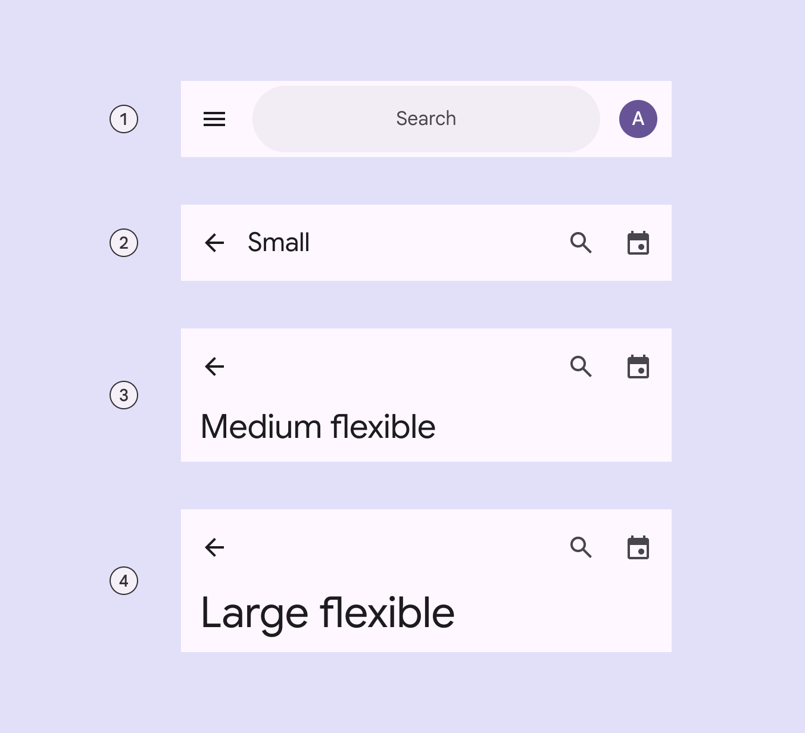

1.  Search app bar
2.  Small
3.  Medium flexible
4.  Large flexible

For implementation purposes, the **search and small app bars** can be grouped
into **regular top app bars**, while the **medium flexible and large flexible
app bars** can be grouped into **collapsing top app bars**.

An app bar can transform into a **contextual action bar**, remaining active
until an action is taken or it is dismissed. For more information, see
[contextual action bar](#contextual-action-bar).

**Note:** Images use various dynamic color schemes.

[**Deprecated app bars**](#deprecated-app-bars)

There are two variants that are being deprecated and are no longer recommended:

1.  **Medium** - Replace with medium flexible.
2.  **Large** - Replace with large flexible.

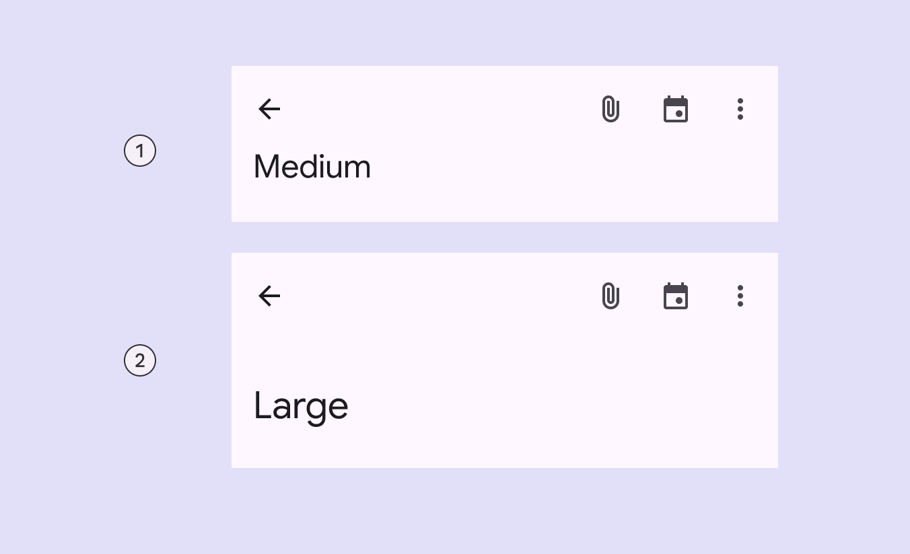

1.  Medium
2.  Large

## Design & API documentation

*   [Material 3 (M3) spec](https://m3.material.io/components/top-app-bar/overview)
*   [API reference](https://developer.android.com/reference/com/google/android/material/appbar/package-summary)

## Anatomy

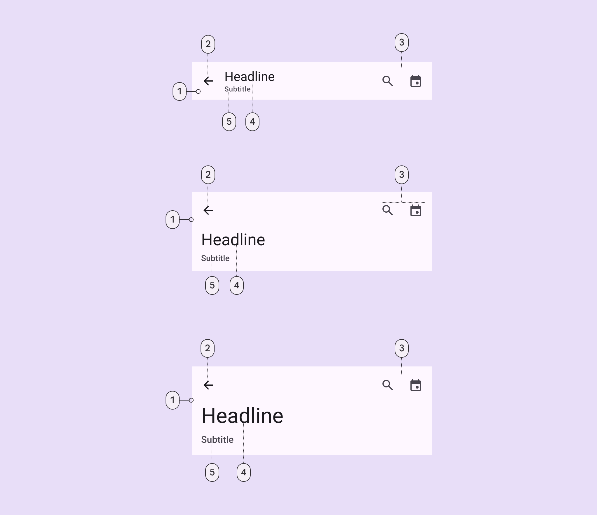

1.  Container
2.  Leading button
3.  Trailing elements
4.  Headline
5.  Subtitle

More details on anatomy items in the
[component guidelines](https://m3.material.io/components/top-app-bar/guidelines#6423b736-55a9-42ba-85f1-b842329f1d54).

## M3 Expressive

### M3 Expressive update

Before you can use `Material3Expressive` component styles, follow the
[`Material3Expressive` themes setup instructions](https://github.com/material-components/material-components-android/tree/master/docs/getting-started.md#material3expressive-themes).

The new **search app bar** supports icons inside and outside the search bar, and
centered text. It opens the search view component when selected.

The new **medium flexible** and **large flexible** app bars come with
significant improvements, and should replace **medium** and **large** app bars,
which are being deprecated. The **small** app bar is updated with the same
flexible improvements.
[More on M3 Expressive](https://m3.material.io/blog/building-with-m3-expressive)

**Types and naming:**

*   Renamed component from **top app bar** to **app bar**
*   Added **search app bar**
*   Deprecating **medium** and **large** app bars
*   Added **medium flexible** and **large flexible** app bars with:
    *   Reduced overall height
    *   Larger title text
    *   Subtitle
    *   Left- and center-aligned text options
    *   Text wrapping
    *   More flexible elements for imagery and filled buttons
*   Added features to small app bar:
    *   Subtitle
    *   Center-aligned text option
    *   More flexible elements for imagery and filled buttons

## Key properties

### Container attributes

Element                         | Attribute                   | Related method(s)                                | Default value
------------------------------- | --------------------------- | ------------------------------------------------ | -------------
**Color**                       | `android:background`        | `setBackground`<br>`getBackground`               | `?attr/colorSurface`
**`MaterialToolbar` elevation** | `android:elevation`         | `setElevation`<br>`getElevation`                 | `4dp`
**`AppBarLayout` elevation**    | `android:stateListAnimator` | `setStateListAnimator`<br>`getStateListAnimator` | `0dp` to `4dp` (see all [states](https://github.com/material-components/material-components-android/tree/master/lib/java/com/google/android/material/appbar/res/animator/design_appbar_state_list_animator.xml))

### Navigation icon attributes

Element                          | Attribute                | Related method(s)                          | Default value
-------------------------------- | ------------------------ | ------------------------------------------ | -------------
**`MaterialToolbar` icon**       | `app:navigationIcon`     | `setNavigationIcon`<br>`getNavigationIcon` | `null`
**`MaterialToolbar` icon color** | `app:navigationIconTint` | `setNavigationIconTint`                    | `?attr/colorOnSurface`

### Title attributes

Element                                                                   | Attribute                                                                                          | Related method(s)                                        | Default value
------------------------------------------------------------------------- | -------------------------------------------------------------------------------------------------- | -------------------------------------------------------- | -------------
**`MaterialToolbar` title text**                                          | `app:title`                                                                                        | `setTitle`<br>`getTitle`                                 | `null`
**`MaterialToolbar` subtitle text**                                       | `app:subtitle`                                                                                     | `setSubtitle`<br>`getSubtitle`                           | `null`
**`MaterialToolbar` title color**                                         | `app:titleTextColor`                                                                               | `setTitleTextColor`                                      | `?attr/colorOnSurface`
**`MaterialToolbar` subtitle color**                                      | `app:subtitleTextColor`                                                                            | `setSubtitleTextColor`                                   | `?attr/colorOnSurfaceVariant`
**`MaterialToolbar` title typography**                                    | `app:titleTextAppearance`                                                                          | `setTitleTextAppearance`                                 | `?attr/textAppearanceTitleLarge`
**`MaterialToolbar` subtitle typography**                                 | `app:subtitleTextAppearance`                                                                       | `setSubtitleTextAppearance`                              | `?attr/textAppearanceTitleMedium`
**`MaterialToolbar` title centering**                                     | `app:titleCentered`                                                                                | `setTitleCentered`                                       | `false`
**`MaterialToolbar` subtitle centering**                                  | `app:subtitleCentered`                                                                             | `setSubtitleCentered`                                    | `false`
**`CollapsingToolbarLayout` collapsed title typography**                  | `app:collapsedTitleTextAppearance`                                                                 | `setCollapsedTitleTextAppearance`                        | `?attr/textAppearanceTitleLarge`
**`CollapsingToolbarLayout` expanded title typography**                   | `app:expandedTitleTextAppearance`                                                                  | `setExpandedTitleTextAppearance`                         | `?attr/textAppearanceHeadlineSmall` for Medium</br>`?attr/textAppearanceHeadlineMedium` for Large
**`CollapsingToolbarLayout` collapsed title color**                       | `android:textColor` (in `app:collapsedTitleTextAppearance`) or `app:collapsedTitleTextColor`       | `setCollapsedTitleTextColor`                             | `?attr/colorOnSurface`
**`CollapsingToolbarLayout` expanded title color**                        | `android:textColor` (in `app:expandedTitleTextAppearance`) or `app:expandedTitleTextColor`         | `setExpandedTitleTextColor`                              | `?attr/colorOnSurface`
**`CollapsingToolbarLayout` collapsed subtitle typography**               | `app:collapsedSubtitleTextAppearance`                                                              | `setCollapsedSubtitleTextAppearance`                     | `?attr/textAppearanceTitleMedium`
**`CollapsingToolbarLayout` expanded subtitle typography**                | `app:expandedSubtitleTextAppearance`                                                               | `setExpandedSubtitleTextAppearance`                      | `?attr/textAppearanceTitleLarge` for Medium</br>`?attr/textAppearanceHeadlineSmall` for Large
**`CollapsingToolbarLayout` collapsed subtitle color**                    | `android:textColor` (in `app:collapsedSubtitleTextAppearance`) or `app:collapsedSubtitleTextColor` | `setCollapsedSubtitleTextColor`                          | `?attr/colorOnSurface`
**`CollapsingToolbarLayout` expanded subtitle color**                     | `android:textColor` (in `app:expandedSubtitleTextAppearance`) or `app:expandedSubtitleTextColor`   | `setExpandedSubtitleTextColor`                           | `?attr/colorOnSurface`
**`CollapsingToolbarLayout` expanded title margins**                      | `app:expandedTitleMargin*`                                                                         | `setExpandedTitleMargin*`                                | `16dp`
**`CollapsingToolbarLayout` padding between expanded title and subtitle** | `app:expandedTitlePadding`                                                                         | `setExpandedTitlePadding`                                | `0dp`
**`CollapsingToolbarLayout` title max lines**                             | `app:maxLines`                                                                                     | `setMaxLines`<br>`getMaxLines`                           | `1`
**`CollapsingToolbarLayout` title ellipsize**                             | `app:titleTextEllipsize`                                                                           | `setTitleEllipsize`<br>`getTitleEllipsize`               | `end`
**`CollapsingToolbarLayout` collapsed title gravity**                     | `app:collapsedTitleGravity`                                                                        | `setCollapsedTitleGravity`<br>`getCollapsedTitleGravity` | `start\|center_vertical`
**`CollapsingToolbarLayout` collapsed title gravity mode**                | `app:collapsedTitleGravityMode`                                                                    | --                                                       | `availableSpace`
**`CollapsingToolbarLayout` expanded title gravity**                      | `app:expandedTitleGravity`                                                                         | `setExpandedTitleGravity`<br>`getExpandedTitleGravity`   | `start\|bottom`

### Action items attributes

Element                          | Attribute  | Related method(s)          | Default value
-------------------------------- | ---------- | -------------------------- | -------------
**`MaterialToolbar` menu**       | `app:menu` | `inflateMenu`<br>`getMenu` | `null`
**`MaterialToolbar` icon color** | N/A        | N/A                        | `?attr/colorOnSurfaceVariant`

### Overflow menu attributes

Element                                        | Attribute                                                                                          | Related method(s)                      | Default value
---------------------------------------------- | -------------------------------------------------------------------------------------------------- | -------------------------------------- | -------------
**`MaterialToolbar` icon**                     | `android:src` and `app:srcCompat` in `actionOverflowButtonStyle` (in app theme)                    | `setOverflowIcon`<br>`getOverflowIcon` | `@drawable/abc_ic_menu_overflow_material` (before API 23) or `@drawable/ic_menu_moreoverflow_material` (after API 23)
**`MaterialToolbar` overflow theme**           | `app:popupTheme`                                                                                   | `setPopupTheme`<br>`getPopupTheme`     | `@style/ThemeOverlay.Material3.*`
**`MaterialToolbar` overflow item typography** | `textAppearanceSmallPopupMenu` and `textAppearanceLargePopupMenu` in `app:popupTheme` or app theme | N/A                                    | `?attr/textAppearanceBodyLarge`

### Scrolling behavior attributes

Element                                                         | Attribute                       | Related method(s)                                                                                     | Default value
--------------------------------------------------------------- | ------------------------------- | ----------------------------------------------------------------------------------------------------- | -------------
**`MaterialToolbar` or `CollapsingToolbarLayout` scroll flags** | `app:layout_scrollFlags`        | `setScrollFlags`<br>`getScrollFlags`<br>(on `AppBarLayout.LayoutParams`)                              | `noScroll`
**`MaterialToolbar` collapse mode**                             | `app:collapseMode`              | `setCollapseMode`<br>`getCollapseMode`<br>(on `CollapsingToolbar`)                                    | `none`
**`CollapsingToolbarLayout` content scrim color**               | `app:contentScrim`              | `setContentScrim`<br>`setContentScrimColor`<br>`setContentScrimResource`<br>`getContentScrim`         | `null`
**`CollapsingToolbarLayout` status bar scrim color**            | `app:statusBarScrim`            | `setStatusBarScrim`<br>`setStatusBarScrimColor`<br>`setStatusBarScrimResource`<br>`getStatusBarScrim` | `@empty`
**`CollapsingToolbarLayout` scrim animation duration**          | `app:scrimAnimationDuration`    | `setScrimAnimationDuration`<br>`getScrimAnimationDuration`                                            | `600`
**`CollapsingToolbarLayout` collapsing animation interpolator** | `app:titlePositionInterpolator` | `setTitlePositionInterpolator`                                                                        | `@null`
**`AppBarLayout` lift on scroll**                               | `app:liftOnScroll`              | `setLiftOnScroll`<br>`isLiftOnScroll`                                                                 | `true`
**`AppBarLayout` lift on scroll color**                         | `app:liftOnScrollColor`         | N/A                                                                                                   | `?attr/colorSurfaceContainer`
**`AppBarLayout` lift on scroll target view**                   | `app:liftOnScrollTargetViewId`  | `setLiftOnScrollTargetViewId`<br>`getLiftOnScrollTargetViewId`                                        | `@null`
**`AppBarLayout` scroll effect**                                | `app:layout_scrollEffect`       | `setScrollEffect`<br>`getScrollEffect`                                                                | `none`

### `AppBarLayout` styles

| Element       | Style                           | Theme attribute           |
| ------------- | ------------------------------- | ------------------------- |
| **Surface     | `Widget.Material3.AppBarLayout` | `?attr/appBarLayoutStyle` |
: background    :                                 :                           :
: color style** :                                 :                           :

### `MaterialToolbar` styles

Element                            | Style                                | Theme attribute
---------------------------------- | ------------------------------------ | ---------------
**Default style**                  | `Widget.Material3.Toolbar`           | `?attr/toolbarStyle`
**Surface background color style** | `Widget.Material3.Toolbar.Surface`   | `?attr/toolbarSurfaceStyle`
**On Surface color style**         | `Widget.Material3.Toolbar.OnSurface` | N/A

### `CollapsingToolbarLayout` styles

Element           | Style                                       | Theme attribute
----------------- | ------------------------------------------- | ---------------
**Default style** | `Widget.Material3.CollapsingToolbar`        | `?attr/collapsingToolbarLayoutStyle`
**Medium style**  | `Widget.Material3.CollapsingToolbar.Medium` | `?attr/collapsingToolbarLayoutMediumStyle`
**Large style**   | `Widget.Material3.CollapsingToolbar.Large`  | `?attr/collapsingToolbarLayoutLargeStyle`

For the full list, see
[styles](https://github.com/material-components/material-components-android/tree/master/lib/java/com/google/android/material/appbar/res/values/styles.xml)
and
[attrs](https://github.com/material-components/material-components-android/tree/master/lib/java/com/google/android/material/appbar/res/values/attrs.xml).

## Variants of app bars

<details>

<summary><h3>Search app bar</h3></summary>

Use a search app bar to provide an emphasized entry-point to open the search
view. Use it on home pages when search is key to the product.

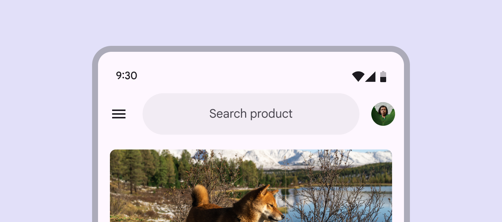
Search app bars have a search field instead of heading text

</details>

<details>

<summary><h3>Small app bar</h3></summary>

Use in dense layouts or when a page is scrolled.

The following example shows a small top app bar with a page title, a navigation
icon, two actions, and an overflow menu.

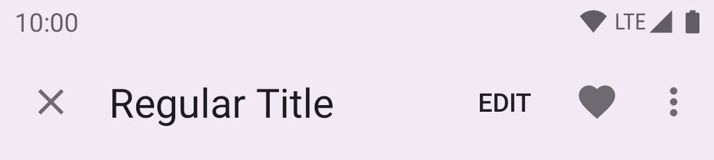

In the layout:

```xml
<androidx.coordinatorlayout.widget.CoordinatorLayout
    ...
    android:layout_width="match_parent"
    android:layout_height="match_parent">

    <com.google.android.material.appbar.AppBarLayout
        android:layout_width="match_parent"
        android:layout_height="wrap_content">

        <com.google.android.material.appbar.MaterialToolbar
            android:id="@+id/topAppBar"
            android:layout_width="match_parent"
            android:layout_height="wrap_content"
            android:minHeight="?attr/actionBarSize"
            app:title="@string/page_title"
            app:menu="@menu/top_app_bar"
            app:navigationIcon="@drawable/ic_close_24dp" />

    </com.google.android.material.appbar.AppBarLayout>

    <!-- Note: A RecyclerView can also be used -->
    <androidx.core.widget.NestedScrollView
        android:layout_width="match_parent"
        android:layout_height="match_parent"
        app:layout_behavior="@string/appbar_scrolling_view_behavior">

        <!-- Scrollable content -->

    </androidx.core.widget.NestedScrollView>

</androidx.coordinatorlayout.widget.CoordinatorLayout>
```

**Note:** In order to allow your top app bar to grow taller when the system font
setting increases, you can use `android:layout_height="wrap_content"` +
`android:minHeight="?attr/actionBarSize"` on your `MaterialToolbar`, as shown in
the example above.

In `@menu/top_app_bar.xml`:

```xml
<menu xmlns:android="http://schemas.android.com/apk/res/android"
    xmlns:app="http://schemas.android.com/apk/res-auto">

    <item
        android:id="@+id/edit"
        android:title="@string/edit"
        android:contentDescription="@string/content_description_search"
        app:showAsAction="ifRoom" />

    <item
        android:id="@+id/favorite"
        android:icon="@drawable/ic_favorite_24dp"
        android:title="@string/favorite"
        android:contentDescription="@string/content_description_favorite"
        app:showAsAction="ifRoom" />

    <item
        android:id="@+id/more"
        android:title="@string/more"
        android:contentDescription="@string/content_description_more"
        app:showAsAction="never" />

</menu>
```

In menu/navigation icon drawables:

```xml
<vector
    ...
    android:tint="?attr/colorControlNormal">
    ...
</vector>
```

In code:

```kt
topAppBar.setNavigationOnClickListener {
    // Handle navigation icon press
}

topAppBar.setOnMenuItemClickListener { menuItem ->
    when (menuItem.itemId) {
        R.id.edit -> {
            // Handle edit text press
            true
        }
        R.id.favorite -> {
            // Handle favorite icon press
            true
        }
        R.id.more -> {
            // Handle more item (inside overflow menu) press
            true
        }
        else -> false
    }
}
```

**Note:** The above example is the recommended approach and, in order for it to
work, you need to use a `Theme.Material3.*` theme containing the `NoActionBar`
segment, such as the `Theme.Material3.Light.NoActionBar`. If not, an action bar
will be added to the current `Activity` window. The `MaterialToolbar` can be set
as the support action bar and thus receive various `Activity` callbacks, as
shown in this [guide](https://developer.android.com/training/appbar).

</details>

<details>

<summary><h3>Medium flexible app bar</h3></summary>

Use to display a larger headline. It can collapse into a small app bar on
scroll.

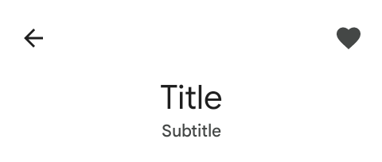

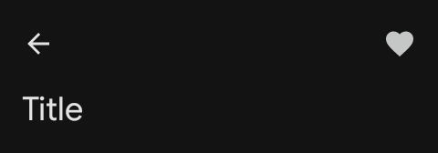

The
[medium flexible top app bar](https://m3.material.io/components/app-bars/specs#51ac0fae-61c2-4abc-b8f9-1167bf54e875)
introduced in expressive updates includes flexible heights, multi-line support,
and can contain a wider variety of elements. These features are already
supported/configurable within the existing Medium variant. Therefore, the name
of the existing `medium` variant will be reused in the `Material3Expressive`
theme.

**If you are using a `Material3Expressive` theme:**

The existing `?attr/collapsingToolbarLayoutMediumStyle` attribute has been
updated to the new flexible behavior. You do not need to change your XML layouts
to get the new functionality.

**If you are not using a `Material3Expressive` theme:**

You should migrate to one of the expressive themes to use the new flexible app
bar styles.

To properly draw the subtitle in expanded mode. Please use the following:

```xml
  <com.google.android.material.appbar.AppBarLayout
      android:id="@+id/appbarlayout"
      android:layout_width="match_parent"
      android:layout_height="wrap_content"
      android:fitsSystemWindows="true">

    <com.google.android.material.appbar.CollapsingToolbarLayout
        style="?attr/collapsingToolbarLayoutMediumStyle"
        android:id="@+id/collapsingtoolbarlayout"
        android:layout_width="match_parent"
        android:layout_height="?attr/collapsingToolbarLayoutMediumSize"
        app:layout_scrollFlags="scroll|exitUntilCollapsed|snap"
        app:expandedTitleGravity="bottom|center_horizontal">

      <com.google.android.material.appbar.MaterialToolbar
          android:id="@+id/toolbar"
          style="?attr/catalogToolbarWithCloseButtonStyle"
          android:layout_width="match_parent"
          android:layout_height="?attr/actionBarSize"
          android:elevation="0dp"
          app:layout_collapseMode="pin"
          app:title="Medium Title"
          app:subtitle="Medium Subtitle"/>
    </com.google.android.material.appbar.CollapsingToolbarLayout>
  </com.google.android.material.appbar.AppBarLayout>
```

</details>

<details>

<summary><h3>Large flexible app bar</h3></summary>

Use to emphasize the headline of the page.

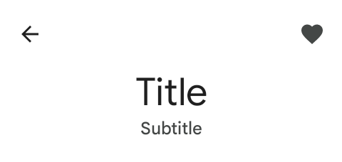

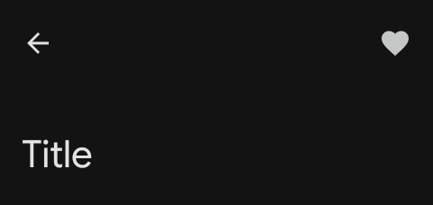

The
[large flexible top app bar](https://m3.material.io/components/app-bars/specs#51ac0fae-61c2-4abc-b8f9-1167bf54e875)
introduced in expressive updates includes flexible heights, multi-line support,
and can contain a wider variety of elements. These features are already
supported/configurable within the existing Large variant. Therefore, the name of
the existing `large` variant will be reused in the `Material3Expressive` theme.

**If you are using a `Material3Expressive` theme:**

The existing `?attr/collapsingToolbarLayoutLargeStyle` attribute has been
updated to the new flexible behavior. You do not need to change your XML layouts
to get the new functionality.

**If you are not using a `Material3Expressive` theme:**

You should migrate to one of the expressive themes to use the new flexible app
bar styles.

To properly draw the subtitle in expanded mode. Please use the following:

```xml
  <com.google.android.material.appbar.AppBarLayout
      android:id="@+id/appbarlayout"
      android:layout_width="match_parent"
      android:layout_height="wrap_content"
      android:fitsSystemWindows="true">

    <com.google.android.material.appbar.CollapsingToolbarLayout
        style="?attr/collapsingToolbarLayoutLargeStyle"
        android:id="@+id/collapsingtoolbarlayout"
        android:layout_width="match_parent"
        android:layout_height="?attr/collapsingToolbarLayoutLargeSize"
        app:layout_scrollFlags="scroll|exitUntilCollapsed|snap"
        app:expandedTitleGravity="bottom|center_horizontal">

      <com.google.android.material.appbar.MaterialToolbar
          android:id="@+id/toolbar"
          style="?attr/catalogToolbarWithCloseButtonStyle"
          android:layout_width="match_parent"
          android:layout_height="?attr/actionBarSize"
          android:elevation="0dp"
          app:layout_collapseMode="pin"
          app:title="Large Title"
          app:subtitle="Large Subtitle"/>
    </com.google.android.material.appbar.CollapsingToolbarLayout>
  </com.google.android.material.appbar.AppBarLayout>
```

</details>

## Code implementation

Before you can use Material top app bars, you need to add a dependency to the
Material components for Android library. For more information, go to the
[Getting started](https://github.com/material-components/material-components-android/tree/master/docs/getting-started.md)
page.

<details>

<summary><h3>Center aligning app bars</h3></summary>

The guidance and code for the all the app bars are also applicable for center
aligning the title in the app bars. To center align them, you only need to set
the `app:titleCentered` and/or `app:subtitleCentered` attributes to `true` on
your `MaterialToolbar`.

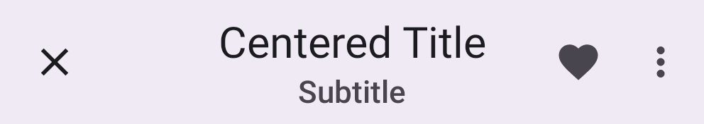

</details>

<details>

<summary><h3>Adding image to collapsing app bars</h3></summary>

A collapsing top app bar with an image background, a page title, a navigation
icon, two action icons, and an overflow menu:

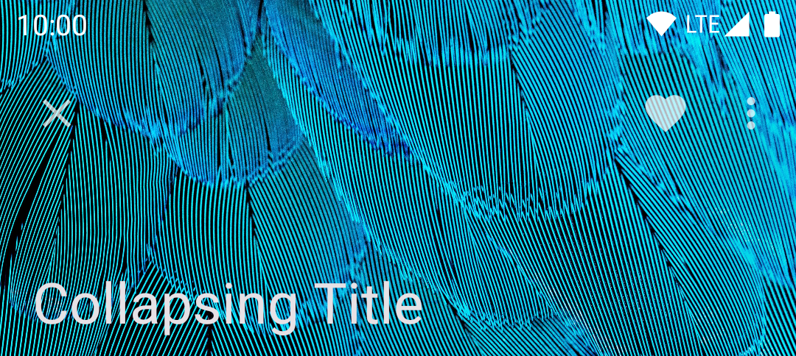

In the layout:

```xml
<androidx.coordinatorlayout.widget.CoordinatorLayout
    ...
    android:fitsSystemWindows="true">

    <com.google.android.material.appbar.AppBarLayout
        ...
        android:layout_width="match_parent"
        android:layout_height="wrap_content"
        android:fitsSystemWindows="true">

        <com.google.android.material.appbar.CollapsingToolbarLayout
            style="?attr/collapsingToolbarLayoutLargeStyle"
            android:layout_width="match_parent"
            android:layout_height="?attr/collapsingToolbarLayoutLargeSize">

            <ImageView
                android:layout_width="match_parent"
                android:layout_height="match_parent"
                android:src="@drawable/media"
                android:scaleType="centerCrop"
                android:fitsSystemWindows="true"
                android:contentDescription="@string/content_description_media" />

            <com.google.android.material.appbar.MaterialToolbar
                android:layout_width="match_parent"
                android:layout_height="?attr/actionBarSize"
                ...
                android:background="@android:color/transparent" />

        </com.google.android.material.appbar.CollapsingToolbarLayout>

    </com.google.android.material.appbar.AppBarLayout>

    ...

</androidx.coordinatorlayout.widget.CoordinatorLayout>
```

In `res/values/themes.xml`:

```xml
<style name="Theme.App" parent="Theme.Material3.*.NoActionBar">
    <item name="android:windowTranslucentStatus">true</item>
</style>
```

</details>

<details>

<summary><h3>Adding filled trailing icon button to app bars</h3></summary>

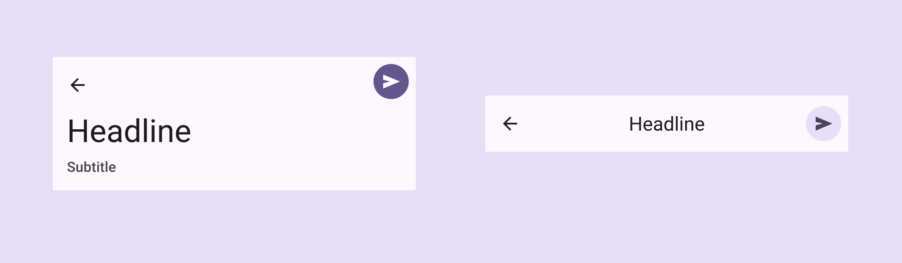

With Expressive updates, a
[filled trailing icon button](https://m3.material.io/components/app-bars/specs#90d1e764-47e7-4e5d-9668-c00bc9599236)
can replace the default action items. To achieve this, please use the follow
layout configuration.

```xml

  <com.google.android.material.appbar.AppBarLayout
      android:id="@+id/appbarlayout"
      android:layout_width="match_parent"
      android:layout_height="wrap_content"
      android:fitsSystemWindows="true">

    <com.google.android.material.appbar.CollapsingToolbarLayout
        style="?attr/collapsingToolbarLayoutMediumStyle"
        android:id="@+id/collapsingtoolbarlayout"
        android:layout_width="match_parent"
        android:layout_height="?attr/collapsingToolbarLayoutMediumSize"
        app:layout_scrollFlags="scroll|exitUntilCollapsed|snap"
        app:toolbarId="@id/toolbar">
      <LinearLayout
          android:layout_width="match_parent"
          android:layout_height="wrap_content"
          android:orientation="horizontal"
          app:layout_collapseMode="pin">
        <com.google.android.material.appbar.MaterialToolbar
            android:id="@+id/toolbar"
            style="?attr/catalogToolbarWithCloseButtonStyle"
            android:layout_width="0dp"
            android:layout_height="?attr/actionBarSize"
            android:layout_weight="1"
            android:elevation="0dp"
            app:title="Medium Title"/>
        <Button
            android:id="@+id/action_button"
            android:layout_width="wrap_content"
            android:layout_height="wrap_content"
            android:layout_marginEnd="8dp"
            android:layout_gravity="center_vertical"
            app:icon="@drawable/ic_star_checkable_24"/>
      </LinearLayout>
    </com.google.android.material.appbar.CollapsingToolbarLayout>
  </com.google.android.material.appbar.AppBarLayout>
```

</details>

<details>

<summary><h3>Adding a circle to the navigation button</h3></summary>

If you would like to add a circle background to the navigation icon, set the
`android:theme="@style/ThemeOverlay.Material3.Toolbar.CircleNavigationButton"`
theme overlay on your `Toolbar` or `MaterialToolbar`.

By default, the theme overlay above uses `?attr/colorSurfaceContainer` for the
circle color. This can be customized by extending the theme overlay and setting
the `toolbarNavigationButtonCircleColor` attribute.

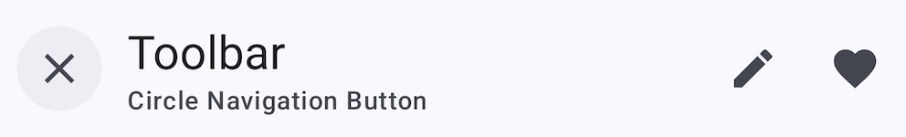

</details>

<details>

<summary><h3>Applying scrolling behavior to app bars</h3></summary>

When scrolling up, the collapsing top app bar transforms into a regular top app
bar.

The following example shows the top app bar positioned at the same elevation as
content. Upon scroll, it increases elevation and lets content scroll behind it.

In the layout:

```xml
<androidx.coordinatorlayout.widget.CoordinatorLayout
    ...>

    <com.google.android.material.appbar.AppBarLayout
        ...
        app:liftOnScroll="true">

        <com.google.android.material.appbar.MaterialToolbar
            ...
            />

    </com.google.android.material.appbar.AppBarLayout>

    ...

</androidx.coordinatorlayout.widget.CoordinatorLayout>
```

**Note:** If your scrolling view (`RecyclerView`, `ListView`, etc.) is nested
within another view (e.g., a `SwipeRefreshLayout`), you should make sure to set
`app:liftOnScrollTargetViewId` on your `AppBarLayout` to the id of the scrolling
view. This will ensure that the `AppBarLayout` is using the right view to
determine whether it should lift or not, and it will help avoid flicker issues.

The following example shows the top app bar disappearing upon scrolling up, and
appearing upon scrolling down.

In the layout:

```xml
<androidx.coordinatorlayout.widget.CoordinatorLayout
    ...>

    <com.google.android.material.appbar.AppBarLayout
        ...>

        <com.google.android.material.appbar.MaterialToolbar
            ...
            app:layout_scrollFlags="scroll|enterAlways|snap"
            />

    </com.google.android.material.appbar.AppBarLayout>

    ...

</androidx.coordinatorlayout.widget.CoordinatorLayout>
```

Optionally, you can change the style in which the app bar disappears and appears
when scrolling by setting a scroll effect. By default, a scroll effect of `none`
is set which translates the app bar in-step with the scrolling content. The
following option shows setting the `compress` scroll effect which clips the top
app bar until it meets the top of the screen:

In the layout:

```xml
<androidx.coordinatorlayout.widget.CoordinatorLayout
    ...>

    <com.google.android.material.appbar.AppBarLayout
        ...>

        <com.google.android.material.appbar.MaterialToolbar
            ...
            app:layout_scrollFlags="scroll|enterAlways|snap"
            app:layout_scrollEffect="compress"
            />

    </com.google.android.material.appbar.AppBarLayout>

    ...

</androidx.coordinatorlayout.widget.CoordinatorLayout>
```

</details>

<details>

<summary><h3>Making app bars accessible</h3></summary>

Android's top app bar component APIs provide support for the navigation icon,
action items, overflow menu and more, to inform the user what each action
performs. While optional, their use is strongly encouraged.

#### Content descriptions

When using icons for navigation, action items and other elements of top app
bars, you should set a content description for them so that screen readers like
TalkBack are able to announce their purpose or action.

For an overall content description of the top app bar, set an
`android:contentDescription` or use the `setContentDescription` method on the
`MaterialToolbar`.

For the navigation icon, this can be achieved via the
`app:navigationContentDescription` attribute or
`setNavigationContentDescription` method.

For action items and items within the overflow menu, the content description
needs to be set in the menu:

```xml
<menu ...>
    ...
    <item
          ...
          android:contentDescription="@string/content_description_one" />
    <item
          ...
          android:contentDescription="@string/content_description_two" />
</menu>
```

For images within collapsing top app bars, set an `android:contentDescription`
or use the `setContentDescription` method for the `ImageView`.

</details>

<details>

<summary><h3>Status bar and edge-to-edge</h3></summary>


A common configuration for modern top app bars, as seen above, is to have a
seamless color shared with the status bar. The best way to achieve this is to
follow the
[edge-to-edge guidance](https://developer.android.com/training/gestures/edge-to-edge),
which will result in a transparent status bar that lets the background color of
the top app bar show through.

Make sure to set `android:fitsSystemWindows="true"` on your `AppBarLayout` (or
`MaterialToolbar` if not using `AppBarLayout`), so that an extra inset is added
to avoid overlap with the status bar.

If your `AppBarLayout` scrolls and content is visible under the status bar, you
can set the `AppBarLayout`'s `statusBarForeground` to a `MaterialShapeDrawable`
to let `AppBarLayout` automatically match the status bar color to its own
background.

In code:

```kt
appBarLayout.statusBarForeground =
    MaterialShapeDrawable.createWithElevationOverlay(context)
```

Or if using tonal surface colors instead of elevation overlays, you can simply
set the `statusBarForeground` to `colorSurface` to let `AppBarLayout`
automatically match the status bar color to its own background:

```kt
appBarLayout.setStatusBarForegroundColor(
    MaterialColors.getColor(appBarLayout, R.attr.colorSurface))
```

</details>

## Customizing app bars

### Theming app bars

App bars support the customization of color, typography, and shape.

#### App bar theming example

API and source code:

*   `CoordinatorLayout`
    *   [Class definition](https://developer.android.com/reference/androidx/coordinatorlayout/widget/CoordinatorLayout)
*   `AppBarLayout`
    *   [Class definition](https://developer.android.com/reference/com/google/android/material/appbar/AppBarLayout)
    *   [Class source](https://github.com/material-components/material-components-android/tree/master/lib/java/com/google/android/material/appbar/AppBarLayout.java)
*   `MaterialToolbar`
    *   [Class definition](https://developer.android.com/reference/com/google/android/material/appbar/MaterialToolbar)
    *   [Class source](https://github.com/material-components/material-components-android/tree/master/lib/java/com/google/android/material/appbar/MaterialToolbar.java)
*   `CollapsingToolbarLayout`
    *   [Class definition](https://developer.android.com/reference/com/google/android/material/appbar/CollapsingToolbarLayout)
    *   [Class source](https://github.com/material-components/material-components-android/tree/master/lib/java/com/google/android/material/appbar/CollapsingToolbarLayout.java)

A regular top app bar with Material theming:

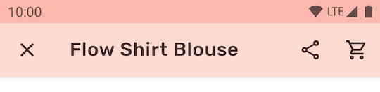

##### Implementing app bar theming

Use theme attributes in `res/values/styles.xml`, which applies to all top app
bars and affects other components:

```xml
<style name="Theme.App" parent="Theme.Material3.*.NoActionBar">
    ...
    <item name="colorSurface">@color/shrine_pink_100</item>
    <item name="colorOnSurface">@color/shrine_pink_900</item>
    <item name="android:statusBarColor">?attr/colorPrimary</item>
    <item name="android:windowLightStatusBar" tools:targetApi="m">true</item>
    <item name="textAppearanceTitleLarge">@style/TextAppearance.App.TitleLarge</item>
    <item name="textAppearanceTitleMedium">@style/TextAppearance.App.TitleMedium</item>
</style>

<style name="TextAppearance.App.TitleLarge" parent="TextAppearance.Material3.TitleLarge">
    <item name="fontFamily">@font/rubik</item>
    <item name="android:fontFamily">@font/rubik</item>
</style>

<style name="TextAppearance.App.TitleMedium" parent="TextAppearance.Material3.TitleMedium">
    <item name="fontFamily">@font/rubik</item>
    <item name="android:fontFamily">@font/rubik</item>
</style>
```

Use default style theme attributes, styles and theme overlays, which applies to
all top app bars but does not affect other components:

```xml
<style name="Theme.App" parent="Theme.Material3.*.NoActionBar">
    ...
    <item name="toolbarStyle">@style/Widget.App.Toolbar</item>
</style>

<style name="Widget.App.Toolbar" parent="Widget.Material3.Toolbar">
    <item name="materialThemeOverlay">@style/ThemeOverlay.App.Toolbar</item>
    <item name="titleTextAppearance">@style/TextAppearance.App.TitleLarge</item>
    <item name="subtitleTextAppearance">@style/TextAppearance.App.TitleMedium</item>
</style>

<style name="ThemeOverlay.App.Toolbar" parent="">
    <item name="colorSurface">@color/shrine_pink_100</item>
    <item name="colorOnSurface">@color/shrine_pink_900</item>
</style>
```

Use the style in the layout, which affects only this top app bar:

```xml
<com.google.android.material.appbar.MaterialToolbar
    ...
    app:title="@string/flow_shirt_blouse"
    app:menu="@menu/top_app_bar_shrine"
    app:navigationIcon="@drawable/ic_close_24dp"
    style="@style/Widget.App.Toolbar"
    />
```

## Contextual action bar

Contextual action bars provide actions for selected items.

<details>

<summary><h3>Anatomy</h3></summary>


1.  Close button (instead of a navigation icon)
2.  Contextual title
3.  Contextual actions
4.  Overflow menu (optional)
5.  Container (not shown)

</details>

<details>

<summary><h3>Key properties</h3></summary>

#### Close button attributes

Element   | Attribute                                    | Related method(s) | Default value
--------- | -------------------------------------------- | ----------------- | -------------
**Icon**  | `app:actionModeCloseDrawable` (in app theme) | N/A               | `@drawable/abc_ic_ab_back_material`
**Color** | N/A                                          | N/A               | `?attr/colorControlNormal` (as `Drawable` tint)

#### Contextual title attributes

Element                 | Attribute               | Related method(s)              | Default value
----------------------- | ----------------------- | ------------------------------ | -------------
**Title text**          | N/A                     | `setTitle`<br>`getTitle`       | `null`
**Subtitle text**       | N/A                     | `setSubtitle`<br>`getSubtitle` | `null`
**Title typography**    | `app:titleTextStyle`    | N/A                            | `@style/TextAppearance.Material3.ActionBar.Title`
**Subtitle typography** | `app:subtitleTextStyle` | N/A                            | `@style/TextAppearance.Material3.ActionBar.Subtitle`

#### Contextual actions attributes

| Element | Attribute | Related method(s) | Default value |
|---|---|---|---|
| **Menu** | N/A | `menuInflater.inflate` in `ActionMode.Callback` | `null` |
| **Icon color** | N/A | N/A | `?attr/colorControlNormal` (as `Drawable` tint) |

#### Overflow menu attributes

Element                      | Attribute                                                                       | Related method(s)                      | Default value
---------------------------- | ------------------------------------------------------------------------------- | -------------------------------------- | -------------
**Icon**                     | `android:src` and `app:srcCompat` in `actionOverflowButtonStyle` (in app theme) | `setOverflowIcon`<br>`getOverflowIcon` | `@drawable/abc_ic_menu_overflow_material` (before API 23) or `@drawable/ic_menu_moreoverflow_material` (after API 23)
**Overflow item typography** | `textAppearanceSmallPopupMenu` and `textAppearanceLargePopupMenu` in app theme  | N/A                                    | `?attr/textAppearanceTitleMedium`

#### Container attributes

Element            | Attribute                                    | Related method(s) | Default value
------------------ | -------------------------------------------- | ----------------- | -------------
**Color**          | `app:background`                             | N/A               | `?attr/actionModeBackground`
**Height**         | `app:height`                                 | N/A               | `?attr/actionBarSize`
**Overlay window** | `app:windowActionModeOverlay` (in app theme) | N/A               | `false`

#### Toolbar logo attributes

Element              | Attribute                  | Related method(s)                                     | Default value
-------------------- | -------------------------- | ----------------------------------------------------- | -------------
**AdjustViewBounds** | `app:logoAdjustViewBounds` | `setLogoAdjustViewBounds`<br>`isLogoAdjustViewBounds` | `false`
**ScaleType**        | `app:logoScaleType`        | `setLogoScaleType`<br>`getLogoScaleType`              | ImageView's default

#### Styles

Element           | Style                         | Theme attribute
----------------- | ----------------------------- | -----------------
**Default style** | `Widget.Material3.ActionMode` | `actionModeStyle`

</details>

<details>

<summary><h3>Adding contextual action bar</h3></summary>

API and source code:

*   `ActionMode`
    *   [Class definition](https://developer.android.com/reference/androidx/appcompat/view/ActionMode)

The following example shows a contextual action bar with a contextual title, a
close icon, two contextual action icons, and an overflow menu:


In `res/values/themes.xml`:

```xml
<style name="Theme.App" parent="Theme.Material3.*.NoActionBar">
    ...
    <item name="windowActionModeOverlay">true</item>
    <item name="actionModeCloseDrawable">@drawable/ic_close_24dp</item>
    <item name="actionBarTheme">@style/ThemeOverlay.Material3.Dark.ActionBar</item>
</style>
```

In code:

```kt
val callback = object : ActionMode.Callback {

    override fun onCreateActionMode(mode: ActionMode?, menu: Menu?): Boolean {
        menuInflater.inflate(R.menu.contextual_action_bar, menu)
        return true
    }

    override fun onPrepareActionMode(mode: ActionMode?, menu: Menu?): Boolean {
        return false
    }

    override fun onActionItemClicked(mode: ActionMode?, item: MenuItem?): Boolean {
        return when (item?.itemId) {
            R.id.share -> {
                // Handle share icon press
                true
            }
            R.id.delete -> {
                // Handle delete icon press
                true
            }
            R.id.more -> {
                // Handle more item (inside overflow menu) press
                true
            }
            else -> false
        }
    }

    override fun onDestroyActionMode(mode: ActionMode?) {
    }
}

val actionMode = startSupportActionMode(callback)
actionMode?.title = "1 selected"
```

In `@menu/contextual_action_bar.xml`:

```xml
<menu xmlns:android="http://schemas.android.com/apk/res/android"
    xmlns:app="http://schemas.android.com/apk/res-auto">

    <item
        android:id="@+id/share"
        android:icon="@drawable/ic_share_24dp"
        android:title="@string/share"
        android:contentDescription="@string/content_description_share"
        app:showAsAction="ifRoom" />

    <item
        android:id="@+id/delete"
        android:icon="@drawable/ic_delete_24dp"
        android:title="@string/delete"
        android:contentDescription="@string/content_description_delete"
        app:showAsAction="ifRoom" />

    <item
        android:id="@+id/more"
        android:title="@string/more"
        android:contentDescription="@string/content_description_more"
        app:showAsAction="never" />

</menu>
```

In menu/navigation icons:

```xml
<vector
    ...
    android:tint="?attr/colorControlNormal">
    ...
</vector>
```

</details>

## Deprecated app bars

There are two deprecated app bars that are no longer recommended:


1.  Medium
2.  Large

The larger collapsing top app bars can be used for longer titles, to house
imagery, or to provide a stronger presence to the top app bar.

<details>

<summary><h3>Medium top app bar</h3></summary>

The following example shows a medium collapsing top app bar with a page title, a
navigation icon, an action icon, and an overflow menu.

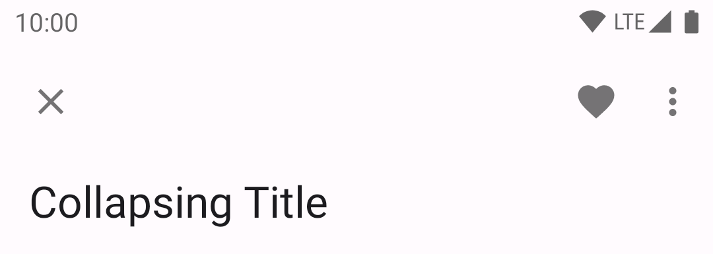

In the layout:

```xml
<androidx.coordinatorlayout.widget.CoordinatorLayout
    ...>

    <com.google.android.material.appbar.AppBarLayout
        ...
        android:layout_width="match_parent"
        android:layout_height="wrap_content"
        android:fitsSystemWindows="true">

        <com.google.android.material.appbar.CollapsingToolbarLayout
            style="?attr/collapsingToolbarLayoutMediumStyle"
            android:layout_width="match_parent"
            android:layout_height="?attr/collapsingToolbarLayoutMediumSize">

            <com.google.android.material.appbar.MaterialToolbar
                ...
                android:layout_width="match_parent"
                android:layout_height="?attr/actionBarSize"
                android:elevation="0dp" />

        </com.google.android.material.appbar.CollapsingToolbarLayout>

    </com.google.android.material.appbar.AppBarLayout>

    ...

</androidx.coordinatorlayout.widget.CoordinatorLayout>
```

</details>

<details>

<summary><h3>Large top app bar</h3></summary>

The following example shows a large collapsing top app bar with a page title, a
navigation icon, an action icon, and an overflow menu.

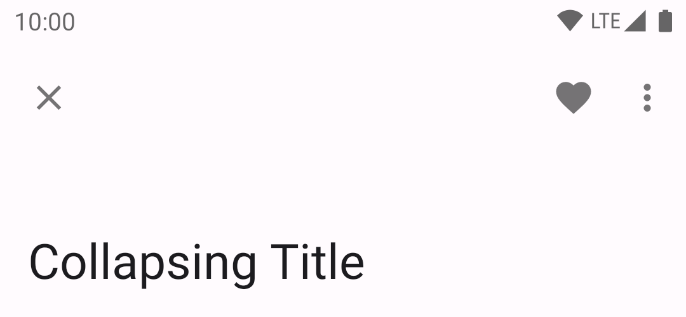

In the layout:

```xml
<androidx.coordinatorlayout.widget.CoordinatorLayout
    ...>

    <com.google.android.material.appbar.AppBarLayout
        ...
        android:layout_width="match_parent"
        android:layout_height="wrap_content"
        android:fitsSystemWindows="true">

        <com.google.android.material.appbar.CollapsingToolbarLayout
            style="?attr/collapsingToolbarLayoutLargeStyle"
            android:layout_width="match_parent"
            android:layout_height="?attr/collapsingToolbarLayoutLargeSize">

            <com.google.android.material.appbar.MaterialToolbar
                android:layout_width="match_parent"
                android:layout_height="?attr/actionBarSize"
                ...
                android:elevation="0dp" />

        </com.google.android.material.appbar.CollapsingToolbarLayout>

    </com.google.android.material.appbar.AppBarLayout>

    ...

</androidx.coordinatorlayout.widget.CoordinatorLayout>
```

</details>
