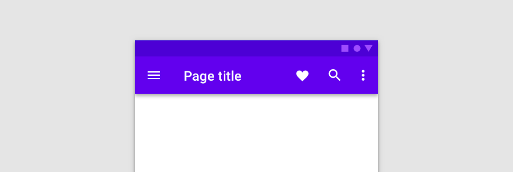
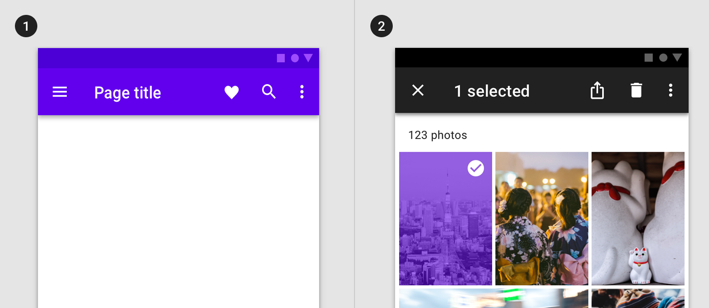
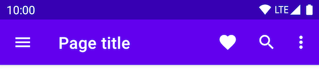
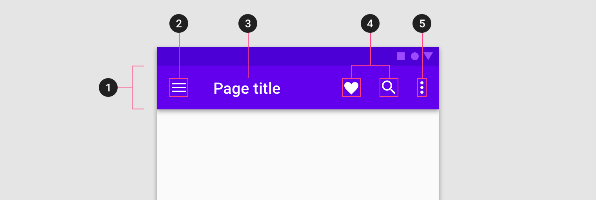
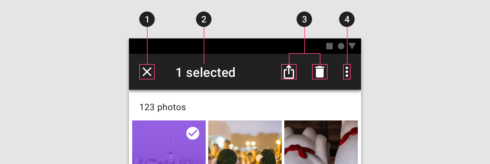
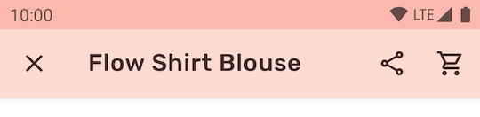

<!--docs:
title: "Top app bars"
layout: detail
section: components
excerpt: "Android top app bar."
iconId: top_app_bar
path: /catalog/top-app-bars/
-->

# Top app bars

[Top app bars](https://material.io/components/app-bars-top/#) display
information and actions relating to the current screen.



**Contents**

*   [Using top app bars](#using-top-app-bars)
*   [Regular top app bar](#regular-top-app-bar)
*   [Contextual action bar](#contextual-action-bar)
*   [Theming](#theming-the-top-app-bar)

## Using top app bars

Before you can use Material top app bars, you need to add a dependency to the
Material Components for Android library. For more information, go to the
[Getting started](https://github.com/material-components/material-components-android/tree/master/docs/getting-started.md)
page.

### Making top app bars accessible

Android's top app bar component APIs provide support for the navigation icon,
action items, overflow menu and more for informing the user as to what each
action performs. While optional, their use is strongly encouraged.

#### Content descriptions

When using icons for navigation icons, action items and other elements of top
app bars, you should set a content description on them so that screen readers
like TalkBack are able to announce their purpose or action, if any.

For an overall content description of the top app bar, set an
`android:contentDescription` or use the `setContentDescription` method on the
`MaterialToolbar`.

For the navigation icon, this can be achieved via the
`app:navigationContentDescription` attribute or
`setNavigationContentDescription` method.

For action items and items within the overflow menu, the content description
needs to be set in the menu:

```xml
<menu ...>
    ...
    <item
          ...
          android:contentDescription="@string/content_description_one" />
    <item
          ...
          android:contentDescription="@string/content_description_two" />
</menu>
```

For images within promininent top app bars, set an `android:contentDescription`
or use the `setContentDescription` method on the `ImageView`.

## Types

There are two types of top app bar: 1\.
[Regular top app bar](#regular-top-app-bar), 2\.
[Contextual action bar](#contextual-action-bar)



## Regular top app bar

The top app bar provides content and actions related to the current screen. It’s
used for branding, screen titles, navigation, and actions.

### Regular top app bar examples

API and source code:

*   `CoordinatorLayout`
    *   [Class definition](https://developer.android.com/reference/androidx/coordinatorlayout/widget/CoordinatorLayout)
*   `AppBarLayout`
    *   [Class definition](https://developer.android.com/reference/com/google/android/material/appbar/AppBarLayout)
    *   [Class source](https://github.com/material-components/material-components-android/tree/master/lib/java/com/google/android/material/appbar/AppBarLayout.java)
*   `MaterialToolbar`
    *   [Class definition](https://developer.android.com/reference/com/google/android/material/appbar/MaterialToolbar)
    *   [Class source](https://github.com/material-components/material-components-android/tree/master/lib/java/com/google/android/material/appbar/MaterialToolbar.java)
*   `CollapsingToolbarLayout`
    *   [Class definition](https://developer.android.com/reference/com/google/android/material/appbar/CollapsingToolbarLayout)
    *   [Class source](https://github.com/material-components/material-components-android/tree/master/lib/java/com/google/android/material/appbar/CollapsingToolbarLayout.java)

The following example shows a top app bar with a page title, a navigation icon,
two action icons, and an overflow menu.



In the layout:

```xml
<androidx.coordinatorlayout.widget.CoordinatorLayout
    ...
    android:layout_width="match_parent"
    android:layout_height="match_parent">

    <com.google.android.material.appbar.AppBarLayout
        android:layout_width="match_parent"
        android:layout_height="wrap_content">

        <com.google.android.material.appbar.MaterialToolbar
            android:id="@+id/topAppBar"
            android:layout_width="match_parent"
            android:layout_height="?attr/actionBarSize"
            app:title="@string/page_title"
            app:menu="@menu/top_app_bar"
            app:navigationIcon="@drawable/ic_menu_24dp"
            style="@style/Widget.MaterialComponents.Toolbar.Primary"
            />

    </com.google.android.material.appbar.AppBarLayout>

    <!-- Note: A RecyclerView can also be used -->
    <androidx.core.widget.NestedScrollView
        android:layout_width="match_parent"
        android:layout_height="match_parent"
        app:layout_behavior="@string/appbar_scrolling_view_behavior">

        <!-- Scrollable content -->

    </androidx.core.widget.NestedScrollView>

</androidx.coordinatorlayout.widget.CoordinatorLayout>
```

In `@menu/top_app_bar.xml`:

```xml
<menu xmlns:android="http://schemas.android.com/apk/res/android"
    xmlns:app="http://schemas.android.com/apk/res-auto">

    <item
        android:id="@+id/favorite"
        android:icon="@drawable/ic_favorite_24dp"
        android:title="@string/favorite"
        android:contentDescription="@string/content_description_favorite"
        app:showAsAction="ifRoom" />

    <item
        android:id="@+id/search"
        android:icon="@drawable/ic_search_24dp"
        android:title="@string/search"
        android:contentDescription="@string/content_description_search"
        app:showAsAction="ifRoom" />

    <item
        android:id="@+id/more"
        android:title="@string/more"
        android:contentDescription="@string/content_description_more"
        app:showAsAction="never" />

</menu>
```

In menu/navigation icons:

```xml
<vector
    ...
    android:tint="?attr/colorControlNormal">
    ...
</vector>
```

In code:

```kt
topAppBar.setNavigationOnClickListener {
    // Handle navigation icon press
}

topAppBar.setOnMenuItemClickListener { menuItem ->
    when (menuItem.itemId) {
        R.id.favorite -> {
            // Handle favorite icon press
            true
        }
        R.id.search -> {
            // Handle search icon press
            true
        }
        R.id.more -> {
            // Handle more item (inside overflow menu) press
            true
        }
        else -> false
    }
}
```

_**Note:** The above example is the recommended approach and, in order for it to
work, you need to be using a `Theme.MaterialComponents.*` theme containing the
`NoActionBar` segment (eg. `Theme.MaterialComponents.Light.NoActionBar`). If
not, an action bar will be added to the current `Activity` window. The
`MaterialToolbar` can be set as the support action bar and thus receive various
`Activity` callbacks, as shown in this
[guide](https://developer.android.com/training/appbar)._

#### Applying scrolling behavior to the top app bar

The following example shows the top app bar positioned at the same elevation as
content. Upon scroll, it increases elevation and lets content scroll behind it.

In the layout:

```xml
<androidx.coordinatorlayout.widget.CoordinatorLayout
    ...>

    <com.google.android.material.appbar.AppBarLayout
        ...
        app:liftOnScroll="true">

        <com.google.android.material.appbar.MaterialToolbar
            ...
            />

    </com.google.android.material.appbar.AppBarLayout>

    ...

</androidx.coordinatorlayout.widget.CoordinatorLayout>
```

The following example shows the top app bar disappearring upon scrolling up, and
appearring upon scrolling down.

In the layout:

```xml
<androidx.coordinatorlayout.widget.CoordinatorLayout
    ...>

    <com.google.android.material.appbar.AppBarLayout
        ...>

        <com.google.android.material.appbar.MaterialToolbar
            ...
            app:layout_scrollFlags="scroll|enterAlways|snap"
            />

    </com.google.android.material.appbar.AppBarLayout>

    ...

</androidx.coordinatorlayout.widget.CoordinatorLayout>
```

#### Converting to a prominent top app bar

The following example shows a prominent top app bar with a page title, a
navigation icon, two action icons, and an overflow menu.


In the layout:

```xml
<androidx.coordinatorlayout.widget.CoordinatorLayout
    ...>

    <com.google.android.material.appbar.AppBarLayout
        ...
        android:layout_height="128dp">

        <com.google.android.material.appbar.CollapsingToolbarLayout
            android:layout_width="match_parent"
            android:layout_height="match_parent"
            app:expandedTitleMarginStart="72dp"
            app:expandedTitleMarginBottom="28dp"
            app:expandedTitleTextAppearance="@style/TextAppearance.App.CollapsingToolbar.Expanded"
            app:collapsedTitleTextAppearance="@style/TextAppearance.App.CollapsingToolbar.Collapsed">

            <com.google.android.material.appbar.MaterialToolbar
                ...
                android:elevation="0dp"
                />

        </com.google.android.material.appbar.CollapsingToolbarLayout>

    </com.google.android.material.appbar.AppBarLayout>

    ...

</androidx.coordinatorlayout.widget.CoordinatorLayout>
```

In `res/values/type.xml`:

```xml
<style name="TextAppearance.App.CollapsingToolbar.Expanded" parent="TextAppearance.MaterialComponents.Headline5">
    <item name="android:textColor">?attr/colorOnPrimary</item>
</style>

<style name="TextAppearance.App.CollapsingToolbar.Collapsed" parent="TextAppearance.MaterialComponents.Headline6">
    <item name="android:textColor">?attr/colorOnPrimary</item>
</style>
```

#### Adding an image to the prominent top app bar

The following example shows a prominent top app bar with an image background, a
page title, a navigation icon, two action icons, and an overflow menu.


In the layout:

```xml
<androidx.coordinatorlayout.widget.CoordinatorLayout
    ...
    android:fitsSystemWindows="true">

    <com.google.android.material.appbar.AppBarLayout
        ...
        android:layout_height="152dp"
        android:fitsSystemWindows="true">

        <com.google.android.material.appbar.CollapsingToolbarLayout
            ...
            android:fitsSystemWindows="true">

            <ImageView
                android:layout_width="match_parent"
                android:layout_height="match_parent"
                android:src="@drawable/media"
                android:scaleType="centerCrop"
                android:fitsSystemWindows="true"
                android:contentDescription="@string/content_description_media"
                />

            <com.google.android.material.appbar.MaterialToolbar
                ...
                android:background="@android:color/transparent"
                />

        </com.google.android.material.appbar.CollapsingToolbarLayout>

    </com.google.android.material.appbar.AppBarLayout>

    ...

</androidx.coordinatorlayout.widget.CoordinatorLayout>
```

In `res/values/themes.xml`:

```xml
<style name="Theme.App" parent="Theme.MaterialComponents.*.NoActionBar">
    <item name="android:windowTranslucentStatus">true</item>
</style>
```

#### Applying scrolling behavior to the prominent top app bar

The following example shows, when scrolling up, the prominent top app bar
transforming into a normal top app bar.

In the layout:

```xml
<androidx.coordinatorlayout.widget.CoordinatorLayout
    ...>

    <com.google.android.material.appbar.AppBarLayout
        ...>

        <com.google.android.material.appbar.CollapsingToolbarLayout
            ...
            app:layout_scrollFlags="scroll|exitUntilCollapsed|snap"
            app:contentScrim="?attr/colorPrimary"
            app:statusBarScrim="?attr/colorPrimaryVariant">

            ...

            <com.google.android.material.appbar.MaterialToolbar
                ...
                app:layout_collapseMode="pin"
                />

        </com.google.android.material.appbar.CollapsingToolbarLayout>

    </com.google.android.material.appbar.AppBarLayout>

    ...

</androidx.coordinatorlayout.widget.CoordinatorLayout>
```

### Anatomy and Key properties



1.  Container
2.  Navigation icon (optional)
3.  Title (optional)
4.  Action items (optional)
5.  Overflow menu (optional)

#### Container attributes

&nbsp;                          | Attribute                   | Related method(s)                                | Default value
------------------------------- | --------------------------- | ------------------------------------------------ | -------------
**Color**                       | `android:background`        | `setBackground`<br>`getBackground`               | `?attr/colorPrimary`
**`MaterialToolbar` Elevation** | `android:elevation`         | `setElevation`<br>`getElevation`                 | `4dp`
**`AppBarLayout` elevation**    | `android:stateListAnimator` | `setStateListAnimator`<br>`getStateListAnimator` | `0dp` to `4dp` (see all [states](https://github.com/material-components/material-components-android/tree/master/lib/java/com/google/android/material/appbar/res/animator-v21/design_appbar_state_list_animator.xml))

#### Navigation icon attributes

&nbsp;                           | Attribute                 | Related method(s)                          | Default value
-------------------------------- | ------------------------- | ------------------------------------------ | -------------
**`MaterialToolbar` icon**       | `app:navigationIcon`      | `setNavigationIcon`<br>`getNavigationIcon` | `null`
**`MaterialToolbar` icon color** | `app:navigationIconTint`  | `setNavigationIconTint`                    | `?attr/colorControlNormal` (as `Drawable` tint)

#### Title attributes

&nbsp;                                                   | Attribute                                                   | Related method(s)                 | Default value
-------------------------------------------------------- | ----------------------------------------------------------- | --------------------------------- | -------------
**`MaterialToolbar` title text**                         | `app:title`                                                 | `setTitle`<br>`getTitle`          | `null`
**`MaterialToolbar` subtitle text**                      | `app:subtitle`                                              | `setSubtitle`<br>`getSubtitle`    | `null`
**`MaterialToolbar` title color**                        | `app:titleTextColor`                                        | `setTitleTextColor`               | `?android:attr/textColorPrimary`
**`MaterialToolbar` subtitle color**                     | `app:subtitleTextColor`                                     | `setSubtitleTextColor`            | `?android:attr/textColorSecondary`
**`MaterialToolbar` title typography**                   | `app:titleTextAppearance`                                   | `setTitleTextAppearance`          | `?attr/textAppearanceHeadline6`
**`MaterialToolbar` subtitle typography**                | `app:subtitleTextAppearance`                                | `setSubtitleTextAppearance`       | `?attr/textAppearanceSubtitle1`
**`CollapsingToolbarLayout` collapsed title typography** | `app:collapsedTitleTextAppearance`                          | `setCollapsedTitleTextAppearance` | `@style/TextAppearance.AppCompat.Widget.ActionBar.Title`
**`CollapsingToolbarLayout` expanded title typography**  | `app:expandedTitleTextAppearance`                           | `setExpandedTitleTextAppearance`  | `@style/TextAppearance.Design.CollapsingToolbar.Expanded`
**`CollapsingToolbarLayout` collapsed title color**      | `android:textColor` (in `app:collapsedTitleTextAppearance`) | `setCollapsedTitleTextColor`      | `?android:attr/textColorPrimary`
**`CollapsingToolbarLayout` expanded title color**       | `android:textColor` (in `app:expandedTitleTextAppearance`)  | `setExpandedTitleTextColor`       | `?android:attr/textColorPrimary`
**`CollapsingToolbarLayout` expanded title margins**     | `app:expandedTitleMargin*`                                  | `setExpandedTitleMargin*`         | `32dp`
**`CollapsingToolbarLayout` title max lines**            | `app:maxLines`                                              | `setMaxLines`<br>`getMaxLines`    | `1`

#### Action items attributes

&nbsp;                           | Attribute  | Related method(s)          | Default value
-------------------------------- | ---------- | -------------------------- | -------------
**`MaterialToolbar` menu**       | `app:menu` | `inflateMenu`<br>`getMenu` | `null`
**`MaterialToolbar` icon color** | N/A        | N/A                        | `?attr/colorControlNormal` (as `Drawable` tint)

#### Overflow menu attributes

&nbsp;                                         | Attribute                                                                                          | Related method(s)                      | Default value
---------------------------------------------- | -------------------------------------------------------------------------------------------------- | -------------------------------------- | -------------
**`MaterialToolbar` icon**                     | `android:src` and `app:srcCompat` in `actionOverflowButtonStyle` (in app theme)                    | `setOverflowIcon`<br>`getOverflowIcon` | `@drawable/abc_ic_menu_overflow_material` (before API 23) or `@drawable/ic_menu_moreoverflow_material` (after API 23)
**`MaterialToolbar` overflow theme**           | `app:popupTheme`                                                                                   | `setPopupTheme`<br>`getPopupTheme`     | `@style/ThemeOverlay.MaterialComponents.*`
**`MaterialToolbar` overflow item typography** | `textAppearanceSmallPopupMenu` and `textAppearanceLargePopupMenu` in `app:popupTheme` or app theme | N/A                                    | `?attr/textAppearanceSubtitle1`

#### Scrolling behavior attributes

&nbsp;                                                          | Attribute                    | Related method(s)                                                                                     | Default value
--------------------------------------------------------------- | ---------------------------- | ----------------------------------------------------------------------------------------------------- | -------------
**`MaterialToolbar` or `CollapsingToolbarLayout` scroll flags** | `app:layout_scrollFlags`     | `setScrollFlags`<br>`getScrollFlags`<br>(on `AppBarLayout.LayoutParams`)                              | `noScroll`
**`MaterialToolbar` collapse mode**                             | `app:collapseMode`           | `setCollapseMode`<br>`getCollapseMode`<br>(on `CollapsingToolbar`)                                    | `none`
**`CollapsingToolbarLayout` content scrim color**               | `app:contentScrim`           | `setContentScrim`<br>`setContentScrimColor`<br>`setContentScrimResource`<br>`getContentScrim`         | `null`
**`CollapsingToolbarLayout` status bar scrim color**            | `app:statusBarScrim`         | `setStatusBarScrim`<br>`setStatusBarScrimColor`<br>`setStatusBarScrimResource`<br>`getStatusBarScrim` | `?attr/colorPrimaryDark`
**`CollapsingToolbarLayout` scrim animation duration**          | `app:scrimAnimationDuration` | `setScrimAnimationDuration`<br>`getScrimAnimationDuration`                                            | `600`
**`AppBarLayout` lift on scroll**                               | `app:liftOnScroll`           | `setLiftOnScroll`<br>`isLiftOnScroll`                                                                 | `false`

#### `AppBarLayout` styles

&nbsp;                                                                   | Style
------------------------------------------------------------------------ | -----
**Primary background color style**                                       | `Widget.MaterialComponents.AppBarLayout.Primary`
**Surface background color style**                                       | `Widget.MaterialComponents.AppBarLayout.Surface`
**Primary (light theme) or surface (dark theme) background color style** | `Widget.MaterialComponents.AppBarLayout.PrimarySurface`

Default style theme attribute: `?attr/appBarLayoutStyle`

#### `MaterialToolbar` styles

&nbsp;                                                                   | Style
------------------------------------------------------------------------ | -----
**Default style**                                                        | `Widget.MaterialComponents.Toolbar`
**Primary background color style**                                       | `Widget.MaterialComponents.Toolbar.Primary`
**Surface background color style**                                       | `Widget.MaterialComponents.Toolbar.Surface`
**Primary (light theme) or surface (dark theme) background color style** | `Widget.MaterialComponents.Toolbar.PrimarySurface`

Default style theme attribute: `?attr/toolbarStyle`

#### `CollapsingToolbarLayout` styles

&nbsp;            | Style
----------------- | ---------------------------------
**Default style** | `Widget.Design.CollapsingToolbar`

Default style theme attribute: collapsingToolbarLayoutStyle

See the full list of
[styles](https://github.com/material-components/material-components-android/tree/master/lib/java/com/google/android/material/appbar/res/values/styles.xml)
and
[attrs](https://github.com/material-components/material-components-android/tree/master/lib/java/com/google/android/material/appbar/res/values/attrs.xml).

## Contextual action bar

Contextual action bars provide actions for selected items. A top app bar can
transform into a contextual action bar, remaining active until an action is
taken or it is dismissed.

### Contextual action bar example

API and source code:

*   `ActionMode`
    *   [Class definition](https://developer.android.com/reference/androidx/appcompat/view/ActionMode)

The following example shows a contextual action bar with a contextual title, a
close icon, two contextual action icons, and an overflow menu:


In `res/values/themes.xml`:

```xml
<style name="Theme.App" parent="Theme.MaterialComponents.*.NoActionBar">
    ...
    <item name="windowActionModeOverlay">true</item>
    <item name="actionModeStyle">@style/Widget.App.ActionMode</item>
    <item name="actionModeCloseDrawable">@drawable/ic_close_24dp</item>
    <item name="actionBarTheme">@style/ThemeOverlay.MaterialComponents.Dark.ActionBar</item>
</style>
```

In `res/values/styles.xml`:

```xml
<style name="Widget.App.ActionMode" parent="Widget.AppCompat.ActionMode">
    <item name="titleTextStyle">?attr/textAppearanceHeadline6</item>
    <item name="subtitleTextStyle">?attr/textAppearanceSubtitle1</item>
    <item name="background">@color/material_grey_900</item>
</style>
```

In code:

```kt
val callback = object : ActionMode.Callback {

    override fun onCreateActionMode(mode: ActionMode?, menu: Menu?): Boolean {
        menuInflater.inflate(R.menu.contextual_action_bar, menu)
        return true
    }

    override fun onPrepareActionMode(mode: ActionMode?, menu: Menu?): Boolean {
        return false
    }

    override fun onActionItemClicked(mode: ActionMode?, item: MenuItem?): Boolean {
        return when (item?.itemId) {
            R.id.share -> {
                // Handle share icon press
                true
            }
            R.id.delete -> {
                // Handle delete icon press
                true
            }
            R.id.more -> {
                // Handle more item (inside overflow menu) press
                true
            }
            else -> false
        }
    }

    override fun onDestroyActionMode(mode: ActionMode?) {
    }
}

val actionMode = startSupportActionMode(callback)
actionMode?.title = "1 selected"
```

In `@menu/contextual_action_bar.xml`:

```xml
<menu xmlns:android="http://schemas.android.com/apk/res/android"
    xmlns:app="http://schemas.android.com/apk/res-auto">

    <item
        android:id="@+id/share"
        android:icon="@drawable/ic_share_24dp"
        android:title="@string/share"
        android:contentDescription="@string/content_description_share"
        app:showAsAction="ifRoom" />

    <item
        android:id="@+id/delete"
        android:icon="@drawable/ic_delete_24dp"
        android:title="@string/delete"
        android:contentDescription="@string/content_description_delete"
        app:showAsAction="ifRoom" />

    <item
        android:id="@+id/more"
        android:title="@string/more"
        android:contentDescription="@string/content_description_more"
        app:showAsAction="never" />

</menu>
```

In menu/navigation icons:

```xml
<vector
    ...
    android:tint="?attr/colorControlNormal">
    ...
</vector>
```

### Anatomy and Key properties



1.  Close button (instead of a navigation icon)
2.  Contextual title
3.  Contextual actions
4.  Overflow menu (optional)
5.  Container (not shown)

#### Close button attributes

&nbsp;    | Attribute                                    | Related method(s) | Default value
--------- | -------------------------------------------- | ----------------- | -------------
**Icon**  | `app:actionModeCloseDrawable` (in app theme) | N/A               | `@drawable/abc_ic_ab_back_material`
**Color** | N/A                                          | N/A               | `?attr/colorControlNormal` (as `Drawable` tint)

#### Contextual title attributes

&nbsp;                  | Attribute               | Related method(s)              | Default value
----------------------- | ----------------------- | ------------------------------ | -------------
**Title text**          | N/A                     | `setTitle`<br>`getTitle`       | `null`
**Subtitle text**       | N/A                     | `setSubtitle`<br>`getSubtitle` | `null`
**Title typography**    | `app:titleTextStyle`    | N/A                            | `@style/TextAppearance.AppCompat.Widget.ActionMode.Title`
**Subtitle typography** | `app:subtitleTextStyle` | N/A                            | `@style/TextAppearance.AppCompat.Widget.ActionMode.Subtitle`

#### Contextual actions attributes

&nbsp;         | Attribute | Related method(s)                               | Default value
-------------- | --------- | ----------------------------------------------- | -------------
**Menu**       | N/A       | `menuInflater.inflate` in `ActionMode.Callback` | `null`
**Icon color** | N/A       | N/A                                             | `?attr/colorControlNormal` (as `Drawable` tint)

#### Overflow menu attributes

&nbsp;                       | Attribute                                                                       | Related method(s)                      | Default value
---------------------------- | ------------------------------------------------------------------------------- | -------------------------------------- | -------------
**Icon**                     | `android:src` and `app:srcCompat` in `actionOverflowButtonStyle` (in app theme) | `setOverflowIcon`<br>`getOverflowIcon` | `@drawable/abc_ic_menu_overflow_material` (before API 23) or `@drawable/ic_menu_moreoverflow_material` (after API 23)
**Overflow item typography** | `textAppearanceSmallPopupMenu` and `textAppearanceLargePopupMenu` in app theme  | N/A                                    | `?attr/textAppearanceSubtitle1`

#### Container attributes

&nbsp;             | Attribute                                    | Related method(s) | Default value
------------------ | -------------------------------------------- | ----------------- | -------------
**Color**          | `app:background`                             | N/A               | `?attr/actionModeBackground`
**Height**         | `app:height`                                 | N/A               | `?attr/actionBarSize`
**Overlay window** | `app:windowActionModeOverlay` (in app theme) | N/A               | `false`

#### Styles

&nbsp;            | Style
----------------- | -----------------------------
**Default style** | `Widget.AppCompat.ActionMode`

Default style theme attribute: `actionModeStyle`

## Theming the top app bar

The top app bar supports
[Material Theming](https://material.io/components/app-bars-top/#theming) and can
be customized in terms of color, typography and shape.

### Top app bar theming example

API and source code:

*   `AppBarLayout`
    *   [Class definition](https://developer.android.com/reference/com/google/android/material/appbar/AppBarLayout)
    *   [Class source](https://github.com/material-components/material-components-android/tree/master/lib/java/com/google/android/material/appbar/AppBarLayout.java)
*   `MaterialToolbar`
    *   [Class definition](https://developer.android.com/reference/com/google/android/material/appbar/MaterialToolbar)
    *   [Class source](https://github.com/material-components/material-components-android/tree/master/lib/java/com/google/android/material/appbar/MaterialToolbar.java)

The following example shows a regular top app bar with Material Theming.



#### Implementing top app bar theming

Using theme attributes in `res/values/styles.xml` (themes all top app bars and
affects other components):

```xml
<style name="Theme.App" parent="Theme.MaterialComponents.*.NoActionBar">
    ...
    <item name="colorPrimary">@color/shrine_pink_100</item>
    <item name="colorPrimaryVariant">@color/shrine_pink_300</item>
    <item name="colorOnPrimary">@color/shrine_pink_900</item>
    <item name="android:statusBarColor">?attr/colorPrimaryVariant</item>
    <item name="android:windowLightStatusBar" tools:targetApi="m">true</item>
    <item name="textAppearanceHeadline6">@style/TextAppearance.App.Headline6</item>
    <item name="textAppearanceSubtitle1">@style/TextAppearance.App.Subtitle1</item>
</style>

<style name="TextAppearance.Shrine.Headline6" parent="TextAppearance.MaterialComponents.Headline6">
    <item name="fontFamily">@font/rubik</item>
    <item name="android:fontFamily">@font/rubik</item>
</style>

<style name="TextAppearance.App.Subtitle1" parent="TextAppearance.MaterialComponents.Subtitle1">
    <item name="fontFamily">@font/rubik</item>
    <item name="android:fontFamily">@font/rubik</item>
</style>
```

or using default style theme attributes, styles and theme overlays (themes all
top app bars but does not affect other components):

```xml
<style name="Theme.App" parent="Theme.MaterialComponents.*.NoActionBar">
    ...
    <item name="toolbarStyle">@style/Widget.App.Toolbar</item>
</style>

<style name="Widget.App.Toolbar" parent="Widget.MaterialComponents.Toolbar.Primary">
    <item name="materialThemeOverlay">@style/ThemeOverlay.App.Toolbar</item>
    <item name="titleTextAppearance">@style/TextAppearance.App.Headline6</item>
    <item name="subtitleTextAppearance">@style/TextAppearance.App.Subtitle1</item>
</style>

<style name="ThemeOverlay.App.Toolbar" parent="">
    <item name="colorPrimary">@color/shrine_pink_100</item>
    <item name="colorPrimaryVariant">@color/shrine_pink_300</item>
    <item name="colorOnPrimary">@color/shrine_pink_900</item>
</style>
```

or using one the style in the layout (affects only this top app bar):

```xml
<com.google.android.material.appbar.MaterialToolbar
    ...
    app:title="@string/flow_shirt_blouse"
    app:menu="@menu/top_app_bar_shrine"
    app:navigationIcon="@drawable/ic_close_24dp"
    style="@style/Widget.App.Toolbar"
    />
```
