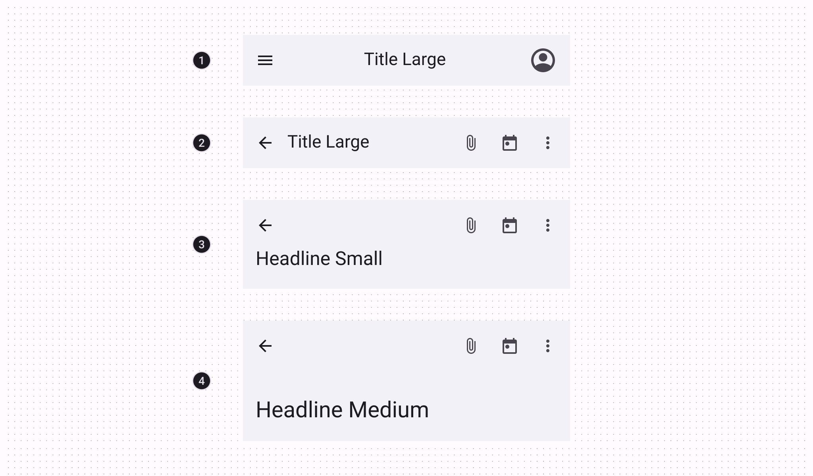
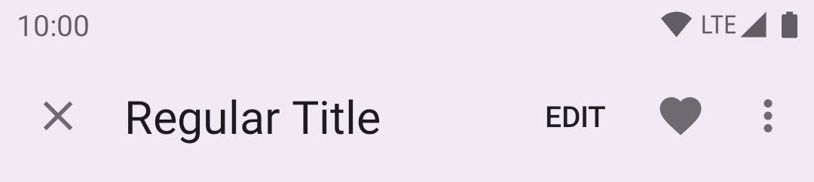
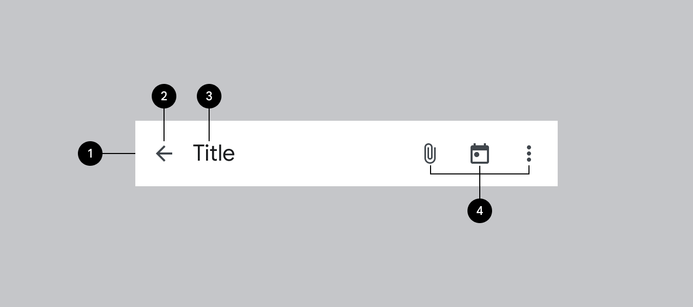

<!--docs:
title: "Top app bars"
layout: detail
section: components
excerpt: "Android top app bar."
iconId: top_app_bar
path: /catalog/top-app-bars/
-->

# Top app bars

[Top app bars](https://material.io/components/app-bars-top/#) display
information and actions related to the current screen.


**Contents**

*   [Design & API Documentation](#design-api-documentation)
*   [Using top app bars](#using-top-app-bars)
*   [Regular top app bars](#regular-top-app-bars)
*   [Collapsing top app bar](#collapsing-top-app-bars)
*   [Contextual action bar](#contextual-action-bar)
*   [Theming](#theming-the-top-app-bar)

## Design & API Documentation

*   [Google Material3 Spec](https://material.io/components/top-app-bar/overview)
*   [API Reference](https://developer.android.com/reference/com/google/android/material/appbar/package-summary)

## Using top app bars

Before you can use Material top app bars, you need to add a dependency to the
Material Components for Android library. For more information, go to the
[Getting started](https://github.com/material-components/material-components-android/tree/master/docs/getting-started.md)
page.

### Making top app bars accessible

Android's top app bar component APIs provide support for the navigation icon,
action items, overflow menu and more, to inform the user what each action
performs. While optional, their use is strongly encouraged.

#### Content descriptions

When using icons for navigation, action items and other elements of top app
bars, you should set a content description for them so that screen readers like
TalkBack are able to announce their purpose or action.

For an overall content description of the top app bar, set an
`android:contentDescription` or use the `setContentDescription` method on the
`MaterialToolbar`.

For the navigation icon, this can be achieved via the
`app:navigationContentDescription` attribute or
`setNavigationContentDescription` method.

For action items and items within the overflow menu, the content description
needs to be set in the menu:

```xml
<menu ...>
    ...
    <item
          ...
          android:contentDescription="@string/content_description_one" />
    <item
          ...
          android:contentDescription="@string/content_description_two" />
</menu>
```

For images within collapsing top app bars, set an `android:contentDescription`
or use the `setContentDescription` method for the `ImageView`.

### Types

There are four types of top app bars: 1\. Center aligned, 2\. Small, 3\. Medium,
4\. Large.

For implementation purposes, the Center aligned & Small types can be grouped
into [Regular top app bars](#regular-top-app-bars), while the Medium & Large
types can be grouped into [Collapsing top app bars](#collapsing-top-app-bars).



API and source code:

*   `CoordinatorLayout`
    *   [Class definition](https://developer.android.com/reference/androidx/coordinatorlayout/widget/CoordinatorLayout)
*   `AppBarLayout`
    *   [Class definition](https://developer.android.com/reference/com/google/android/material/appbar/AppBarLayout)
    *   [Class source](https://github.com/material-components/material-components-android/tree/master/lib/java/com/google/android/material/appbar/AppBarLayout.java)
*   `MaterialToolbar`
    *   [Class definition](https://developer.android.com/reference/com/google/android/material/appbar/MaterialToolbar)
    *   [Class source](https://github.com/material-components/material-components-android/tree/master/lib/java/com/google/android/material/appbar/MaterialToolbar.java)
*   `CollapsingToolbarLayout`
    *   [Class definition](https://developer.android.com/reference/com/google/android/material/appbar/CollapsingToolbarLayout)
    *   [Class source](https://github.com/material-components/material-components-android/tree/master/lib/java/com/google/android/material/appbar/CollapsingToolbarLayout.java)

## Regular top app bars

The top app bar provides content and actions related to the current screen. It’s
used for branding, screen titles, navigation, and actions.

### Small top app bar example

The following example shows a Small top app bar with a page title, a navigation
icon, two actions, and an overflow menu.



In the layout:

```xml
<androidx.coordinatorlayout.widget.CoordinatorLayout
    ...
    android:layout_width="match_parent"
    android:layout_height="match_parent">

    <com.google.android.material.appbar.AppBarLayout
        android:layout_width="match_parent"
        android:layout_height="wrap_content">

        <com.google.android.material.appbar.MaterialToolbar
            android:id="@+id/topAppBar"
            android:layout_width="match_parent"
            android:layout_height="wrap_content"
            android:minHeight="?attr/actionBarSize"
            app:title="@string/page_title"
            app:menu="@menu/top_app_bar"
            app:navigationIcon="@drawable/ic_close_24dp" />

    </com.google.android.material.appbar.AppBarLayout>

    <!-- Note: A RecyclerView can also be used -->
    <androidx.core.widget.NestedScrollView
        android:layout_width="match_parent"
        android:layout_height="match_parent"
        app:layout_behavior="@string/appbar_scrolling_view_behavior">

        <!-- Scrollable content -->

    </androidx.core.widget.NestedScrollView>

</androidx.coordinatorlayout.widget.CoordinatorLayout>
```

**Note:** In order to allow your Top App Bar to grow taller when the system font
setting increases, you can use `android:layout_height="wrap_content"` +
`android:minHeight="?attr/actionBarSize"` on your `MaterialToolbar`, as shown in
the example above.

In `@menu/top_app_bar.xml`:

```xml
<menu xmlns:android="http://schemas.android.com/apk/res/android"
    xmlns:app="http://schemas.android.com/apk/res-auto">

    <item
        android:id="@+id/edit"
        android:title="@string/edit"
        android:contentDescription="@string/content_description_search"
        app:showAsAction="ifRoom" />

    <item
        android:id="@+id/favorite"
        android:icon="@drawable/ic_favorite_24dp"
        android:title="@string/favorite"
        android:contentDescription="@string/content_description_favorite"
        app:showAsAction="ifRoom" />

    <item
        android:id="@+id/more"
        android:title="@string/more"
        android:contentDescription="@string/content_description_more"
        app:showAsAction="never" />

</menu>
```

In menu/navigation icon drawables:

```xml
<vector
    ...
    android:tint="?attr/colorControlNormal">
    ...
</vector>
```

In code:

```kt
topAppBar.setNavigationOnClickListener {
    // Handle navigation icon press
}

topAppBar.setOnMenuItemClickListener { menuItem ->
    when (menuItem.itemId) {
        R.id.edit -> {
            // Handle edit text press
            true
        }
        R.id.favorite -> {
            // Handle favorite icon press
            true
        }
        R.id.more -> {
            // Handle more item (inside overflow menu) press
            true
        }
        else -> false
    }
}
```

**Note:** The above example is the recommended approach and, in order for it to
work, you need to use a `Theme.Material3.*` theme containing the `NoActionBar`
segment, such as the `Theme.Material3.Light.NoActionBar`. If not, an action bar
will be added to the current `Activity` window. The `MaterialToolbar` can be set
as the support action bar and thus receive various `Activity` callbacks, as
shown in this [guide](https://developer.android.com/training/appbar).

#### Applying scrolling behavior to the top app bar

The following example shows the top app bar positioned at the same elevation as
content. Upon scroll, it increases elevation and lets content scroll behind it.

In the layout:

```xml
<androidx.coordinatorlayout.widget.CoordinatorLayout
    ...>

    <com.google.android.material.appbar.AppBarLayout
        ...
        app:liftOnScroll="true">

        <com.google.android.material.appbar.MaterialToolbar
            ...
            />

    </com.google.android.material.appbar.AppBarLayout>

    ...

</androidx.coordinatorlayout.widget.CoordinatorLayout>
```

**Note:** If your scrolling view (`RecyclerView`, `ListView`, etc.) is nested
within another view (e.g., a `SwipeRefreshLayout`), you should make sure to set
`app:liftOnScrollTargetViewId` on your `AppBarLayout` to the id of the scrolling
view. This will ensure that the `AppBarLayout` is using the right view to
determine whether it should lift or not, and it will help avoid flicker issues.

The following example shows the top app bar disappearing upon scrolling up, and
appearing upon scrolling down.

In the layout:

```xml
<androidx.coordinatorlayout.widget.CoordinatorLayout
    ...>

    <com.google.android.material.appbar.AppBarLayout
        ...>

        <com.google.android.material.appbar.MaterialToolbar
            ...
            app:layout_scrollFlags="scroll|enterAlways|snap"
            />

    </com.google.android.material.appbar.AppBarLayout>

    ...

</androidx.coordinatorlayout.widget.CoordinatorLayout>
```

Optionally, you can change the style in which the app bar disappears and
appears when scrolling by setting a scroll effect. By default, a scroll effect
of `none` is set which translates the app bar in-step with the scrolling
content. The following option shows setting the `compress` scroll effect
which clips the top app bar until it meets the top of the screen:

In the layout:

```xml
<androidx.coordinatorlayout.widget.CoordinatorLayout
    ...>

    <com.google.android.material.appbar.AppBarLayout
        ...>

        <com.google.android.material.appbar.MaterialToolbar
            ...
            app:layout_scrollFlags="scroll|enterAlways|snap"
            app:layout_scrollEffect="compress"
            />

    </com.google.android.material.appbar.AppBarLayout>

    ...

</androidx.coordinatorlayout.widget.CoordinatorLayout>
```

### Status bar and edge-to-edge


A common configuration for modern Top App Bars, as seen above, is to have a
seamless color shared with the status bar. The best way to achieve this is to
follow the
[edge-to-edge guidance](https://developer.android.com/training/gestures/edge-to-edge),
which will result in a transparent status bar that lets the background color of
the Top App Bar show through.

Make sure to set `android:fitsSystemWindows="true"` on your `AppBarLayout` (or
`MaterialToolbar` if not using `AppBarLayout`), so that an extra inset is added
to avoid overlap with the status bar.

If your `AppBarLayout` scrolls and content is visible under the status bar, you
can set the `AppBarLayout`'s `statusBarForeground` to a `MaterialShapeDrawable`
to let `AppBarLayout` automatically match the status bar color to its own
background.

In code:

```kt
appBarLayout.statusBarForeground =
    MaterialShapeDrawable.createWithElevationOverlay(context)
```

Or if using Tonal Surface Colors instead of Elevation Overlays, you can simply
set the `statusBarForeground` to `colorSurface` to let `AppBarLayout`
automatically match the status bar color to its own background:

```kt
appBarLayout.setStatusBarForegroundColor(
    MaterialColors.getColor(appBarLayout, R.attr.colorSurface))
```

### Center aligned top app bar example

All of the same guidance and code from the sections above is relevant for Center
aligned top app bars. The only additional configuration needed for centering is
setting the `app:titleCentered` and/or `app:subtitleCentered` attributes to
`true` on your `MaterialToolbar`.


### Anatomy and Key properties



1.  Container
2.  Navigation icon (optional)
3.  Title (optional)
4.  Action menu items (optional)

#### Container attributes

Element                         | Attribute                   | Related method(s)                                | Default value
------------------------------- | --------------------------- | ------------------------------------------------ | -------------
**Color**                       | `android:background`        | `setBackground`<br>`getBackground`               | `?attr/colorSurface`
**`MaterialToolbar` elevation** | `android:elevation`         | `setElevation`<br>`getElevation`                 | `4dp`
**`AppBarLayout` elevation**    | `android:stateListAnimator` | `setStateListAnimator`<br>`getStateListAnimator` | `0dp` to `4dp` (see all [states](https://github.com/material-components/material-components-android/tree/master/lib/java/com/google/android/material/appbar/res/animator-v21/design_appbar_state_list_animator.xml))

#### Navigation icon attributes

Element                          | Attribute                | Related method(s)                          | Default value
-------------------------------- | ------------------------ | ------------------------------------------ | -------------
**`MaterialToolbar` icon**       | `app:navigationIcon`     | `setNavigationIcon`<br>`getNavigationIcon` | `null`
**`MaterialToolbar` icon color** | `app:navigationIconTint` | `setNavigationIconTint`                    | `?attr/colorOnSurface`

#### Title attributes

Element                                                  | Attribute                                                                                    | Related method(s)                          | Default value
-------------------------------------------------------- | -------------------------------------------------------------------------------------------- | ------------------------------------------ | -------------
**`MaterialToolbar` title text**                         | `app:title`                                                                                  | `setTitle`<br>`getTitle`                   | `null`
**`MaterialToolbar` subtitle text**                      | `app:subtitle`                                                                               | `setSubtitle`<br>`getSubtitle`             | `null`
**`MaterialToolbar` title color**                        | `app:titleTextColor`                                                                         | `setTitleTextColor`                        | `?attr/colorOnSurface`
**`MaterialToolbar` subtitle color**                     | `app:subtitleTextColor`                                                                      | `setSubtitleTextColor`                     | `?attr/colorOnSurfaceVariant`
**`MaterialToolbar` title typography**                   | `app:titleTextAppearance`                                                                    | `setTitleTextAppearance`                   | `?attr/textAppearanceTitleLarge`
**`MaterialToolbar` subtitle typography**                | `app:subtitleTextAppearance`                                                                 | `setSubtitleTextAppearance`                | `?attr/textAppearanceTitleMedium`
**`MaterialToolbar` title centering**                    | `app:titleCentered`                                                                          | `setTitleCentered`                         | `false`
**`MaterialToolbar` subtitle centering**                 | `app:subtitleCentered`                                                                       | `setSubtitleCentered`                      | `false`
**`CollapsingToolbarLayout` collapsed title typography** | `app:collapsedTitleTextAppearance`                                                           | `setCollapsedTitleTextAppearance`          | `?attr/textAppearanceTitleLarge`
**`CollapsingToolbarLayout` expanded title typography**  | `app:expandedTitleTextAppearance`                                                            | `setExpandedTitleTextAppearance`           | `?attr/textAppearanceHeadlineSmall` for Medium</br>`?attr/textAppearanceHeadlineMedium` for Large
**`CollapsingToolbarLayout` collapsed title color**      | `android:textColor` (in `app:collapsedTitleTextAppearance`) or `app:collapsedTitleTextColor` | `setCollapsedTitleTextColor`               | `?attr/colorOnSurface`
**`CollapsingToolbarLayout` expanded title color**       | `android:textColor` (in `app:expandedTitleTextAppearance`) or `app:expandedTitleTextColor`   | `setExpandedTitleTextColor`                | `?attr/colorOnSurface`
**`CollapsingToolbarLayout` expanded title margins**     | `app:expandedTitleMargin*`                                                                   | `setExpandedTitleMargin*`                  | `16dp`
**`CollapsingToolbarLayout` title max lines**            | `app:maxLines`                                                                               | `setMaxLines`<br>`getMaxLines`             | `1`
**`CollapsingToolbarLayout` title ellipsize**            | `app:titleTextEllipsize`                                                                     | `setTitleEllipsize`<br>`getTitleEllipsize` | `end`

#### Action items attributes

Element                          | Attribute  | Related method(s)          | Default value
-------------------------------- | ---------- | -------------------------- | -------------
**`MaterialToolbar` menu**       | `app:menu` | `inflateMenu`<br>`getMenu` | `null`
**`MaterialToolbar` icon color** | N/A        | N/A                        | `?attr/colorOnSurfaceVariant`

#### Overflow menu attributes

Element                                        | Attribute                                                                                          | Related method(s)                      | Default value
---------------------------------------------- | -------------------------------------------------------------------------------------------------- | -------------------------------------- | -------------
**`MaterialToolbar` icon**                     | `android:src` and `app:srcCompat` in `actionOverflowButtonStyle` (in app theme)                    | `setOverflowIcon`<br>`getOverflowIcon` | `@drawable/abc_ic_menu_overflow_material` (before API 23) or `@drawable/ic_menu_moreoverflow_material` (after API 23)
**`MaterialToolbar` overflow theme**           | `app:popupTheme`                                                                                   | `setPopupTheme`<br>`getPopupTheme`     | `@style/ThemeOverlay.Material3.*`
**`MaterialToolbar` overflow item typography** | `textAppearanceSmallPopupMenu` and `textAppearanceLargePopupMenu` in `app:popupTheme` or app theme | N/A                                    | `?attr/textAppearanceBodyLarge`

#### Scrolling behavior attributes

Element                                                         | Attribute                       | Related method(s)                                                                                     | Default value
--------------------------------------------------------------- | ------------------------------- | ----------------------------------------------------------------------------------------------------- | -------------
**`MaterialToolbar` or `CollapsingToolbarLayout` scroll flags** | `app:layout_scrollFlags`        | `setScrollFlags`<br>`getScrollFlags`<br>(on `AppBarLayout.LayoutParams`)                              | `noScroll`
**`MaterialToolbar` collapse mode**                             | `app:collapseMode`              | `setCollapseMode`<br>`getCollapseMode`<br>(on `CollapsingToolbar`)                                    | `none`
**`CollapsingToolbarLayout` content scrim color**               | `app:contentScrim`              | `setContentScrim`<br>`setContentScrimColor`<br>`setContentScrimResource`<br>`getContentScrim`         | `null`
**`CollapsingToolbarLayout` status bar scrim color**            | `app:statusBarScrim`            | `setStatusBarScrim`<br>`setStatusBarScrimColor`<br>`setStatusBarScrimResource`<br>`getStatusBarScrim` | `@empty`
**`CollapsingToolbarLayout` scrim animation duration**          | `app:scrimAnimationDuration`    | `setScrimAnimationDuration`<br>`getScrimAnimationDuration`                                            | `600`
**`CollapsingToolbarLayout` collapsing animation interpolator** | `app:titlePositionInterpolator` | `setTitlePositionInterpolator`                                                                        | `@null`
**`AppBarLayout` lift on scroll**                               | `app:liftOnScroll`              | `setLiftOnScroll`<br>`isLiftOnScroll`                                                                 | `true`
**`AppBarLayout` lift on scroll color**                         | `app:liftOnScrollColor`         | N/A                                                                                                   | `?attr/colorSurfaceContainer`
**`AppBarLayout` lift on scroll target view**                   | `app:liftOnScrollTargetViewId`  | `setLiftOnScrollTargetViewId`<br>`getLiftOnScrollTargetViewId`                                        | `@null`
**`AppBarLayout` scroll effect**                                | `app:layout_scrollEffect`       | `setScrollEffect`<br>`getScrollEffect`                                                                | `none`

#### `AppBarLayout` styles

Element                            | Style
---------------------------------- | -------------------------------
**Surface background color style** | `Widget.Material3.AppBarLayout`

Default style theme attribute: `?attr/appBarLayoutStyle`

#### `MaterialToolbar` styles

Element                            | Style
---------------------------------- | ------------------------------------
**Default style**                  | `Widget.Material3.Toolbar`
**Surface background color style** | `Widget.Material3.Toolbar.Surface`
**On Surface color style**         | `Widget.Material3.Toolbar.OnSurface`

Default style theme attribute: `?attr/toolbarStyle`

Additional style theme attributes: `?attr/toolbarSurfaceStyle`

#### `CollapsingToolbarLayout` styles

Element           | Style
----------------- | -------------------------------------------
**Default style** | `Widget.Material3.CollapsingToolbar`
**Medium style**  | `Widget.Material3.CollapsingToolbar.Medium`
**Large style**   | `Widget.Material3.CollapsingToolbar.Large`

Default style theme attribute: `?attr/collapsingToolbarLayoutStyle`

Additional style theme attributes: `?attr/collapsingToolbarLayoutMediumStyle`,
`?attr/collapsingToolbarLayoutLargeStyle`

See the full list of
[styles](https://github.com/material-components/material-components-android/tree/master/lib/java/com/google/android/material/appbar/res/values/styles.xml)
and
[attrs](https://github.com/material-components/material-components-android/tree/master/lib/java/com/google/android/material/appbar/res/values/attrs.xml).

## Collapsing top app bars

The larger collapsing top app bars can be used for longer titles, to house
imagery, or to provide a stronger presence to the top app bar.

### Medium top app bar example

The following example shows a Medium collapsing top app bar with a page title, a
navigation icon, an action icon, and an overflow menu.


In the layout:

```xml
<androidx.coordinatorlayout.widget.CoordinatorLayout
    ...>

    <com.google.android.material.appbar.AppBarLayout
        ...
        android:layout_width="match_parent"
        android:layout_height="wrap_content"
        android:fitsSystemWindows="true">

        <com.google.android.material.appbar.CollapsingToolbarLayout
            style="?attr/collapsingToolbarLayoutMediumStyle"
            android:layout_width="match_parent"
            android:layout_height="?attr/collapsingToolbarLayoutMediumSize">

            <com.google.android.material.appbar.MaterialToolbar
                ...
                android:layout_width="match_parent"
                android:layout_height="?attr/actionBarSize"
                android:elevation="0dp" />

        </com.google.android.material.appbar.CollapsingToolbarLayout>

    </com.google.android.material.appbar.AppBarLayout>

    ...

</androidx.coordinatorlayout.widget.CoordinatorLayout>
```

### Large top app bar example

The following example shows a Large collapsing top app bar with a page title, a
navigation icon, an action icon, and an overflow menu.


In the layout:

```xml
<androidx.coordinatorlayout.widget.CoordinatorLayout
    ...>

    <com.google.android.material.appbar.AppBarLayout
        ...
        android:layout_width="match_parent"
        android:layout_height="wrap_content"
        android:fitsSystemWindows="true">

        <com.google.android.material.appbar.CollapsingToolbarLayout
            style="?attr/collapsingToolbarLayoutLargeStyle"
            android:layout_width="match_parent"
            android:layout_height="?attr/collapsingToolbarLayoutLargeSize">

            <com.google.android.material.appbar.MaterialToolbar
                android:layout_width="match_parent"
                android:layout_height="?attr/actionBarSize"
                ...
                android:elevation="0dp" />

        </com.google.android.material.appbar.CollapsingToolbarLayout>

    </com.google.android.material.appbar.AppBarLayout>

    ...

</androidx.coordinatorlayout.widget.CoordinatorLayout>
```

#### Adding an image to a collapsing top app bar

A collapsing top app bar with an image background, a page title, a navigation
icon, two action icons, and an overflow menu:


In the layout:

```xml
<androidx.coordinatorlayout.widget.CoordinatorLayout
    ...
    android:fitsSystemWindows="true">

    <com.google.android.material.appbar.AppBarLayout
        ...
        android:layout_width="match_parent"
        android:layout_height="wrap_content"
        android:fitsSystemWindows="true">

        <com.google.android.material.appbar.CollapsingToolbarLayout
            style="?attr/collapsingToolbarLayoutLargeStyle"
            android:layout_width="match_parent"
            android:layout_height="?attr/collapsingToolbarLayoutLargeSize">

            <ImageView
                android:layout_width="match_parent"
                android:layout_height="match_parent"
                android:src="@drawable/media"
                android:scaleType="centerCrop"
                android:fitsSystemWindows="true"
                android:contentDescription="@string/content_description_media" />

            <com.google.android.material.appbar.MaterialToolbar
                android:layout_width="match_parent"
                android:layout_height="?attr/actionBarSize"
                ...
                android:background="@android:color/transparent" />

        </com.google.android.material.appbar.CollapsingToolbarLayout>

    </com.google.android.material.appbar.AppBarLayout>

    ...

</androidx.coordinatorlayout.widget.CoordinatorLayout>
```

In `res/values/themes.xml`:

```xml
<style name="Theme.App" parent="Theme.Material3.*.NoActionBar">
    <item name="android:windowTranslucentStatus">true</item>
</style>
```

#### Applying scrolling behavior to a collapsing top app bar

When scrolling up, the collapsing top app bar transforms into a regular top app
bar.

In the layout:

```xml
<androidx.coordinatorlayout.widget.CoordinatorLayout
    ...>

    <com.google.android.material.appbar.AppBarLayout
        ...>

        <com.google.android.material.appbar.CollapsingToolbarLayout
            ...
            app:layout_scrollFlags="scroll|exitUntilCollapsed|snap"
            app:contentScrim="?attr/colorPrimary">

            ...

            <com.google.android.material.appbar.MaterialToolbar
                ...
                android:layout_height="?attr/actionBarSize"
                app:layout_collapseMode="pin"
                />

        </com.google.android.material.appbar.CollapsingToolbarLayout>

    </com.google.android.material.appbar.AppBarLayout>

    ...

</androidx.coordinatorlayout.widget.CoordinatorLayout>
```

## Contextual action bar

Contextual action bars provide actions for selected items. A top app bar can
transform into a contextual action bar, remaining active until an action is
taken or it is dismissed.

### Contextual action bar example

API and source code:

*   `ActionMode`
    *   [Class definition](https://developer.android.com/reference/androidx/appcompat/view/ActionMode)

The following example shows a contextual action bar with a contextual title, a
close icon, two contextual action icons, and an overflow menu:


In `res/values/themes.xml`:

```xml
<style name="Theme.App" parent="Theme.Material3.*.NoActionBar">
    ...
    <item name="windowActionModeOverlay">true</item>
    <item name="actionModeCloseDrawable">@drawable/ic_close_24dp</item>
    <item name="actionBarTheme">@style/ThemeOverlay.Material3.Dark.ActionBar</item>
</style>
```

In code:

```kt
val callback = object : ActionMode.Callback {

    override fun onCreateActionMode(mode: ActionMode?, menu: Menu?): Boolean {
        menuInflater.inflate(R.menu.contextual_action_bar, menu)
        return true
    }

    override fun onPrepareActionMode(mode: ActionMode?, menu: Menu?): Boolean {
        return false
    }

    override fun onActionItemClicked(mode: ActionMode?, item: MenuItem?): Boolean {
        return when (item?.itemId) {
            R.id.share -> {
                // Handle share icon press
                true
            }
            R.id.delete -> {
                // Handle delete icon press
                true
            }
            R.id.more -> {
                // Handle more item (inside overflow menu) press
                true
            }
            else -> false
        }
    }

    override fun onDestroyActionMode(mode: ActionMode?) {
    }
}

val actionMode = startSupportActionMode(callback)
actionMode?.title = "1 selected"
```

In `@menu/contextual_action_bar.xml`:

```xml
<menu xmlns:android="http://schemas.android.com/apk/res/android"
    xmlns:app="http://schemas.android.com/apk/res-auto">

    <item
        android:id="@+id/share"
        android:icon="@drawable/ic_share_24dp"
        android:title="@string/share"
        android:contentDescription="@string/content_description_share"
        app:showAsAction="ifRoom" />

    <item
        android:id="@+id/delete"
        android:icon="@drawable/ic_delete_24dp"
        android:title="@string/delete"
        android:contentDescription="@string/content_description_delete"
        app:showAsAction="ifRoom" />

    <item
        android:id="@+id/more"
        android:title="@string/more"
        android:contentDescription="@string/content_description_more"
        app:showAsAction="never" />

</menu>
```

In menu/navigation icons:

```xml
<vector
    ...
    android:tint="?attr/colorControlNormal">
    ...
</vector>
```

### Anatomy and Key properties


1.  Close button (instead of a navigation icon)
2.  Contextual title
3.  Contextual actions
4.  Overflow menu (optional)
5.  Container (not shown)

#### Close button attributes

Element   | Attribute                                    | Related method(s) | Default value
--------- | -------------------------------------------- | ----------------- | -------------
**Icon**  | `app:actionModeCloseDrawable` (in app theme) | N/A               | `@drawable/abc_ic_ab_back_material`
**Color** | N/A                                          | N/A               | `?attr/colorControlNormal` (as `Drawable` tint)

#### Contextual title attributes

Element                 | Attribute               | Related method(s)              | Default value
----------------------- | ----------------------- | ------------------------------ | -------------
**Title text**          | N/A                     | `setTitle`<br>`getTitle`       | `null`
**Subtitle text**       | N/A                     | `setSubtitle`<br>`getSubtitle` | `null`
**Title typography**    | `app:titleTextStyle`    | N/A                            | `@style/TextAppearance.Material3.ActionBar.Title`
**Subtitle typography** | `app:subtitleTextStyle` | N/A                            | `@style/TextAppearance.Material3.ActionBar.Subtitle`

#### Contextual actions attributes

Element        | Attribute | Related method(s)                               | Default value
-------------- | --------- | ----------------------------------------------- | -------------
**Menu**       | N/A       | `menuInflater.inflate` in `ActionMode.Callback` | `null`
**Icon color** | N/A       | N/A                                             | `?attr/colorControlNormal` (as `Drawable` tint)

#### Overflow menu attributes

Element                      | Attribute                                                                       | Related method(s)                      | Default value
---------------------------- | ------------------------------------------------------------------------------- | -------------------------------------- | -------------
**Icon**                     | `android:src` and `app:srcCompat` in `actionOverflowButtonStyle` (in app theme) | `setOverflowIcon`<br>`getOverflowIcon` | `@drawable/abc_ic_menu_overflow_material` (before API 23) or `@drawable/ic_menu_moreoverflow_material` (after API 23)
**Overflow item typography** | `textAppearanceSmallPopupMenu` and `textAppearanceLargePopupMenu` in app theme  | N/A                                    | `?attr/textAppearanceTitleMedium`

#### Container attributes

Element            | Attribute                                    | Related method(s) | Default value
------------------ | -------------------------------------------- | ----------------- | -------------
**Color**          | `app:background`                             | N/A               | `?attr/actionModeBackground`
**Height**         | `app:height`                                 | N/A               | `?attr/actionBarSize`
**Overlay window** | `app:windowActionModeOverlay` (in app theme) | N/A               | `false`

#### Toolbar logo attributes

Element               | Attribute                                    | Related method(s)                                         | Default value
--------------------- | -------------------------------------------- | --------------------------------------------------------- | -------------
**AdjustViewBounds**  | `app:logoAdjustViewBounds`                   | `setLogoAdjustViewBounds`<br>`isLogoAdjustViewBounds`     | `false`
**ScaleType**         | `app:logoScaleType`                          | `setLogoScaleType`<br>`getLogoScaleType`                  | ImageView's default

#### Styles

Element           | Style
----------------- | -----------------------------
**Default style** | `Widget.Material3.ActionMode`

Default style theme attribute: `actionModeStyle`

## Theming the top app bar

The top app bar supports
[Material Theming](https://material.io/components/app-bars-top/#theming) and can
customize color, typography and shape.

### Top app bar theming example

API and source code:

*   `AppBarLayout`
    *   [Class definition](https://developer.android.com/reference/com/google/android/material/appbar/AppBarLayout)
    *   [Class source](https://github.com/material-components/material-components-android/tree/master/lib/java/com/google/android/material/appbar/AppBarLayout.java)
*   `MaterialToolbar`
    *   [Class definition](https://developer.android.com/reference/com/google/android/material/appbar/MaterialToolbar)
    *   [Class source](https://github.com/material-components/material-components-android/tree/master/lib/java/com/google/android/material/appbar/MaterialToolbar.java)

A regular top app bar with Material Theming:


#### Implementing top app bar theming

Use theme attributes in `res/values/styles.xml`, which applies to all top app
bars and affects other components:

```xml
<style name="Theme.App" parent="Theme.Material3.*.NoActionBar">
    ...
    <item name="colorSurface">@color/shrine_pink_100</item>
    <item name="colorOnSurface">@color/shrine_pink_900</item>
    <item name="android:statusBarColor">?attr/colorPrimary</item>
    <item name="android:windowLightStatusBar" tools:targetApi="m">true</item>
    <item name="textAppearanceTitleLarge">@style/TextAppearance.App.TitleLarge</item>
    <item name="textAppearanceTitleMedium">@style/TextAppearance.App.TitleMedium</item>
</style>

<style name="TextAppearance.App.TitleLarge" parent="TextAppearance.Material3.TitleLarge">
    <item name="fontFamily">@font/rubik</item>
    <item name="android:fontFamily">@font/rubik</item>
</style>

<style name="TextAppearance.App.TitleMedium" parent="TextAppearance.Material3.TitleMedium">
    <item name="fontFamily">@font/rubik</item>
    <item name="android:fontFamily">@font/rubik</item>
</style>
```

Use default style theme attributes, styles and theme overlays, which applies to
all top app bars but does not affect other components:

```xml
<style name="Theme.App" parent="Theme.Material3.*.NoActionBar">
    ...
    <item name="toolbarStyle">@style/Widget.App.Toolbar</item>
</style>

<style name="Widget.App.Toolbar" parent="Widget.Material3.Toolbar">
    <item name="materialThemeOverlay">@style/ThemeOverlay.App.Toolbar</item>
    <item name="titleTextAppearance">@style/TextAppearance.App.TitleLarge</item>
    <item name="subtitleTextAppearance">@style/TextAppearance.App.TitleMedium</item>
</style>

<style name="ThemeOverlay.App.Toolbar" parent="">
    <item name="colorSurface">@color/shrine_pink_100</item>
    <item name="colorOnSurface">@color/shrine_pink_900</item>
</style>
```

Use the style in the layout, which affects only this top app bar:

```xml
<com.google.android.material.appbar.MaterialToolbar
    ...
    app:title="@string/flow_shirt_blouse"
    app:menu="@menu/top_app_bar_shrine"
    app:navigationIcon="@drawable/ic_close_24dp"
    style="@style/Widget.App.Toolbar"
    />
```
