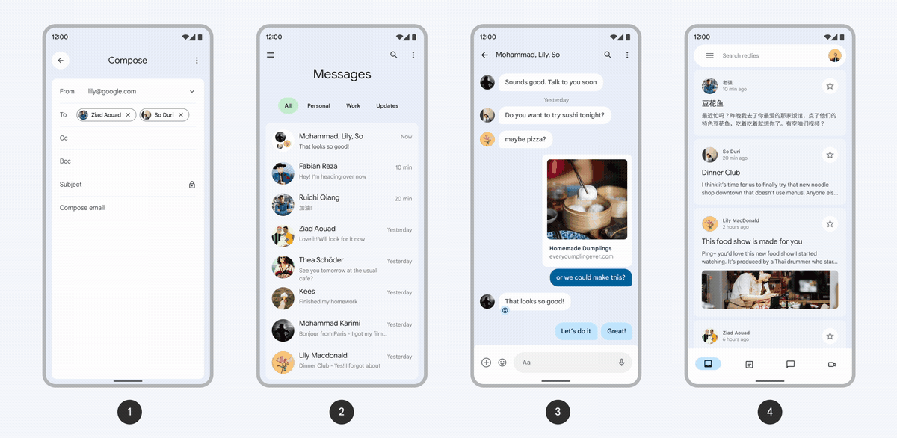

<!--docs:
title: "Motion"
layout: detail
section: theming
excerpt: "Motion system - easings, durations, and transitions."
latest_update: "January 23, 2023"
path: /theming/motion/
-->

# Motion

Material motion is a system to help create stylized and consistent animations
across an app. Provided in the library are semantic easing and duration theme
attributes, semantic spring theme attributes, components that use themed motion
for their built-in animations, and a set of transitions for
navigational events or custom animations.

The easing and duration motion system is available in version `1.6.0` or later.
The physics motion system is available in version `1.13.0` or later. For more
information, see the
[Getting started](https://github.com/material-components/material-components-android/tree/master/docs/getting-started.md)
page.

1.  [Theming](#theming)
2.  [Transitions](#transitions)

## Theming

The Material motion system is backed by a set of easing and duration slots and
a set of spring slots. These are the building blocks for creating any
Material-styled animation. These slots are implemented as theme attributes,
similar to color or shape attributes. They are used by components in the
library to create a unified motion feel and can be used by custom animations
to make motion feel cohesive across an entire app.

### Springs

The spring (or physics) motion system is a set of six opinionated spring
attributes intended to be used with the [Dynamic Animation AndroidX library](https://developer.android.com/develop/ui/views/animations/spring-animation#add-support-library).
A spring attribute is configured as a style made up of a damping and stiffness
value (see [MaterialSpring styleable](https://github.com/material-components/material-components-android/tree/master/lib/java/com/google/android/material/motion/res/values/attrs.xml)
for available properties and [spring styles](https://github.com/material-components/material-components-android/tree/master/lib/java/com/google/android/material/motion/res/values/styles.xml)
for examples). The damping ratio describes how rapidly spring oscillations
decay. Stiffness defines the strength of the spring. Learn more about how
spring animations work [here](https://developer.android.com/develop/ui/views/animations/spring-animation).

The spring system provides springs in three speeds - fast, slow, and default.
A speed is chosen based on the size of the component being animated or the
distance covered. Small component animations like switches should use the fast
spring, full screen animations or transitions should use the slow spring, and
everything in between should use the default spring.

Additionally, for each speed there are two types of springs - spatial and
effects. Spatial springs are used for animations that move something on
screen - like the x & y position of a View. Effects springs are used to animate
properties such as color or opacity where the property's value should not be
overshot (e.g. a background's alpha shouldn't bounce or oscillate above 100%).

This makes for a total of six spring attributes:

Attribute        | Default value                | Description
-------------- | ------------------------ | ---------------------------------
**?attr/motionSpringFastSpatial** | `damping: 0.9, stiffness: 1400`  | Spring for small components like switches and buttons.
**?attr/motionSpringFastEffects** | `damping: 1, stiffness: 3800`  | Spring for small component effects like color and opacity.
**?attr/motionSpringSlowSpatial** | `damping: 0.9, stiffness: 300` | Spring for full screen animations.
**?attr/motionSpringSlowEffects** | `damping: 1, stiffness: 800` | Spring for full screen animation effects like color and opacity.
**?attr/motionSpringDefaultSpatial** | `damping: 0.9, stiffness: 700` | Spring for animations that partially cover the screen like a bottom sheet or nav drawer.
**?attr/motionSpringDefaultEffects** | `damping: 1, stiffness: 1600` | Spring for animation effects that partially cover the screen.

When building spring animations, a speed should be chosen based on the
animation's size or distance covered. Then, a spatial or effects type should be
chosen depending on the property being animated. For example, if animating a
button's shape and color when pressed, use two springs: a
`motionSpringFastSpatial` spring to animate the button's shape/size and a
`motionSpringFastEffects` spring to animate the button's color.

Spring attributes can be customized (or "themed") by overriding their value to
your own [MaterialSpring](https://github.com/material-components/material-components-android/tree/master/lib/java/com/google/android/material/motion/res/values/attrs.xml)
style.

#### Custom animations using the spring motion system

To create a spring animation, you'll need to declare a dependency on the
Dynamic Animation AndroidX library. Follow instructions for including the
library and creating a spring animation
[here](https://developer.android.com/develop/ui/views/animations/spring-animation#add-support-library).

With your configured `SpringAnimation`, use
[MotionUtils.resolveThemeSpring()](https://github.com/material-components/material-components-android/tree/master/lib/java/com/google/android/material/motion/MotionUtils.java)
to resolve a spring attribute from your theme into a SpringForce object. Then,
use the resolved object to configure your SpringAnimation's SpringForce.

```kt
val defaultSpatialSpring = MotionUtils.resolveThemeSpringForce(
  /* context= */ this,
  /* attrResId= */ com.google.android.material.R.attr.motionSpringDefaultSpatial
)
SpringAnimation(box, DynamicAnimation.TRANSLATION_Y, 400f).apply {
  spring.apply {
    dampingRatio = defaultSpatialSpring.dampingRatio
    stiffness = defaultSpatialSpring.stiffness
  }
  start()
}
```

### Curves (easing & duration)

Easing (aka interpolator) and duration theme attributes make up the curve
motion system. Easing is a curve which determines how long it takes an object
to start and stop moving. Duration determines the overall time of the animation.
These are paired together to define how motion moves and feels. Learn about
suggested pairings by reading through Material's
[Easing and duration guidance](https://m3.material.io/styles/motion/easing-and-duration/applying-easing-and-duration).

Material's curve system includes seven easing attributes
([interpolators](https://developer.android.com/reference/androidx/core/animation/Interpolator))
:

Attribute        | Default value                | Description
-------------- | ------------------------ | ---------------------------------
**?attr/motionEasingStandardInterpolator** | `cubic-bezier: 0.2, 0, 0, 1`  | Easing used for utility focused animations that begin and end on screen.
**?attr/motionEasingStandardDecelerateInterpolator** | `cubic-bezier: 0, 0, 0, 1`  | Easing used for utitlity focused animations that enter the screen.
**?attr/motionEasingStandardAccelerateInterpolator** | `cubic-bezier: 0.3, 0, 1, 1` | Easing used for utility focused animations that exit the screen.
**?attr/motionEasingEmphasizedInterpolator** | `path: M 0,0 C 0.05, 0, 0.133333, 0.06, 0.166666, 0.4 C 0.208333, 0.82, 0.25, 1, 1, 1` | Easing used for common, M3-styled animations that begin and end on screen.
**?attr/motionEasingEmphasizedDecelerateInterpolator** | `cubic-bezier: 0.05, 0.7, 0.1, 1` | Easing used for common, M3-styled animations that enter the screen.
**?attr/motionEasingEmphasizedAccelerateInterpolator** | `cubic-bezier: 0.3, 0, 0.8, 0.15` | Easing used for common, M3-styled animations that exit the screen.
**?attr/motionEasingLinearInterpolator** | `cubic-bezier: 0, 0, 1, 1` | Easing for simple, non-stylized motion.

By default, these attribute values are set to interpolators that feel cohesive
when used together in an app. However, they can be overridden (or "themed") to
reflect your app's unique style by setting their values to your own interpolator
resource from your app's theme.

```xml
<style name="Theme.MyTheme" parent="Theme.Material3.DayNight.NoActionBar">
    ....
    <item name="motionEasingEmphasizedInterpolator">@interpolator/my_app_emphasized_interpolator</item>
</style>
```

For more information on easing, see [Applying easing and duration](https://m3.material.io/styles/motion/easing-and-duration/applying-easing-and-duration#569498ab-3e78-4e1a-bf59-c3fc7b1a187b).

Material's curve system also includes 16 duration attributes to be paired
with an easing. The duration attributes include:

Attribute        | Default value
-------------- | ------------------------
**?attr/motionDurationShort1** | `50ms`
**?attr/motionDurationShort2** | `100ms`
**?attr/motionDurationShort3** | `150ms`
**?attr/motionDurationShort4** | `200ms`
**?attr/motionDurationMedium1** | `250ms`
**?attr/motionDurationMedium2** | `300ms`
**?attr/motionDurationMedium3** | `350ms`
**?attr/motionDurationMedium4** | `400ms`
**?attr/motionDurationLong1** | `450ms`
**?attr/motionDurationLong2** | `500ms`
**?attr/motionDurationLong3** | `550ms`
**?attr/motionDurationLong4** | `600ms`
**?attr/motionDurationExtraLong1** | `700ms`
**?attr/motionDurationExtraLong2** | `800ms`
**?attr/motionDurationExtraLong3** | `900ms`
**?attr/motionDurationExtraLong4** | `1000ms`

In general, duration should increase as the area/traversal of an animation
increases. Maintaining this rule when customizing duration attributes will
ensure your transitions have a consistent sense of speed.

To override a duration attribute, assign the attribute to your desired
millisecond integer value.

```xml
<style name="Theme.MyTheme" parent="Theme.Material3.DayNight.NoActionBar">
    ....
    <item name="motionDurationLong2">450</item>
</style>
```

For more information on duration, see [Applying easing and duration](https://m3.material.io/styles/motion/easing-and-duration/applying-easing-and-duration#569498ab-3e78-4e1a-bf59-c3fc7b1a187b).

#### Custom animations using the curve motion system

When implementing your own animations, use an easing and duration theme
attribute so your animations tie in with animations used by Material components,
bringing motion consistency across your app.

When creating animations in xml, set your animation's `interpolator` and
`duration` properties to a Material motion theme attribute.

```xml
<!-- res/anim/slide_in.xml –>
<set xmlns:android="http://schemas.android.com/apk/res/android"
   android:duration="?attr/motionEasingDurationMedium1"
   android:interpolator="?attr/motionEasingStandardDecelerateInterpolator">
 <translate
     android:fromYDelta="20%p"
     android:toYDelta="0"/>
 <alpha
     android:fromAlpha="0.0"
     android:toAlpha="1.0"/>
<set/>
```

If creating animations in Java or Kotlin, Material provides a `MotionUtils`
class to help facilitate loading `interpolator` and `duration` theme attributes.

```kt
val interpolator = MotionUtils.resolveThemeInterpolator(
  context,
  R.attr.motionEasingStandardInterpolator,  // interpolator theme attribute
  FastOutSlowInInterpolator()  // default fallback interpolator
)

val duration = MotionUtils.resolveThemeDuration(
  context,
  R.attr.motionDurationLong1,  // duration theme attribute
  500  // default fallback duration
)
```

## Transitions

Material provides a set of transition patterns that help users understand and
navigate an app. For more information on the patterns and how to choose between
them, check out the
[Material motion transition patterns](https://m3.material.io/styles/motion/transitions/transition-patterns).

Material Components for Android provides support for all four motion patterns
defined in the Material spec.

1.  [Container transform](#container-transform)
2.  [Shared axis (or Forward and Backward)](#shared-axis)
3.  [Fade through (or Top Level)](#fade-through)
4.  [Fade (or Enter and Exit)](#fade)

The library offers transition classes for these patterns, built on top of both
the
[AndroidX Transition library](https://developer.android.com/reference/androidx/transition/package-summary)
(`androidx.transition`) and the
[Android Transition Framework](https://developer.android.com/training/transitions)
(`android.transition`):

**AndroidX (preferred)**

*   Available in the `com.google.android.material.transition` package
*   Supports Fragments and Views but not Activities or Windows
*   Contains backported bug fixes and consistent behavior across API Levels

**Platform**

*   Available in the `com.google.android.material.transition.platform` package
*   Supports Activities, Windows, Fragments, and Views.
*   Bug fixes not backported and may have different behavior across API Levels

### Motion resources

*   [Design Guidelines](https://material.io/design/motion/the-motion-system.html)
*   [Codelab](https://codelabs.developers.google.com/codelabs/material-motion-android)
*   [Blog Post](https://medium.com/androiddevelopers/material-motion-with-mdc-c1f09bb90bf9)
*   [Reply (example email app)](https://github.com/material-components/material-components-android-examples/tree/develop/Reply)
*   [Javadocs (AndroidX)](https://developer.android.com/reference/com/google/android/material/transition/package-summary)
*   [Javadocs (Platform)](https://developer.android.com/reference/com/google/android/material/transition/platform/package-summary)
*   [Catalog Demos](https://github.com/material-components/material-components-android/tree/master/catalog/java/io/material/catalog/transition)
*   [Library Source](https://github.com/material-components/material-components-android/tree/master/lib/java/com/google/android/material/transition)
*   [Android Platform Transition Guide](https://developer.android.com/training/transitions)
*   [AndroidX Transition Library](https://developer.android.com/reference/androidx/transition/package-summary)

### Container transform

The **container transform** pattern is designed for transitions between UI
elements that include a container. This pattern creates a visible connection
between two UI elements.

`MaterialContainerTransform` is a
[shared element transition](https://developer.android.com/training/transitions/start-activity#start-with-element).
Unlike traditional Android shared elements, it is not designed around a single
piece of shared content, such as an image, to be moved between two scenes.
Instead, the shared element here refers to the bounding container of a start
`View` or `ViewGroup` (such as the entire row layout of an item in a list)
transforming its size and shape into that of an end `View` or `ViewGroup` (the
root `ViewGroup` of a full screen Fragment). These start and end container Views
are the “shared element” of a container transform. While these containers are
being transformed, their contents are swapped to create the transition.


_Examples of the container transform:_

1.  _A card into a details page_
2.  _A list item into a details page_
3.  _A FAB into a details page_
4.  _A search bar into expanded search_

#### Using the container transform pattern

A container transform can be configured to transition between a number of
Android structures including Fragments, Activities and Views.

#### Container transform examples

##### Transition between Fragments

In Fragment A and Fragment B's layouts, identify the start and end Views (as
described in the [container transform overview](#container-transform)) which
will be shared. Add a matching `transitionName` to each of these Views.

```xml
<!--fragment_a.xml-->
<View
  android:id="@+id/start_view"
  android:transitionName="shared_element_container" />
```

```xml
<!--fragment_b.xml-->
<View
  android:id="@+id/end_view"
  android:transitionName="shared_element_container" />
```

**Note:** There cannot be more than a 1:1 mapping of `transitionNames` between
the start and end layouts. If you have multiple Views in your start layout that
could be mapped to an end View in your end layout (for example, each
`RecyclerView` item maps to a details screen), read about shared element mapping
at
[Continuous Shared Element Transitions: RecyclerView to ViewPager](https://android-developers.googleblog.com/2018/02/continuous-shared-element-transitions.html).

Set Fragment B's `sharedElementEnterTransition` to a new
`MaterialContainerTransform`. This can be done either before adding/replacing
Fragment B into your Fragment container or in Fragment B's `onCreate` method.

```kt
// FragmentA.kt
val fragmentB = FragmentB()
fragmentB.sharedElementEnterTransition = MaterialContainerTransform()


/*** OR ***/


// FragmentB.kt
override fun onCreate(savedInstanceState: Bundle?)  {
  super.onCreate(savedInstanceState)
  sharedElementEnterTransition = MaterialContainerTransform()
}
```

Add or replace Fragment B, adding the shared element from your start scene to
your Fragment transaction.

```kt
childFragmentManager
  .beginTransaction()
  // Map the start View in FragmentA and the transitionName of the end View in FragmentB
  .addSharedElement(view, "shared_element_container")
  .replace(R.id.fragment_container, fragmentB, FragmentB.TAG)
  .addToBackStack(FragmentB.TAG)
  .commit()
```

If using the Navigation Architecture Component, use the following.

```kt
// Map the start View in FragmentA and the transitionName of the end View in FragmentB
val extras = FragmentNavigatorExtras(view to "shared_element_container")
findNavController().navigate(R.id.action_fragmentA_to_fragmentB, null, null, extras)
```

Completing these steps should give you a working enter and return container
transform when navigating from Fragment A to Fragment B and popping from
Fragment B to Fragment A.

**Note:** Fragments are able to define enter and return shared element
transitions. When only an enter shared element transition is set, it will be
reused when the Fragment is popped (returns). `MaterialContainerTransform`
internally configures the transition’s properties based on whether or not it’s
entering or returning. If you need to customize either the enter or return style
of the transition, see [Customizing the container transform](#customization).

When running this new transition, you might notice that Fragment A (everything
besides the shared element) disappears as soon as the container transform
starts. This is because Fragment A has been removed from its container. To
“hold” Fragment A in place as the container transform plays, set Fragment A's
exit transition to the provided `Hold` transition.

```kt
// FragmentA.kt
override fun onCreate(savedInstanceState: Bundle?) {
  super.onCreate(savedInstanceState)

  // Fragment A’s exitTransition can be set any time before Fragment A is
  // replaced with Fragment B. Ensure Hold's duration is set to the same
  // duration as your MaterialContainerTransform.
  exitTransition = Hold()
}
```

**Note:** When setting a `Hold` or `MaterialElevationScale` transition, it’s
important that the transition matches the duration of the
`MaterialContainerTransform` it’s paired with. If explicitly setting a duration
on `MaterialContainerTransform` with `setDuration`, use the same value.
Otherwise, prefer the `MaterialContainerTransform(Context, boolean)` constructor
which loads theme-based values upfront so `Hold` or `MaterialElevationScale`’s
duration can be accurately set using `MaterialContainerTransform.getDuration`.

Alternatively, to subtly scale and fade Fragment A while the container transform
is playing, set Fragment A's exit and reenter transitions to a
`MaterialElevationScale` transition. This will help to reinforce the spatial
relationship and navigational hierarchy of the two screens along the z-axis.

```kt
// FragmentA.kt
fun onCreate(savedInstanceState: Bundle?) {
  super.onCreate(savedInstanceState)

  exitTransition = MaterialElevationScale(/* growing= */ false)
  reenterTransition = MaterialElevationScale(/* growing= */ true)
}
```

Pass `false` for the exit `MaterialElevationScale` `growing` constructor param,
to scale down or shrink Fragment A when it is exiting during the enter container
transform. Pass `true` for the reenter `MaterialElevationScale` to scale up or
expand Fragment A when it is reentering during the return container transform.

**Note:** When using `MaterialElevationScale`, make sure to mark the root view
of your Fragment as a
[transition group](https://developer.android.com/reference/android/view/ViewGroup#setTransitionGroup\(boolean\)),
either with `android:transitionGroup="true"`. This will ensure that
the animation is applied to the Fragment view as a whole, as opposed to each
child view individually, which is the default behavior of the Android
Transitions system.

##### Transition between activities

**Note:** Activity and Window transitions require using Android Framework
Transitions provided in the `com.google.android.material.transition.platform`
package.

In Activity A’s layout, identify the start View to be used as the “shared
element” as described in the
[container transform overview](#container-transform). Give the start view a
`transitionName`.

```xml
<!--activity_a.xml-->
<View
  android:id="@+id/start_view"
  android:transitionName="shared_element_container" />
```

Configure Activity A for an exit shared element transition as follows:

```kt
override fun onCreate(savedInstanceState: Bundle?) {

  // Enable Activity Transitions. Optionally enable Activity transitions in your
  // theme with <item name=”android:windowActivityTransitions”>true</item>.
  window.requestFeature(Window.FEATURE_ACTIVITY_TRANSITIONS)

  // Attach a callback used to capture the shared elements from this Activity to be used
  // by the container transform transition
  setExitSharedElementCallback(MaterialContainerTransformSharedElementCallback())

  // Keep system bars (status bar, navigation bar) persistent throughout the transition.
  window.sharedElementsUseOverlay = false
  super.onCreate(bundle)
  setContentView(R.layout.activity_a)
  ...
}
```

In Activity B, configure the Activity for transitions in a similar fashion.

```kt
override fun onCreate(savedInstanceState: Bundle?) {

  // Enable Activity Transitions. Optionally enable Activity transitions in your
  // theme with <item name=”android:windowActivityTransitions”>true</item>.
  window.requestFeature(Window.FEATURE_ACTIVITY_TRANSITIONS)

  // Set the transition name, which matches Activity A’s start view transition name, on
  // the root view.
  findViewById<View>(android.R.id.content).transitionName = "shared_element_container"

  // Attach a callback used to receive the shared elements from Activity A to be
  // used by the container transform transition.
  setEnterSharedElementCallback(MaterialContainerTransformSharedElementCallback())

  // Set this Activity’s enter and return transition to a MaterialContainerTransform
  window.sharedElementEnterTransition = MaterialContainerTransform().apply {
    addTarget(android.R.id.content)
    duration = 300L
  }
  window.sharedElementReturnTransition = MaterialContainerTransform().apply {
    addTarget(android.R.id.content)
    duration = 250L
  }

  super.onCreate(bundle)
  setContentView(R.layout.activity_b)
  ...
}
```

**Note:** We are using `android.R.id.content` (the window’s root) as the shared
element “container” in Activity B. This will cause the start view from Activity
A to transition into the full screen of Activity B. If you have views in
Activity A and Activity B that you do not want included as part of the
transform, you can alternatively set the transition name on a `View`/`ViewGroup`
in Activity B’s layout or include/exclude `View`s with helper methods on the
Transition class (`Transition#addTarget`, `Transition#excludeChildren`, etc).

From Activity A, start the container transform by constructing an Intent with
the following options.

```kt
val intent = Intent(this, ActivityB::class.java)

val options = ActivityOptions.makeSceneTransitionAnimation(
  this,
  startView,
  "shared_element_container" // The transition name to be matched in Activity B.
)
startActivity(intent, options.toBundle())
```

##### Transition between Views

In the Activity or Fragment where you are transitioning between two views,
trigger a `MaterialContainerTransform` by manually setting the transition’s
start and end `View`s.

```kt
val transform = MaterialContainerTransform().apply {
  // Manually tell the container transform which Views to transform between.
  startView = fab
  endView = bottomToolbar

  // Ensure the container transform only runs on a single target
  addTarget(endView)

  // Optionally add a curved path to the transform
  pathMotion = MaterialArcMotion()

  // Since View to View transforms often are not transforming into full screens,
  // remove the transition's scrim.
  scrimColor = Color.TRANSPARENT
}

// Begin the transition by changing properties on the start and end views or
// removing/adding them from the hierarchy.
TransitionManager.beginDelayedTransition(container, transform)
fab.visibility = View.GONE
bottomToolbar.visibility = View.VISIBLE
```

This will perform a container transform from the start view, transitioning to
the end view. To return, set up the same transform, switching the start and end
Views and undoing any property changes (setting the FAB back to `View.VISIBLE`
and the `bottomToolbar` back to `View.GONE`) done by the first transform.

#### Customization

While the out-of-the-box container transform should work in most cases, you can
manually set the following properties on `MaterialContainerTransform` to
customize the look and feel of the animation:

##### Container transform attributes

<!--  Todo: Update this table with links to source where listing defaults is too lengthy (thresholds) -->

Element        | Attribute                | Related method(s)                 | Default value
-------------- | ------------------------ | --------------------------------- | -------------
**Shape** | `transitionShapeAppearance`           | `getStartShapeAppearanceModel`<br/>`setStartShapeAppearanceModel`<br/>`getEndShapeAppearanceModel`<br/>`setEndShapeAppearanceModel`          | `null`
**Duration (incoming)** | `motionDurationLong1`           | `getDuration`<br/>`setDuration`          | `300ms`
**Duration (outgoing)** | `motionDurationMedium2`           | `getDuration`<br/>`setDuration`          | `250ms`
**Easing** | `motionEasingStandard`           | `getInterpolator`<br/>`setInterpolator`          | `cubic-bezier(0.4, 0.0, 0.2, 1)`<br/>`FastOutSlowIn`
**Motion path** | `motionPath`           | `getPathMotion`<br/>`setPathMotion`          | `linear`

**Note:** By default, `MaterialContainerTransform` uses different durations
when incoming vs. outgoing. Calling `setDuration` on an instance of
`MaterialContainerTransform` will override this behavior, causing the passed
duration to be used both when incoming and outgoing. If you would like different
durations for incoming and outgoing animations, you should create and set
separate instances of `MaterialContainerTransform` for entering and returning
transitions with the desired values. Alternatively, update the duration theme
attributes.

`MaterialContainerTransform` provides two constructors - an empty parameter
constructor and a `(Context, boolean)` constructor. The `(Context, boolean)`
constructor is used to load theme-values upfront, making it possible to query
for duration, interpolation and motion path if other transitions or animations,
such as `Hold` and `MaterialElevationScale`, depend on these values from
`MaterialContainerTransform`.

See the [Motion Theming section](#theming) for details on how to systematically
update motion.

##### Container transform properties

Element                                   | Related method(s)                                                     | Default value
----------------------------------------- | --------------------------------------------------------------------- | -------------
**Duration**                              | `getDuration`<br/>`setDuration`                                       | `300`
**Interpolation**                         | `getInterpolation`<br/>`setInterpolation`                             | `R.interpolator.fast_out_slow_in`
**Path Motion**                           | `getPathMotion`<br/>`setPathMotion`                                   | `null` (Linear)
**Z Order**                               | `getDrawingViewId`<br/>`setDrawingViewId`                             | `android.R.id.content`
**Container Background Color**            | `getContainerColor`<br/>`setContainerColor`                           | `Color.TRANSPARENT`
**Container Start View Background Color** | `getStartContainerColor`<br/>`setStartContainerColor`                 | `Color.TRANSPARENT`
**Container End View Background Color**   | `getEndContainerColor`<br/>`setEndContainerColor`                     | `Color.TRANSPARENT`
**Scrim Color**                           | `getScrimColor`<br/>`setScrimColor`                                   | `#52000000` (32% opacity, black)
**Direction**                             | `getTransitionDirection`<br/>`setTransitionDirection`                 | `MaterialContainerTransform.TRANSITION_DIRECTION_AUTO`
**Fade Mode**                             | `getFadeMode`<br/>`setFadeMode`                                       | `MaterialContainerTransform.FADE_MODE_IN`
**Fit Mode**                              | `getFitMode`<br/>`setFitMode`                                         | `MaterialContainerTransform.FIT_MODE_AUTO`
**Fade Thresholds**                       | `getFadeProgressThresholds`<br/>`setFadeProgressThresholds`           | `[0.0 - 0.25] enter`<br/>`[0.6 - 0.9] return`<br/>`[0.1 - 0.4] enter w. arc`<br/>`[0.6 - 0.9] return w. arc`
**Scale Thresholds**                      | `getScaleProgressThresholds`<br/>`setScaleProgressThresholds`         | `[0.0 - 1.0] enter`<br/>`[0.0 - 1.0] return`<br/>`[0.1 - 1.0] enter w. arc`<br/>`[0.0 - 0.9] return w. arc`
**Scale Mask Thresholds**                 | `getScaleMaskProgressThresholds`<br/>`setScaleMaskProgressThresholds` | `[0.0 - 1.0] enter`<br/>`[0.0 - 0.9] return`<br/>`[0.1 - 1.0] enter w. arc`<br/>`[0.0 - 0.9] return w. arc`
**Shape Mask Thresholds**                 | `getShapeMaskProgressThresholds`<br/>`setShapeMaskProgressThresholds` | `[0.0 - 0.75] enter`<br/>`[0.3 - 0.9] return`<br/>`[0.1 - 0.9] enter w. arc`<br/>`[0.2 - 0.9] return w. arc`
**Debug Drawing**                         | `isDrawDebugEnabled()`<br/>`setDrawDebugEnabled()`                    | `false`

**Note:** All of these properties have defaults. In most cases, each property
has a different default value depending on whether or not the transition is
entering or returning.

*When you manually set any of the above properties, the value set will be used
when the transition is both entering and returning (including when an enter
transition is being reused due to no return being set). If you need to manually
set properties which differ depending on whether or not the transition is
entering or returning, create two `MaterialContainerTransforms` and set both the
`sharedElementEnterTransition` and `sharedElementReturnTransition`.*

##### Fade through Variant

`MaterialContainerTransform` supports the "Container transform: fade through
variant" mentioned in the
[spec](https://material.io/design/motion/the-motion-system.html#container-transform),
which will sequentially fade out and in the outgoing and incoming views,
respectively, in order to minimize the visual overlap of these views. This
variant can be achieved with the following Fade Mode configuration:

```kt
containerTransform.fadeMode = MaterialContainerTransform.FADE_MODE_THROUGH
```

If using the fade through variant, consider also tweaking the
`MaterialContainerTransform`'s Fade Thresholds property. For example, to make
the container transform's fade through happen over the full duration of the
transition, use the following Fade Thresholds configuration:

```kt
containerTransform.fadeProgressThresholds = MaterialContainerTransform.ProgressThresholds(0f, 1f)
```

### Shared axis

The **shared axis** pattern is used for transitions between UI elements that
have a spatial or navigational relationship. This pattern uses a shared
transformation on the x, y, or z axis to reinforce the relationship between
elements.


_Examples of the shared axis pattern:_

1.  _An onboarding flow transitions along the x-axis_
2.  _A stepper transitions along the y-axis_
3.  _A parent-child navigation transitions along the z-axis_

#### Using the shared axis pattern

`MaterialSharedAxis` is a `Visibility` transition. A `Visibility` transition is
triggered when the target `View`'s visibility is changed or when the `View` is
added or removed. This means `MaterialSharedAxis` requires a View to be changing
in visibility or to be added or removed to trigger its animation.

`MaterialSharedAxis` uses the concept of moving forward or backward. Below are
the axes along which a `MaterialSharedAxis` will move, both forward and
backward.

##### Shared axis direction

Axis  | Forward           | Backward
----- | ----------------- | ------------------
**X** | Left on x-axis    | Right on x-axis
**Y** | Up on y-axis      | Down on y-axis
**Z** | Forward on z-axis | Backward on z-axis

**Note:** Since a shared axis' direction is independent of whether its target is
appearing or disappearing (an appearing target will sometimes be moving forward
when entering **and** forward when exiting), `MaterialSharedAxis` is not able to
automatically reverse when only a target's enter transition is set. For this
reason, you should manually configure and set a target's transitions (enter,
exit, return, reenter) with the correct direction.

A shared axis transition can be configured to transition between a number of
Android structures including Fragments, Activities and Views.

#### Shared axis examples

##### Transition between Fragments

In the following example, we’re creating a shared axis Z transition between
Fragment A and Fragment B. Moving from Fragment A to Fragment B should be a
“forward” movement and returning from Fragment B to Fragment A should be a
“backward” movement.

In Fragment A, configure an enter and exit transition.

```kt
// FragmentA.kt

override fun onCreate(savedInstanceState: Bundle?) {
  super.onCreate(savedInstanceState)

  exitTransition = MaterialSharedAxis(MaterialSharedAxis.Z, /* forward= */ true)
  reenterTransition = MaterialSharedAxis(MaterialSharedAxis.Z, /* forward= */ false)
}
```

In Fragment B, again configure an enter and exit transition.

```kt
// FragmentB.kt

override fun onCreate(savedInstanceState: Bundle?) {
  super.onCreate(savedInstanceState)

  enterTransition = MaterialSharedAxis(MaterialSharedAxis.Z, /* forward= */ true)
  returnTransition = MaterialSharedAxis(MaterialSharedAxis.Z, /* forward= */ false)
}
```

It’s important to note here how these two fragments move together. When Fragment
A is exiting, Fragment B will be entering. This is why, in Fragment A, the exit
transition is `forward = true` and in Fragment B the enter transition is also
`forward = true`. This will ensure that both Fragments are moving in the same direction
when these transition pairs are running. The opposite is true in the backwards
direction. When Fragment B is exiting, Fragment A will be reentering. For this
reason, Fragment B is configured to exit in the backward direction and Fragment
A is configured to reenter in the backward direction.

When you're ready to move from Fragment A to B, replace Fragment A with Fragment
B.

```kt
supportFragmentManager
  .beginTransaction()
  .replace(R.id.fragment_container, FragmentB())
  .commit()
```

The instructions above should give you a working shared axis transition between
Fragment A and Fragment B. Changing the axis to `MaterialSharedAxis.X` or
`MaterialSharedAxis.Y` will create the same, coordinated interaction in their
respective axis. Alternatively, try replacing `MaterialSharedAxis` with a
`MaterialFadeThrough` for a transition between destinations or layouts that are
*not* spatially related.

##### Transition between Activities

**Note:** Activity and Window transitions require using Android Framework
Transitions provided in the `com.google.android.material.transition.platform`
package.

Enable Activity transitions by either setting
`android:windowActivityTransitions` to true in your theme or enabling them on an
Activity by Activity basis by setting the `Window.FEATURE_ACTIVITY_TRANSITIONS`
flag.

```xml
<style  name="MyTheme" parent="Theme.Material3.DayNight.NoActionBar">
  ...
  <item  name="android:windowActivityTransitions">true</item>
</style>
```

Or in your Activities:

```kt
override fun onCreate(savedInstanceState: Bundle?) {
  window.requestFeature(Window.FEATURE_ACTIVITY_TRANSITIONS)
  ...
}
```

To get started, configure a new shared axis transition in Activity A and set it
as the Activity's `exitTransition`.

```kt
// ActivityA.kt

override fun onCreate(savedInstanceState: Bundle?) {
  val exit = MaterialSharedAxis(MaterialSharedAxis.X, true).apply {

    // Only run the transition on the contents of this activity, excluding
    // system bars or app bars if provided by the app’s theme.
    addTarget(R.id.a_container)
  }
  window.exitTransition = exit

  // TODO: Add a reenter transition in the backwards direction to animate
  // Activity B out and Activity A back in in the opposite direction.

  super.onCreate(savedInstanceState)
  setContentView(R.layout.activity_a)
}
```

You can optionally add or exclude targets to have the transition affect or
ignore Views. Use the combination you need to have the transition applied where
desired. For example:

```kt
val exit = MaterialSharedAxis(MaterialSharedAxis.X, true).apply {

  // Only run the transition on the root ViewGroup of this activity. This will exclude
  // other views except what is specified by this method.
  addTarget(R.id.a_container)

  // OR

  // Run the transition on everything except the system status and navigation bars. All
  // other Views, besides those explicitly excluded, will be affected by the transition.
  excludeTarget(android.R.id.statusBarBackground, true)
  excludeTarget(android.R.id.navigationBarBackground, true)
}
```

Next, configure a new `MaterialSharedAxis` enter transition in Activity B.

```kt
// ActivityB.kt

override fun onCreate(savedInstanceState: Bundle?) {

  window.requestFeature(Window.FEATURE_ACTIVITY_TRANSITIONS)

  val enter = MaterialSharedAxis(MaterialSharedAxis.X, true).apply {
    addTarget(R.id.b_container)
  }
  window.enterTransition = enter
  // TODO: Configure a return transition in the backwards direction.

  // Allow Activity A’s exit transition to play at the same time as this Activity’s
  // enter transition instead of playing them sequentially.
  window.allowEnterTransitionOverlap = true

  super.onCreate(savedInstanceState)
  setContentView(R.layout.activity_b)
  ...
}
```

When you're ready to navigate from Activity A to Activity B, start Activity B
like you normally would, passing in an `ActivityOptions` `Bundle`.

```kt
val bundle = ActivityOptions.makeSceneTransitionAnimation(this).toBundle()
startActivity(Intent(this, ActivityB::class.java), bundle)
```

##### Transition between Views

In your Activity or Fragment’s layout, identify the two views which will be
“swapped”. The outgoing View should be added to the layout and visible. The
incoming View's visibility should either be set to `View.GONE` or the View
should not yet be added to the layout. When you’re ready to replace the outgoing
view with the incoming View, do so with a shared axis transition as follows.

```kt
// Set up a new MaterialSharedAxis in the specified axis and direction.
val sharedAxis = MaterialSharedAxis(MaterialSharedAxis.Y, true)

// Begin watching for changes in the View hierarchy.
TransitionManager.beginDelayedTransition(container, sharedAxis)

// Make any changes to the hierarchy to be animated by the shared axis transition.
outgoingView.visibility = View.GONE
incomingView.visibility = View.VISIBLE
```

This will transition between your outgoing and incoming Views with a shared axis
transition. To reverse the animation, set up a new shared axis in the opposite
direction and set your outgoing View back to `View.VISIBLE` and your incoming
View back to `View.GONE`.

#### Customization

`MaterialSharedAxis` is an extension of `MaterialVisibility`.
`MaterialVisibility` is a `Visibility` transition composed of smaller, "atomic"
`VisibilityAnimatorProvider`s. These providers are classes which can be
configured and are able to construct an animator depending on whether a target
is appearing or disappearing. By default, a `MaterialVisibility` implementation
has a primary and secondary `VisibilityAnimatorProvider`. The primary provider
can be modified while the secondary provider can be either modified, replaced or
removed. This allows for the customization of Material motion while still
adhering to a pattern's foundation and is referred to as a *variant*.

##### Shared axis composition

| Element                | Primary transition         | Secondary transition |
| ---------------------- | -------------------------- | -------------------- |
| **MaterialSharedAxis** |  **X** -`SlideDistance`<br> **Y** -`SlideDistance`<br> **Z** -`Scale` | `FadeThrough`        |


##### Shared axis fade variant

The following is a `MaterialSharedAxis` Z transition between Activities which
fades Activity B in and over Activity A while leaving Activity A’s alpha
unchanged. This can be accomplished by removing the secondary
`FadeThroughProvider` from Activity A's exit transition.

```kt
// ActivityA.kt

override fun onCreate(savedInstanceState: Bundle?) {
  val exit = MaterialSharedAxis(MaterialSharedAxis.Z, true).apply {
    // Remove the exit transitions secondary animator provider completely so this Activity
    // only scales instead of scaling and fading out. Alternatively, this could be
    // set to a modified FadeThroughProvider or any other VisibilityAnimatorProvider.
    secondaryAnimatorProvider = null

    addTarget(R.id.main_container)
  }

  window.exitTransition = exit

  super.onCreate(savedInstanceState)
  setContentView(R.layout.activity_main)
  ...
}
```

##### Shared axis attributes

Element        | Attribute                | Related method(s)                 | Default value
-------------- | ------------------------ | --------------------------------- | -------------
**Duration** | `motionDurationLong1`           | `getDuration`<br/>`setDuration`          | `300ms`
**Easing** | `motionEasingStandard`           | `getInterpolator`<br/>`setInterpolator`          | `cubic-bezier(0.4, 0.0, 0.2, 1)`<br/>`FastOutSlowIn`

See the [Motion Theming section](#theming) for details on how to systematically
update motion.

### Fade through

The **fade through** pattern is used for transitions between UI elements that do
not have a strong relationship to each other.


_Examples of the fade through pattern:_

1.  _Tapping destinations in a bottom navigation bar_
2.  _Tapping a refresh icon_
3.  _Tapping an account switcher_

#### Using the fade through pattern

`MaterialFadeThrough` is a `Visibility` transition. A `Visibility` transition is
triggered when the target `View`'s visibility is changed or when the `View` is
added or removed. This means `MaterialFadeThrough` requires a View to be
changing in visibility or to be added or removed to trigger its animation.

A fade through can be configured to transition between a number of Android
structures including Fragments, Activities and Views.

#### Fade through examples

##### Transition between Fragments

In Fragment A, configure an exit `MaterialFadeThrough` transition and in
Fragment B configure an enter `MaterialFadeThrough` transition. Both of these
will be used (and reused) when navigating from Fragment A to Fragment B and from
Fragment B to Fragment A.

```kt
// FragmentA.kt

override fun onCreate(savedInstanceState: Bundle?) {
  super.onCreate(savedInstanceState)

  exitTransition = MaterialFadeThrough()
}
```

```kt
// FragmentB.kt

override fun onCreate(savedInstanceState: Bundle?) {
  super.onCreate(savedInstanceState)

  enterTransition = MaterialFadeThrough()
}
```

**Note:** Since `MaterialFadeThrough` extends `Visibility`,
`MaterialFadeThrough` is able to appropriately animate targets depending on
whether they are appearing or disappearing.

When you're ready to navigate between Fragment A and Fragment B, use a standard
Fragment transaction or use the
[Navigation Component](https://developer.android.com/guide/navigation/navigation-getting-started).

```kt
supportFragmentManager
  .beginTransaction()
  .replace(R.id.fragment_container, FragmentB())
  .commit()
```

##### Transition between Activities

**Note:** Activity and Window transitions require using Android Framework
Transitions provided in the `com.google.android.material.transition.platform`
package.

Enable Activity transitions by either setting
`android:windowActivityTransitions` to true in your theme or enabling them on an
Activity-by-Activity basis by setting the `Window.FEATURE_ACTIVITY_TRANSITIONS`
flag.

```xml
<style name="MyTheme" parent="Theme.Material3.DayNight.NoActionBar">
  ...
  <item name="android:windowActivityTransitions">true</item>
</style>
```

Or in your Activities:

```kt
override fun onCreate(savedInstanceState: Bundle?) {
  window.requestFeature(Window.FEATURE_ACTIVITY_TRANSITIONS)
  ...
}
```

To get started, configure a new `MaterialFadeThrough` in Activity A and set it
as the Activity's exitTransition.

```kt
// ActivityA.kt

override fun onCreate(savedInstanceState: Bundle?) {

  val exit = MaterialFadeThrough().apply {

    // Only run the transition on the contents of this activity, excluding
    // system bars or app bars if provided by the app’s theme.
    addTarget(R.id.a_container)
  }
  window.exitTransition = exit

  super.onCreate(savedInstanceState)
  setContentView(R.layout.activity_a)
}
```

You can optionally add or exclude targets to have the transition affect or
ignore Views. Use the combination you need to have the transition applied where
you’d like. For example:

```kt
val exit = MaterialFadeThrough().apply {

  window.requestFeature(Window.FEATURE_ACTIVITY_TRANSITIONS)

  // Only run the transition on the root ViewGroup of this activity. This will exclude
  // other Views except what is specified by this method.
  addTarget(R.id.a_container)

  // OR

  // Run the transition on everything except the system status and navigation bars. All
  // other Views, besides those explicitly excluded, will be affected by the transition.
  excludeTarget(android.R.id.statusBarBackground, true)
  excludeTarget(android.R.id.navigationBarBackground, true)
}
```

Next, configure a new `MaterialFadeThrough` enter transition in Activity B.

```kt
// ActivityB.kt

override fun onCreate(savedInstanceState: Bundle?) {

  window.requestFeature(Window.FEATURE_ACTIVITY_TRANSITIONS)

  val enter = MaterialFadeThrough().apply {
    addTarget(R.id.b_container)
  }
  window.enterTransition = enter

  // Allow Activity A’s exit transition to play at the same time as this Activity’s
  // enter transition instead of playing them sequentially.
  window.allowEnterTransitionOverlap = true

  super.onCreate(savedInstanceState)
  setContentView(R.layout.activity_b)
  ...
}
```

When you're ready to navigate from Activity A to Activity B, start Activity B as
you normally would, passing in an `ActivityOptions` `Bundle`.

```kt
val bundle = ActivityOptions.makeSceneTransitionAnimation(this).toBundle()
startActivity(Intent(this, ActivityB::class.java), bundle)
```

##### Transition between Views

In your Activity or Fragment’s layout, identify the two Views which will be
“swapped”. The outgoing View should be added to the layout and visible. The
incoming View should either be set to `View.GONE` or not yet added to the
layout. When you’re ready to replace the outgoing View with the incoming View,
do so with a fade through transition as follows.

```kt
val fadeThrough = MaterialFadeThrough()

// Begin watching for changes in the View hierarchy.
TransitionManager.beginDelayedTransition(container, fadeThrough)

// Make any changes to the hierarchy to be animated by the fade through transition.
outgoingView.visibility = View.GONE
incomingView.visibility = View.VISIBLE
```

This will transition between your outgoing and incoming Views with a fade
through transition. To reverse the animation, follow the same steps, setting
your outgoing View back to `View.VISIBLE` and your incoming View back to
`View.GONE`.

#### Customization

`MaterialFadeThrough` is an extension of `MaterialVisibility`.
`MaterialVisibility` is a `Visibility` transition composed of smaller, "atomic"
`VisibilityAnimatorProvider`s. These providers are classes which can be
configured and are able to construct an animator depending on whether a target
is appearing or disappearing. By default, a `MaterialVisibility` implementation
has a primary and secondary `VisibilityAnimatorProvider`. The primary provider
can be modified while the secondary provider can be either modified, replaced or
removed. This allows for the customization of Material motion while still
adhering to a pattern's foundation and is referred to as a *variant*.

##### Fade through composition

Element                 | Primary transition | Secondary transition
----------------------- | ------------------ | --------------------
**MaterialFadeThrough** | `FadeThrough`      | `Scale`

##### Fade through slide variant

The code below will create a fade through between Fragments which fades Fragment
A out (without a scale) and fades Fragment B in with a *slide* instead of a
scale.

```kt
// FragmentA.kt

override fun onCreate(savedInstanceState: Bundle?) {
  super.onCreate(savedInstanceState)
  exitTransition = MaterialFadeThrough().apply {
    // Remove the exit fade through's secondary scale so this Fragment simply fades out.
    secondaryAnimatorProvider = null
  }
}
```

```kt
// FragmentA.kt

override fun onCreate(savedInstanceState: Bundle?) {
  super.onCreate(savedInstanceState)

  enterTransition = MaterialFadeThrough().apply {
    // Replace the enter fade through's secondary animator provider with a SlideDistanceProvider.
    secondaryAnimatorProvider = SlideDistanceProvider(Gravity.BOTTOM)
  }
}
```

##### Fade through attributes

Element        | Attribute                | Related method(s)                 | Default value
-------------- | ------------------------ | --------------------------------- | -------------
**Duration** | `motionDurationLong1`           | `getDuration`<br/>`setDuration`          | `300ms`
**Easing** | `motionEasingStandard`           | `getInterpolator`<br/>`setInterpolator`          | `cubic-bezier(0.4, 0.0, 0.2, 1)`<br/>`FastOutSlowIn`

See the [Motion Theming section](#theming) for details on how to systematically
update motion.

### Fade

The **fade** pattern is used for UI elements that enter or exit within the
bounds of the screen, such as a dialog that fades in the center of the screen.


_Examples of the fade pattern:_

1.  _A dialog_
2.  _A menu_
3.  _A snackbar_
4.  _A FAB_

#### Using the fade pattern

`MaterialFade` is a `Visibility` transition. A `Visibility` transition is
triggered when the target `View`'s visibility is changed or when the `View` is
added or removed. This means `MaterialFade` requires a View to be changing in
visibility or to be added or removed to trigger its animation.

#### Fade examples

##### Transition a View

In your Activity or Fragment, toggle the visibility of your target View, in this
case a Floating Action Button, using a `MaterialFade` to animate the change.

```kt
// FragmentA.kt

showButton.setOnClickListener {
   val materialFade = MaterialFade().apply {
     duration = 150L
   }
   TransitionManager.beginDelayedTransition(container, materialFade)
   fab.visibility = View.VISIBLE
}
```

When reversing the transition, configure and trigger a `MaterialFade` in the
same manner, making any adjustments to the transition that differ, when entering
versus exiting.

```kt
// FragmentA.kt

hideButton.setOnClickListener {
   val materialFade = MaterialFade().apply {
     duration = 84L
   }
   TransitionManager.beginDelayedTransition(container, materialFade)
   fab.visibility = View.GONE
}
```

#### Customization

`MaterialFade` is an extension of `MaterialVisibility`. `MaterialVisibility` is
a `Visibility` transition composed of smaller, "atomic"
`VisibilityAnimatorProvider`s. These providers are classes which can be
configured and are able to construct an animator depending on whether a target
is appearing or disappearing. By default, a `MaterialVisibility` implementation
has a primary and secondary `VisibilityAnimatorProvider`. The primary provider
can be modified while the secondary provider can be either modified, replaced or
removed. This allows for the customization of Material motion while still
adhering to a pattern's foundation and is referred to as a *variant*.

##### Fade composition

Element          | Primary transition | Secondary transition
---------------- | ------------------ | --------------------
**MaterialFade** | `Fade`             | `Scale`

<!-- Todo: Add snippet of variant -->

##### Fade through attributes

Element        | Attribute                | Related method(s)                 | Default value
-------------- | ------------------------ | --------------------------------- | -------------
**Duration (incoming)** | `motionDurationShort2`           | `getDuration`<br/>`setDuration`          | `150ms`
**Duration (outgoing)** | `motionDurationShort1`           | `getDuration`<br/>`setDuration`          | `75ms`
**Easing** | `motionEasingLinear`           | `getInterpolator`<br/>`setInterpolator`          | `cubic-bezier(0 0, 1, 1)`<br/>`Linear`

See the [Motion Theming section](#theming) for details on how to systematically
update motion.

